# Day 1: Welcome to TypeScript

## What You'll Learn Today

- What TypeScript is and why you need it
- How TypeScript works
- Setting up your development environment
- Writing your first TypeScript program

---

## The Problems with JavaScript

JavaScript was designed in 1995 by Brendan Eich at Netscape. It was famously created in just 10 days to add simple interactivity to web pages.

Fast forward nearly 30 years, and JavaScript has become one of the most widely used programming languages in the world. However, it presents challenges for large-scale application development.

### 1. Errors Only Appear at Runtime

```javascript
// JavaScript code
function greet(name) {
  console.log("Hello, " + name.toUppercase()); // typo: toUpperCase
}

greet("World"); // Runtime error: name.toUppercase is not a function
```

The problem in this code won't be discovered until you run it. `toUppercase` is a typo of `toUpperCase`, but JavaScript won't tell you until execution.

### 2. Unknown Parameter Types

```javascript
// What should this function receive?
function calculateTotal(items) {
  return items.reduce((sum, item) => sum + item.price, 0);
}

// Wrong arguments don't cause errors (until runtime)
calculateTotal("hello"); // Runtime error
calculateTotal(123);     // Runtime error
calculateTotal([{ cost: 100 }]); // cost instead of price... Runtime error
```

### 3. Limited Editor Support

Without type information, editors cannot provide:

- Accurate autocomplete suggestions
- Warnings for incorrect property names
- Identification of affected areas during refactoring

---

## What Is TypeScript?

TypeScript is a language that adds **static typing** to JavaScript. It was released by Microsoft in 2012 and continues to be developed as an open-source project.


### TypeScript Features

| Feature | Description |
|---------|-------------|
| **Static Typing** | Detect type errors before running code |
| **JavaScript Superset** | All JavaScript code is valid TypeScript |
| **Compilation** | TypeScript is transformed to JavaScript for execution |
| **Gradual Adoption** | Can be introduced incrementally to existing JS projects |

### Why Use TypeScript?

```mermaid
flowchart TB
    subgraph Benefits["TypeScript Benefits"]
        B1["🐛 Early Bug Detection"]
        B2["📝 Self-Documenting Code"]
        B3["🔧 Powerful Editor Support"]
        B4["🔄 Safe Refactoring"]
    end

    B1 --> Result["Improved Developer Productivity"]
    B2 --> Result
    B3 --> Result
    B4 --> Result

    style Benefits fill:#22c55e,color:#fff
    style Result fill:#3b82f6,color:#fff
```



---

## How TypeScript Works

Let's understand the TypeScript compilation process.


Key points:

1. **Types exist only at compile time** - Type information doesn't remain in the runtime JavaScript
2. **Type checking and code generation are independent** - JavaScript is generated even with type errors (configurable)
3. **No runtime performance impact** - TypeScript ultimately becomes JavaScript

---

## Setting Up Your Environment

Let's set up your environment to start with TypeScript.

### Requirements

1. **Node.js** (v18 or higher recommended)
2. **npm** (comes with Node.js)
3. **Code Editor** (VS Code recommended)

### Verify Node.js Installation

```bash
# Check Node.js version
node --version
# Should display v20.x.x or similar

# Check npm version
npm --version
# Should display 10.x.x or similar
```

### Install TypeScript

```bash
# Global installation (available everywhere)
npm install -g typescript

# Verify version
tsc --version
# Should display Version 5.x.x or similar
```

### VS Code Setup

VS Code is the ideal editor for TypeScript development. These extensions are helpful:

- **ESLint** - Code quality checking
- **Prettier** - Code formatting
- **Error Lens** - Display errors inline

---

## Your First TypeScript Program

### Create a Project

```bash
# Create project directory
mkdir hello-typescript
cd hello-typescript

# Initialize package.json
npm init -y

# Install TypeScript to the project
npm install typescript --save-dev

# Generate tsconfig.json
npx tsc --init
```

### Basic tsconfig.json Configuration

`tsconfig.json` is the TypeScript compiler configuration file. These settings are sufficient to start:

```json
{
  "compilerOptions": {
    "target": "ES2020",
    "module": "commonjs",
    "strict": true,
    "outDir": "./dist",
    "rootDir": "./src"
  },
  "include": ["src/**/*"]
}
```

| Option | Description |
|--------|-------------|
| `target` | JavaScript version to output |
| `module` | Module system |
| `strict` | Enable strict type checking |
| `outDir` | Output directory for compiled files |
| `rootDir` | Root directory for source files |

### Hello, TypeScript!

Create `src/index.ts`:

```typescript
// src/index.ts
function greet(name: string): string {
  return `Hello, ${name}!`;
}

const message = greet("TypeScript");
console.log(message);
```

Compile and run:

```bash
# Compile
npx tsc

# Run
node dist/index.js
# Output: Hello, TypeScript!
```

### Experience a Type Error

Let's try passing the wrong type:

```typescript
function greet(name: string): string {
  return `Hello, ${name}!`;
}

// Try to pass a number
greet(123);
// Error: Argument of type 'number' is not assignable to parameter of type 'string'.
```

This is the power of TypeScript! Problems are discovered before execution.

---

## TypeScript Playground

If you want to try TypeScript easily in your browser, the official Playground is convenient.

**URL**: https://www.typescriptlang.org/play

What you can do in the Playground:

- Write and execute TypeScript code
- View the compiled JavaScript
- Try various compiler options
- Share your code

---

## Summary

| Concept | Description |
|---------|-------------|
| TypeScript | A language that adds static typing to JavaScript |
| Static Typing | Checks type consistency before code execution |
| tsc | TypeScript compiler |
| tsconfig.json | Compiler configuration file |
| Type Annotation | Specifying types like `: string` for variables and parameters |

### Key Takeaways

1. **TypeScript is "better JavaScript"** - Your JavaScript knowledge transfers directly
2. **Types exist only at compile time** - Everything becomes JavaScript at runtime
3. **Gradual adoption is possible** - You don't need to type everything at once
4. **Powerful editor support** - Autocomplete and refactoring become comfortable

---

## Practice Exercises

### Exercise 1: Basic

Convert the following JavaScript code to TypeScript.

```javascript
function add(a, b) {
  return a + b;
}

const result = add(5, 3);
console.log(result);
```

### Exercise 2: Fix the Type Error

The following TypeScript code has an error. Fix it.

```typescript
function multiply(x: number, y: number): number {
  return x * y;
}

const product = multiply("5", 3);
```

### Challenge

Create a function that returns a self-introduction.

- Function name: `introduce`
- Parameters: `name` (string), `age` (number)
- Return value: The string `"My name is {name} and I am {age} years old."`

---

## References

- [TypeScript Official Website](https://www.typescriptlang.org/)
- [TypeScript Playground](https://www.typescriptlang.org/play)
- [TypeScript Handbook](https://www.typescriptlang.org/docs/handbook/)

---

**Next Up**: In Day 2, we'll learn about "Understanding Basic Types." We'll explore primitive types like string, number, and boolean, and dive into how type inference works.
