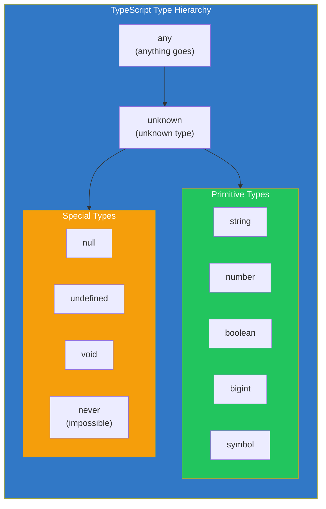
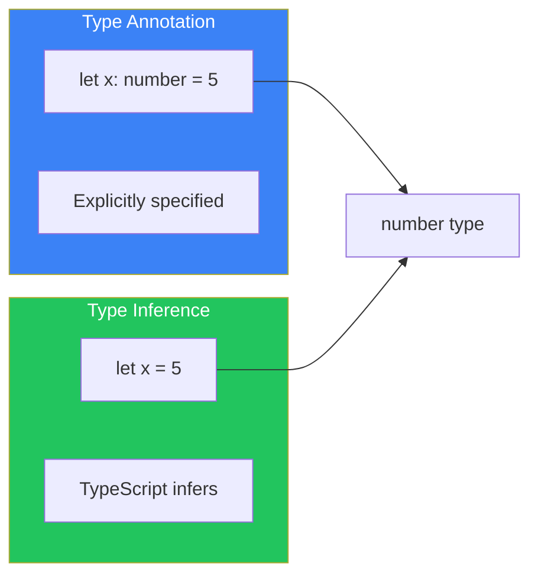
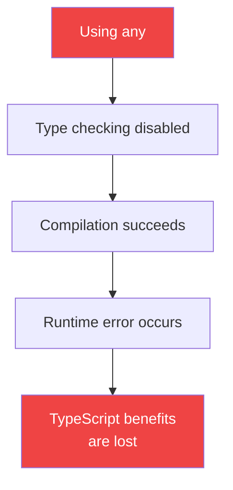
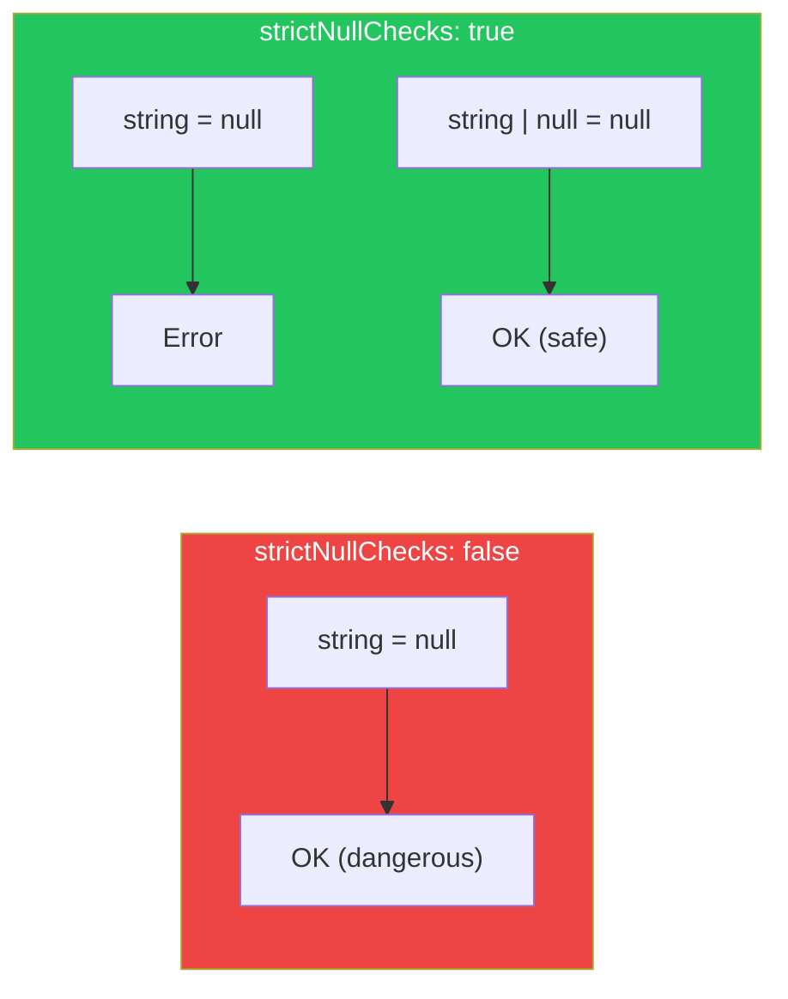
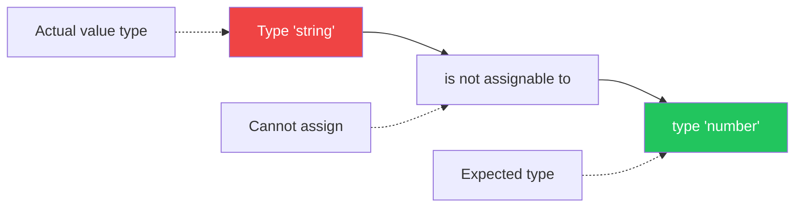

# Day 2: Understanding Basic Types

## What You'll Learn Today

- Primitive types (string, number, boolean)
- The difference between type annotations and type inference
- How to use any, unknown, and never
- Handling null and undefined

---

## What Is a Type?

A "type" in TypeScript represents **a set of values and the operations that can be performed on them**.

For example:

- `string` type = the set of all strings + string operations (`+`, `.toUpperCase()`, `.slice()`, etc.)
- `number` type = the set of all numbers + number operations (`+`, `-`, `*`, `/`, etc.)

Knowing the type makes it clear **what you can do** and **what you can't do** with a value.



---

## Primitive Types

Each of JavaScript's seven primitive values has a corresponding TypeScript type.

### string

```typescript
// Explicit type annotation
let greeting: string = "Hello, World!";

// Type inference (TypeScript figures it out automatically)
let name = "TypeScript"; // Inferred as string

// String operations
greeting.toUpperCase(); // OK
greeting.toLowerCase(); // OK
greeting * 2;           // Error: * operator cannot be used on strings
```

### number

```typescript
let age: number = 25;
let price = 19.99;        // Inferred as number
let hex = 0xff;           // Hexadecimal is also number
let binary = 0b1010;      // Binary is also number

// Number operations
age + 10;        // OK
age.toFixed(2);  // OK
age.toUpperCase(); // Error: toUpperCase does not exist on number
```

### boolean

```typescript
let isActive: boolean = true;
let isCompleted = false;  // Inferred as boolean

// Logical operations
!isActive;          // OK
isActive && isCompleted; // OK
isActive + 1;       // Error: + operator cannot be used on boolean
```

### bigint

```typescript
// Available from ES2020
let bigNumber: bigint = 9007199254740991n;
let anotherBig = BigInt(123); // Inferred as bigint

// number and bigint cannot be mixed
let num: number = 100;
bigNumber + num; // Error: bigint and number cannot be mixed
bigNumber + 100n; // OK
```

### symbol

```typescript
let sym1: symbol = Symbol("description");
let sym2 = Symbol("description");

// Symbols are always unique
sym1 === sym2; // false (different symbols even with same description)
```

---

## Type Annotations vs Type Inference

TypeScript has two ways to specify types.

### Type Annotation

The programmer explicitly specifies the type:

```typescript
let username: string = "alice";
let count: number = 42;
let isValid: boolean = true;
```

### Type Inference

TypeScript automatically infers the type from the initial value:

```typescript
let username = "alice";    // Inferred as string
let count = 42;            // Inferred as number
let isValid = true;        // Inferred as boolean
```



### Which Should You Use?

| Scenario | Recommendation |
|----------|----------------|
| Variable with initial value | Let type inference handle it |
| Function parameters | Use type annotations |
| Function return values | Use type annotations (for complex cases) |
| Variable without initial value | Type annotation is required |

```typescript
// Type inference is sufficient
let message = "Hello"; // Obviously string

// Type annotation is needed
let data: string[]; // No initial value, assigned later
data = ["a", "b", "c"];

// Function parameters need annotations
function greet(name: string): string {
  return `Hello, ${name}!`;
}
```

---

## The any Type: An Escape Hatch You Shouldn't Use

The `any` type is a special type that accepts any type.

```typescript
let anything: any = "hello";
anything = 42;        // OK
anything = true;      // OK
anything = { x: 1 };  // OK

// any disables type checking
anything.foo.bar.baz(); // No error (risk of runtime error)
```

### Problems with any



**Avoid using `any` as a general rule**. Use it only when absolutely necessary.

---

## The unknown Type: Safe "I Don't Know"

The `unknown` type represents "unknown type" but is safer than `any`.

```typescript
let value: unknown = "hello";
value = 42;        // OK
value = true;      // OK

// unknown cannot be operated on directly
value.toUpperCase(); // Error: toUpperCase does not exist on 'unknown'

// Check the type before operating
if (typeof value === "string") {
  value.toUpperCase(); // OK: confirmed to be string
}
```

### Comparison of any and unknown

| Feature | any | unknown |
|---------|-----|---------|
| Can assign anything | ✅ | ✅ |
| Can operate directly | ✅ | ❌ |
| Benefits of type checking | ❌ | ✅ |
| Recommended | Low | High |

```typescript
// When receiving data from external sources
function processData(data: unknown) {
  // Type checking is required
  if (typeof data === "string") {
    return data.toUpperCase();
  }
  if (typeof data === "number") {
    return data * 2;
  }
  return null;
}
```

---

## The never Type: Never Happens

The `never` type is a type that **never holds a value**. It's used in two main scenarios:

### 1. Functions That Never Return

```typescript
// Always throws an exception
function throwError(message: string): never {
  throw new Error(message);
}

// Infinite loop
function infiniteLoop(): never {
  while (true) {
    // Never ends
  }
}
```

### 2. Exhaustiveness Checking

```typescript
type Color = "red" | "green" | "blue";

function getColorCode(color: Color): string {
  switch (color) {
    case "red":
      return "#ff0000";
    case "green":
      return "#00ff00";
    case "blue":
      return "#0000ff";
    default:
      // Type error if this is reached
      const exhaustiveCheck: never = color;
      return exhaustiveCheck;
  }
}
```

---

## null and undefined

JavaScript has two values that represent "no value".

```typescript
let nullable: string | null = null;
let undefinedValue: string | undefined = undefined;

// Check before using nullable values
if (nullable !== null) {
  console.log(nullable.toUpperCase()); // OK
}
```

### strictNullChecks

Setting `strict: true` or `strictNullChecks: true` in `tsconfig.json` makes handling of null and undefined stricter.

```typescript
// With strictNullChecks: true
let name: string = null; // Error: null is not assignable to string

// Explicitly allow null
let name: string | null = null; // OK
```



---

## Reading Type Errors

TypeScript error messages contain a lot of information. Let's learn how to read them.

```typescript
let count: number = "hello";
// Type 'string' is not assignable to type 'number'.
```

Error message structure:
- `Type 'X'` - The actual type of the value passed
- `is not assignable to` - Cannot be assigned
- `type 'Y'` - The expected type



---

## Summary

| Type | Description | Example |
|------|-------------|---------|
| string | Text | `"hello"`, `'world'` |
| number | Numbers | `42`, `3.14` |
| boolean | True/false | `true`, `false` |
| bigint | Large integers | `9007199254740991n` |
| symbol | Unique identifier | `Symbol("id")` |
| any | Anything (not recommended) | - |
| unknown | Unknown type (safe) | - |
| never | Impossible type | - |
| null | No value | `null` |
| undefined | Not defined | `undefined` |

### Key Takeaways

1. **Leverage type inference** - Omit annotations when the type is obvious
2. **Avoid any** - You lose the benefits of type checking
3. **Use unknown** - Safe choice when the type is unknown
4. **Enable strictNullChecks** - Write null-safe code

---

## Practice Exercises

### Exercise 1: Identify the Type

What types will be inferred for the following variables?

```typescript
let a = "TypeScript";
let b = 3.14;
let c = true;
let d = null;
let e;
```

### Exercise 2: Fix the Type Errors

Fix the errors in the following code.

```typescript
let score: number = "100";
let isActive: boolean = 1;
let name: string = undefined;
```

### Challenge

Create a function `processValue` that receives an `unknown` type value. If it's a string, convert it to uppercase. If it's a number, double it. Return `null` for any other type.

---

## References

- [TypeScript Handbook - Everyday Types](https://www.typescriptlang.org/docs/handbook/2/everyday-types.html)
- [MDN - JavaScript Data Types](https://developer.mozilla.org/en-US/docs/Web/JavaScript/Data_structures)

---

**Next Up**: In Day 3, we'll learn about "Union Types and Type Narrowing." We'll understand how to combine multiple types and narrow types using Type Guards.
