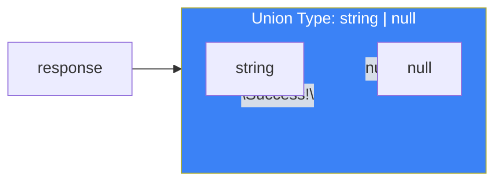
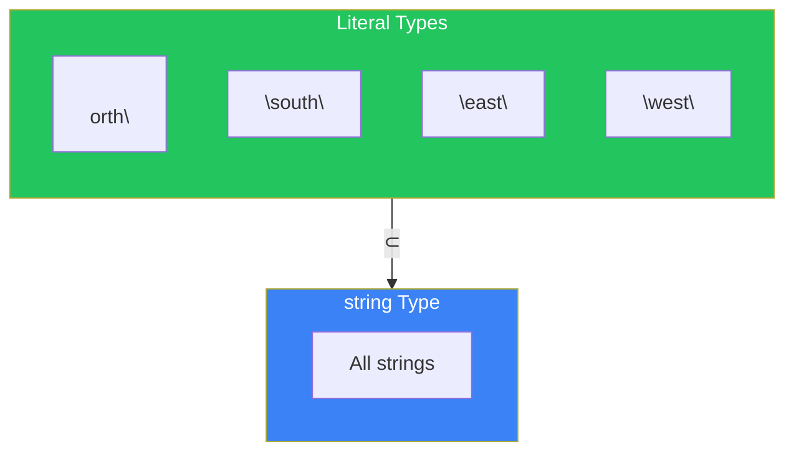
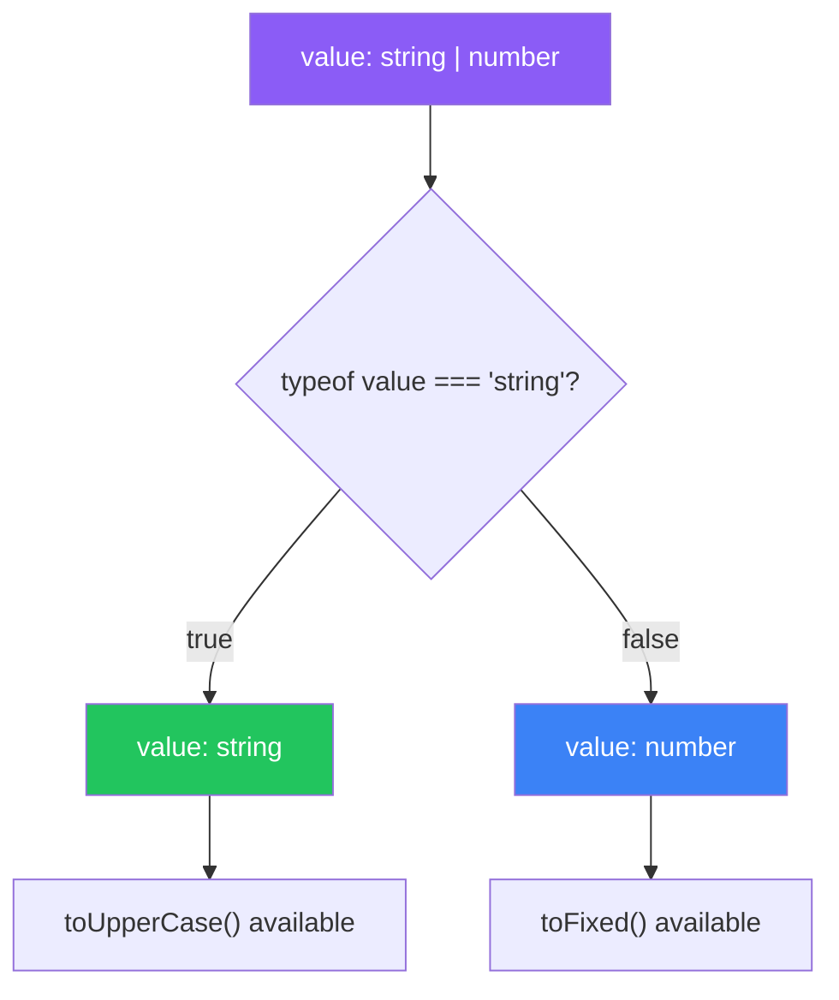
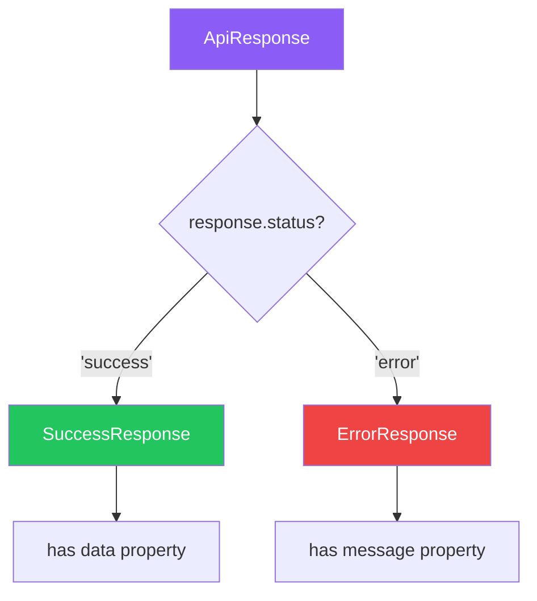

# Day 3: Union Types and Type Narrowing

## What You'll Learn Today

- Combining multiple types with Union types (|)
- Using literal types to allow only specific values
- How type narrowing works
- Naming types with type aliases

---

## What Are Union Types?

In real programs, variables often can hold multiple types.

```typescript
// API response: string on success, null on failure
let response = Math.random() > 0.5 ? "Success!" : null;
// Type of response is string | null
```

Types like `string | null` that represent "A or B" are called **Union types**.



### Basic Union Type Syntax

```typescript
// Union of two types
let id: string | number;
id = "abc123";  // OK
id = 12345;     // OK
id = true;      // Error: boolean is not assignable to string | number

// Three or more types are possible
let value: string | number | boolean;
value = "hello";  // OK
value = 42;       // OK
value = true;     // OK
```

### Property Access on Union Types

For Union type values, you can only access **properties common to all constituent types**.

```typescript
let value: string | number;

// Methods common to both work
value.toString();  // OK: exists on both string and number

// Methods on only one type don't work
value.toUpperCase(); // Error: toUpperCase does not exist on number
value.toFixed();     // Error: toFixed does not exist on string
```

---

## Literal Types

Regular types (`string`, `number`) allow all values of that type. However, **literal types** allow only specific values.

```typescript
// Regular string type: allows all strings
let direction: string = "north";
direction = "south";  // OK
direction = "hello";  // OK (unintended values are also allowed)

// Literal type: allows only specific values
let direction2: "north" | "south" | "east" | "west";
direction2 = "north"; // OK
direction2 = "south"; // OK
direction2 = "hello"; // Error: "hello" is not allowed
```



### Types of Literal Types

```typescript
// String literal type
type Status = "pending" | "approved" | "rejected";

// Numeric literal type
type DiceValue = 1 | 2 | 3 | 4 | 5 | 6;

// Boolean literal type (only true or false)
type True = true;
type False = false;
```

### Type Inference Difference Between const and let

```typescript
// let is mutable, so a wider type is inferred
let message = "Hello";  // Type: string

// const is immutable, so a literal type is inferred
const greeting = "Hello";  // Type: "Hello"
```

---

## Type Narrowing

When using Union type values, TypeScript can **narrow the type through conditional branches**. This is called **Narrowing**.

### Narrowing with typeof

```typescript
function printValue(value: string | number) {
  // Here value is string | number

  if (typeof value === "string") {
    // Here value is string
    console.log(value.toUpperCase());
  } else {
    // Here value is number
    console.log(value.toFixed(2));
  }
}
```



### Narrowing with Truthiness

```typescript
function printName(name: string | null) {
  if (name) {
    // If name is truthy, it's string
    console.log(name.toUpperCase());
  } else {
    // If name is falsy, it's null (or empty string)
    console.log("No name provided");
  }
}
```

### Narrowing with the in Operator

```typescript
type Fish = { swim: () => void };
type Bird = { fly: () => void };

function move(animal: Fish | Bird) {
  if ("swim" in animal) {
    // animal is Fish
    animal.swim();
  } else {
    // animal is Bird
    animal.fly();
  }
}
```

### Narrowing with instanceof

```typescript
function formatDate(date: Date | string) {
  if (date instanceof Date) {
    // date is Date
    return date.toISOString();
  } else {
    // date is string
    return new Date(date).toISOString();
  }
}
```

### Narrowing with Equality

```typescript
function printLength(value: string | string[] | null) {
  if (value === null) {
    // value is null
    console.log("No value");
  } else if (typeof value === "string") {
    // value is string
    console.log(`String length: ${value.length}`);
  } else {
    // value is string[]
    console.log(`Array length: ${value.length}`);
  }
}
```

---

## Type Aliases

Complex types or frequently used types can be given names with **type aliases**.

```typescript
// Define type aliases
type ID = string | number;
type Status = "pending" | "approved" | "rejected";

// Usage
let userId: ID = "user_123";
let postId: ID = 456;
let orderStatus: Status = "pending";
```

### Type Alias Naming Conventions

```typescript
// Use PascalCase
type UserID = string;
type HttpStatus = 200 | 404 | 500;
type ApiResponse = { data: unknown; error: string | null };
```

### Combining Type Aliases

```typescript
type StringOrNumber = string | number;
type NullableString = string | null;

// Combine aliases
type ID = StringOrNumber | null;

// Result type based on conditions
type Result =
  | { success: true; data: string }
  | { success: false; error: string };
```

---

## Discriminated Unions

In real applications, Union types of objects are commonly used. Having a **common property** to discriminate between types is convenient.

```typescript
type SuccessResponse = {
  status: "success";
  data: string;
};

type ErrorResponse = {
  status: "error";
  message: string;
};

type ApiResponse = SuccessResponse | ErrorResponse;

function handleResponse(response: ApiResponse) {
  // Discriminate by status property
  if (response.status === "success") {
    // response is SuccessResponse
    console.log(response.data);
  } else {
    // response is ErrorResponse
    console.log(response.message);
  }
}
```



### Discriminated Union Best Practices

```typescript
// Have a common discriminant property
type LoadingState = { status: "loading" };
type SuccessState = { status: "success"; data: string[] };
type ErrorState = { status: "error"; error: Error };

type State = LoadingState | SuccessState | ErrorState;

function renderState(state: State) {
  switch (state.status) {
    case "loading":
      return "Loading...";
    case "success":
      return state.data.join(", ");
    case "error":
      return `Error: ${state.error.message}`;
  }
}
```

---

## Summary

| Concept | Description | Example |
|---------|-------------|---------|
| Union Type | One of multiple types | `string \| number` |
| Literal Type | Only specific values | `"north" \| "south"` |
| Narrowing | Narrow type through conditionals | `typeof`, `in`, `instanceof` |
| Type Alias | Give a name to a type | `type ID = string \| number` |
| Discriminated Union | Discriminate by common property | `{ status: "success" } \| { status: "error" }` |

### Key Takeaways

1. **Union types mean "or"** - Allow any of multiple types
2. **Be strict with literal types** - Prevent bugs by allowing only specific values
3. **Leverage narrowing** - Narrow types through conditionals for safe operations
4. **Improve readability with type aliases** - Name complex types

---

## Practice Exercises

### Exercise 1: Basic

What are the types of the following variables?

```typescript
let a = Math.random() > 0.5 ? "hello" : 42;
let b = Math.random() > 0.5 ? true : null;
const c = "fixed";
```

### Exercise 2: Narrowing

Complete the following function. Return the length if `value` is a string, the number itself if it's a number, and 0 otherwise.

```typescript
function getLength(value: string | number | boolean): number {
  // Implement here
}
```

### Challenge

Create a discriminated union type representing a shopping cart state.

- `empty`: Cart is empty
- `hasItems`: Has items (has an items array)
- `checkout`: Processing payment (has items array and totalPrice)

Then implement a function `getCartMessage` that returns a message based on the state.

---

## References

- [TypeScript Handbook - Narrowing](https://www.typescriptlang.org/docs/handbook/2/narrowing.html)
- [TypeScript Handbook - Union Types](https://www.typescriptlang.org/docs/handbook/2/everyday-types.html#union-types)

---

**Next Up**: In Day 4, we'll learn about "Typing Functions." We'll understand parameter and return type definitions, optional parameters, and function overloads.
