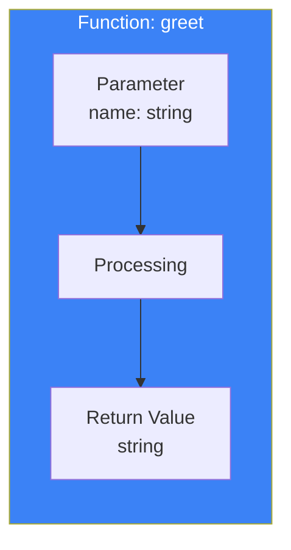
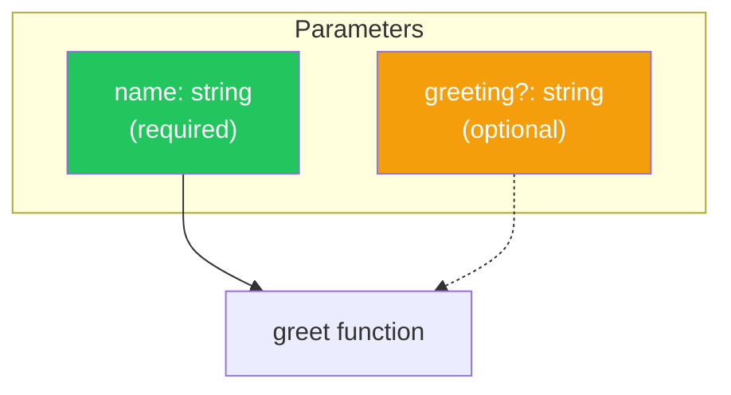
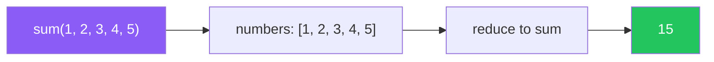
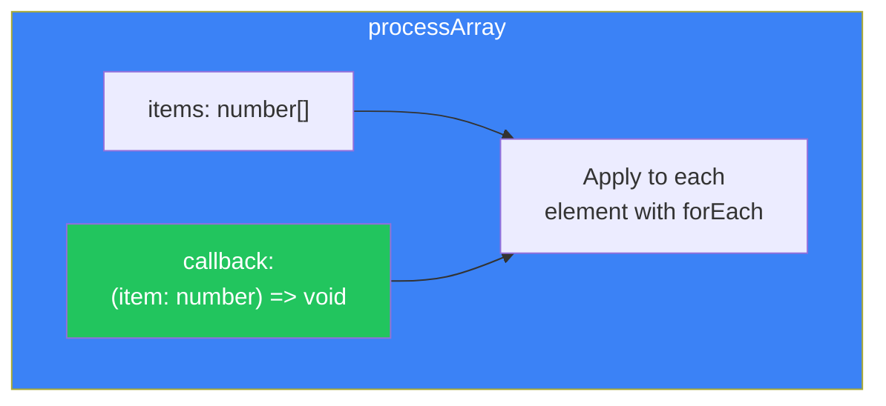
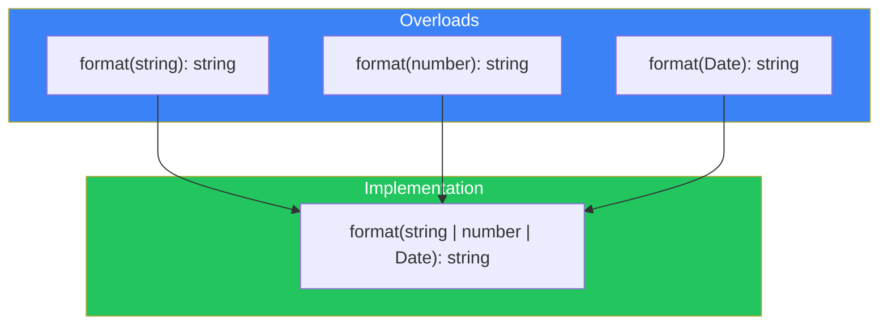

# Day 4: Typing Functions

## What You'll Learn Today

- Adding types to function parameters and return values
- Optional parameters and default values
- Rest parameters
- void and never types in functions
- Function overloads
- Typing callback functions

---

## Basic Function Type Definitions

In TypeScript, you can specify types for function **parameters** and **return values**.

```typescript
// Basic function type definition
function greet(name: string): string {
  return `Hello, ${name}!`;
}

// Calling
greet("TypeScript"); // OK
greet(123);          // Error: number is not assignable to string
```



### Arrow Function Type Definitions

```typescript
// Same for arrow functions
const add = (a: number, b: number): number => {
  return a + b;
};

// Shorthand (when there's a single expression)
const multiply = (a: number, b: number): number => a * b;
```

### Return Type Inference

TypeScript can infer return types, but explicitly declaring them is recommended.

```typescript
// Let type inference handle it
function add(a: number, b: number) {
  return a + b; // Return type is inferred as number
}

// Explicitly specify the type (recommended)
function subtract(a: number, b: number): number {
  return a - b;
}
```

---

## Optional Parameters

Adding `?` after a parameter makes it optional.

```typescript
function greet(name: string, greeting?: string): string {
  // greeting is string | undefined
  if (greeting) {
    return `${greeting}, ${name}!`;
  }
  return `Hello, ${name}!`;
}

greet("Alice");           // "Hello, Alice!"
greet("Bob", "Hi");       // "Hi, Bob!"
greet("Charlie", "Hey");  // "Hey, Charlie!"
```



### Optional Parameter Caveats

- Optional parameters must come **after required parameters**
- The value is `undefined` when not provided

```typescript
// Error: Optional parameter must follow required parameters
function bad(a?: string, b: number) { } // Error

// OK
function good(a: number, b?: string) { } // OK
```

---

## Default Parameters

You can set default values for parameters.

```typescript
function greet(name: string, greeting: string = "Hello"): string {
  return `${greeting}, ${name}!`;
}

greet("Alice");           // "Hello, Alice!"
greet("Bob", "Hi");       // "Hi, Bob!"
greet("Charlie", undefined); // "Hello, Charlie!" (default value is used)
```

### Type Inference with Default Parameters

```typescript
// Type is inferred from default value
function createUser(name: string, age = 20) {
  // age is inferred as number
  return { name, age };
}
```

---

## Rest Parameters

You can receive a variable number of arguments as an array.

```typescript
function sum(...numbers: number[]): number {
  return numbers.reduce((total, n) => total + n, 0);
}

sum(1, 2);           // 3
sum(1, 2, 3, 4, 5);  // 15
sum();               // 0
```



### Combining Rest Parameters with Regular Parameters

```typescript
function log(message: string, ...values: unknown[]): void {
  console.log(message, ...values);
}

log("Hello");                    // "Hello"
log("Values:", 1, 2, 3);         // "Values:" 1 2 3
log("Mixed:", "a", 1, true);     // "Mixed:" "a" 1 true
```

---

## The void Type: Functions with No Return Value

When a function doesn't return anything, the return type is `void`.

```typescript
function logMessage(message: string): void {
  console.log(message);
  // No return statement, or only return;
}

// Same for arrow functions
const printHello = (): void => {
  console.log("Hello!");
};
```

### Difference Between void and undefined

```typescript
// void: Indicates return value won't be used
function logA(): void {
  console.log("A");
}

// undefined: Indicates it returns undefined
function logB(): undefined {
  console.log("B");
  return undefined; // Required
}

const resultA = logA(); // void
const resultB = logB(); // undefined
```

---

## The never Type: Functions That Never Return

When a function **never completes normally**, the return type is `never`.

```typescript
// Always throws an exception
function throwError(message: string): never {
  throw new Error(message);
}

// Infinite loop
function infiniteLoop(): never {
  while (true) {
    // Never ends
  }
}
```

### Difference Between void and never

| Type | Description | Example |
|------|-------------|---------|
| void | No return value (normal completion) | `console.log()` |
| never | Never returns | `throw`, infinite loops |

---

## Function Types

You can define the type of a function itself.

```typescript
// Define a function type
type GreetFunction = (name: string) => string;

// Use the function type
const greet: GreetFunction = (name) => {
  return `Hello, ${name}!`;
};

// Parameter type is inferred from the type annotation
const greet2: GreetFunction = (name) => `Hi, ${name}!`;
```

### Callback Function Types

```typescript
// Function that accepts a callback
function processArray(
  items: number[],
  callback: (item: number) => void
): void {
  items.forEach(callback);
}

processArray([1, 2, 3], (item) => {
  console.log(item * 2);
});
```



### Complex Function Types

```typescript
// Function type with multiple signatures
type EventHandler = {
  (event: MouseEvent): void;
  (event: KeyboardEvent): void;
};

// Functions in objects
type Calculator = {
  add: (a: number, b: number) => number;
  subtract: (a: number, b: number) => number;
};

const calc: Calculator = {
  add: (a, b) => a + b,
  subtract: (a, b) => a - b,
};
```

---

## Function Overloads

You can handle different parameter patterns with the same function name.

```typescript
// Overload signatures
function format(value: string): string;
function format(value: number): string;
function format(value: Date): string;

// Implementation signature
function format(value: string | number | Date): string {
  if (typeof value === "string") {
    return value.toUpperCase();
  }
  if (typeof value === "number") {
    return value.toFixed(2);
  }
  return value.toISOString();
}

format("hello");      // "HELLO"
format(3.14159);      // "3.14"
format(new Date());   // "2024-01-20T..."
```

### Overload Caveats

1. **Overload signatures**: Used for type checking when calling
2. **Implementation signature**: The actual implementation (handles all cases)
3. The implementation signature cannot be called directly from outside



---

## The this Parameter

In TypeScript, you can explicitly specify the type of `this` in a function.

```typescript
interface User {
  name: string;
  greet(this: User): string;
}

const user: User = {
  name: "Alice",
  greet() {
    return `Hello, I'm ${this.name}`;
  }
};

user.greet(); // "Hello, I'm Alice"

// Error when this type doesn't match
const greetFn = user.greet;
greetFn(); // Error: this type doesn't match
```

---

## Summary

| Concept | Description | Example |
|---------|-------------|---------|
| Parameter Type | Specify type for arguments | `(name: string)` |
| Return Type | Specify type for return value | `: string` |
| Optional | Optional argument | `(name?: string)` |
| Default Value | Set default value | `(name = "default")` |
| Rest Parameters | Variable arguments | `(...args: number[])` |
| void | No return value | `(): void` |
| never | Never returns | `(): never` |
| Function Type | Type of function itself | `type Fn = (x: number) => number` |
| Overloads | Multiple signatures | Multiple declarations + one implementation |

### Key Takeaways

1. **Always type parameters** - Type inference doesn't work for them
2. **Explicitly declare return types** - Clarifies intent and prevents errors
3. **Optional parameters come last** - Place after required parameters
4. **Distinguish void and never** - Use based on whether it completes normally

---

## Practice Exercises

### Exercise 1: Basic

Add appropriate type annotations to the following function.

```typescript
function concatenate(a, b, separator) {
  return a + separator + b;
}
```

### Exercise 2: Optional and Default

Create a function that displays user information.

- `name`: required (string)
- `age`: optional (number)
- `country`: default value "Japan" (string)

### Challenge

Create a `createLogger` function that meets the following requirements:

1. Takes a `prefix` (string) as an argument
2. Returns a log function
3. The returned log function accepts any number of arguments and outputs them to the console with the prefix

```typescript
const logger = createLogger("[INFO]");
logger("Hello", "World"); // "[INFO] Hello World"
logger(1, 2, 3);          // "[INFO] 1 2 3"
```

---

## References

- [TypeScript Handbook - More on Functions](https://www.typescriptlang.org/docs/handbook/2/functions.html)
- [MDN - Functions](https://developer.mozilla.org/en-US/docs/Web/JavaScript/Guide/Functions)

---

**Next Up**: In Day 5, we'll learn about "Object Types." We'll understand object type definitions, structural typing, and the readonly modifier.
