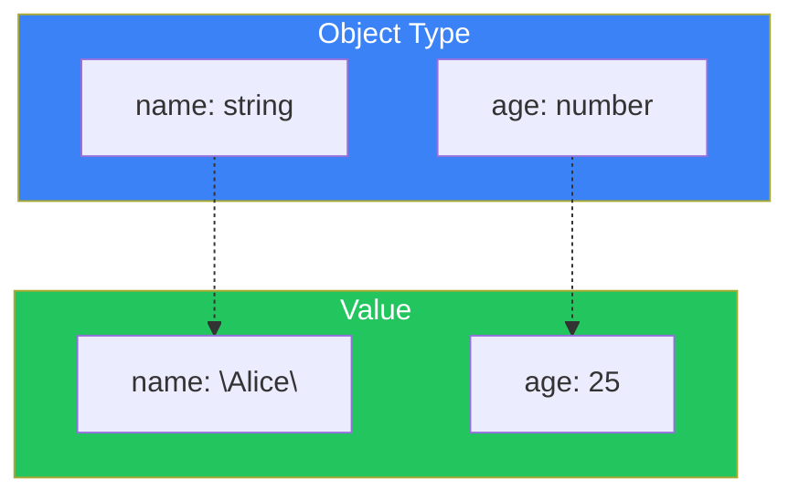
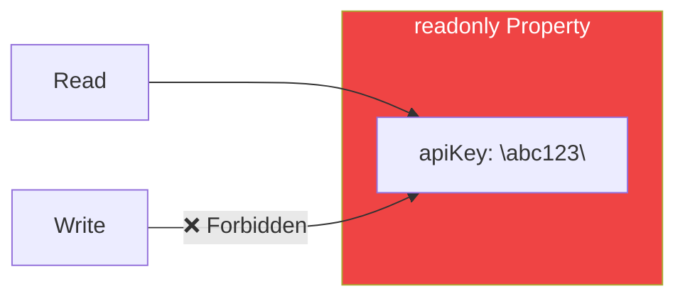
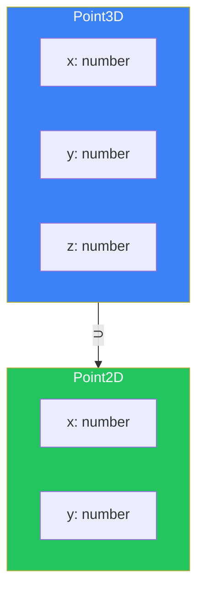
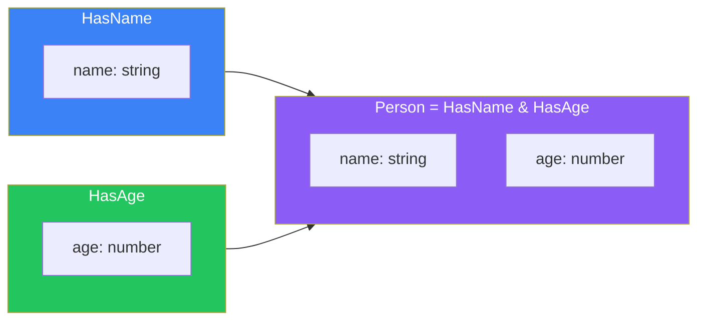

# Day 5: Object Types

## What You'll Learn Today

- How to define object types
- Optional properties and readonly
- Index signatures
- Structural typing
- Intersection types

---

## Object Type Basics

In TypeScript, you can define the "shape" of an object as a type.

```typescript
// Type inference from object literal
const user = {
  name: "Alice",
  age: 25,
};
// Type: { name: string; age: number; }

// Explicit type definition
const product: { name: string; price: number } = {
  name: "TypeScript Book",
  price: 29.80,
};
```



### Defining Object Types with Type Aliases

```typescript
// Make it reusable with type aliases
type User = {
  name: string;
  age: number;
  email: string;
};

const alice: User = {
  name: "Alice",
  age: 25,
  email: "alice@example.com",
};

const bob: User = {
  name: "Bob",
  age: 30,
  email: "bob@example.com",
};
```

---

## Optional Properties

Adding `?` after a property name makes it optional.

```typescript
type User = {
  name: string;
  age: number;
  email?: string;  // Optional
};

// email can be omitted
const user1: User = {
  name: "Alice",
  age: 25,
};

const user2: User = {
  name: "Bob",
  age: 30,
  email: "bob@example.com",
};
```

### Accessing Optional Properties

```typescript
type User = {
  name: string;
  email?: string;
};

function sendEmail(user: User) {
  // email is string | undefined
  if (user.email) {
    console.log(`Sending email to ${user.email}`);
  } else {
    console.log("No email address");
  }
}
```

---

## The readonly Modifier

Adding `readonly` makes a property immutable.

```typescript
type Config = {
  readonly apiKey: string;
  readonly endpoint: string;
};

const config: Config = {
  apiKey: "abc123",
  endpoint: "https://api.example.com",
};

// Reading is OK
console.log(config.apiKey);

// Writing causes an error
config.apiKey = "new-key"; // Error: Cannot assign to read-only property
```



### Making All Properties Readonly

```typescript
type User = {
  name: string;
  age: number;
};

// Use the Readonly utility type
type ReadonlyUser = Readonly<User>;

const user: ReadonlyUser = {
  name: "Alice",
  age: 25,
};

user.name = "Bob"; // Error: read-only
user.age = 30;     // Error: read-only
```

---

## Index Signatures

You can define types for objects with dynamic keys.

```typescript
// Object with string keys and number values
type Scores = {
  [subject: string]: number;
};

const scores: Scores = {
  math: 90,
  english: 85,
  science: 88,
};

// Can access dynamically
scores["history"] = 92;
console.log(scores.math); // 90
```

### Combining Index Signatures with Fixed Properties

```typescript
type Dictionary = {
  // Fixed property
  length: number;
  // Index signature
  [word: string]: number | string;
};

const dict: Dictionary = {
  length: 3,
  hello: "konnichiwa",
  goodbye: "sayonara",
  count: 100,
};
```

### Caveats

```typescript
type StringMap = {
  [key: string]: string;
};

const map: StringMap = {
  a: "apple",
  b: "banana",
};

// Accessing non-existent keys doesn't cause an error
const value = map["nonexistent"]; // Type: string (actually undefined)
```

---

## Structural Typing

TypeScript uses **structural typing**. Types are compatible based on their **structure (shape)**, not their names.

```typescript
type Point2D = {
  x: number;
  y: number;
};

type Point3D = {
  x: number;
  y: number;
  z: number;
};

function printPoint(point: Point2D) {
  console.log(`(${point.x}, ${point.y})`);
}

const point3D: Point3D = { x: 1, y: 2, z: 3 };

// Point3D contains Point2D's structure, so it's OK
printPoint(point3D); // OK: (1, 2)
```



### Excess Property Checking

However, when passing an object literal directly, extra properties cause an error.

```typescript
type User = {
  name: string;
  age: number;
};

// Error when passing object literal directly
const user: User = {
  name: "Alice",
  age: 25,
  email: "alice@example.com", // Error: excess property
};

// OK when passing through a variable
const userData = {
  name: "Alice",
  age: 25,
  email: "alice@example.com",
};
const user2: User = userData; // OK
```

---

## Intersection Types

Use `&` to combine multiple types.

```typescript
type HasName = {
  name: string;
};

type HasAge = {
  age: number;
};

// Intersection: has properties of both
type Person = HasName & HasAge;

const person: Person = {
  name: "Alice",
  age: 25,
};
```



### Difference from Union Types

```typescript
// Union: A or B
type StringOrNumber = string | number;

// Intersection: A and B
type Named = { name: string };
type Aged = { age: number };
type NamedAndAged = Named & Aged; // Both properties are required
```

### Practical Example of Intersection Types

```typescript
// Base type
type Timestamp = {
  createdAt: Date;
  updatedAt: Date;
};

// Entity type
type User = {
  id: string;
  name: string;
  email: string;
};

// User with timestamp
type UserWithTimestamp = User & Timestamp;

const user: UserWithTimestamp = {
  id: "1",
  name: "Alice",
  email: "alice@example.com",
  createdAt: new Date(),
  updatedAt: new Date(),
};
```

---

## Nested Object Types

Object types can be nested.

```typescript
type Address = {
  street: string;
  city: string;
  zipCode: string;
};

type User = {
  name: string;
  address: Address;
  contacts: {
    email: string;
    phone?: string;
  };
};

const user: User = {
  name: "Alice",
  address: {
    street: "123 Main St",
    city: "Tokyo",
    zipCode: "100-0001",
  },
  contacts: {
    email: "alice@example.com",
  },
};
```

---

## Summary

| Concept | Description | Example |
|---------|-------------|---------|
| Object Type | Define properties and types | `{ name: string; age: number }` |
| Optional | Optional property | `email?: string` |
| readonly | Immutable | `readonly id: string` |
| Index Signature | Dynamic keys | `[key: string]: number` |
| Structural Typing | Compatible if shape matches | - |
| Intersection | Combine multiple types | `TypeA & TypeB` |

### Key Takeaways

1. **Reuse with type aliases** - Don't repeat the same type definitions
2. **Optional includes undefined** - Check before accessing
3. **Guarantee immutability with readonly** - Prevent unintended changes
4. **Understand structural typing** - Compatibility is based on structure, not names

---

## Practice Exercises

### Exercise 1: Basic

Define a type for the following object.

```typescript
const book = {
  title: "TypeScript Introduction",
  author: "John Smith",
  pages: 300,
  published: true,
};
```

### Exercise 2: Optional and readonly

Define a `Product` type that meets the following requirements.

- `id`: immutable string
- `name`: string
- `price`: number
- `description`: optional string

### Challenge

Design a type representing an API response.

- Common properties: `status` (number), `timestamp` (Date)
- On success: `data` (any type)
- On failure: `error` (object with message and code)

Try creating a generic type like `ApiResponse<T>` using intersection types or union types.

---

## References

- [TypeScript Handbook - Object Types](https://www.typescriptlang.org/docs/handbook/2/objects.html)
- [TypeScript Deep Dive - Type Compatibility](https://basarat.gitbook.io/typescript/type-system/type-compatibility)

---

**Next Up**: In Day 6, we'll learn about "Arrays and Tuples." We'll understand array type definitions, tuple types, and readonly arrays.
