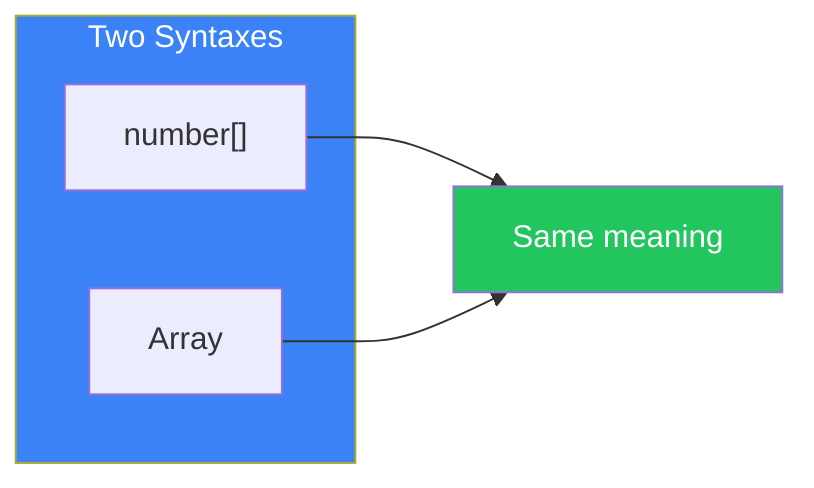
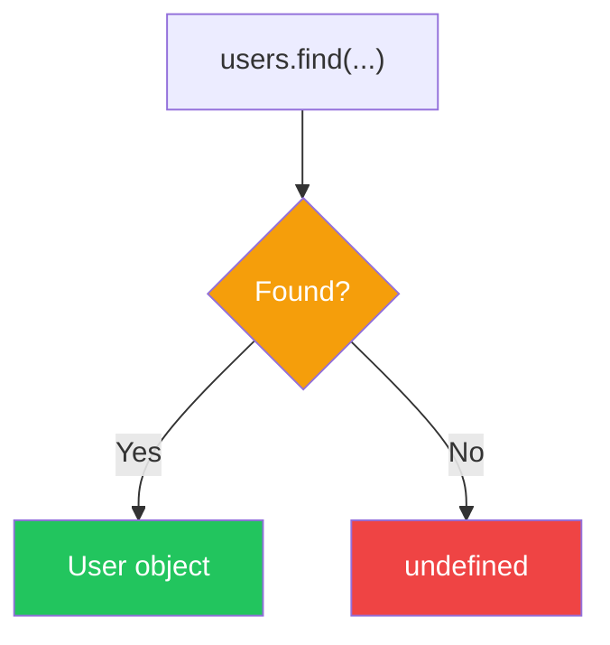
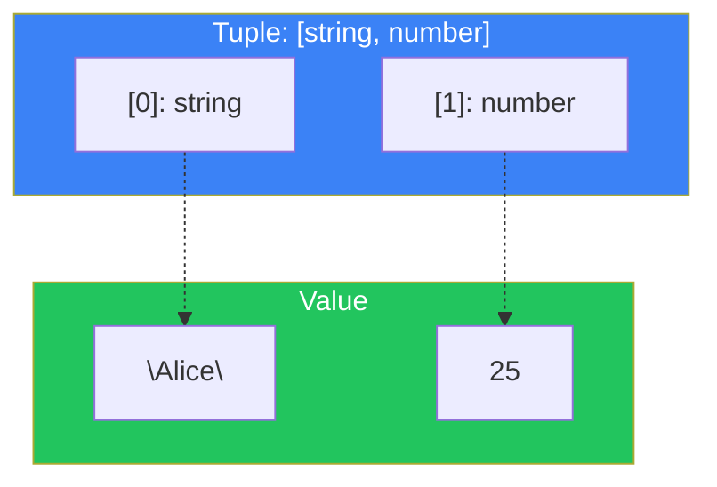
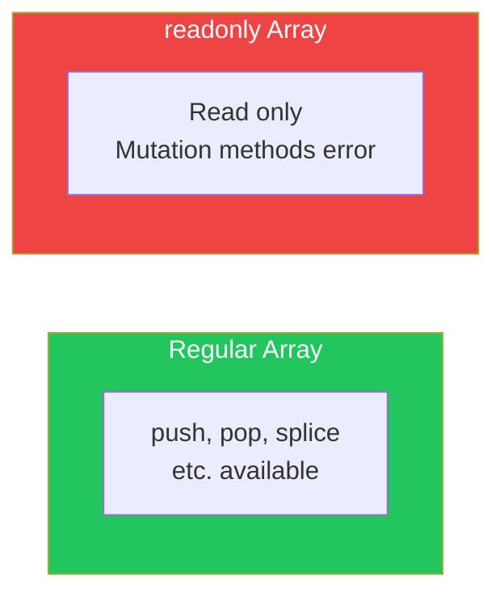

# Day 6: Arrays and Tuples

## What You'll Learn Today

- How to define array types
- Array methods and types
- Tuple type basics and usage
- Readonly arrays and tuples
- Spread operator and types

---

## Array Type Definitions

In TypeScript, you can specify the type of array elements. There are two ways to write it.

```typescript
// Syntax 1: type[]
let numbers: number[] = [1, 2, 3, 4, 5];
let names: string[] = ["Alice", "Bob", "Charlie"];

// Syntax 2: Array<type> (generics syntax)
let scores: Array<number> = [90, 85, 88];
let items: Array<string> = ["apple", "banana"];
```



### Type Inference

```typescript
// Type is inferred from initial values
let fruits = ["apple", "banana", "orange"]; // string[]
let mixed = [1, "two", 3];                  // (string | number)[]

// Be careful with empty arrays
let empty = [];        // Inferred as any[] (dangerous)
let empty2: string[] = []; // Explicitly specify the type
```

---

## Array Methods and Types

TypeScript correctly types the return values of array methods.

### map, filter, reduce

```typescript
const numbers: number[] = [1, 2, 3, 4, 5];

// map: number[] → string[]
const strings = numbers.map(n => n.toString());
// Type: string[]

// filter: number[] → number[]
const evens = numbers.filter(n => n % 2 === 0);
// Type: number[]

// reduce: number[] → number
const sum = numbers.reduce((acc, n) => acc + n, 0);
// Type: number
```

### find and findIndex

```typescript
const users = [
  { id: 1, name: "Alice" },
  { id: 2, name: "Bob" },
];

// find: May not find, so includes undefined
const user = users.find(u => u.id === 1);
// Type: { id: number; name: string; } | undefined

if (user) {
  console.log(user.name); // OK: Confirmed not undefined
}
```



---

## Union Type Arrays

When array elements can have multiple types:

```typescript
// Array of numbers or strings
let mixed: (string | number)[] = [1, "two", 3, "four"];

// Array of union type objects
type Dog = { type: "dog"; bark: () => void };
type Cat = { type: "cat"; meow: () => void };
type Pet = Dog | Cat;

const pets: Pet[] = [
  { type: "dog", bark: () => console.log("Woof!") },
  { type: "cat", meow: () => console.log("Meow!") },
];
```

### Note: Difference Between (A | B)[] and A[] | B[]

```typescript
// (string | number)[]: Each element is string or number
let mixed: (string | number)[] = [1, "two", 3];

// string[] | number[]: The entire array is either string[] or number[]
let either: string[] | number[] = [1, 2, 3]; // OK
either = ["a", "b", "c"]; // OK
either = [1, "two"]; // Error: Cannot mix
```

---

## Tuple Types

A **tuple** is an array with a fixed number of elements and fixed types at each position.

```typescript
// [string, number] tuple
let person: [string, number] = ["Alice", 25];

// Access each element with the correct type
const name = person[0]; // string
const age = person[1];  // number

// Out-of-bounds access is an error
person[2]; // Error: Index '2' does not exist
```



### Tuple Use Cases

```typescript
// Coordinates
type Point = [number, number];
const origin: Point = [0, 0];

// RGB color
type RGB = [number, number, number];
const red: RGB = [255, 0, 0];

// Named tuples (TypeScript 4.0+)
type NamedPoint = [x: number, y: number];
const point: NamedPoint = [10, 20];

// Multiple return values from a function
function getMinMax(numbers: number[]): [number, number] {
  return [Math.min(...numbers), Math.max(...numbers)];
}

const [min, max] = getMinMax([5, 2, 8, 1, 9]);
// min: 1, max: 9
```

### Optional Elements

```typescript
// Third element is optional
type Point2DOrMaybe3D = [number, number, number?];

const point2D: Point2DOrMaybe3D = [10, 20];
const point3D: Point2DOrMaybe3D = [10, 20, 30];
```

### Rest Elements in Tuples

```typescript
// First is string, rest are all numbers
type StringThenNumbers = [string, ...number[]];

const data: StringThenNumbers = ["header", 1, 2, 3, 4, 5];
```

---

## Readonly Arrays and Tuples

You can make arrays and tuples immutable.

### Readonly Arrays

```typescript
// Method 1: readonly modifier
const numbers: readonly number[] = [1, 2, 3];

// Method 2: ReadonlyArray<T>
const items: ReadonlyArray<string> = ["a", "b", "c"];

// Reading is OK
console.log(numbers[0]); // 1

// Modifications are errors
numbers.push(4);    // Error
numbers[0] = 10;    // Error
numbers.pop();      // Error
```



### Readonly Tuples

```typescript
const point: readonly [number, number] = [10, 20];

// Reading is OK
console.log(point[0]); // 10

// Modification is an error
point[0] = 30; // Error
```

### Making Immutable with as const

```typescript
// as const infers the narrowest type
const colors = ["red", "green", "blue"] as const;
// Type: readonly ["red", "green", "blue"]

// Each element is a literal type
type FirstColor = typeof colors[0]; // "red"

// Immutable
colors.push("yellow"); // Error
colors[0] = "orange";  // Error
```

---

## Spread Operator and Types

### Array Spread

```typescript
const arr1: number[] = [1, 2, 3];
const arr2: number[] = [4, 5, 6];

// Combine with spread
const combined: number[] = [...arr1, ...arr2];
// [1, 2, 3, 4, 5, 6]

// Combine arrays of different types
const strings: string[] = ["a", "b"];
const mixed: (string | number)[] = [...arr1, ...strings];
// [1, 2, 3, "a", "b"]
```

### Tuple Spread

```typescript
const tuple1: [string, number] = ["hello", 42];
const tuple2: [boolean] = [true];

// Combine tuples
const combined: [string, number, boolean] = [...tuple1, ...tuple2];
// ["hello", 42, true]
```

### Spread into Function Arguments

```typescript
function greet(name: string, age: number) {
  console.log(`Hello, ${name}! You are ${age} years old.`);
}

const args: [string, number] = ["Alice", 25];
greet(...args); // OK: Tuple type matches arguments
```

---

## Summary

| Concept | Description | Example |
|---------|-------------|---------|
| Array Type | Array of same type elements | `number[]`, `Array<string>` |
| Union Array | Allows multiple types | `(string \| number)[]` |
| Tuple | Fixed length and type array | `[string, number]` |
| readonly | Immutable | `readonly number[]` |
| as const | Infer as literal types | `[1, 2, 3] as const` |

### Key Takeaways

1. **Explicitly type empty arrays** - Avoid `any[]`
2. **find includes undefined** - Check before accessing
3. **Use tuples for fixed-length arrays** - When position has meaning
4. **Guarantee immutability with readonly** - Prevent unintended changes

---

## Practice Exercises

### Exercise 1: Basic

Fix the type errors in the following code.

```typescript
const scores: number[] = [90, 85, "88", 92];
scores.push("100");
```

### Exercise 2: Tuples

Define the return type of the following function as a tuple.

```typescript
function parseCoordinate(input: string) {
  const [x, y] = input.split(",").map(Number);
  return [x, y];
}

const result = parseCoordinate("10,20");
// result should be [number, number]
```

### Challenge

Create a `groupBy` function that meets the following requirements:

1. Takes an array and a function that extracts a key from each element
2. Returns an object grouped by key
3. Add appropriate type definitions

```typescript
const users = [
  { name: "Alice", role: "admin" },
  { name: "Bob", role: "user" },
  { name: "Charlie", role: "admin" },
];

const grouped = groupBy(users, (user) => user.role);
// { admin: [...], user: [...] }
```

---

## References

- [TypeScript Handbook - Arrays](https://www.typescriptlang.org/docs/handbook/2/everyday-types.html#arrays)
- [TypeScript Handbook - Tuple Types](https://www.typescriptlang.org/docs/handbook/2/objects.html#tuple-types)

---

**Next Up**: In Day 7, we'll learn about "Interfaces." We'll understand interface definitions, the difference from type, and extension.
