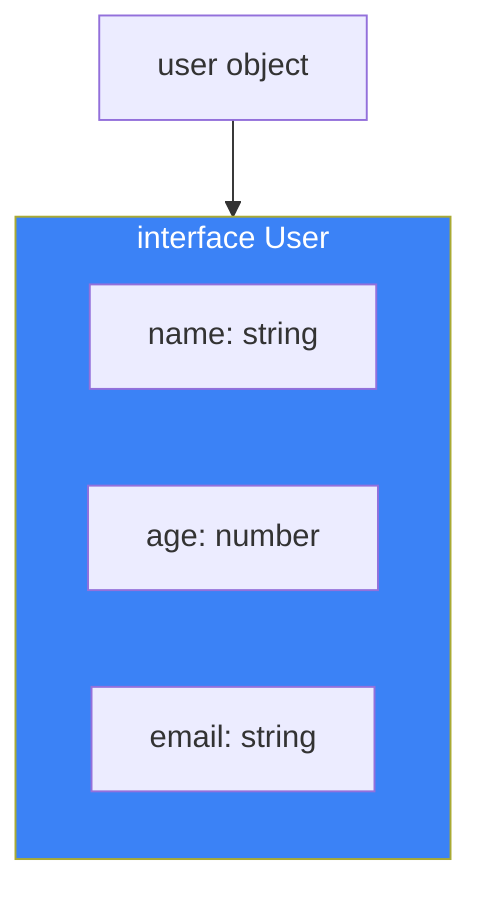
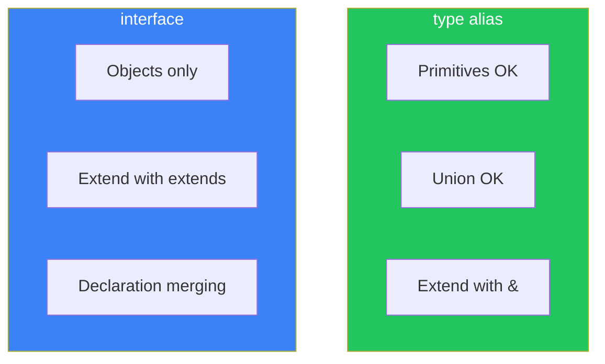
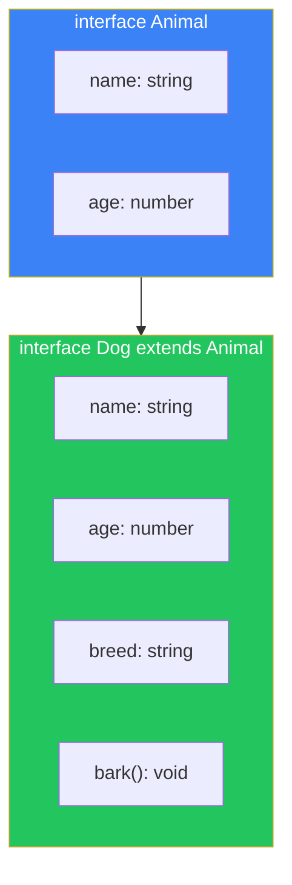
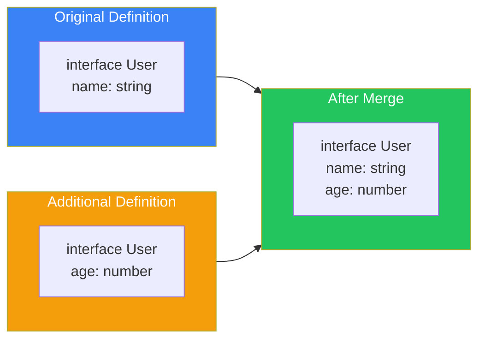

# Day 7: Interfaces

## What You'll Learn Today

- Basic interface syntax
- Differences between type and interface
- Extending interfaces with extends
- Declaration merging
- Practical uses of interfaces

---

## Interface Basics

An **interface** is another way to define the shape of an object.

```typescript
// Interface definition
interface User {
  name: string;
  age: number;
  email: string;
}

// Using the interface
const user: User = {
  name: "Alice",
  age: 25,
  email: "alice@example.com",
};
```



### Optional and readonly

Like type aliases, you can use optional and readonly.

```typescript
interface Product {
  readonly id: string;      // Immutable
  name: string;
  price: number;
  description?: string;     // Optional
}

const product: Product = {
  id: "prod-001",
  name: "TypeScript Book",
  price: 29.80,
};

product.id = "new-id"; // Error: read-only
```

---

## type vs interface

TypeScript has two ways to define object types.

```typescript
// Type alias
type UserType = {
  name: string;
  age: number;
};

// Interface
interface UserInterface {
  name: string;
  age: number;
}
```

### Key Differences

| Feature | type | interface |
|---------|------|-----------|
| Extension method | `&` (intersection) | `extends` |
| Declaration merging | ❌ Not possible | ✅ Possible |
| Union types | ✅ Possible | ❌ Not possible |
| Primitive types | ✅ Possible | ❌ Not possible |
| Computed properties | ✅ Possible | ❌ Not possible |



### When to Use Which

```typescript
// Interface is better for:
// - Defining object shapes
// - Types that classes implement
// - Library API definitions

interface ApiResponse {
  data: unknown;
  status: number;
}

// Type alias is better for:
// - Union types
// - Primitive aliases
// - Complex type operations

type ID = string | number;
type Result<T> = { success: true; data: T } | { success: false; error: string };
```

---

## Extending Interfaces

Use the `extends` keyword to extend existing interfaces.

```typescript
// Base interface
interface Animal {
  name: string;
  age: number;
}

// Extended interface
interface Dog extends Animal {
  breed: string;
  bark(): void;
}

const dog: Dog = {
  name: "Max",
  age: 3,
  breed: "Labrador",
  bark() {
    console.log("Woof!");
  },
};
```



### Extending Multiple Interfaces

```typescript
interface Timestamp {
  createdAt: Date;
  updatedAt: Date;
}

interface Identifiable {
  id: string;
}

// Extend multiple interfaces
interface User extends Timestamp, Identifiable {
  name: string;
  email: string;
}

const user: User = {
  id: "user-001",
  name: "Alice",
  email: "alice@example.com",
  createdAt: new Date(),
  updatedAt: new Date(),
};
```

---

## Declaration Merging

Interfaces with the same name are automatically merged.

```typescript
interface User {
  name: string;
}

interface User {
  age: number;
}

// Automatically merged
const user: User = {
  name: "Alice",
  age: 25,
};
```

### Using Declaration Merging

Useful for extending existing library types.

```typescript
// Extend Node.js process.env
declare global {
  namespace NodeJS {
    interface ProcessEnv {
      DATABASE_URL: string;
      API_KEY: string;
    }
  }
}

// Type-safe access
const dbUrl = process.env.DATABASE_URL; // string
```



---

## Method Definitions

Interfaces can define methods in two ways.

```typescript
interface Calculator {
  // Property syntax
  add: (a: number, b: number) => number;

  // Method syntax
  subtract(a: number, b: number): number;
}

const calc: Calculator = {
  add: (a, b) => a + b,
  subtract(a, b) {
    return a - b;
  },
};
```

### Call Signatures

You can express the type of a function itself in an interface.

```typescript
interface Greeter {
  (name: string): string;
  greeting: string;
}

const greeter: Greeter = (name: string) => {
  return `${greeter.greeting}, ${name}!`;
};
greeter.greeting = "Hello";

console.log(greeter("World")); // "Hello, World!"
```

---

## Index Signatures

Interfaces can also use index signatures.

```typescript
interface StringDictionary {
  [key: string]: string;
}

const dict: StringDictionary = {
  hello: "konnichiwa",
  goodbye: "sayonara",
};

// Numeric index
interface NumberArray {
  [index: number]: string;
}

const arr: NumberArray = ["a", "b", "c"];
console.log(arr[0]); // "a"
```

### Index Signatures with Fixed Properties

```typescript
interface User {
  id: string;
  name: string;
  [key: string]: string; // Other properties
}

const user: User = {
  id: "001",
  name: "Alice",
  email: "alice@example.com", // OK
  phone: "123-456-7890",      // OK
};
```

---

## Practical Patterns

### API Type Definitions

```typescript
interface ApiResponse<T> {
  data: T;
  status: number;
  message: string;
}

interface User {
  id: string;
  name: string;
  email: string;
}

interface UserListResponse extends ApiResponse<User[]> {
  totalCount: number;
  page: number;
}

const response: UserListResponse = {
  data: [
    { id: "1", name: "Alice", email: "alice@example.com" },
    { id: "2", name: "Bob", email: "bob@example.com" },
  ],
  status: 200,
  message: "Success",
  totalCount: 100,
  page: 1,
};
```

### Component Props

```typescript
interface ButtonProps {
  label: string;
  onClick: () => void;
  disabled?: boolean;
  variant?: "primary" | "secondary" | "danger";
}

// Extension
interface IconButtonProps extends ButtonProps {
  icon: string;
  iconPosition?: "left" | "right";
}
```

---

## Summary

| Concept | Description | Example |
|---------|-------------|---------|
| interface | Define object shape | `interface User { name: string }` |
| extends | Extend interfaces | `interface Dog extends Animal` |
| Declaration merging | Same-name interfaces merge | Multiple `interface User` declarations |
| Method definition | Two syntaxes | `method(): void` or `method: () => void` |

### Key Takeaways

1. **Use interface for object types** - Readable and extensible
2. **Use type for union types** - Not possible with interfaces
3. **Use extends for inheritance** - Improve code reusability
4. **Be aware of declaration merging** - Avoid unintended merges

---

## Practice Exercises

### Exercise 1: Basic

Define a `Vehicle` interface that meets the following requirements.

- `brand`: string
- `model`: string
- `year`: number
- `start()`: method returning void

### Exercise 2: Extension

Extend `Vehicle` to create an `ElectricCar` interface.

- `batteryCapacity`: number (kWh)
- `charge()`: method returning void

### Challenge

Create type definitions for an event management system with the following requirements:

1. `Event` interface: id, title, date, location
2. Extend to `OnlineEvent` and `OfflineEvent` (each with unique properties)
3. `EventManager` interface: methods for adding, removing, and getting events

---

## References

- [TypeScript Handbook - Interfaces](https://www.typescriptlang.org/docs/handbook/interfaces.html)
- [TypeScript Handbook - Declaration Merging](https://www.typescriptlang.org/docs/handbook/declaration-merging.html)

---

**Next Up**: In Day 8, we'll learn about "Classes." We'll understand the relationship between classes and types, access modifiers, and abstract classes.
