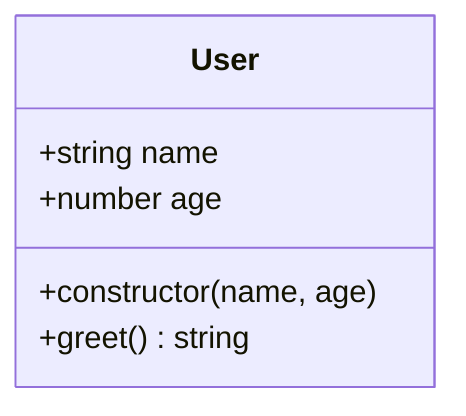
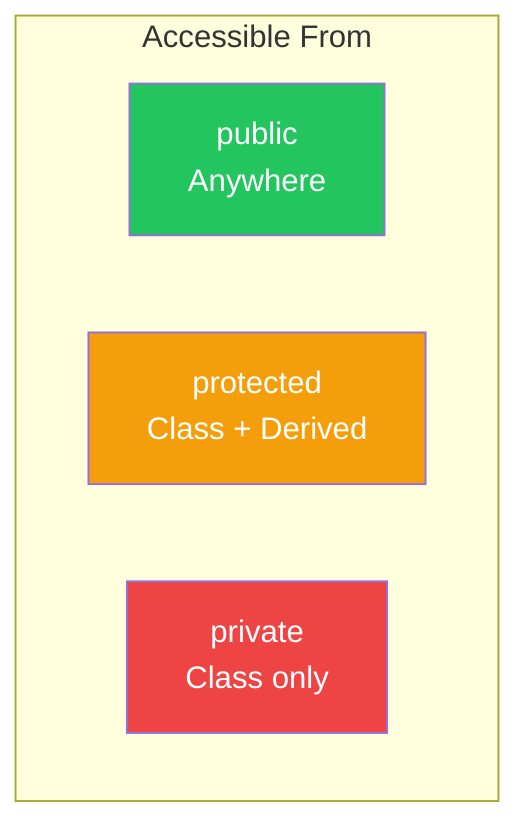
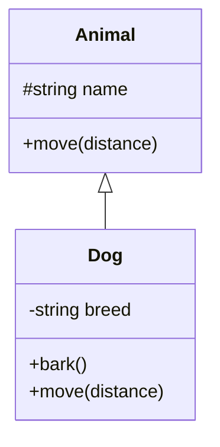
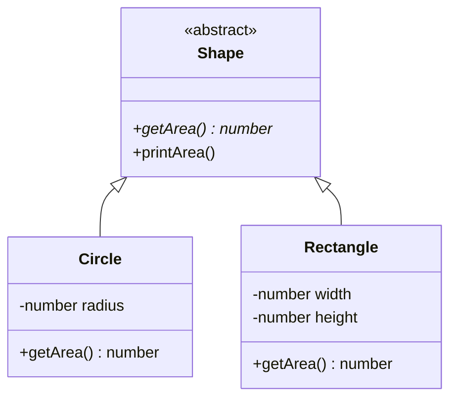

# Day 8: Classes

## What You'll Learn Today

- Class basics in TypeScript
- Access modifiers (public, private, protected)
- readonly properties
- Abstract classes
- Implementing interfaces (implements)

---

## Class Basics

TypeScript classes add type safety to JavaScript classes.

```typescript
class User {
  name: string;
  age: number;

  constructor(name: string, age: number) {
    this.name = name;
    this.age = age;
  }

  greet(): string {
    return `Hello, I'm ${this.name}!`;
  }
}

const user = new User("Alice", 25);
console.log(user.greet()); // "Hello, I'm Alice!"
```



### Property Initialization

In TypeScript, properties must be initialized at declaration or in the constructor.

```typescript
class Product {
  // Initialize at declaration
  category: string = "general";

  // Initialize in constructor
  name: string;
  price: number;

  constructor(name: string, price: number) {
    this.name = name;
    this.price = price;
  }
}
```

---

## Access Modifiers

TypeScript has three access modifiers.

### public (Default)

Accessible from anywhere.

```typescript
class User {
  public name: string; // public can be omitted

  constructor(name: string) {
    this.name = name;
  }
}

const user = new User("Alice");
console.log(user.name); // OK
```

### private

Only accessible within the class.

```typescript
class BankAccount {
  private balance: number;

  constructor(initialBalance: number) {
    this.balance = initialBalance;
  }

  deposit(amount: number): void {
    this.balance += amount;
  }

  getBalance(): number {
    return this.balance;
  }
}

const account = new BankAccount(1000);
account.deposit(500);
console.log(account.getBalance()); // 1500
console.log(account.balance);      // Error: private property
```

### protected

Accessible within the class and derived classes.

```typescript
class Animal {
  protected name: string;

  constructor(name: string) {
    this.name = name;
  }
}

class Dog extends Animal {
  bark(): void {
    // Accessible because it's protected
    console.log(`${this.name} says: Woof!`);
  }
}

const dog = new Dog("Max");
dog.bark();      // OK: "Max says: Woof!"
dog.name;        // Error: protected property
```



### Parameter Properties

Adding modifiers to constructor parameters eliminates property declarations and assignments.

```typescript
// Regular way
class User {
  private name: string;
  private age: number;

  constructor(name: string, age: number) {
    this.name = name;
    this.age = age;
  }
}

// Using parameter properties
class User2 {
  constructor(
    private name: string,
    private age: number
  ) {}
  // this.name and this.age are automatically set
}
```

---

## The readonly Modifier

`readonly` prevents modification after initialization.

```typescript
class User {
  readonly id: string;
  name: string;

  constructor(id: string, name: string) {
    this.id = id;   // Can only assign in constructor
    this.name = name;
  }

  changeName(newName: string): void {
    this.name = newName; // OK
  }

  changeId(newId: string): void {
    this.id = newId; // Error: readonly property
  }
}
```

---

## Class Inheritance

Use the `extends` keyword to inherit from existing classes.

```typescript
class Animal {
  constructor(protected name: string) {}

  move(distance: number): void {
    console.log(`${this.name} moved ${distance}m`);
  }
}

class Dog extends Animal {
  constructor(name: string, private breed: string) {
    super(name); // Call parent constructor
  }

  bark(): void {
    console.log(`${this.name} says: Woof!`);
  }

  // Method override
  move(distance: number): void {
    console.log(`${this.name} runs...`);
    super.move(distance); // Call parent method
  }
}

const dog = new Dog("Max", "Labrador");
dog.bark(); // "Max says: Woof!"
dog.move(10); // "Max runs..." → "Max moved 10m"
```



---

## Abstract Classes

**Abstract classes** cannot be instantiated directly. They must be extended.

```typescript
abstract class Shape {
  abstract getArea(): number; // Abstract method: implemented in child class

  printArea(): void {
    console.log(`Area: ${this.getArea()}`);
  }
}

class Circle extends Shape {
  constructor(private radius: number) {
    super();
  }

  // Must implement abstract method
  getArea(): number {
    return Math.PI * this.radius ** 2;
  }
}

class Rectangle extends Shape {
  constructor(
    private width: number,
    private height: number
  ) {
    super();
  }

  getArea(): number {
    return this.width * this.height;
  }
}

// const shape = new Shape(); // Error: Cannot instantiate abstract class
const circle = new Circle(5);
circle.printArea(); // "Area: 78.53981633974483"
```



---

## Implementing Interfaces

Classes can implement interfaces using `implements`.

```typescript
interface Printable {
  print(): void;
}

interface Serializable {
  serialize(): string;
}

// Implement multiple interfaces
class Document implements Printable, Serializable {
  constructor(private content: string) {}

  print(): void {
    console.log(this.content);
  }

  serialize(): string {
    return JSON.stringify({ content: this.content });
  }
}

const doc = new Document("Hello, World!");
doc.print();           // "Hello, World!"
doc.serialize();       // '{"content":"Hello, World!"}'
```

### Interface vs Abstract Class

| Feature | interface | abstract class |
|---------|-----------|----------------|
| Multiple implementation/inheritance | ✅ Multiple | ❌ Single only |
| Default implementation | ❌ | ✅ |
| Property implementation | ❌ | ✅ |
| Constructor | ❌ | ✅ |

```typescript
// Interface: Define a contract
interface Logger {
  log(message: string): void;
}

// Abstract class: Provide common implementation
abstract class BaseLogger implements Logger {
  abstract log(message: string): void;

  // Common method
  error(message: string): void {
    this.log(`[ERROR] ${message}`);
  }
}

class ConsoleLogger extends BaseLogger {
  log(message: string): void {
    console.log(message);
  }
}
```

---

## Classes and Types

In TypeScript, a class is both a **value** and a **type**.

```typescript
class User {
  constructor(public name: string) {}
}

// User is a value (constructor function)
const user = new User("Alice");

// User can also be used as a type
function greet(user: User): void {
  console.log(`Hello, ${user.name}!`);
}

// Compatible with interfaces (structural typing)
interface HasName {
  name: string;
}

const obj: HasName = { name: "Bob" };
greet(obj); // OK: Structure matches
```

---

## Summary

| Concept | Description | Example |
|---------|-------------|---------|
| public | Accessible from anywhere | `public name: string` |
| private | Class only | `private balance: number` |
| protected | Class + derived classes | `protected id: string` |
| readonly | Immutable after initialization | `readonly createdAt: Date` |
| abstract | Abstract class/method | `abstract class Shape` |
| implements | Implement interface | `class Dog implements Animal` |

### Key Takeaways

1. **Hide with access modifiers** - Encapsulate internal implementation
2. **Use parameter properties for brevity** - Reduce boilerplate
3. **Share implementation with abstract classes** - Reuse through inheritance
4. **Define contracts with interfaces** - Hide implementation details

---

## Practice Exercises

### Exercise 1: Basic

Create a `Counter` class that meets the following requirements.

- `count` property (private, not readonly)
- `increment()` method
- `decrement()` method
- `getCount()` method

### Exercise 2: Inheritance

Create a `Bird` class that extends `Animal`.

- `Animal` has `name` and `move()`
- `Bird` adds a `fly()` method and overrides `move()`

### Challenge

Design a system that meets the following requirements.

1. `Storage` interface: `save()`, `load()`, `delete()`
2. Implement with `MemoryStorage` and `FileStorage` classes
3. Create a common `BaseStorage` abstract class that centralizes error handling

---

## References

- [TypeScript Handbook - Classes](https://www.typescriptlang.org/docs/handbook/2/classes.html)
- [MDN - Classes](https://developer.mozilla.org/en-US/docs/Web/JavaScript/Reference/Classes)

---

**Next Up**: In Day 9, we'll learn about "Generics." Let's create reusable type definitions by parameterizing types.
