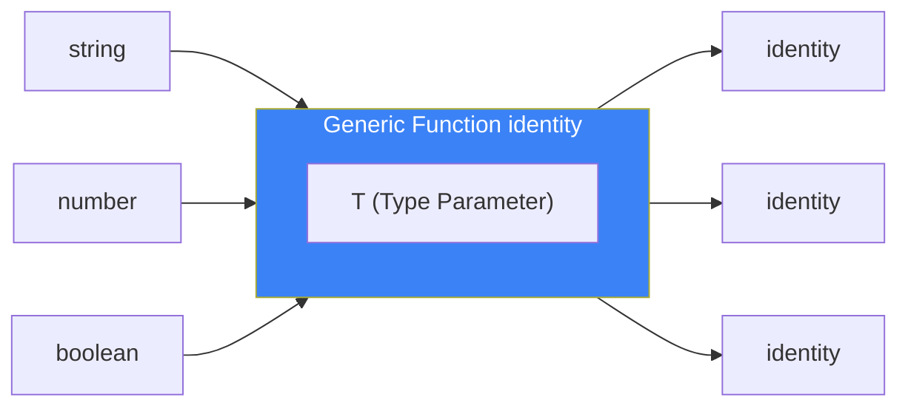
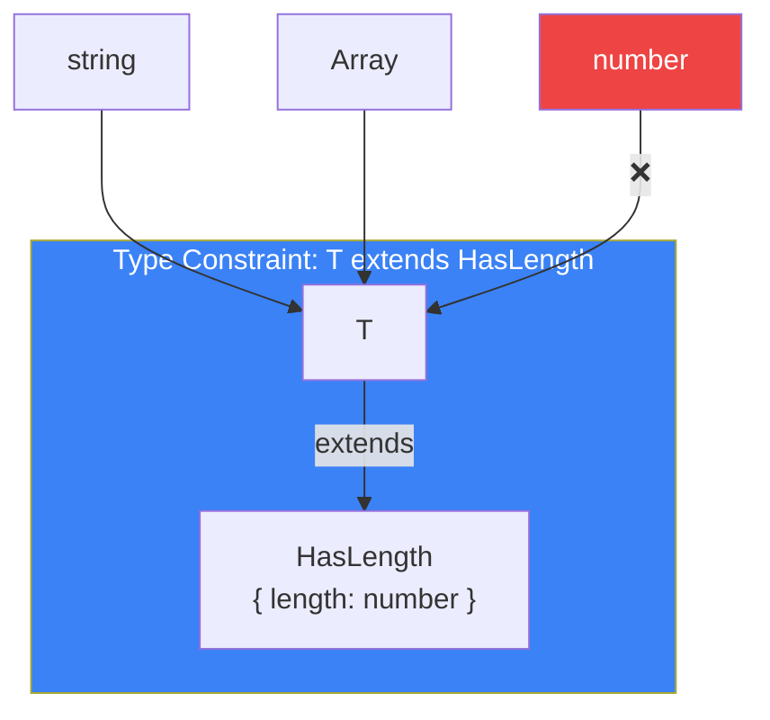
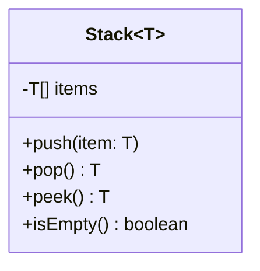
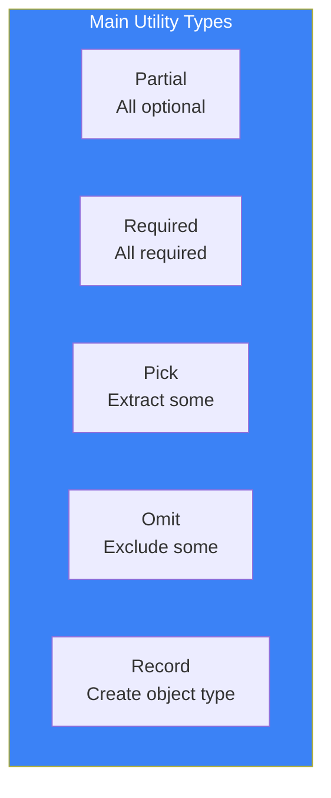

# Day 9: Generics

## What You'll Learn Today

- Basic concept of generics
- Generic functions
- Generic classes and interfaces
- Type constraints (extends)
- Utility types

---

## What Are Generics?

**Generics** is a feature that parameterizes types. Functions and classes can be reused with various types.

```typescript
// Problem without generics
function identityString(value: string): string {
  return value;
}

function identityNumber(value: number): number {
  return value;
}

// Need a function for each type...

// Solve with generics
function identity<T>(value: T): T {
  return value;
}

identity<string>("hello");  // Type: string
identity<number>(42);       // Type: number
identity<boolean>(true);    // Type: boolean
```



### Type Argument Inference

In many cases, TypeScript can infer type arguments.

```typescript
function identity<T>(value: T): T {
  return value;
}

// Explicitly specified
identity<string>("hello");

// Let type inference handle it (recommended)
identity("hello");  // T is inferred as string
identity(42);       // T is inferred as number
```

---

## Generic Functions

### Multiple Type Parameters

```typescript
function pair<T, U>(first: T, second: U): [T, U] {
  return [first, second];
}

const result = pair("hello", 42);
// Type: [string, number]
```

### Functions That Operate on Arrays

```typescript
function first<T>(arr: T[]): T | undefined {
  return arr[0];
}

first([1, 2, 3]);      // number | undefined
first(["a", "b"]);     // string | undefined
first([]);             // undefined

function map<T, U>(arr: T[], fn: (item: T) => U): U[] {
  return arr.map(fn);
}

map([1, 2, 3], (n) => n.toString()); // string[]
```

### Generics in Arrow Functions

```typescript
// Arrow function
const identity = <T>(value: T): T => value;

// To avoid confusion with JSX, write like this in TSX files
const identity2 = <T,>(value: T): T => value;
// Or
const identity3 = <T extends unknown>(value: T): T => value;
```

---

## Type Constraints (extends)

You can add constraints to type parameters.

```typescript
// Without constraint: any type is OK
function getLength<T>(value: T): number {
  return value.length; // Error: Unknown if T has length
}

// With constraint: only types with length
interface HasLength {
  length: number;
}

function getLength<T extends HasLength>(value: T): number {
  return value.length; // OK
}

getLength("hello");        // OK: string has length
getLength([1, 2, 3]);      // OK: array has length
getLength({ length: 10 }); // OK
getLength(123);            // Error: number doesn't have length
```



### Combining with keyof

```typescript
function getProperty<T, K extends keyof T>(obj: T, key: K): T[K] {
  return obj[key];
}

const user = { name: "Alice", age: 25 };

getProperty(user, "name"); // OK: string
getProperty(user, "age");  // OK: number
getProperty(user, "email"); // Error: "email" is not a key of user
```

---

## Generic Interfaces

Interfaces can also have type parameters.

```typescript
interface Box<T> {
  value: T;
  getValue(): T;
}

const stringBox: Box<string> = {
  value: "hello",
  getValue() {
    return this.value;
  },
};

const numberBox: Box<number> = {
  value: 42,
  getValue() {
    return this.value;
  },
};
```

### API Response Type Definitions

```typescript
interface ApiResponse<T> {
  data: T;
  status: number;
  message: string;
}

interface User {
  id: string;
  name: string;
}

interface Product {
  id: string;
  name: string;
  price: number;
}

type UserResponse = ApiResponse<User>;
type ProductListResponse = ApiResponse<Product[]>;
```

---

## Generic Classes

Classes can also have type parameters.

```typescript
class Stack<T> {
  private items: T[] = [];

  push(item: T): void {
    this.items.push(item);
  }

  pop(): T | undefined {
    return this.items.pop();
  }

  peek(): T | undefined {
    return this.items[this.items.length - 1];
  }

  isEmpty(): boolean {
    return this.items.length === 0;
  }
}

const numberStack = new Stack<number>();
numberStack.push(1);
numberStack.push(2);
numberStack.pop(); // 2

const stringStack = new Stack<string>();
stringStack.push("hello");
stringStack.push("world");
```



---

## Default Type Parameters

You can set default values for type parameters.

```typescript
interface Container<T = string> {
  value: T;
}

const defaultContainer: Container = { value: "hello" }; // T = string
const numberContainer: Container<number> = { value: 42 };

// Same for functions
function createArray<T = number>(length: number, value: T): T[] {
  return Array(length).fill(value);
}

createArray(3, "x"); // string[]
createArray(3, 42);  // number[]
```

---

## Utility Types

TypeScript has useful built-in generic types.

### Partial<T>

Makes all properties optional.

```typescript
interface User {
  name: string;
  age: number;
  email: string;
}

// Partial<User> = { name?: string; age?: number; email?: string; }
function updateUser(id: string, updates: Partial<User>): void {
  // Can update only some fields
}

updateUser("1", { name: "Bob" }); // OK
updateUser("1", { age: 30 });     // OK
```

### Required<T>

Makes all properties required.

```typescript
interface Config {
  host?: string;
  port?: number;
}

// Required<Config> = { host: string; port: number; }
const config: Required<Config> = {
  host: "localhost",
  port: 3000,
};
```

### Pick<T, K>

Extracts only specific properties.

```typescript
interface User {
  id: string;
  name: string;
  email: string;
  password: string;
}

// Pick<User, "id" | "name"> = { id: string; name: string; }
type PublicUser = Pick<User, "id" | "name">;

const user: PublicUser = {
  id: "1",
  name: "Alice",
};
```

### Omit<T, K>

Excludes specific properties.

```typescript
// Omit<User, "password"> = { id: string; name: string; email: string; }
type SafeUser = Omit<User, "password">;
```

### Record<K, T>

Creates an object type with specified key and value types.

```typescript
// Record<string, number> = { [key: string]: number }
const scores: Record<string, number> = {
  math: 90,
  english: 85,
};

type Role = "admin" | "user" | "guest";
type Permissions = Record<Role, string[]>;

const permissions: Permissions = {
  admin: ["read", "write", "delete"],
  user: ["read", "write"],
  guest: ["read"],
};
```



---

## Summary

| Concept | Description | Example |
|---------|-------------|---------|
| Type Parameter | Parameterize types | `<T>` |
| Type Constraint | Constrain type parameters | `<T extends HasLength>` |
| Default Type | Set default value | `<T = string>` |
| Utility Types | Built-in generic types | `Partial<T>`, `Pick<T, K>` |

### Key Takeaways

1. **Improve reusability** - Parameterize types for flexibility
2. **Leverage type inference** - Explicit type arguments can often be omitted
3. **Set appropriate constraints** - Ensure required functionality
4. **Use utility types** - Transform existing types

---

## Practice Exercises

### Exercise 1: Basic

Create a generic function `last<T>` that returns the last element.

```typescript
last([1, 2, 3]);      // 3
last(["a", "b"]);     // "b"
last([]);             // undefined
```

### Exercise 2: Type Constraints

Create a function `findById` that searches for an object with a specified ID from an array of objects that have an `id` property.

```typescript
interface HasId {
  id: string | number;
}

// Implement this
// findById(items, id)
```

### Challenge

Implement the following utility types yourself.

1. `MyPartial<T>`: Same functionality as Partial<T>
2. `MyPick<T, K>`: Same functionality as Pick<T, K>
3. `MyReadonly<T>`: Makes all properties readonly

---

## References

- [TypeScript Handbook - Generics](https://www.typescriptlang.org/docs/handbook/2/generics.html)
- [TypeScript Handbook - Utility Types](https://www.typescriptlang.org/docs/handbook/utility-types.html)

---

**Next Up**: In Day 10, we'll learn about "Advanced Types and Best Practices." We'll understand Mapped Types, Conditional Types, and best practices for effectively using TypeScript.
