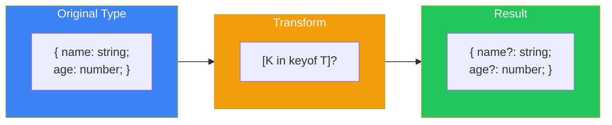
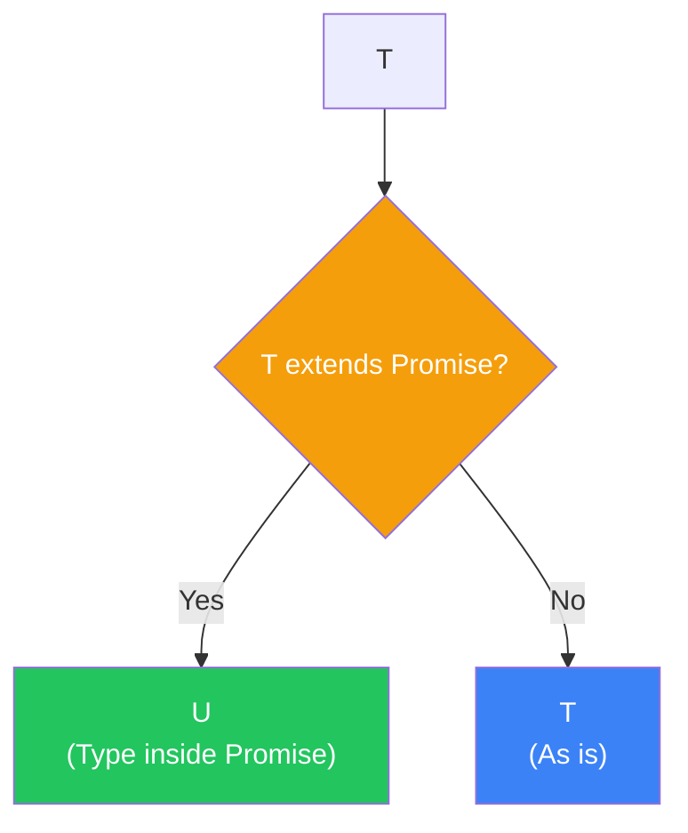
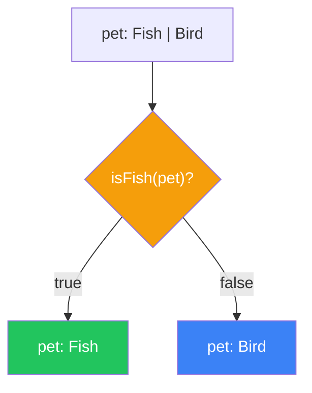

# Day 10: Advanced Types and Best Practices

## What You'll Learn Today

- Mapped Types
- Conditional Types
- Template Literal Types
- Type assertions and Type Guards
- Important tsconfig.json settings
- TypeScript best practices

---

## Mapped Types

**Mapped Types** transform properties of an existing type to create a new type.

```typescript
// Basic syntax
type MappedType<T> = {
  [K in keyof T]: T[K];
};

// Practical example: Make all properties optional
type MyPartial<T> = {
  [K in keyof T]?: T[K];
};

interface User {
  name: string;
  age: number;
}

type PartialUser = MyPartial<User>;
// { name?: string; age?: number; }
```



### Adding and Removing Modifiers

```typescript
// Add readonly
type Readonly<T> = {
  readonly [K in keyof T]: T[K];
};

// Remove readonly
type Mutable<T> = {
  -readonly [K in keyof T]: T[K];
};

// Remove optional
type Required<T> = {
  [K in keyof T]-?: T[K];
};
```

### Key Transformation

```typescript
// Generate getter functions
type Getters<T> = {
  [K in keyof T as `get${Capitalize<string & K>}`]: () => T[K];
};

interface Person {
  name: string;
  age: number;
}

type PersonGetters = Getters<Person>;
// { getName: () => string; getAge: () => number; }
```

---

## Conditional Types

**Conditional Types** select types based on conditions.

```typescript
// Basic syntax: T extends U ? X : Y
type IsString<T> = T extends string ? true : false;

type A = IsString<string>;  // true
type B = IsString<number>;  // false
```

### The infer Keyword

Use `infer` to extract types.

```typescript
// Extract function return type
type ReturnType<T> = T extends (...args: any[]) => infer R ? R : never;

function greet(): string {
  return "Hello";
}

type GreetReturn = ReturnType<typeof greet>; // string

// Extract the inner type of a Promise
type Awaited<T> = T extends Promise<infer U> ? U : T;

type A = Awaited<Promise<string>>; // string
type B = Awaited<string>;          // string
```



### Distributive Conditional Types

When a conditional type is applied to a union type, it distributes over each member.

```typescript
type ToArray<T> = T extends any ? T[] : never;

type A = ToArray<string | number>;
// string[] | number[] (distributed to each type)

// To prevent distribution, wrap in []
type ToArrayNonDist<T> = [T] extends [any] ? T[] : never;

type B = ToArrayNonDist<string | number>;
// (string | number)[]
```

---

## Template Literal Types

String literal types can be manipulated with templates.

```typescript
// Basic
type Greeting = `Hello, ${string}!`;
const g: Greeting = "Hello, World!"; // OK
const g2: Greeting = "Hi, World!";   // Error

// Combining with union types
type Direction = "top" | "right" | "bottom" | "left";
type MarginProperty = `margin-${Direction}`;
// "margin-top" | "margin-right" | "margin-bottom" | "margin-left"
```

### Built-in String Manipulation Types

```typescript
type Uppercase<S extends string> = ...
type Lowercase<S extends string> = ...
type Capitalize<S extends string> = ...
type Uncapitalize<S extends string> = ...

type A = Uppercase<"hello">;     // "HELLO"
type B = Capitalize<"hello">;    // "Hello"

// Generate event handler names
type EventName = "click" | "focus" | "blur";
type Handler = `on${Capitalize<EventName>}`;
// "onClick" | "onFocus" | "onBlur"
```

---

## Type Assertions and Type Guards

### Type Assertions

Override the type checker's judgment.

```typescript
// as syntax (recommended)
const value = someValue as string;

// Angle bracket syntax (not recommended due to JSX conflict)
const value2 = <string>someValue;

// Example usage
const canvas = document.getElementById("canvas") as HTMLCanvasElement;
```

### Warning: Type Assertions Are Not Safe

```typescript
const value: unknown = "hello";

// Dangerous: Possible runtime error
const num = value as number;
console.log(num.toFixed(2)); // Runtime error
```

### Type Guards (Custom Type Guards)

Create functions that narrow types using the `is` keyword.

```typescript
interface Fish {
  swim(): void;
}

interface Bird {
  fly(): void;
}

// Custom type guard
function isFish(pet: Fish | Bird): pet is Fish {
  return (pet as Fish).swim !== undefined;
}

function move(pet: Fish | Bird) {
  if (isFish(pet)) {
    pet.swim(); // OK: Recognized as Fish
  } else {
    pet.fly();  // OK: Recognized as Bird
  }
}
```



---

## Important tsconfig.json Settings

### Strict Mode Settings

```json
{
  "compilerOptions": {
    // Recommended: Enable all strict checks
    "strict": true,

    // Individual strict settings
    "noImplicitAny": true,        // Disallow implicit any
    "strictNullChecks": true,     // Strict null/undefined checks
    "strictFunctionTypes": true,  // Strict function type checks
    "strictBindCallApply": true,  // Strict bind/call/apply checks
    "noImplicitThis": true,       // Disallow implicit this
    "alwaysStrict": true          // Output "use strict"
  }
}
```

### Code Quality Settings

```json
{
  "compilerOptions": {
    "noUnusedLocals": true,           // Warn on unused local variables
    "noUnusedParameters": true,       // Warn on unused parameters
    "noImplicitReturns": true,        // Disallow implicit returns
    "noFallthroughCasesInSwitch": true // Disallow fallthrough in switch
  }
}
```

### Module and Target

```json
{
  "compilerOptions": {
    "target": "ES2020",           // Output JS version
    "module": "ESNext",           // Module system
    "moduleResolution": "bundler", // Module resolution
    "esModuleInterop": true       // CommonJS interop
  }
}
```

---

## Best Practices

### 1. Avoid any

```typescript
// ❌ Bad
function process(data: any) {
  return data.value;
}

// ✅ Good
function process<T extends { value: unknown }>(data: T) {
  return data.value;
}

// Or use unknown
function process(data: unknown) {
  if (isValidData(data)) {
    return data.value;
  }
}
```

### 2. Leverage Type Inference

```typescript
// ❌ Verbose
const name: string = "Alice";
const numbers: number[] = [1, 2, 3];

// ✅ Let type inference handle it
const name = "Alice";
const numbers = [1, 2, 3];

// Explicit return types are useful for functions
function calculateTotal(items: Item[]): number {
  return items.reduce((sum, item) => sum + item.price, 0);
}
```

### 3. Use Union Types

```typescript
// ❌ Ambiguous
function setStatus(status: string) { }

// ✅ Clear
function setStatus(status: "pending" | "approved" | "rejected") { }
```

### 4. Use readonly

```typescript
// ❌ Mutable
interface Config {
  apiKey: string;
  endpoint: string;
}

// ✅ Immutable
interface Config {
  readonly apiKey: string;
  readonly endpoint: string;
}

// For arrays too
function process(items: readonly number[]) {
  // items.push(1); // Error
}
```

### 5. Use Discriminated Unions

```typescript
// ❌ Ambiguous
interface Response {
  success: boolean;
  data?: any;
  error?: string;
}

// ✅ Clear
type Response =
  | { success: true; data: any }
  | { success: false; error: string };
```

---

## Summary

| Concept | Description | Example |
|---------|-------------|---------|
| Mapped Types | Transform properties | `{ [K in keyof T]: T[K] }` |
| Conditional Types | Conditional branching | `T extends U ? X : Y` |
| Template Literal | String manipulation | `` `prefix-${T}` `` |
| Type Guard | Narrow types | `function isX(v): v is X` |

### 10-Day Recap

Congratulations! You've learned TypeScript from basics to advanced types in 10 days.

| Day | Topic | Key Points |
|-----|-------|------------|
| 1 | Introduction | What is TypeScript, setup |
| 2 | Basic Types | Primitives, any, unknown, never |
| 3 | Union Types | Combining types, narrowing |
| 4 | Functions | Parameters, return types, overloads |
| 5 | Objects | Type definitions, structural typing |
| 6 | Arrays/Tuples | Array types, fixed-length arrays |
| 7 | Interfaces | extends, declaration merging |
| 8 | Classes | Access modifiers, abstract classes |
| 9 | Generics | Type parameters, utility types |
| 10 | Advanced Types | Mapped/Conditional Types |

---

## Next Steps

Resources to continue learning TypeScript:

1. **Official Handbook**: https://www.typescriptlang.org/docs/handbook/
2. **TypeScript Deep Dive**: https://basarat.gitbook.io/typescript/
3. **Type Challenges**: https://github.com/type-challenges/type-challenges
4. **Practice**: Migrate an existing JavaScript project to TypeScript

### Practice Tips

- Start with small projects
- Begin with `strict: true`
- Develop the habit of reading error messages
- Try reading type definition files (.d.ts)

---

## Final Practice Problems

### Problem 1: Mapped Types

Implement a `Nullable<T>` type that makes all properties nullable.

```typescript
interface User {
  name: string;
  age: number;
}

type NullableUser = Nullable<User>;
// { name: string | null; age: number | null; }
```

### Problem 2: Conditional Types

Implement `ElementType<T>` that extracts the element type from an array type.

```typescript
type A = ElementType<string[]>;  // string
type B = ElementType<number[]>;  // number
type C = ElementType<string>;    // never
```

### Challenge

Implement `DeepPartial<T>` that makes all properties optional in a deeply nested object.

```typescript
interface Config {
  server: {
    host: string;
    port: number;
  };
  database: {
    url: string;
  };
}

type PartialConfig = DeepPartial<Config>;
// All nested properties also become optional
```

---

## References

- [TypeScript Official Documentation](https://www.typescriptlang.org/docs/)
- [TypeScript Playground](https://www.typescriptlang.org/play)
- [DefinitelyTyped](https://github.com/DefinitelyTyped/DefinitelyTyped)

---

**Congratulations!** You've mastered the fundamentals of TypeScript. Now go ahead and use TypeScript in real projects to write type-safe code!
