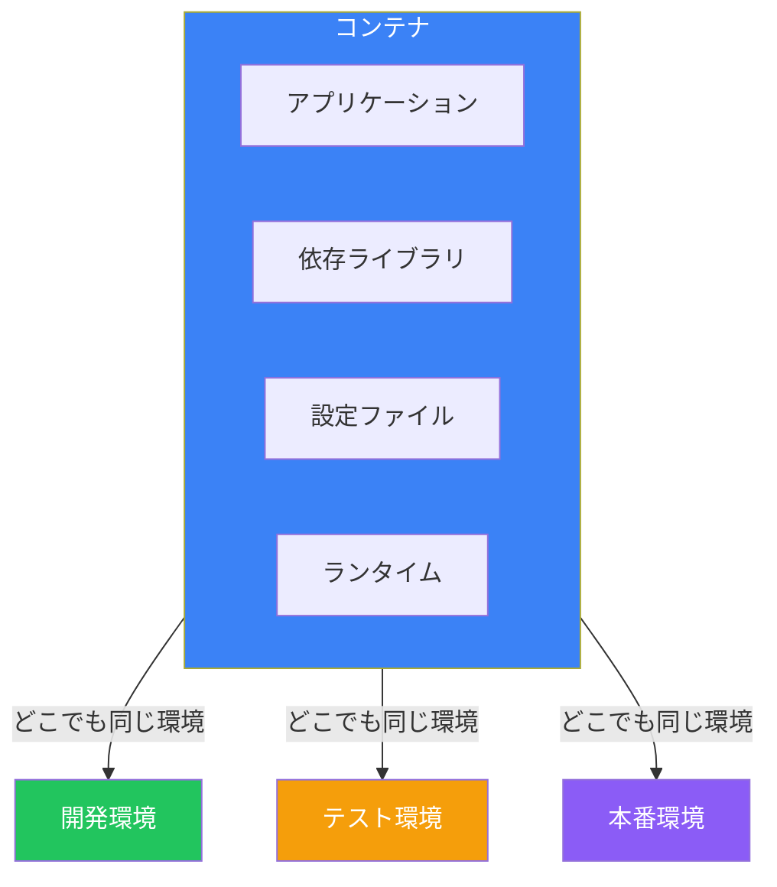
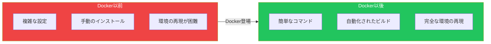
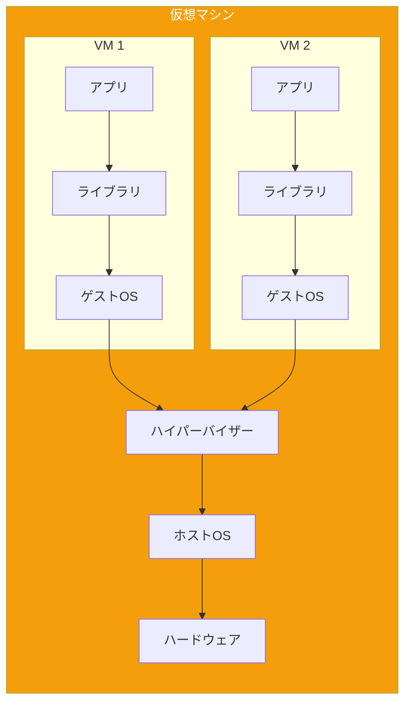
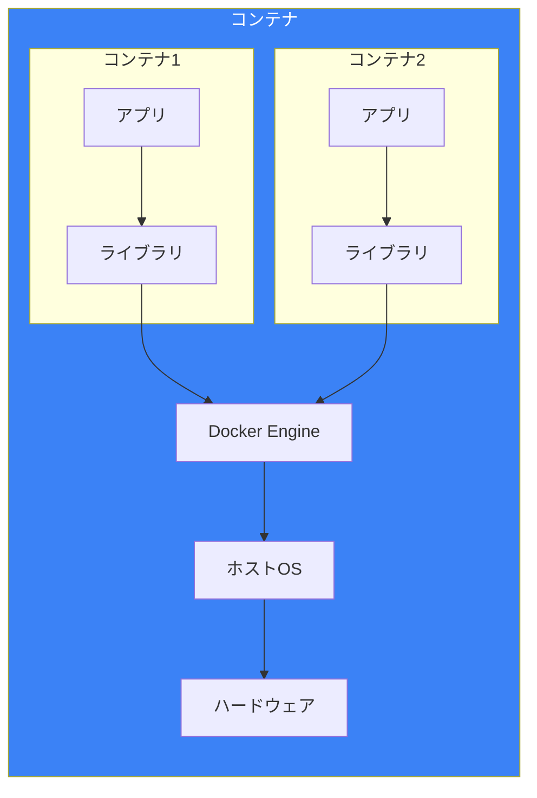
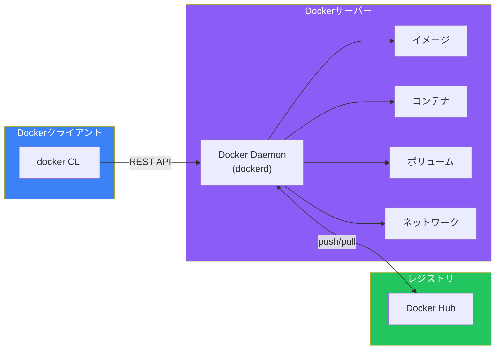

# Day 1: Dockerの世界へようこそ

## 今日学ぶこと

- コンテナ技術とは何か、なぜ必要なのか
- Dockerの歴史と背景
- 仮想マシン（VM）とコンテナの違い
- Dockerがもたらすメリット

---

## アプリケーション開発の課題

「自分のマシンでは動いたのに...」

この言葉を聞いたことがある方は多いでしょう。開発環境では完璧に動作するアプリケーションが、テスト環境や本番環境にデプロイした途端に動かなくなる。これはソフトウェア開発における最も一般的な問題の一つです。

### なぜ環境によって動作が変わるのか？

アプリケーションは単独では動きません。OSのバージョン、ライブラリ、設定ファイル、環境変数など、多くの要素に依存しています。

```
開発環境             本番環境
┌──────────────┐    ┌──────────────┐
│ Python 3.11  │    │ Python 3.9   │  ← バージョン違い
│ Ubuntu 22.04 │    │ CentOS 7     │  ← OS違い
│ ライブラリA v2.0 │    │ ライブラリA v1.8 │  ← ライブラリ違い
└──────────────┘    └──────────────┘
```

この「環境の違い」が、多くの問題を引き起こします：

- **「動かない」問題**: 依存関係の違いでエラーが発生
- **再現困難なバグ**: 特定の環境でのみ発生する問題
- **デプロイの恐怖**: 本番環境への変更が怖い

---

## コンテナ技術の登場

コンテナは、この「環境の違い」問題を解決するために生まれました。

### コンテナとは？

コンテナは、**アプリケーションとその実行に必要なすべての依存関係をパッケージ化した軽量な実行単位**です。



コンテナには、アプリケーションが動作するために必要なものすべてが含まれています。そのため、コンテナをどの環境で実行しても、まったく同じように動作します。

---

## Dockerとは

Dockerは、2013年にDotCloud社（後のDocker社）のSolomon Hykesによって発表されたコンテナプラットフォームです。

### なぜDockerが革命を起こしたのか？

コンテナ技術自体はDockerより前から存在していました（LXC、FreeBSD Jailなど）。しかし、Dockerが画期的だったのは以下の点です：

1. **使いやすさ**: シンプルなコマンドでコンテナを操作できる
2. **イメージの共有**: Docker Hubでイメージを簡単に共有できる
3. **Dockerfile**: テキストファイルでイメージをビルドできる
4. **エコシステム**: 豊富なツールとコミュニティ



---

## 仮想マシン vs コンテナ

従来、環境の分離には仮想マシン（VM）が使われてきました。コンテナはVMとどう違うのでしょうか？

### 仮想マシン（VM）

VMは、**ハイパーバイザー**を使って物理的なハードウェアを仮想化します。各VMには完全なOSが含まれます。



### コンテナ

コンテナは、ホストOSのカーネルを共有し、**プロセスレベル**で分離されます。



### 比較表

| 特性 | 仮想マシン | コンテナ |
|------|-----------|---------|
| 起動時間 | 数分 | 数秒 |
| サイズ | 数GB〜数十GB | 数十MB〜数百MB |
| リソース効率 | 低い（各VMにOSが必要） | 高い（カーネル共有） |
| 分離レベル | 強い（完全なOS分離） | 中程度（プロセス分離） |
| 移植性 | 限定的 | 非常に高い |

---

## Dockerのアーキテクチャ

Dockerは、クライアント-サーバー型のアーキテクチャを採用しています。



### 主要コンポーネント

1. **Docker Client（クライアント）**: ユーザーがDockerと対話するためのCLI
2. **Docker Daemon（デーモン）**: コンテナを管理するバックグラウンドサービス
3. **Docker Images（イメージ）**: コンテナの設計図
4. **Docker Containers（コンテナ）**: イメージから作成された実行中のインスタンス
5. **Docker Registry（レジストリ）**: イメージを保存・共有する場所

---

## Dockerの主なメリット

### 1. 環境の一貫性

開発、テスト、本番で同じコンテナを使用できます。「自分のマシンでは動いた」問題が解消されます。

### 2. 迅速な起動

VMが数分かかるのに対し、コンテナは数秒で起動します。開発サイクルが大幅に短縮されます。

### 3. 効率的なリソース利用

複数のコンテナがOSカーネルを共有するため、VMより少ないリソースで多くのアプリケーションを実行できます。

### 4. 簡単なスケーリング

コンテナは軽量なため、必要に応じて簡単に増減できます。

### 5. バージョン管理

イメージにタグをつけてバージョン管理できます。問題が発生したら、以前のバージョンに簡単にロールバックできます。

### 6. マイクロサービスとの親和性

各サービスを独立したコンテナとして実行でき、マイクロサービスアーキテクチャと相性が良いです。

---

## Dockerの用語

これからDockerを学ぶにあたり、重要な用語を整理しておきましょう。

| 用語 | 説明 |
|------|------|
| **イメージ（Image）** | コンテナを作成するための読み取り専用テンプレート |
| **コンテナ（Container）** | イメージから作成された実行可能なインスタンス |
| **Dockerfile** | イメージを構築するための命令を記述したテキストファイル |
| **レジストリ（Registry）** | イメージを保存・配布する場所（Docker Hub等） |
| **レイヤー（Layer）** | イメージを構成する個々の層 |
| **ボリューム（Volume）** | コンテナのデータを永続化するための仕組み |

---

## まとめ

| 概念 | 説明 |
|------|------|
| コンテナ | アプリケーションと依存関係をパッケージ化した軽量実行単位 |
| Docker | コンテナを簡単に作成・管理できるプラットフォーム |
| VM vs コンテナ | コンテナはカーネル共有で軽量・高速 |
| イメージ | コンテナの設計図（読み取り専用） |
| Docker Hub | イメージを共有するレジストリ |

### 重要ポイント

1. コンテナは「環境の違い」問題を解決する
2. Dockerは使いやすさでコンテナ技術を普及させた
3. コンテナはVMより軽量で高速
4. Dockerはクライアント-サーバー型アーキテクチャ
5. イメージからコンテナが作成される

---

## 練習問題

### 問題1: 基本概念
コンテナと仮想マシンの最も大きな違いは何でしょうか？自分の言葉で説明してみてください。

### 問題2: 用語の理解
以下の文の空欄を埋めてください：
- Dockerの「＿＿＿」は、コンテナを作成するための読み取り専用テンプレートです
- 「＿＿＿」は、イメージを保存・配布するための場所です
- 「＿＿＿」は、イメージを構築するための命令を記述したファイルです

### チャレンジ問題
あなたが開発しているWebアプリケーションがあるとします。開発環境から本番環境へのデプロイで、どのような問題が発生しうるか3つ挙げ、Dockerがそれぞれをどう解決できるか考えてみてください。

---

## 参考リンク

- [Docker公式ドキュメント](https://docs.docker.com/)
- [Docker Hub](https://hub.docker.com/)
- [What is a Container? - Docker](https://www.docker.com/resources/what-container/)
- [Containers vs Virtual Machines - Microsoft](https://learn.microsoft.com/en-us/virtualization/windowscontainers/about/containers-vs-vm)

---

**次回予告**: Day 2では「Docker環境のセットアップ」について学びます。実際にDockerをインストールして、使い始める準備をしましょう。
