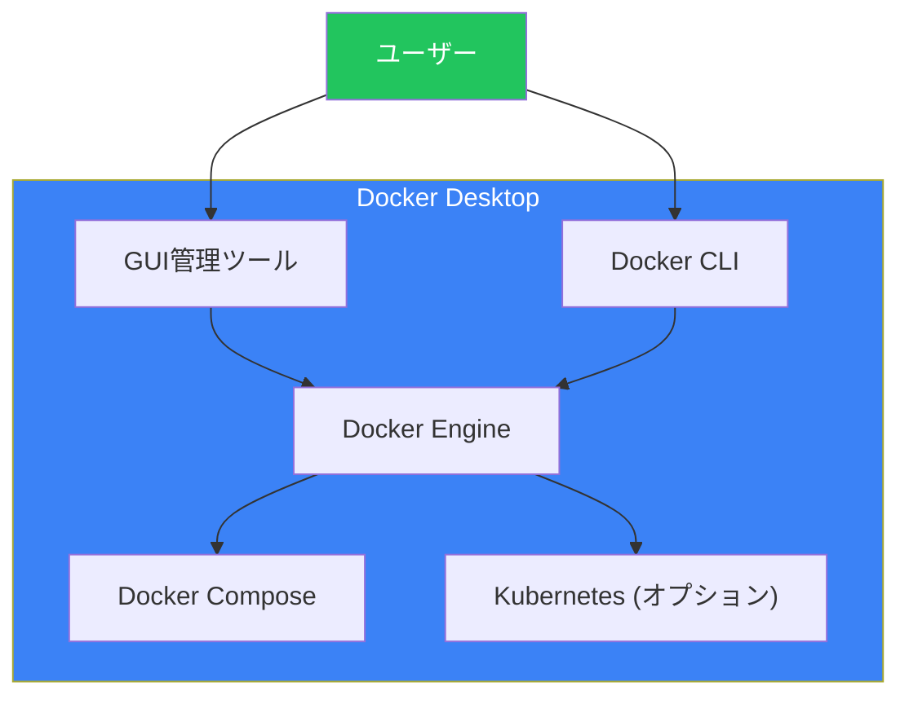
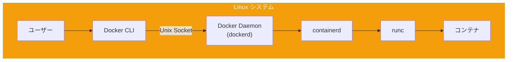
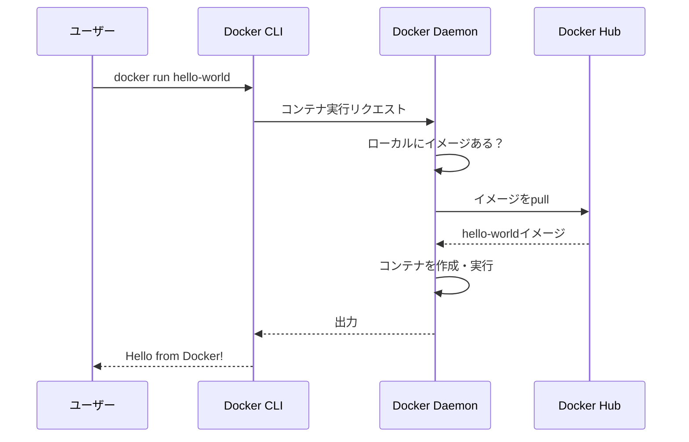

# Day 2: Docker環境のセットアップ

## 今日学ぶこと

- Docker Desktopのインストール（Windows/Mac）
- LinuxでのDockerインストール
- Docker Hubアカウントの作成
- インストールの動作確認

---

## Docker Desktopとは

Docker Desktopは、Windows/macOSでDockerを使うための最も簡単な方法です。GUIによる管理ツールとCLIの両方が含まれています。



### Docker Desktopに含まれるもの

| コンポーネント | 説明 |
|---------------|------|
| Docker Engine | コンテナを実行するコアエンジン |
| Docker CLI | コマンドラインインターフェース |
| Docker Compose | 複数コンテナの管理ツール |
| Docker Build | イメージのビルドツール |
| GUI | グラフィカルな管理インターフェース |
| Kubernetes | オプションで有効化可能 |

---

## Windowsへのインストール

### システム要件

- Windows 10 64bit: Home、Pro、Enterprise、Education（Build 19041以降）
- Windows 11 64bit: Home、Pro、Enterprise、Education
- WSL 2 機能の有効化
- BIOS で仮想化が有効

### インストール手順

#### 1. WSL 2の有効化

PowerShellを管理者として開き、以下を実行します：

```powershell
# WSL をインストール
wsl --install

# 再起動後、WSL 2 をデフォルトに設定
wsl --set-default-version 2
```

#### 2. Docker Desktopのダウンロード

[Docker公式サイト](https://www.docker.com/products/docker-desktop/)からインストーラーをダウンロードします。

#### 3. インストーラーの実行

1. ダウンロードした `Docker Desktop Installer.exe` を実行
2. 「Use WSL 2 instead of Hyper-V」にチェック
3. インストールを完了し、再起動

#### 4. 初回起動

- Docker Desktopを起動
- サービス利用規約に同意
- 推奨設定を適用


---

## macOSへのインストール

### システム要件

- macOS 12 (Monterey) 以降
- Apple Silicon (M1/M2/M3) または Intel チップ
- 4GB以上のRAM

### インストール手順

#### 1. Docker Desktopのダウンロード

[Docker公式サイト](https://www.docker.com/products/docker-desktop/)から、お使いのMacに対応したインストーラーをダウンロードします：

- **Apple Silicon (M1/M2/M3)**: Apple chip用
- **Intel**: Intel chip用

#### 2. インストール

1. ダウンロードした `.dmg` ファイルを開く
2. Docker アイコンを Applications フォルダにドラッグ
3. Applications から Docker を起動

#### 3. 初回起動

- セキュリティの確認で「開く」を選択
- 特権アクセスの許可を求められたらパスワードを入力
- サービス利用規約に同意

---

## Linuxへのインストール

Linuxでは、Docker Engineを直接インストールします。ここではUbuntuでの手順を説明します。

### Ubuntu へのインストール

#### 1. 古いバージョンの削除

```bash
# 古いバージョンがあれば削除
sudo apt-get remove docker docker-engine docker.io containerd runc
```

#### 2. リポジトリの設定

```bash
# 必要なパッケージをインストール
sudo apt-get update
sudo apt-get install ca-certificates curl gnupg

# Docker の公式 GPG キーを追加
sudo install -m 0755 -d /etc/apt/keyrings
curl -fsSL https://download.docker.com/linux/ubuntu/gpg | sudo gpg --dearmor -o /etc/apt/keyrings/docker.gpg
sudo chmod a+r /etc/apt/keyrings/docker.gpg

# リポジトリを追加
echo \
  "deb [arch=$(dpkg --print-architecture) signed-by=/etc/apt/keyrings/docker.gpg] https://download.docker.com/linux/ubuntu \
  $(. /etc/os-release && echo "$VERSION_CODENAME") stable" | \
  sudo tee /etc/apt/sources.list.d/docker.list > /dev/null
```

#### 3. Docker Engineのインストール

```bash
# パッケージインデックスを更新
sudo apt-get update

# Docker Engine をインストール
sudo apt-get install docker-ce docker-ce-cli containerd.io docker-buildx-plugin docker-compose-plugin
```

#### 4. 一般ユーザーでの実行設定

```bash
# docker グループにユーザーを追加
sudo usermod -aG docker $USER

# 変更を反映（ログアウト/ログインまたは以下を実行）
newgrp docker
```

### インストール後の構成



---

## Docker Hubアカウントの作成

Docker Hubは、イメージを保存・共有するための公式レジストリです。アカウントを作成すると、自分のイメージをプッシュしたり、プライベートリポジトリを使用したりできます。

### アカウント作成手順

1. [Docker Hub](https://hub.docker.com/)にアクセス
2. 「Sign Up」をクリック
3. 必要な情報を入力：
   - ユーザー名（Docker ID）
   - メールアドレス
   - パスワード
4. メール認証を完了

### Docker CLIでのログイン

```bash
# Docker Hub にログイン
docker login

# ユーザー名とパスワードを入力
# または、アクセストークンを使用（推奨）
```

---

## インストールの確認

### 基本的な動作確認

```bash
# Docker のバージョンを確認
docker --version
```

期待される出力：
```
Docker version 27.x.x, build xxxxxxx
```

### 詳細情報の確認

```bash
# Docker の詳細情報を表示
docker info
```

この出力には以下の情報が含まれます：
- 実行中のコンテナ数
- イメージの数
- ストレージドライバー
- OS/アーキテクチャ

### 最初のコンテナを実行

```bash
# Hello World コンテナを実行
docker run hello-world
```

成功すると以下のようなメッセージが表示されます：

```
Hello from Docker!
This message shows that your installation appears to be working correctly.

To generate this message, Docker took the following steps:
 1. The Docker client contacted the Docker daemon.
 2. The Docker daemon pulled the "hello-world" image from the Docker Hub.
 3. The Docker daemon created a new container from that image which runs the
    executable that produces the output you are currently reading.
 4. The Docker daemon streamed that output to the Docker client, which sent it
    to your terminal.
...
```

### 何が起きたのか？



---

## Docker Desktopの操作

### ダッシュボード

Docker Desktopを起動すると、ダッシュボードが表示されます。

| タブ | 説明 |
|------|------|
| Containers | 実行中・停止中のコンテナを管理 |
| Images | ローカルにあるイメージを管理 |
| Volumes | ボリュームを管理 |
| Dev Environments | 開発環境の管理 |
| Extensions | 拡張機能の管理 |

### 設定（Settings）

重要な設定項目：

| 設定 | 説明 |
|------|------|
| Resources > Memory | Dockerに割り当てるメモリ量 |
| Resources > CPUs | Dockerに割り当てるCPU数 |
| Docker Engine | daemon.jsonの設定 |
| Kubernetes | Kubernetesの有効化 |

---

## トラブルシューティング

### よくある問題と解決策

#### 1. Docker Daemon が起動しない

**Windows:**
```powershell
# WSL 2 を再起動
wsl --shutdown
# Docker Desktop を再起動
```

**Linux:**
```bash
# Docker サービスの状態を確認
sudo systemctl status docker

# Docker を再起動
sudo systemctl restart docker
```

#### 2. permission denied エラー（Linux）

```bash
# docker グループに追加されているか確認
groups $USER

# 追加されていない場合
sudo usermod -aG docker $USER

# ログアウトして再ログイン
```

#### 3. ディスク容量不足

```bash
# 未使用のリソースを削除
docker system prune -a
```

---

## まとめ

| 項目 | 内容 |
|------|------|
| Docker Desktop | Windows/macOS向けのオールインワンパッケージ |
| Docker Engine | Linux向けのコアエンジン |
| Docker Hub | イメージの公式レジストリ |
| docker run | コンテナを実行する基本コマンド |
| docker info | システム情報を表示 |

### 重要ポイント

1. Windows/macOSはDocker Desktopが最も簡単
2. LinuxはDocker Engineを直接インストール
3. docker グループへの追加でsudo不要に
4. `docker run hello-world`で動作確認
5. Docker Hubアカウントでイメージ共有が可能

---

## 練習問題

### 問題1: 確認コマンド
Docker のバージョンを確認するコマンドと、詳細情報を表示するコマンドをそれぞれ書いてください。

### 問題2: インストールの理解
Windows で Docker Desktop を使う場合、なぜ WSL 2 が必要なのか説明してください。

### チャレンジ問題
`docker run hello-world` を実行した後、以下のコマンドを実行して結果を確認してください：

```bash
# ローカルにあるイメージを一覧表示
docker images

# すべてのコンテナを表示（停止中も含む）
docker ps -a
```

hello-world のイメージサイズと、コンテナの状態を確認してみましょう。

---

## 参考リンク

- [Install Docker Desktop on Windows](https://docs.docker.com/desktop/setup/install/windows-install/)
- [Install Docker Desktop on Mac](https://docs.docker.com/desktop/setup/install/mac-install/)
- [Install Docker Engine on Ubuntu](https://docs.docker.com/engine/install/ubuntu/)
- [Docker Hub](https://hub.docker.com/)

---

**次回予告**: Day 3では「最初のコンテナを動かそう」について学びます。コンテナのライフサイクルと基本的な操作コマンドをマスターしましょう。
