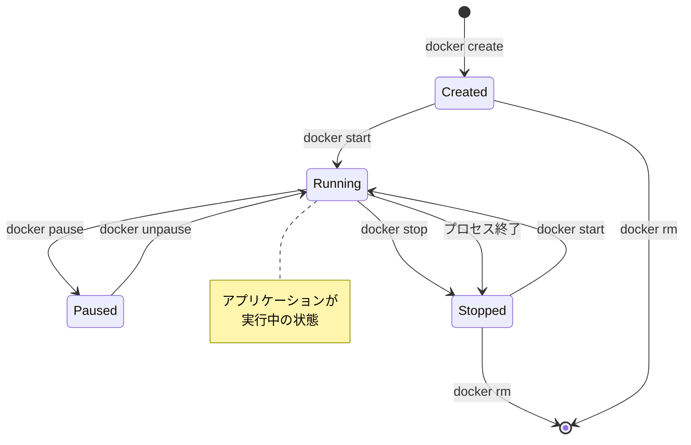
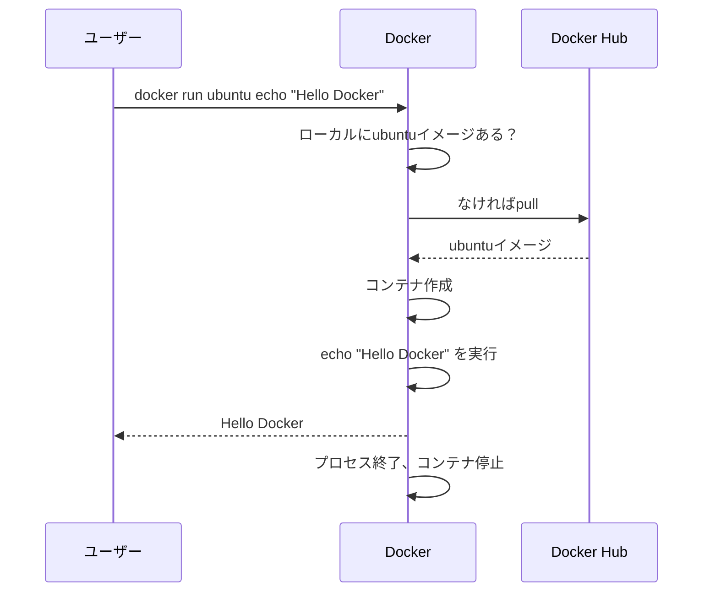
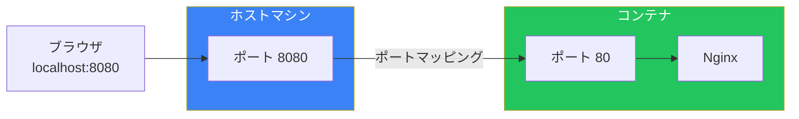
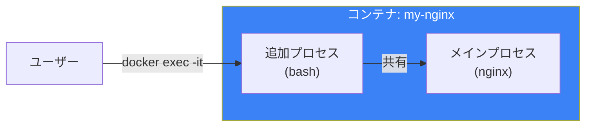
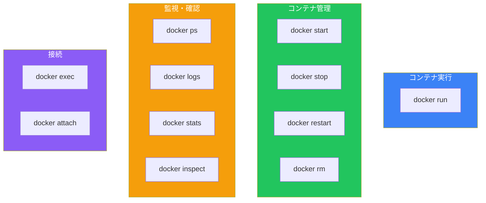

# Day 3: 最初のコンテナを動かそう

## 今日学ぶこと

- コンテナのライフサイクル
- docker run コマンドの詳細
- コンテナの基本操作（start, stop, rm）
- コンテナへの接続とログの確認

---

## コンテナのライフサイクル

コンテナには、作成から削除までのライフサイクルがあります。



### コンテナの状態

| 状態 | 説明 |
|------|------|
| Created | コンテナが作成されたが、まだ起動していない |
| Running | コンテナが実行中 |
| Paused | コンテナが一時停止中 |
| Stopped | コンテナが停止している |
| Deleted | コンテナが削除された |

---

## docker run コマンド

`docker run` は最もよく使うコマンドです。イメージからコンテナを作成し、実行します。

### 基本構文

```bash
docker run [オプション] イメージ名 [コマンド]
```

### シンプルな実行

```bash
# Ubuntu コンテナを実行し、bash を起動
docker run ubuntu echo "Hello Docker"
```

出力：
```
Hello Docker
```

このコマンドで何が起きたか：



---

## 重要なオプション

### -it: インタラクティブモード

コンテナ内で対話的に操作したい場合に使用します。

```bash
# Ubuntu コンテナに接続して bash を操作
docker run -it ubuntu bash
```

| オプション | 意味 |
|-----------|------|
| `-i` | 標準入力を開いたままにする（interactive） |
| `-t` | 疑似TTYを割り当てる（terminal） |

コンテナ内のシェルが起動します：

```bash
root@abc123def456:/# ls
bin  boot  dev  etc  home  lib  ...

root@abc123def456:/# cat /etc/os-release
PRETTY_NAME="Ubuntu 24.04 LTS"
...

root@abc123def456:/# exit
```

### -d: バックグラウンド実行

コンテナをバックグラウンドで実行します。

```bash
# Nginx をバックグラウンドで実行
docker run -d nginx
```

出力（コンテナID）：
```
d8e7f6a5b4c3d2e1f0a9b8c7d6e5f4a3b2c1d0e9
```

### --name: コンテナに名前をつける

```bash
# my-nginx という名前でコンテナを実行
docker run -d --name my-nginx nginx
```

### -p: ポートマッピング

ホストのポートをコンテナのポートにマッピングします。

```bash
# ホストの8080番をコンテナの80番にマッピング
docker run -d -p 8080:80 nginx
```



ブラウザで `http://localhost:8080` にアクセスすると、Nginx のウェルカムページが表示されます。

### --rm: 終了時に自動削除

コンテナが停止したら自動的に削除されます。

```bash
# 実行後、自動的にコンテナを削除
docker run --rm ubuntu echo "一時的なコンテナ"
```

---

## コンテナの一覧表示

### 実行中のコンテナを表示

```bash
docker ps
```

出力例：
```
CONTAINER ID   IMAGE   COMMAND                  STATUS          PORTS                  NAMES
d8e7f6a5b4c3   nginx   "/docker-entrypoint.…"   Up 5 minutes    0.0.0.0:8080->80/tcp   my-nginx
```

### すべてのコンテナを表示（停止中も含む）

```bash
docker ps -a
```

### 出力の各列

| 列 | 説明 |
|------|------|
| CONTAINER ID | コンテナの一意な識別子 |
| IMAGE | コンテナの元となったイメージ |
| COMMAND | コンテナで実行されているコマンド |
| CREATED | コンテナが作成された時間 |
| STATUS | コンテナの状態 |
| PORTS | ポートマッピング |
| NAMES | コンテナの名前 |

---

## コンテナの操作

### コンテナの停止

```bash
# コンテナ名またはIDで停止
docker stop my-nginx

# 複数のコンテナを一度に停止
docker stop container1 container2
```

### コンテナの開始

```bash
# 停止中のコンテナを開始
docker start my-nginx
```

### コンテナの再起動

```bash
docker restart my-nginx
```

### コンテナの削除

```bash
# 停止中のコンテナを削除
docker rm my-nginx

# 実行中のコンテナを強制削除
docker rm -f my-nginx
```

### すべての停止中コンテナを削除

```bash
docker container prune
```

---

## 実行中のコンテナに接続

### docker exec

実行中のコンテナで追加のコマンドを実行します。

```bash
# コンテナ内でコマンドを実行
docker exec my-nginx ls /etc/nginx

# コンテナ内でシェルを起動
docker exec -it my-nginx bash
```



### docker attach

コンテナのメインプロセスに接続します。

```bash
docker attach my-container
```

**注意**: `attach` を使うと、コンテナのメインプロセスに直接接続します。Ctrl+C で終了すると、コンテナ自体が停止する可能性があります。

---

## ログの確認

### docker logs

コンテナの標準出力/標準エラー出力を確認します。

```bash
# ログを表示
docker logs my-nginx

# 最後の10行を表示
docker logs --tail 10 my-nginx

# リアルタイムでログを追跡
docker logs -f my-nginx

# タイムスタンプ付きで表示
docker logs -t my-nginx
```

### よく使うオプション

| オプション | 説明 |
|-----------|------|
| `-f, --follow` | ログをリアルタイムで追跡 |
| `--tail N` | 最後のN行を表示 |
| `-t, --timestamps` | タイムスタンプを表示 |
| `--since` | 指定時刻以降のログを表示 |

---

## コンテナの詳細情報

### docker inspect

コンテナの詳細なJSON形式の情報を取得します。

```bash
docker inspect my-nginx
```

### 特定の情報を取得

```bash
# IPアドレスを取得
docker inspect -f '{{range .NetworkSettings.Networks}}{{.IPAddress}}{{end}}' my-nginx

# マウントされたボリュームを取得
docker inspect -f '{{json .Mounts}}' my-nginx
```

### docker stats

コンテナのリソース使用状況をリアルタイムで表示します。

```bash
# すべてのコンテナのリソース使用状況
docker stats

# 特定のコンテナのリソース使用状況
docker stats my-nginx
```

出力例：
```
CONTAINER ID   NAME       CPU %     MEM USAGE / LIMIT     MEM %     NET I/O
d8e7f6a5b4c3   my-nginx   0.00%     7.5MiB / 7.765GiB     0.09%     1.45kB / 0B
```

---

## 実践：Webサーバーを動かす

Nginxを使って簡単なWebサーバーを構築してみましょう。

### Step 1: Nginxコンテナを起動

```bash
docker run -d --name web-server -p 8080:80 nginx
```

### Step 2: 動作確認

ブラウザで `http://localhost:8080` にアクセス、または：

```bash
curl http://localhost:8080
```

### Step 3: ログを確認

```bash
docker logs web-server
```

### Step 4: コンテナ内部を確認

```bash
docker exec -it web-server bash

# Nginx の設定を確認
cat /etc/nginx/nginx.conf

# HTMLファイルを確認
cat /usr/share/nginx/html/index.html

exit
```

### Step 5: クリーンアップ

```bash
docker stop web-server
docker rm web-server
```

---

## コマンドチートシート



---

## まとめ

| コマンド | 説明 |
|---------|------|
| `docker run` | イメージからコンテナを作成・実行 |
| `docker ps` | コンテナの一覧を表示 |
| `docker stop` | コンテナを停止 |
| `docker start` | コンテナを開始 |
| `docker rm` | コンテナを削除 |
| `docker logs` | コンテナのログを表示 |
| `docker exec` | 実行中のコンテナでコマンドを実行 |

### 重要ポイント

1. `-it` でインタラクティブモード、`-d` でバックグラウンド実行
2. `-p` でホストとコンテナのポートをマッピング
3. `--name` でコンテナに名前をつけると管理しやすい
4. `docker exec -it` で実行中のコンテナにシェル接続
5. `docker logs -f` でリアルタイムにログを追跡

---

## 練習問題

### 問題1: 基本操作
以下の操作を順番に実行してください：
1. Nginxコンテナを `my-web` という名前でバックグラウンド起動（ポート8080）
2. コンテナが動いているか確認
3. ログを表示
4. コンテナを停止・削除

### 問題2: コマンドの理解
`docker run -d -p 3000:80 --name app nginx` コマンドの各オプションの意味を説明してください。

### チャレンジ問題
Ubuntuコンテナを起動し、その中でPythonの簡単なHTTPサーバーを立ち上げてみてください。

```bash
# ヒント
docker run -it -p 8000:8000 ubuntu bash

# コンテナ内で
apt update && apt install -y python3
cd /tmp
echo "Hello from Docker" > index.html
python3 -m http.server 8000
```

別のターミナルで `curl http://localhost:8000` を実行して確認してみましょう。

---

## 参考リンク

- [docker run リファレンス](https://docs.docker.com/reference/cli/docker/container/run/)
- [docker exec リファレンス](https://docs.docker.com/reference/cli/docker/container/exec/)
- [docker logs リファレンス](https://docs.docker.com/reference/cli/docker/container/logs/)

---

**次回予告**: Day 4では「Dockerイメージを理解する」について学びます。イメージの仕組み、レイヤー構造、そしてイメージの取得方法を詳しく見ていきましょう。
