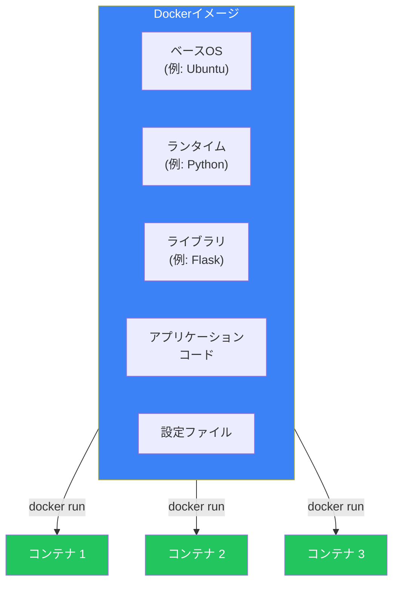
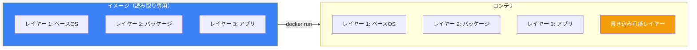
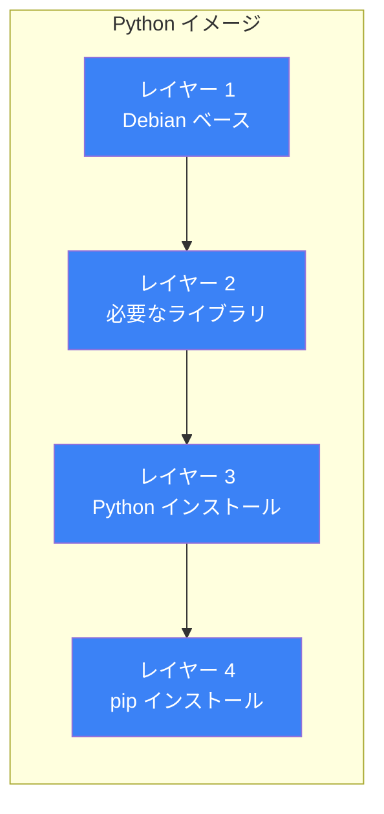
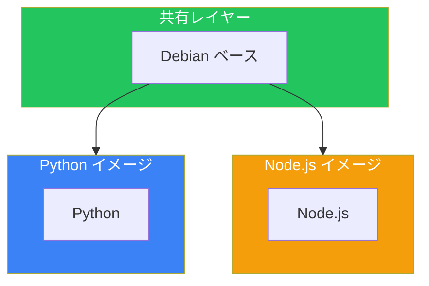
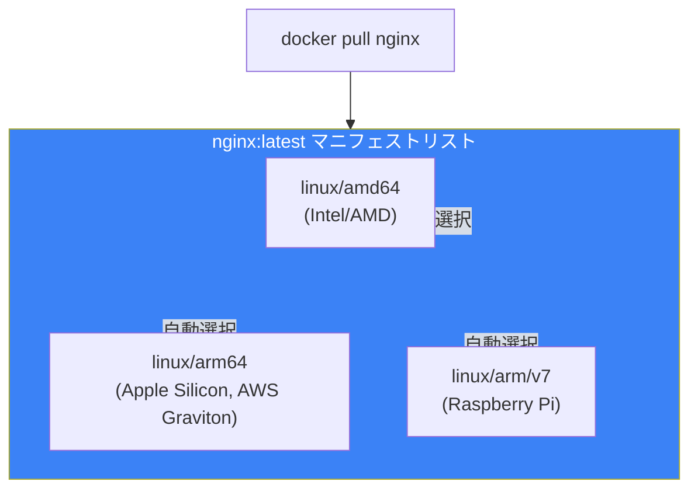

# Day 4: Dockerイメージを理解する

## 今日学ぶこと

- Dockerイメージとは何か
- イメージのレイヤー構造
- イメージの命名とタグ
- Docker Hubからのイメージ取得
- イメージの管理コマンド

---

## Dockerイメージとは

Dockerイメージは、コンテナを作成するための**読み取り専用のテンプレート**です。アプリケーションを実行するために必要なすべての要素が含まれています。



### イメージに含まれるもの

| 要素 | 説明 |
|------|------|
| ベースOS | 最小限のOS環境（Ubuntu, Alpine等） |
| ランタイム | 言語の実行環境（Python, Node.js等） |
| ライブラリ | アプリに必要なパッケージ |
| アプリケーション | 実際のコード |
| 設定 | 環境変数、設定ファイル |

---

## イメージとコンテナの関係

イメージとコンテナは、クラス（設計図）とインスタンス（実体）の関係に似ています。



- **イメージ**: 読み取り専用、複数のコンテナで共有可能
- **コンテナ**: イメージの上に書き込み可能なレイヤーを追加

---

## イメージの命名規則

### 完全なイメージ名の構造

```
[レジストリ/][ユーザー名/]イメージ名[:タグ]
```

| 部分 | 説明 | 例 |
|------|------|-----|
| レジストリ | イメージが保存されている場所 | docker.io, ghcr.io |
| ユーザー名 | イメージの所有者 | nginx, myuser |
| イメージ名 | イメージの名前 | nginx, python |
| タグ | バージョンやバリエーション | latest, 3.11, alpine |

### 例

```bash
# 公式イメージ（ユーザー名なし）
nginx
nginx:latest
nginx:1.25

# ユーザーのイメージ
myuser/myapp:v1.0

# 他のレジストリ
ghcr.io/owner/image:tag
```

### タグについて

タグはイメージのバージョンやバリエーションを識別します。

```bash
# 同じイメージ名でも、タグで異なるバージョンを指定
python:3.11
python:3.10
python:3.11-slim    # 軽量版
python:3.11-alpine  # Alpine Linux ベース
```

**重要**: `latest` タグは「最新」を意味しますが、必ずしも最新とは限りません。本番環境では具体的なバージョンを指定しましょう。

---

## イメージのレイヤー構造

Dockerイメージは複数の**レイヤー**で構成されています。これは効率的なストレージと高速なビルドを可能にします。



### レイヤーの特徴

1. **読み取り専用**: 各レイヤーは変更不可
2. **共有可能**: 同じレイヤーは複数のイメージで共有
3. **キャッシュ**: ビルド時に変更されていないレイヤーは再利用

### レイヤーの共有例



同じベースレイヤーは1回だけダウンロードされ、ディスク上で共有されます。

---

## イメージの取得：docker pull

Docker Hubや他のレジストリからイメージを取得します。

### 基本的な使い方

```bash
# 最新版を取得
docker pull nginx

# 特定のタグを指定
docker pull nginx:1.25

# 特定のレジストリから取得
docker pull ghcr.io/owner/image:tag
```

### pull時の出力を理解する

```bash
$ docker pull nginx:1.25
1.25: Pulling from library/nginx
a2abf6c4d29d: Pull complete
a9edb18cadd1: Pull complete
589b7251471a: Pull complete
186b1aaa4aa6: Pull complete
b4df32aa5a72: Pull complete
a0bcbecc962e: Pull complete
Digest: sha256:0d17b565c37bcbd895e9d92315a05c1c3c9a29f762b011a10c54a66cd53c9b31
Status: Downloaded newer image for nginx:1.25
docker.io/library/nginx:1.25
```

| 項目 | 説明 |
|------|------|
| `a2abf6c4d29d: Pull complete` | 各レイヤーのダウンロード状況 |
| `Digest` | イメージの一意な識別子（SHA256） |
| `Status` | ダウンロード結果 |

---

## イメージの一覧：docker images

ローカルにあるイメージを一覧表示します。

```bash
$ docker images
REPOSITORY   TAG       IMAGE ID       CREATED       SIZE
nginx        1.25      a6bd71f48f68   2 weeks ago   187MB
nginx        latest    a6bd71f48f68   2 weeks ago   187MB
python       3.11      22140f8f7b81   3 weeks ago   1.01GB
ubuntu       22.04     3b418d7b466a   4 weeks ago   77.8MB
```

### 出力の各列

| 列 | 説明 |
|------|------|
| REPOSITORY | イメージ名 |
| TAG | タグ |
| IMAGE ID | イメージの一意な識別子 |
| CREATED | イメージが作成された時間 |
| SIZE | イメージのサイズ |

### フィルタリング

```bash
# 特定のイメージだけ表示
docker images nginx

# ダングリングイメージ（タグなし）を表示
docker images -f dangling=true
```

---

## イメージの詳細：docker inspect

イメージの詳細情報をJSON形式で取得します。

```bash
docker inspect nginx:1.25
```

### 便利な使い方

```bash
# イメージのレイヤーを確認
docker inspect nginx:1.25 | grep -A 100 "Layers"

# 環境変数を確認
docker inspect -f '{{json .Config.Env}}' nginx:1.25 | jq

# CMD（デフォルトコマンド）を確認
docker inspect -f '{{json .Config.Cmd}}' nginx:1.25
```

---

## イメージの履歴：docker history

イメージがどのように構築されたかを確認します。

```bash
$ docker history nginx:1.25
IMAGE          CREATED       CREATED BY                                      SIZE
a6bd71f48f68   2 weeks ago   CMD ["nginx" "-g" "daemon off;"]                0B
<missing>      2 weeks ago   STOPSIGNAL SIGQUIT                              0B
<missing>      2 weeks ago   EXPOSE map[80/tcp:{}]                           0B
<missing>      2 weeks ago   ENTRYPOINT ["/docker-entrypoint.sh"]            0B
<missing>      2 weeks ago   COPY 30-tune-worker-processes.sh ... 4.62kB     4.62kB
...
```

各行がDockerfileの命令に対応しています。

---

## イメージの削除：docker rmi

```bash
# イメージを削除
docker rmi nginx:1.25

# イメージIDで削除
docker rmi a6bd71f48f68

# 強制削除
docker rmi -f nginx:1.25
```

### 未使用イメージの一括削除

```bash
# ダングリングイメージを削除
docker image prune

# 未使用のすべてのイメージを削除
docker image prune -a
```

---

## Docker Hub を探索する

[Docker Hub](https://hub.docker.com/) は、Dockerの公式イメージレジストリです。

### 公式イメージ

Docker社が管理・検証している信頼性の高いイメージです。

```bash
# 公式イメージの例
docker pull nginx
docker pull python
docker pull postgres
docker pull redis
```

### イメージの検索

```bash
# CLIで検索
docker search python

# 結果例
NAME                  DESCRIPTION                                     STARS
python                Python is an interpreted, interactive...        9280
pypy                  PyPy is a fast, compliant alternative...        365
```

### 良いイメージを選ぶポイント

| ポイント | 説明 |
|---------|------|
| 公式イメージ | "Official Image" バッジがある |
| スター数 | 多くの人に使われている |
| 更新日 | 最近更新されている |
| ドキュメント | README が充実している |

---

## マルチアーキテクチャイメージ

現代のイメージは、複数のCPUアーキテクチャをサポートしています。



`docker pull` は、実行環境に適したアーキテクチャを自動的に選択します。

---

## イメージのサイズを理解する

### なぜサイズが重要か

- **ダウンロード時間**: 大きいイメージはpullに時間がかかる
- **ストレージ**: ディスク容量を消費
- **セキュリティ**: 大きいイメージほど攻撃対象が増える

### サイズ比較

```bash
# 同じ言語でも大きな違い
python:3.11        # 約1GB
python:3.11-slim   # 約150MB
python:3.11-alpine # 約50MB
```

### Alpineベースイメージ

Alpine Linuxベースのイメージは非常に軽量です。

```bash
# 比較
ubuntu:22.04  # 約78MB
alpine:3.19   # 約7MB
```

**注意**: Alpineは軽量ですが、glibc ではなく musl を使用するため、一部のアプリケーションで互換性の問題が発生する可能性があります。

---

## 実践：様々なイメージを試す

### Step 1: 異なるPythonイメージを比較

```bash
# 3つのバリエーションをpull
docker pull python:3.11
docker pull python:3.11-slim
docker pull python:3.11-alpine

# サイズを比較
docker images python
```

### Step 2: イメージの中身を確認

```bash
# 各イメージでシェルを起動して確認
docker run -it python:3.11 bash
docker run -it python:3.11-slim bash
docker run -it python:3.11-alpine sh  # Alpineはbashがない
```

### Step 3: レイヤーの違いを確認

```bash
docker history python:3.11
docker history python:3.11-alpine
```

---

## まとめ

| コマンド | 説明 |
|---------|------|
| `docker pull` | イメージをレジストリから取得 |
| `docker images` | ローカルのイメージを一覧表示 |
| `docker inspect` | イメージの詳細情報を表示 |
| `docker history` | イメージの構築履歴を表示 |
| `docker rmi` | イメージを削除 |
| `docker image prune` | 未使用イメージを削除 |

### 重要ポイント

1. イメージは読み取り専用で、コンテナの設計図
2. イメージはレイヤーで構成され、効率的に共有される
3. タグでバージョン管理、`latest` より具体的なタグを推奨
4. 公式イメージは信頼性が高い
5. Alpine ベースは軽量だが互換性に注意

---

## 練習問題

### 問題1: イメージの取得
以下のイメージを取得し、サイズを比較してください：
- `node:20`
- `node:20-slim`
- `node:20-alpine`

### 問題2: イメージの調査
`redis:latest` イメージをpullし、以下を調べてください：
- イメージのサイズ
- レイヤーの数（`docker history` で確認）
- デフォルトのコマンド（`docker inspect` で確認）

### チャレンジ問題
Docker Hub で PostgreSQL の公式イメージを検索し、利用可能なタグの種類（通常版、Alpine版など）を調べてください。それぞれのタグがどのような用途に適しているか考えてみましょう。

---

## 参考リンク

- [Docker Hub](https://hub.docker.com/)
- [Docker イメージの概要](https://docs.docker.com/get-started/docker-concepts/the-basics/what-is-an-image/)
- [Dockerfile ベストプラクティス](https://docs.docker.com/develop/develop-images/dockerfile_best-practices/)

---

**次回予告**: Day 5では「Dockerfileでイメージを作成」について学びます。自分のアプリケーションをコンテナ化する方法をマスターしましょう。
