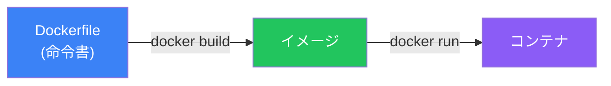
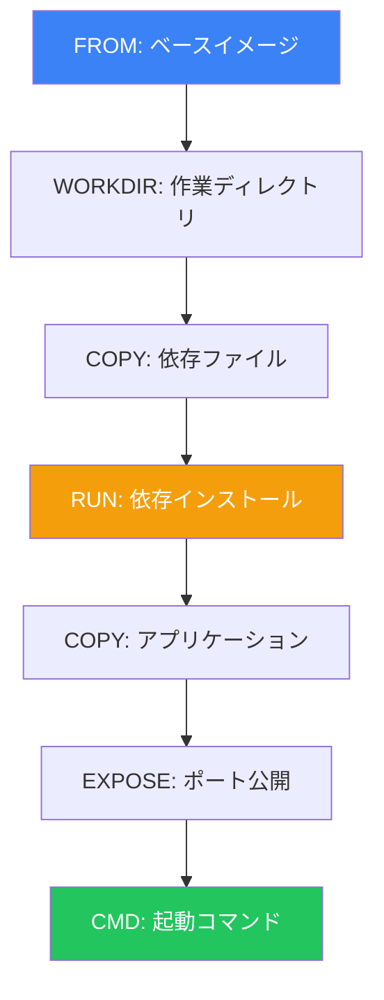
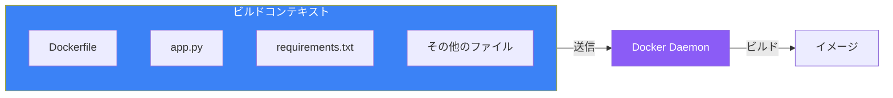

# Day 5: Dockerfileでイメージを作成

## 今日学ぶこと

- Dockerfileとは何か
- 基本的なDockerfile命令
- docker buildでイメージをビルド
- ビルドコンテキストの理解
- 実践的なDockerfileの作成

---

## Dockerfileとは

Dockerfileは、Dockerイメージを構築するための命令を記述した**テキストファイル**です。レシピのように、ベースイメージから始まり、アプリケーションの設定、依存関係のインストール、起動コマンドなどを順番に記述します。



### なぜDockerfileを使うのか

| メリット | 説明 |
|---------|------|
| 再現性 | 同じDockerfileから同じイメージを何度でも作成可能 |
| バージョン管理 | Gitで変更履歴を管理できる |
| 自動化 | CI/CDパイプラインに組み込める |
| ドキュメント | イメージの構成が明確に記述される |

---

## Dockerfileの基本構造

```dockerfile
# ベースイメージを指定
FROM python:3.11-slim

# メタデータを追加
LABEL maintainer="your@email.com"

# 作業ディレクトリを設定
WORKDIR /app

# ファイルをコピー
COPY requirements.txt .

# コマンドを実行
RUN pip install -r requirements.txt

# アプリケーションをコピー
COPY . .

# ポートを公開
EXPOSE 8000

# コンテナ起動時のコマンド
CMD ["python", "app.py"]
```

---

## 主要な命令

### FROM - ベースイメージの指定

すべてのDockerfileは `FROM` から始まります。

```dockerfile
# 公式Pythonイメージを使用
FROM python:3.11

# 軽量版を使用
FROM python:3.11-slim

# 超軽量Alpine版を使用
FROM python:3.11-alpine

# 特定のバージョンを固定
FROM python:3.11.7-slim-bookworm
```

### WORKDIR - 作業ディレクトリの設定

```dockerfile
# 作業ディレクトリを作成して移動
WORKDIR /app

# 以降の命令はすべて /app 内で実行される
```

### COPY - ファイルのコピー

ホストのファイルをイメージにコピーします。

```dockerfile
# 単一ファイルをコピー
COPY requirements.txt .

# 複数ファイルをコピー
COPY package.json package-lock.json ./

# ディレクトリをコピー
COPY src/ ./src/

# すべてをコピー
COPY . .
```

### ADD - 高度なコピー

`COPY` に似ていますが、追加機能があります。

```dockerfile
# URLからダウンロード
ADD https://example.com/file.tar.gz /app/

# tarファイルを自動展開
ADD archive.tar.gz /app/
```

**推奨**: 通常は `COPY` を使用。`ADD` は特別な機能が必要な場合のみ。

### RUN - コマンドの実行

イメージ構築時にコマンドを実行します。

```dockerfile
# パッケージのインストール
RUN apt-get update && apt-get install -y curl

# Pythonパッケージのインストール
RUN pip install --no-cache-dir -r requirements.txt

# 複数コマンドを1つのRUNにまとめる（レイヤー数を減らす）
RUN apt-get update && \
    apt-get install -y --no-install-recommends curl && \
    rm -rf /var/lib/apt/lists/*
```

### CMD - デフォルトコマンド

コンテナ起動時のデフォルトコマンドを指定します。

```dockerfile
# exec形式（推奨）
CMD ["python", "app.py"]

# shell形式
CMD python app.py
```

### ENTRYPOINT - エントリーポイント

コンテナをコマンドとして使用する場合に便利です。

```dockerfile
ENTRYPOINT ["python"]
CMD ["app.py"]
```

```bash
# app.py を実行
docker run myapp

# 別のスクリプトを実行
docker run myapp other.py
```

### ENV - 環境変数

```dockerfile
ENV APP_ENV=production
ENV PORT=8000

# 複数を一度に
ENV APP_ENV=production \
    PORT=8000
```

### EXPOSE - ポートの公開

```dockerfile
# ポート8000を公開（ドキュメント目的）
EXPOSE 8000

# 複数ポート
EXPOSE 80 443
```

**注意**: `EXPOSE` は実際にポートを開くわけではありません。`docker run -p` で指定が必要です。

### ARG - ビルド時引数

```dockerfile
ARG PYTHON_VERSION=3.11
FROM python:${PYTHON_VERSION}

ARG APP_ENV=production
ENV APP_ENV=${APP_ENV}
```

```bash
# ビルド時に引数を渡す
docker build --build-arg PYTHON_VERSION=3.10 .
```

---

## 命令の流れ



---

## docker build コマンド

### 基本構文

```bash
docker build [オプション] パス
```

### 基本的な使い方

```bash
# カレントディレクトリのDockerfileをビルド
docker build .

# タグを指定してビルド
docker build -t myapp:v1.0 .

# 別のDockerfileを指定
docker build -f Dockerfile.prod -t myapp:prod .
```

### ビルドコンテキスト

`docker build` の最後の引数（`.`）は**ビルドコンテキスト**です。



ビルドコンテキスト内のすべてのファイルがDockerデーモンに送信されます。

### .dockerignore

不要なファイルをビルドコンテキストから除外します。

```
# .dockerignore
node_modules/
.git/
*.log
.env
__pycache__/
.pytest_cache/
*.pyc
```

---

## 実践：Pythonアプリをコンテナ化

### Step 1: アプリケーションの作成

```bash
# プロジェクトディレクトリを作成
mkdir myapp && cd myapp
```

**app.py**
```python
from flask import Flask

app = Flask(__name__)

@app.route('/')
def hello():
    return 'Hello from Docker!'

@app.route('/health')
def health():
    return 'OK'

if __name__ == '__main__':
    app.run(host='0.0.0.0', port=8000)
```

**requirements.txt**
```
flask==3.0.0
```

### Step 2: Dockerfileの作成

**Dockerfile**
```dockerfile
# ベースイメージ
FROM python:3.11-slim

# 作業ディレクトリ
WORKDIR /app

# 依存関係をまずコピー（キャッシュ効率化）
COPY requirements.txt .

# 依存関係のインストール
RUN pip install --no-cache-dir -r requirements.txt

# アプリケーションをコピー
COPY app.py .

# ポートを公開
EXPOSE 8000

# 起動コマンド
CMD ["python", "app.py"]
```

### Step 3: イメージのビルド

```bash
docker build -t myapp:v1.0 .
```

出力例：
```
[+] Building 15.2s (10/10) FINISHED
 => [internal] load build definition from Dockerfile
 => [internal] load .dockerignore
 => [internal] load metadata for docker.io/library/python:3.11-slim
 => [1/5] FROM docker.io/library/python:3.11-slim
 => [2/5] WORKDIR /app
 => [3/5] COPY requirements.txt .
 => [4/5] RUN pip install --no-cache-dir -r requirements.txt
 => [5/5] COPY app.py .
 => exporting to image
 => => naming to docker.io/library/myapp:v1.0
```

### Step 4: コンテナの実行

```bash
docker run -d -p 8000:8000 --name myapp myapp:v1.0
```

### Step 5: 動作確認

```bash
# ブラウザまたはcurlで確認
curl http://localhost:8000
# Hello from Docker!

curl http://localhost:8000/health
# OK
```

### Step 6: クリーンアップ

```bash
docker stop myapp
docker rm myapp
```

---

## ビルドキャッシュ

Dockerは各レイヤーをキャッシュします。変更がないレイヤーは再利用されます。

```mermaid
flowchart TB
    subgraph FirstBuild["初回ビルド"]
        F1["FROM python:3.11-slim"] --> F2["WORKDIR /app"]
        F2 --> F3["COPY requirements.txt"]
        F3 --> F4["RUN pip install"]
        F4 --> F5["COPY app.py"]
    end

    subgraph SecondBuild["app.py変更後の2回目"]
        S1["FROM (キャッシュ)"] --> S2["WORKDIR (キャッシュ)"]
        S2 --> S3["COPY req (キャッシュ)"]
        S3 --> S4["RUN pip (キャッシュ)"]
        S4 --> S5["COPY app.py (再実行)"]
    end

    style F4 fill:#f59e0b,color:#fff
    style S4 fill:#22c55e,color:#fff
    style S5 fill:#f59e0b,color:#fff
```



**重要**: 変更頻度が低いものを上に、高いものを下に配置することでキャッシュを最大限活用できます。

---

## 実践：Node.jsアプリをコンテナ化

### package.json
```json
{
  "name": "node-docker",
  "version": "1.0.0",
  "main": "index.js",
  "scripts": {
    "start": "node index.js"
  },
  "dependencies": {
    "express": "^4.18.2"
  }
}
```

### index.js
```javascript
const express = require('express');
const app = express();
const port = 3000;

app.get('/', (req, res) => {
  res.send('Hello from Node.js in Docker!');
});

app.listen(port, '0.0.0.0', () => {
  console.log(`App listening on port ${port}`);
});
```

### Dockerfile
```dockerfile
FROM node:20-slim

WORKDIR /app

# package.jsonとpackage-lock.jsonをコピー
COPY package*.json ./

# 依存関係のインストール
RUN npm ci --only=production

# アプリケーションをコピー
COPY index.js .

EXPOSE 3000

CMD ["npm", "start"]
```

### ビルドと実行
```bash
docker build -t node-app:v1.0 .
docker run -d -p 3000:3000 --name node-app node-app:v1.0
curl http://localhost:3000
```

---

## まとめ

| 命令 | 説明 |
|------|------|
| `FROM` | ベースイメージを指定 |
| `WORKDIR` | 作業ディレクトリを設定 |
| `COPY` | ファイルをイメージにコピー |
| `RUN` | ビルド時にコマンドを実行 |
| `ENV` | 環境変数を設定 |
| `EXPOSE` | 公開するポートを宣言 |
| `CMD` | デフォルト起動コマンドを指定 |
| `ENTRYPOINT` | エントリーポイントを設定 |

### 重要ポイント

1. `FROM` は必ず最初に記述
2. 変更頻度の低いものを上に配置してキャッシュを活用
3. `.dockerignore` で不要ファイルを除外
4. `RUN` コマンドは可能な限りまとめてレイヤーを減らす
5. 本番では `slim` や `alpine` ベースを検討

---

## 練習問題

### 問題1: Dockerfileの作成
以下の要件でDockerfileを作成してください：
- Python 3.11-slim ベース
- `/app` を作業ディレクトリに
- `requirements.txt` をコピーしてパッケージをインストール
- すべてのファイルをコピー
- ポート5000を公開
- `python main.py` で起動

### 問題2: 命令の理解
`COPY` と `ADD` の違いを説明してください。どのような場合に `ADD` を使うべきでしょうか？

### チャレンジ問題
静的なHTMLファイルを提供するNginxコンテナを作成してください：

1. `index.html` を作成（内容は自由）
2. Dockerfileで `nginx:alpine` をベースに使用
3. `index.html` を `/usr/share/nginx/html/` にコピー
4. ビルドして実行、ブラウザで確認

---

## 参考リンク

- [Dockerfile リファレンス](https://docs.docker.com/reference/dockerfile/)
- [Dockerfile ベストプラクティス](https://docs.docker.com/develop/develop-images/dockerfile_best-practices/)
- [docker build リファレンス](https://docs.docker.com/reference/cli/docker/image/build/)

---

**次回予告**: Day 6では「コンテナとデータの永続化」について学びます。ボリュームとバインドマウントを使って、コンテナのデータを永続化する方法をマスターしましょう。
