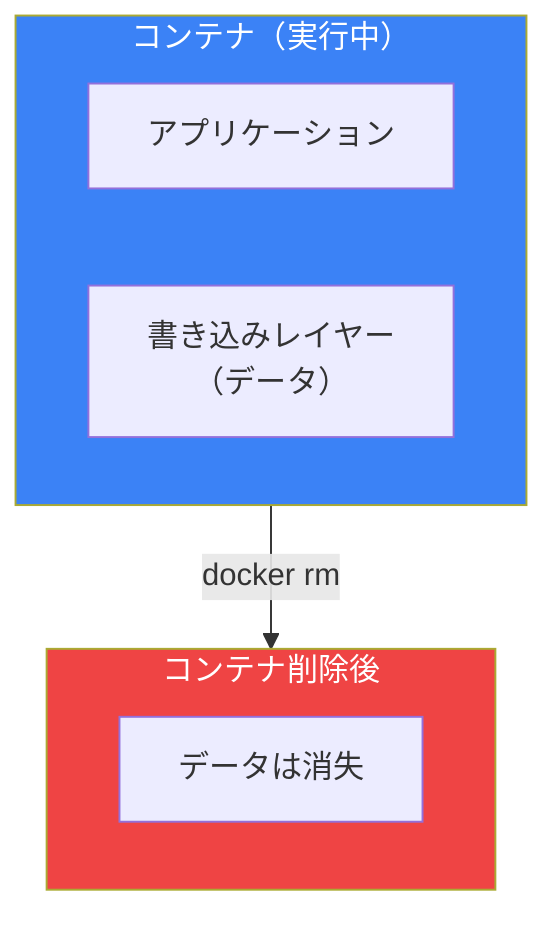
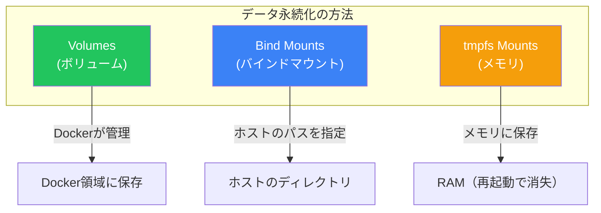
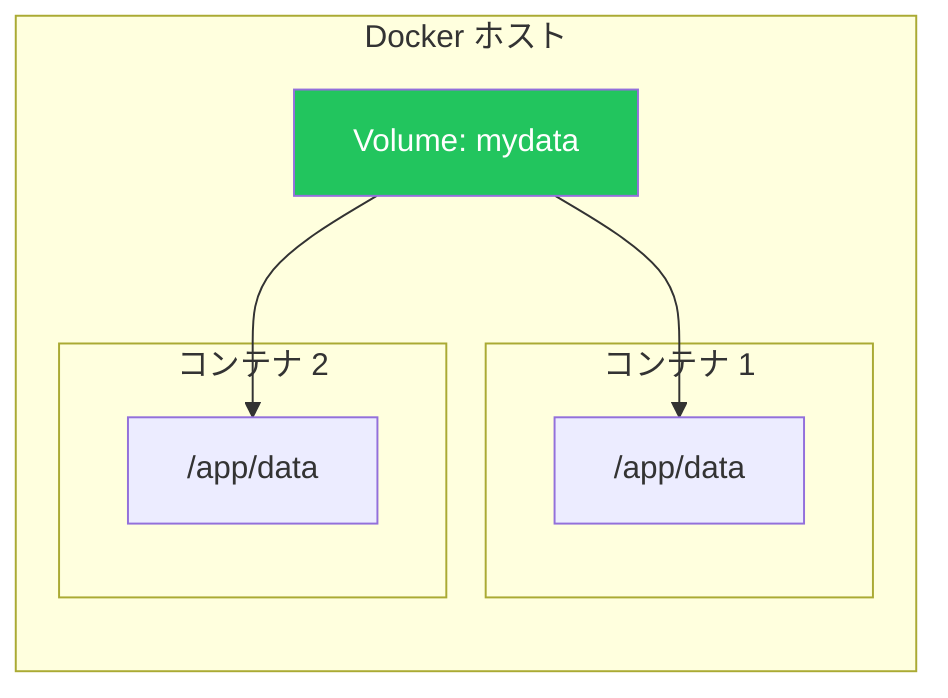
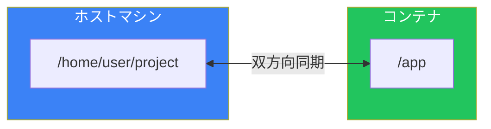
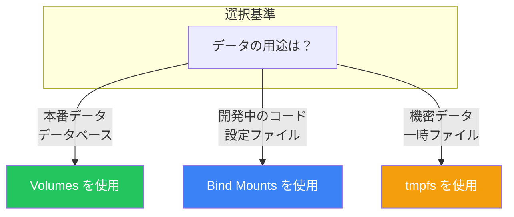

# Day 6: コンテナとデータの永続化

## 今日学ぶこと

- コンテナのデータが消える問題
- Volumes（ボリューム）の使い方
- Bind mounts（バインドマウント）の使い方
- データ管理のベストプラクティス

---

## コンテナのデータはデフォルトで消える

コンテナを削除すると、その中のデータも一緒に消えます。これはコンテナの設計上の特性です。



### 実験：データの消失を確認

```bash
# コンテナでファイルを作成
docker run -it --name test-data ubuntu bash
root@abc123:/# echo "大切なデータ" > /data.txt
root@abc123:/# exit

# コンテナを削除
docker rm test-data

# 同じイメージで新しいコンテナを起動
docker run -it ubuntu bash
root@def456:/# cat /data.txt
cat: /data.txt: No such file or directory
```

データが消えてしまいました。

---

## データの永続化方法

Dockerでデータを永続化する主な方法は3つあります。



| 方法 | 説明 | 用途 |
|------|------|------|
| **Volumes** | Dockerが管理するストレージ | データベース、永続データ |
| **Bind Mounts** | ホストのディレクトリをマウント | 開発時のコード共有 |
| **tmpfs** | メモリ上の一時ストレージ | 機密データの一時保存 |

---

## Volumes（ボリューム）

ボリュームは、Dockerが管理するデータ永続化の推奨方法です。

### ボリュームの特徴

- Dockerが完全に管理
- ホストのファイルシステムから分離
- バックアップや移行が容易
- 複数のコンテナで共有可能

### ボリュームの作成

```bash
# ボリュームを作成
docker volume create mydata

# ボリュームの一覧を表示
docker volume ls
```

出力：
```
DRIVER    VOLUME NAME
local     mydata
```

### ボリュームの詳細を確認

```bash
docker volume inspect mydata
```

出力：
```json
[
    {
        "CreatedAt": "2025-01-21T10:00:00Z",
        "Driver": "local",
        "Labels": {},
        "Mountpoint": "/var/lib/docker/volumes/mydata/_data",
        "Name": "mydata",
        "Options": {},
        "Scope": "local"
    }
]
```

### ボリュームをコンテナにマウント

```bash
# -v オプション（短縮形）
docker run -d -v mydata:/app/data --name app1 nginx

# --mount オプション（詳細形）
docker run -d \
  --mount type=volume,source=mydata,target=/app/data \
  --name app2 nginx
```



### 実践：ボリュームでデータを永続化

```bash
# ボリュームを作成
docker volume create testdata

# コンテナでデータを書き込み
docker run -it -v testdata:/data --name writer ubuntu bash
root@abc123:/# echo "永続化されたデータ" > /data/message.txt
root@abc123:/# exit

# コンテナを削除
docker rm writer

# 新しいコンテナでデータを確認
docker run -it -v testdata:/data --name reader ubuntu bash
root@def456:/# cat /data/message.txt
永続化されたデータ
```

データが残っています。

---

## Bind Mounts（バインドマウント）

ホストマシンのディレクトリをコンテナにマウントします。

### バインドマウントの特徴

- ホストのパスを直接指定
- 開発時のコード共有に最適
- ホストとコンテナで同じファイルを参照
- パフォーマンスが良い（特にLinux）

### バインドマウントの使い方

```bash
# -v オプション（短縮形）
docker run -d -v /path/on/host:/path/in/container nginx

# --mount オプション（詳細形）
docker run -d \
  --mount type=bind,source=/path/on/host,target=/path/in/container \
  nginx
```

### 開発環境での使用例

```bash
# カレントディレクトリをコンテナにマウント
docker run -d \
  -v $(pwd):/app \
  -w /app \
  -p 3000:3000 \
  node:20 npm start
```



### 実践：開発環境をセットアップ

```bash
# プロジェクトディレクトリを作成
mkdir myproject && cd myproject

# index.html を作成
echo '<h1>Hello from Bind Mount!</h1>' > index.html

# Nginx コンテナでマウント
docker run -d \
  -v $(pwd):/usr/share/nginx/html:ro \
  -p 8080:80 \
  --name web nginx

# ブラウザで確認
curl http://localhost:8080
```

ファイルを編集すると、即座にコンテナに反映されます：

```bash
# ファイルを更新
echo '<h1>Updated Content!</h1>' > index.html

# 変更が反映される
curl http://localhost:8080
```

### 読み取り専用マウント

```bash
# :ro を追加すると読み取り専用になる
docker run -d -v $(pwd):/app:ro nginx
```

---

## ボリューム vs バインドマウント

| 特性 | ボリューム | バインドマウント |
|------|-----------|-----------------|
| 管理者 | Docker | ユーザー |
| 場所 | Docker領域 | 任意のホストパス |
| バックアップ | Dockerコマンドで可能 | 手動 |
| 複数コンテナ共有 | 簡単 | 可能 |
| 本番環境 | 推奨 | 非推奨 |
| 開発環境 | 使用可能 | 推奨 |



---

## ボリュームの管理コマンド

### ボリュームの一覧

```bash
docker volume ls
```

### ボリュームの詳細

```bash
docker volume inspect ボリューム名
```

### ボリュームの削除

```bash
# 単一のボリュームを削除
docker volume rm mydata

# 未使用のボリュームを一括削除
docker volume prune
```

### ボリュームのバックアップ

```bash
# ボリュームの内容をtarファイルにバックアップ
docker run --rm \
  -v mydata:/data \
  -v $(pwd):/backup \
  ubuntu tar cvf /backup/mydata-backup.tar /data
```

### ボリュームのリストア

```bash
# tarファイルからボリュームにリストア
docker run --rm \
  -v mydata:/data \
  -v $(pwd):/backup \
  ubuntu bash -c "cd / && tar xvf /backup/mydata-backup.tar"
```

---

## 実践：MySQLのデータを永続化

### Step 1: ボリュームを作成

```bash
docker volume create mysql-data
```

### Step 2: MySQLコンテナを起動

```bash
docker run -d \
  --name mysql \
  -e MYSQL_ROOT_PASSWORD=mypassword \
  -e MYSQL_DATABASE=mydb \
  -v mysql-data:/var/lib/mysql \
  -p 3306:3306 \
  mysql:8
```

### Step 3: データを作成

```bash
# MySQLに接続
docker exec -it mysql mysql -uroot -pmypassword mydb

# テーブルとデータを作成
mysql> CREATE TABLE users (id INT PRIMARY KEY, name VARCHAR(100));
mysql> INSERT INTO users VALUES (1, 'Alice'), (2, 'Bob');
mysql> SELECT * FROM users;
mysql> exit
```

### Step 4: コンテナを削除して再作成

```bash
# コンテナを停止・削除
docker stop mysql
docker rm mysql

# 同じボリュームで新しいコンテナを起動
docker run -d \
  --name mysql-new \
  -e MYSQL_ROOT_PASSWORD=mypassword \
  -v mysql-data:/var/lib/mysql \
  mysql:8

# データが残っているか確認
docker exec -it mysql-new mysql -uroot -pmypassword mydb -e "SELECT * FROM users"
```

データが永続化されています。

---

## 匿名ボリューム

名前を指定しないボリュームも作成できます。

```bash
# 匿名ボリュームが自動作成される
docker run -d -v /data nginx
```

Dockerfileの `VOLUME` 命令でも匿名ボリュームが作成されます：

```dockerfile
VOLUME /var/lib/mysql
```

**注意**: 匿名ボリュームは管理が困難なため、本番環境では名前付きボリュームを推奨します。

---

## まとめ

| コマンド | 説明 |
|---------|------|
| `docker volume create` | ボリュームを作成 |
| `docker volume ls` | ボリュームの一覧 |
| `docker volume inspect` | ボリュームの詳細 |
| `docker volume rm` | ボリュームを削除 |
| `docker volume prune` | 未使用ボリュームを削除 |
| `-v name:/path` | ボリュームをマウント |
| `-v /host:/container` | バインドマウント |

### 重要ポイント

1. コンテナのデータはデフォルトで揮発性
2. ボリュームはDockerが管理する推奨の永続化方法
3. バインドマウントは開発時のコード共有に最適
4. 本番環境では名前付きボリュームを使用
5. ボリュームは複数コンテナで共有可能

---

## 練習問題

### 問題1: ボリュームの基本
以下の操作を実行してください：
1. `practice-vol` という名前のボリュームを作成
2. そのボリュームを `/data` にマウントしてUbuntuコンテナを起動
3. `/data/test.txt` にテキストを書き込み
4. コンテナを削除
5. 新しいコンテナで同じボリュームをマウントし、データが残っているか確認

### 問題2: バインドマウントの活用
HTMLファイルを作成し、Nginxコンテナにバインドマウントしてください。ファイルを編集して、変更がすぐに反映されることを確認してください。

### チャレンジ問題
PostgreSQLコンテナのデータを永続化する構成を作成してください：
- データ用のボリューム
- 初期化スクリプト用のバインドマウント（`/docker-entrypoint-initdb.d/`）
- 環境変数でユーザー名とパスワードを設定

---

## 参考リンク

- [Docker ボリュームの概要](https://docs.docker.com/engine/storage/volumes/)
- [バインドマウント](https://docs.docker.com/engine/storage/bind-mounts/)
- [データ管理のベストプラクティス](https://docs.docker.com/develop/develop-images/dockerfile_best-practices/#volume)

---

**次回予告**: Day 7では「Dockerネットワーキング」について学びます。コンテナ間の通信やポートマッピングの仕組みを理解しましょう。
