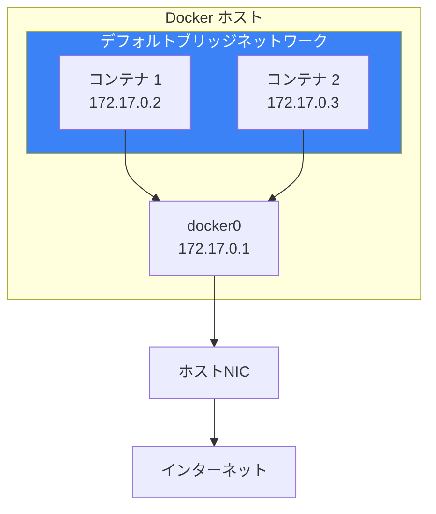
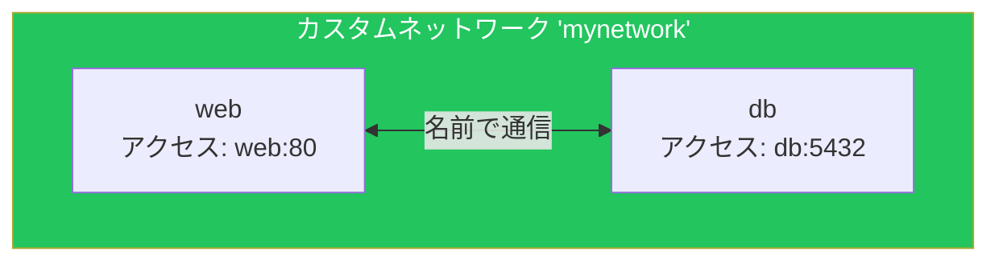
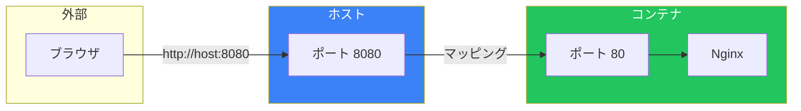
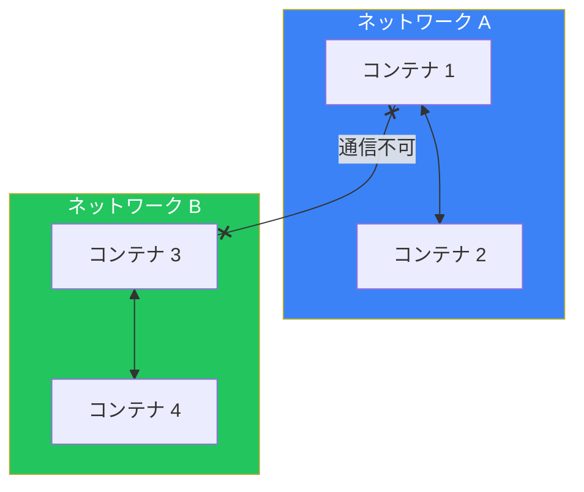
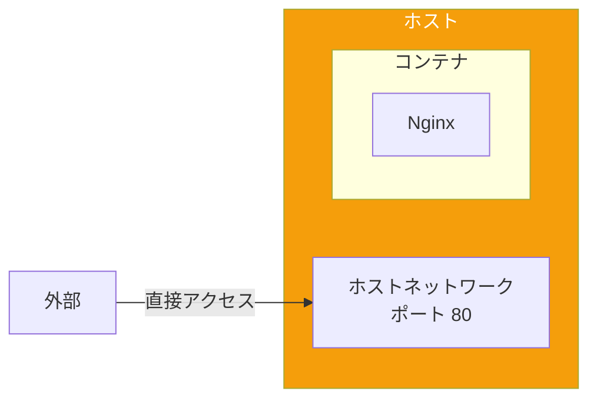
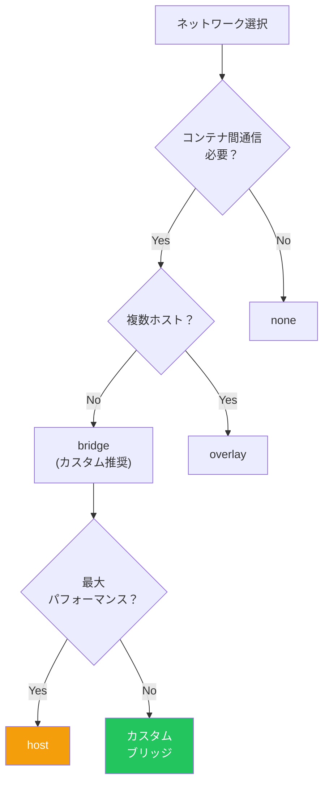

# Day 7: Dockerネットワーキング

## 今日学ぶこと

- Dockerネットワークの基本概念
- ブリッジネットワーク
- ポートマッピング
- コンテナ間通信
- カスタムネットワークの作成

---

## Dockerネットワークの概要

Dockerは独自のネットワーク機能を持っています。コンテナは仮想ネットワークに接続され、他のコンテナやホスト、外部と通信できます。



### ネットワークドライバー

Dockerには複数のネットワークドライバーがあります。

| ドライバー | 説明 | 用途 |
|-----------|------|------|
| **bridge** | デフォルト。仮想ブリッジで接続 | 単一ホストでのコンテナ通信 |
| **host** | ホストのネットワークを直接使用 | 最大パフォーマンスが必要な場合 |
| **none** | ネットワークなし | 完全に分離したいコンテナ |
| **overlay** | 複数ホスト間のネットワーク | Swarmモード |

---

## ネットワークの確認

### 既存のネットワーク一覧

```bash
docker network ls
```

出力：
```
NETWORK ID     NAME      DRIVER    SCOPE
abc123def456   bridge    bridge    local
def456ghi789   host      host      local
ghi789jkl012   none      null      local
```

### ネットワークの詳細

```bash
docker network inspect bridge
```

コンテナのIPアドレスや設定を確認できます。

---

## ブリッジネットワーク

### デフォルトブリッジネットワーク

すべてのコンテナはデフォルトで `bridge` ネットワークに接続されます。

```bash
# コンテナを起動
docker run -d --name web nginx

# IPアドレスを確認
docker inspect web | grep IPAddress
```

### デフォルトブリッジの制限

| 制限 | 説明 |
|------|------|
| 名前解決なし | コンテナ名でアクセスできない |
| 全コンテナが同一ネットワーク | 分離ができない |
| レガシー機能 | 新機能が追加されない |

---

## カスタムブリッジネットワーク

本番環境では、カスタムブリッジネットワークを推奨します。

### カスタムネットワークの作成

```bash
docker network create mynetwork
```

### カスタムネットワークの利点



| 利点 | 説明 |
|------|------|
| **DNS名前解決** | コンテナ名で通信可能 |
| **分離** | 異なるネットワークは相互に通信できない |
| **接続/切断が動的** | 再起動なしでネットワーク変更可能 |
| **環境変数共有** | `--link` なしで通信可能 |

### カスタムネットワークでコンテナを起動

```bash
# ネットワークを作成
docker network create app-network

# ネットワークに接続してコンテナを起動
docker run -d --name web --network app-network nginx
docker run -d --name db --network app-network postgres:16

# webコンテナからdbにアクセス
docker exec web ping db
```

---

## ポートマッピング（ポート公開）

コンテナのポートをホストに公開して、外部からアクセス可能にします。

### 基本構文

```bash
# ホストポート:コンテナポート
docker run -d -p 8080:80 nginx

# ホストのランダムポートを使用
docker run -d -p 80 nginx

# 特定のインターフェースにバインド
docker run -d -p 127.0.0.1:8080:80 nginx
```



### 公開ポートの確認

```bash
# 実行中のコンテナのポートを確認
docker ps

# 特定のコンテナのポートマッピング
docker port コンテナ名
```

### 複数ポートの公開

```bash
docker run -d \
  -p 80:80 \
  -p 443:443 \
  nginx
```

---

## コンテナ間通信

### 同一ネットワーク内

同じカスタムネットワーク内のコンテナは、コンテナ名で通信できます。

```bash
# ネットワーク作成
docker network create backend

# Redisコンテナを起動
docker run -d --name redis --network backend redis:7

# アプリコンテナを起動
docker run -d --name app --network backend python:3.11 sleep infinity

# appからredisに接続
docker exec app ping redis
```

### 異なるネットワーク間

異なるネットワークのコンテナは直接通信できません。



### コンテナを複数ネットワークに接続

```bash
# 既存のコンテナを追加のネットワークに接続
docker network connect another-network container-name

# ネットワークから切断
docker network disconnect another-network container-name
```

---

## host ネットワーク

コンテナがホストのネットワークを直接使用します。

```bash
docker run -d --network host nginx
```



| 特徴 | 説明 |
|------|------|
| パフォーマンス | ネットワーク変換がなく高速 |
| ポートマッピング不要 | ホストのポートを直接使用 |
| 分離なし | ホストのネットワーク設定に依存 |
| Linux限定 | macOS/Windowsでは制限あり |

---

## none ネットワーク

ネットワークを完全に無効化します。

```bash
docker run -d --network none nginx
```

完全に分離されたコンテナを作成する場合に使用します。

---

## 実践：Webアプリとデータベース

典型的なWebアプリケーション構成を構築します。

### Step 1: 専用ネットワークを作成

```bash
docker network create webapp-network
```

### Step 2: データベースコンテナを起動

```bash
docker run -d \
  --name db \
  --network webapp-network \
  -e POSTGRES_USER=app \
  -e POSTGRES_PASSWORD=secret \
  -e POSTGRES_DB=myapp \
  postgres:16
```

### Step 3: Webアプリコンテナを起動

```bash
# 簡易的にPythonでテスト
docker run -d \
  --name web \
  --network webapp-network \
  -p 8080:80 \
  -e DATABASE_HOST=db \
  -e DATABASE_PORT=5432 \
  nginx
```

### Step 4: 接続確認

```bash
# webからdbに接続できるか確認
docker exec web apt-get update && docker exec web apt-get install -y postgresql-client
docker exec web pg_isready -h db -U app
```

### Step 5: クリーンアップ

```bash
docker stop web db
docker rm web db
docker network rm webapp-network
```

---

## ネットワーク管理コマンド

### 一覧表示

```bash
docker network ls
```

### 作成

```bash
# 基本的な作成
docker network create mynet

# サブネットを指定
docker network create --subnet=172.20.0.0/16 mynet

# IPレンジを指定
docker network create \
  --subnet=172.20.0.0/16 \
  --ip-range=172.20.240.0/20 \
  mynet
```

### 詳細表示

```bash
docker network inspect mynet
```

### 削除

```bash
# 単一のネットワークを削除
docker network rm mynet

# 未使用のネットワークを一括削除
docker network prune
```

### コンテナの接続/切断

```bash
# 接続
docker network connect mynet container-name

# 切断
docker network disconnect mynet container-name
```

---

## ネットワークの選択ガイド



---

## まとめ

| コマンド | 説明 |
|---------|------|
| `docker network ls` | ネットワーク一覧 |
| `docker network create` | ネットワーク作成 |
| `docker network inspect` | ネットワーク詳細 |
| `docker network rm` | ネットワーク削除 |
| `docker network connect` | コンテナをネットワークに接続 |
| `docker network disconnect` | コンテナをネットワークから切断 |
| `-p host:container` | ポートマッピング |
| `--network name` | ネットワークを指定 |

### 重要ポイント

1. カスタムブリッジネットワークで名前解決が可能
2. デフォルトブリッジより、カスタムネットワークを推奨
3. `-p` でホストポートにマッピングして外部公開
4. 同一ネットワーク内はコンテナ名で通信
5. 異なるネットワークは分離される

---

## 練習問題

### 問題1: ネットワークの作成と接続
以下の操作を実行してください：
1. `myapp-net` という名前のネットワークを作成
2. `redis` コンテナをそのネットワークで起動
3. `app` コンテナを同じネットワークで起動
4. `app` から `redis` に ping を実行して通信を確認

### 問題2: ポートマッピング
以下の要件でNginxコンテナを起動してください：
- ホストのポート3000をコンテナのポート80にマッピング
- localhost からのみアクセス可能に設定

### チャレンジ問題
以下の構成を構築してください：
- `frontend-net` と `backend-net` の2つのネットワーク
- `web` コンテナは両方のネットワークに接続
- `api` コンテナは `backend-net` のみ
- `db` コンテナは `backend-net` のみ
- 外部からは `web` の80番ポートのみアクセス可能

---

## 参考リンク

- [Docker ネットワークの概要](https://docs.docker.com/engine/network/)
- [ブリッジネットワーク](https://docs.docker.com/engine/network/drivers/bridge/)
- [コンテナ間通信](https://docs.docker.com/engine/network/tutorials/standalone/)

---

**次回予告**: Day 8では「Docker Composeで複数コンテナを管理」について学びます。複数のコンテナを定義ファイルで一元管理する方法をマスターしましょう。
