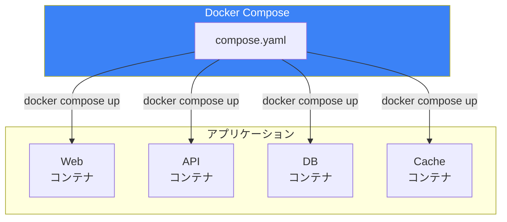
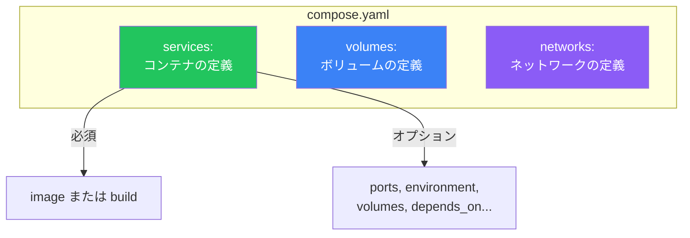
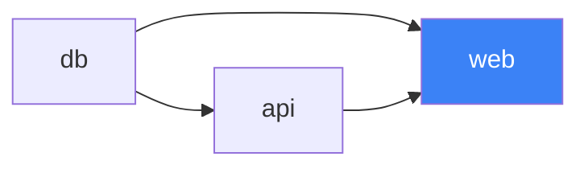

# Day 8: Docker Composeで複数コンテナを管理

## 今日学ぶこと

- Docker Composeとは何か
- compose.yaml の書き方
- docker compose コマンド
- マルチコンテナアプリケーションの構築

---

## Docker Composeとは

Docker Composeは、**複数のコンテナを定義・管理するためのツール**です。YAMLファイルで構成を記述し、1つのコマンドですべてのコンテナを起動・停止できます。



### なぜDocker Composeを使うのか

| 課題 | Docker Compose による解決 |
|------|--------------------------|
| 複数の `docker run` コマンド | 1つのYAMLファイルで定義 |
| コンテナ間の依存関係 | `depends_on` で明示 |
| ネットワークの手動作成 | 自動でネットワーク作成 |
| 環境変数の管理 | ファイルで一元管理 |
| 再現性の確保 | 設定をバージョン管理 |

---

## compose.yaml の基本構造

```yaml
# サービス（コンテナ）の定義
services:
  web:
    image: nginx:latest
    ports:
      - "8080:80"

  db:
    image: postgres:16
    environment:
      POSTGRES_PASSWORD: secret

# ボリュームの定義（オプション）
volumes:
  db-data:

# ネットワークの定義（オプション）
networks:
  backend:
```

### 主要な要素



---

## サービスの定義

### image - 使用するイメージ

```yaml
services:
  web:
    image: nginx:1.25
```

### build - Dockerfileからビルド

```yaml
services:
  app:
    build: .
    # または詳細に指定
    build:
      context: ./app
      dockerfile: Dockerfile.prod
```

### ports - ポートマッピング

```yaml
services:
  web:
    image: nginx
    ports:
      - "8080:80"      # ホスト:コンテナ
      - "443:443"
```

### environment - 環境変数

```yaml
services:
  db:
    image: postgres:16
    environment:
      POSTGRES_USER: myuser
      POSTGRES_PASSWORD: secret
      POSTGRES_DB: mydb
    # または配列形式
    environment:
      - POSTGRES_USER=myuser
      - POSTGRES_PASSWORD=secret
```

### env_file - 環境変数ファイル

```yaml
services:
  app:
    image: myapp
    env_file:
      - .env
      - .env.local
```

### volumes - ボリュームのマウント

```yaml
services:
  db:
    image: postgres:16
    volumes:
      - db-data:/var/lib/postgresql/data  # 名前付きボリューム
      - ./init:/docker-entrypoint-initdb.d # バインドマウント

volumes:
  db-data:
```

### depends_on - 依存関係

```yaml
services:
  web:
    image: nginx
    depends_on:
      - api
      - db

  api:
    image: myapi
    depends_on:
      - db

  db:
    image: postgres:16
```



### networks - ネットワーク接続

```yaml
services:
  web:
    image: nginx
    networks:
      - frontend
      - backend

  db:
    image: postgres:16
    networks:
      - backend

networks:
  frontend:
  backend:
```

### restart - 再起動ポリシー

```yaml
services:
  web:
    image: nginx
    restart: always  # no, always, on-failure, unless-stopped
```

---

## docker compose コマンド

### アプリケーションの起動

```bash
# フォアグラウンドで起動
docker compose up

# バックグラウンドで起動
docker compose up -d

# ビルドしてから起動
docker compose up --build
```

### アプリケーションの停止

```bash
# 停止（コンテナは残る）
docker compose stop

# 停止してコンテナを削除
docker compose down

# ボリュームも削除
docker compose down -v
```

### 状態の確認

```bash
# サービスの状態
docker compose ps

# ログを表示
docker compose logs

# 特定のサービスのログ
docker compose logs web

# リアルタイムでログを追跡
docker compose logs -f
```

### その他の操作

```bash
# サービスの再起動
docker compose restart

# サービス内でコマンド実行
docker compose exec web bash

# 一度きりのコマンド実行
docker compose run --rm web npm test
```

---

## 実践：Webアプリケーションの構築

Node.js + PostgreSQL の構成を構築します。

### プロジェクト構成

```
myapp/
├── compose.yaml
├── app/
│   ├── Dockerfile
│   ├── package.json
│   └── index.js
└── .env
```

### Step 1: アプリケーションコード

**app/package.json**
```json
{
  "name": "docker-compose-demo",
  "version": "1.0.0",
  "main": "index.js",
  "dependencies": {
    "express": "^4.18.2",
    "pg": "^8.11.3"
  }
}
```

**app/index.js**
```javascript
const express = require('express');
const { Pool } = require('pg');

const app = express();
const port = 3000;

const pool = new Pool({
  host: process.env.DB_HOST || 'db',
  port: process.env.DB_PORT || 5432,
  user: process.env.DB_USER || 'app',
  password: process.env.DB_PASSWORD || 'secret',
  database: process.env.DB_NAME || 'myapp',
});

app.get('/', async (req, res) => {
  try {
    const result = await pool.query('SELECT NOW()');
    res.json({
      message: 'Hello from Docker Compose!',
      dbTime: result.rows[0].now,
    });
  } catch (err) {
    res.status(500).json({ error: err.message });
  }
});

app.get('/health', (req, res) => {
  res.json({ status: 'healthy' });
});

app.listen(port, '0.0.0.0', () => {
  console.log(`App listening on port ${port}`);
});
```

### Step 2: Dockerfile

**app/Dockerfile**
```dockerfile
FROM node:20-slim

WORKDIR /app

COPY package*.json ./
RUN npm install

COPY . .

EXPOSE 3000

CMD ["node", "index.js"]
```

### Step 3: compose.yaml

```yaml
services:
  app:
    build: ./app
    ports:
      - "3000:3000"
    environment:
      DB_HOST: db
      DB_USER: app
      DB_PASSWORD: secret
      DB_NAME: myapp
    depends_on:
      db:
        condition: service_healthy
    restart: unless-stopped

  db:
    image: postgres:16
    environment:
      POSTGRES_USER: app
      POSTGRES_PASSWORD: secret
      POSTGRES_DB: myapp
    volumes:
      - db-data:/var/lib/postgresql/data
    healthcheck:
      test: ["CMD-SHELL", "pg_isready -U app -d myapp"]
      interval: 5s
      timeout: 5s
      retries: 5
    restart: unless-stopped

volumes:
  db-data:
```

### Step 4: 起動と確認

```bash
# 起動
docker compose up -d

# 状態確認
docker compose ps

# ログ確認
docker compose logs -f app

# 動作確認
curl http://localhost:3000
```

### Step 5: クリーンアップ

```bash
docker compose down -v
```

---

## 高度な設定

### ヘルスチェック

```yaml
services:
  web:
    image: nginx
    healthcheck:
      test: ["CMD", "curl", "-f", "http://localhost"]
      interval: 30s
      timeout: 10s
      retries: 3
      start_period: 40s
```

### depends_on の condition

```yaml
services:
  app:
    depends_on:
      db:
        condition: service_healthy  # ヘルスチェックが成功するまで待機
```

### プロファイル

開発用と本番用で異なるサービスを定義できます。

```yaml
services:
  app:
    image: myapp

  debug:
    image: debug-tools
    profiles:
      - debug
```

```bash
# debugプロファイルも起動
docker compose --profile debug up
```

### 複数のComposeファイル

```bash
# 複数ファイルをマージ
docker compose -f compose.yaml -f compose.prod.yaml up
```

---

## 環境変数の管理

### .env ファイル

**`.env`**
```bash
POSTGRES_USER=app
POSTGRES_PASSWORD=secret
POSTGRES_DB=myapp
APP_PORT=3000
```

**compose.yaml**
```yaml
services:
  db:
    image: postgres:16
    environment:
      POSTGRES_USER: ${POSTGRES_USER}
      POSTGRES_PASSWORD: ${POSTGRES_PASSWORD}
      POSTGRES_DB: ${POSTGRES_DB}

  app:
    build: ./app
    ports:
      - "${APP_PORT}:3000"
```

### 変数の優先順位

1. シェルの環境変数
2. `.env` ファイル
3. compose.yaml のデフォルト値

---

## よく使うパターン

### 開発環境でのホットリロード

```yaml
services:
  app:
    build: ./app
    volumes:
      - ./app:/app        # ソースコードをマウント
      - /app/node_modules # node_modulesは除外
    command: npm run dev
```

### データベース + 管理ツール

```yaml
services:
  db:
    image: postgres:16
    environment:
      POSTGRES_PASSWORD: secret

  adminer:
    image: adminer
    ports:
      - "8080:8080"
```

### Redis キャッシュの追加

```yaml
services:
  app:
    build: ./app
    depends_on:
      - db
      - redis

  db:
    image: postgres:16

  redis:
    image: redis:7-alpine
```

---

## まとめ

| コマンド | 説明 |
|---------|------|
| `docker compose up` | サービスを起動 |
| `docker compose up -d` | バックグラウンドで起動 |
| `docker compose down` | サービスを停止・削除 |
| `docker compose ps` | サービスの状態表示 |
| `docker compose logs` | ログを表示 |
| `docker compose exec` | コンテナでコマンド実行 |
| `docker compose build` | イメージをビルド |
| `docker compose restart` | サービスを再起動 |

### 重要ポイント

1. compose.yaml で複数コンテナを宣言的に定義
2. `depends_on` で起動順序を制御
3. 名前付きボリュームでデータを永続化
4. `.env` ファイルで環境変数を管理
5. ヘルスチェックで依存関係をより確実に

---

## 練習問題

### 問題1: 基本構成
以下の構成のcompose.yamlを作成してください：
- Nginx（ポート8080で公開）
- Redis（内部通信のみ）
- 両方が同じネットワークに接続

### 問題2: ボリュームの追加
問題1の構成に以下を追加してください：
- Redisのデータを永続化するボリューム
- Nginxの設定ファイルをバインドマウント

### チャレンジ問題
WordPressとMySQLの構成を作成してください：
- WordPress: ポート80で公開
- MySQL: データを永続化
- 環境変数は `.env` ファイルで管理
- ヘルスチェックでMySQLが起動してからWordPressを起動

---

## 参考リンク

- [Docker Compose 概要](https://docs.docker.com/compose/)
- [Compose ファイルリファレンス](https://docs.docker.com/reference/compose-file/)
- [docker compose CLI リファレンス](https://docs.docker.com/reference/cli/docker/compose/)

---

**次回予告**: Day 9では「実践的なDockerfile」について学びます。マルチステージビルドやイメージの最適化テクニックをマスターしましょう。
