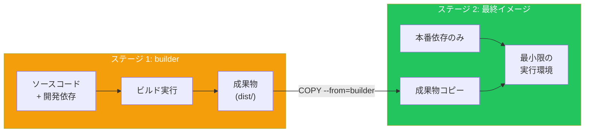
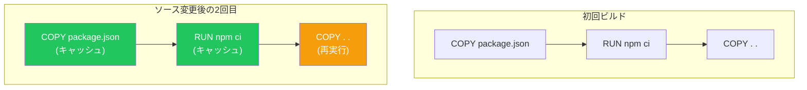

# Day 9: 実践的なDockerfile

## 今日学ぶこと

- マルチステージビルド
- イメージサイズの最適化
- セキュリティのベストプラクティス
- キャッシュの効率的な活用

---

## マルチステージビルド

マルチステージビルドは、ビルド環境と実行環境を分離する技術です。これにより、最終イメージのサイズを大幅に削減できます。

### 問題：ビルドツールが残る

通常のDockerfileでは、ビルドに必要なツールがイメージに残ってしまいます。

```dockerfile
# 従来の方法（問題あり）
FROM node:20

WORKDIR /app
COPY package*.json ./
RUN npm install
COPY . .
RUN npm run build  # TypeScriptをコンパイル

CMD ["node", "dist/index.js"]

# 問題: node_modules（開発用含む）、TypeScriptコンパイラなどが残る
# イメージサイズ: 約1GB以上
```

### 解決：マルチステージビルド

```dockerfile
# ステージ1: ビルド環境
FROM node:20 AS builder

WORKDIR /app
COPY package*.json ./
RUN npm install
COPY . .
RUN npm run build

# ステージ2: 実行環境
FROM node:20-slim

WORKDIR /app
COPY package*.json ./
RUN npm install --only=production
COPY --from=builder /app/dist ./dist

CMD ["node", "dist/index.js"]

# 結果: ビルドツール不要、本番依存のみ
# イメージサイズ: 約200MB
```



### Goアプリケーションの例

Goは特にマルチステージビルドの効果が大きいです。

```dockerfile
# ステージ1: ビルド
FROM golang:1.22 AS builder

WORKDIR /app
COPY go.mod go.sum ./
RUN go mod download
COPY . .
RUN CGO_ENABLED=0 GOOS=linux go build -o main .

# ステージ2: 実行（scratch = 空のイメージ）
FROM scratch

COPY --from=builder /app/main /main

ENTRYPOINT ["/main"]

# イメージサイズ: 約10MB（Goランタイム不要）
```

| ステージ | サイズ |
|---------|--------|
| golang:1.22 | 約800MB |
| 最終イメージ（scratch） | 約10MB |

---

## イメージサイズの最適化

### 1. 軽量ベースイメージを選ぶ

```dockerfile
# ❌ フルイメージ（約1GB）
FROM python:3.11

# ✅ slimイメージ（約150MB）
FROM python:3.11-slim

# ✅ Alpineイメージ（約50MB）
FROM python:3.11-alpine
```

### 2. レイヤーを最小限に

各 `RUN` 命令はレイヤーを作成します。可能な限りまとめましょう。

```dockerfile
# ❌ 悪い例：レイヤーが多い
RUN apt-get update
RUN apt-get install -y curl
RUN apt-get install -y git
RUN rm -rf /var/lib/apt/lists/*

# ✅ 良い例：1つのRUNにまとめる
RUN apt-get update && \
    apt-get install -y --no-install-recommends \
        curl \
        git && \
    rm -rf /var/lib/apt/lists/*
```

### 3. 不要なファイルを含めない

**.dockerignore**
```
.git
node_modules
*.log
.env
.DS_Store
__pycache__
*.pyc
.pytest_cache
coverage/
dist/
build/
```

### 4. キャッシュを削除

```dockerfile
# Python
RUN pip install --no-cache-dir -r requirements.txt

# Node.js
RUN npm ci --only=production && npm cache clean --force

# apt
RUN apt-get update && \
    apt-get install -y package && \
    rm -rf /var/lib/apt/lists/*

# apk (Alpine)
RUN apk add --no-cache package
```

---

## キャッシュの効率的な活用

### 依存ファイルを先にコピー

変更頻度の低いファイルを先にコピーすることで、キャッシュを最大限活用できます。

```dockerfile
# ✅ 良い例
WORKDIR /app

# 1. 依存定義ファイルをコピー（変更頻度：低）
COPY package.json package-lock.json ./

# 2. 依存をインストール（キャッシュされる）
RUN npm ci

# 3. ソースコードをコピー（変更頻度：高）
COPY . .

# ソースコードだけ変更した場合、ステップ1-2はキャッシュが使われる
```



### BuildKitのキャッシュマウント

```dockerfile
# BuildKitの機能を使ったキャッシュ
RUN --mount=type=cache,target=/root/.cache/pip \
    pip install -r requirements.txt

RUN --mount=type=cache,target=/root/.npm \
    npm ci
```

---

## セキュリティのベストプラクティス

### 1. 非rootユーザーで実行

```dockerfile
FROM node:20-slim

# ユーザーを作成
RUN useradd --create-home --shell /bin/bash appuser

WORKDIR /app

COPY --chown=appuser:appuser . .

# ユーザーを切り替え
USER appuser

CMD ["node", "index.js"]
```

### 2. 最小限の権限

```dockerfile
# ファイルの権限を制限
COPY --chmod=555 script.sh /app/
```

### 3. シークレットを含めない

```dockerfile
# ❌ 絶対にやってはいけない
COPY .env /app/
ENV API_KEY=secret123

# ✅ 実行時に環境変数として渡す
# docker run -e API_KEY=xxx myimage
```

### 4. 特定バージョンを固定

```dockerfile
# ❌ 悪い例
FROM python:latest
RUN pip install flask

# ✅ 良い例
FROM python:3.11.7-slim-bookworm
RUN pip install flask==3.0.0
```

### 5. 脆弱性スキャン

```bash
# Docker Scoutで脆弱性スキャン
docker scout cves myimage:latest

# Trivyを使用
docker run --rm -v /var/run/docker.sock:/var/run/docker.sock \
  aquasec/trivy image myimage:latest
```

---

## 実践的なDockerfileパターン

### Pythonアプリケーション

```dockerfile
# マルチステージビルド
FROM python:3.11-slim AS builder

WORKDIR /app

# 仮想環境を作成
RUN python -m venv /opt/venv
ENV PATH="/opt/venv/bin:$PATH"

COPY requirements.txt .
RUN pip install --no-cache-dir -r requirements.txt

# 最終イメージ
FROM python:3.11-slim

# 非rootユーザー
RUN useradd --create-home appuser
USER appuser

WORKDIR /app

# 仮想環境をコピー
COPY --from=builder /opt/venv /opt/venv
ENV PATH="/opt/venv/bin:$PATH"

COPY --chown=appuser:appuser . .

EXPOSE 8000

CMD ["gunicorn", "--bind", "0.0.0.0:8000", "app:app"]
```

### Node.jsアプリケーション

```dockerfile
FROM node:20-slim AS builder

WORKDIR /app

COPY package*.json ./
RUN npm ci

COPY . .
RUN npm run build && npm prune --production

# 最終イメージ
FROM node:20-slim

RUN useradd --create-home appuser
USER appuser

WORKDIR /app

COPY --from=builder --chown=appuser:appuser /app/dist ./dist
COPY --from=builder --chown=appuser:appuser /app/node_modules ./node_modules
COPY --from=builder --chown=appuser:appuser /app/package.json ./

EXPOSE 3000

CMD ["node", "dist/index.js"]
```

### Reactフロントエンド + Nginx

```dockerfile
# ビルドステージ
FROM node:20 AS builder

WORKDIR /app
COPY package*.json ./
RUN npm ci
COPY . .
RUN npm run build

# Nginxで配信
FROM nginx:alpine

COPY --from=builder /app/build /usr/share/nginx/html
COPY nginx.conf /etc/nginx/conf.d/default.conf

EXPOSE 80

CMD ["nginx", "-g", "daemon off;"]
```

---

## HEALTHCHECK命令

コンテナの健全性を監視します。

```dockerfile
FROM nginx:alpine

HEALTHCHECK --interval=30s --timeout=3s --start-period=5s --retries=3 \
  CMD curl -f http://localhost/ || exit 1
```

| オプション | 説明 |
|-----------|------|
| `--interval` | チェック間隔 |
| `--timeout` | タイムアウト時間 |
| `--start-period` | 起動待機時間 |
| `--retries` | 失敗許容回数 |

---

## LABEL命令でメタデータを追加

```dockerfile
FROM python:3.11-slim

LABEL maintainer="your@email.com"
LABEL version="1.0.0"
LABEL description="My awesome app"
LABEL org.opencontainers.image.source="https://github.com/user/repo"
```

---

## イメージサイズの確認

```bash
# イメージサイズを確認
docker images myapp

# 詳細な分析
docker history myapp:latest

# diveツールでレイヤー分析
docker run --rm -it \
  -v /var/run/docker.sock:/var/run/docker.sock \
  wagoodman/dive myapp:latest
```

---

## まとめ

| テクニック | 効果 |
|-----------|------|
| マルチステージビルド | ビルドツールを除外、サイズ削減 |
| 軽量ベースイメージ | 基本サイズを削減 |
| レイヤーの統合 | レイヤー数とサイズを削減 |
| .dockerignore | 不要ファイルを除外 |
| キャッシュ削除 | 一時ファイルを除外 |
| 依存を先にコピー | ビルドキャッシュを活用 |
| 非rootユーザー | セキュリティ向上 |
| バージョン固定 | 再現性とセキュリティ |

### 重要ポイント

1. マルチステージビルドで最終イメージを最小化
2. 変更頻度の低いものを先にコピーしてキャッシュ活用
3. 必ず非rootユーザーで実行
4. シークレットはイメージに含めない
5. 本番環境では具体的なバージョンを固定

---

## 練習問題

### 問題1: マルチステージビルド
TypeScriptのNode.jsアプリ用のマルチステージDockerfileを作成してください：
- ステージ1: ビルド（npm run build）
- ステージ2: 本番依存のみで実行

### 問題2: 最適化
以下のDockerfileの問題点を指摘し、改善してください：

```dockerfile
FROM python:3.11
WORKDIR /app
COPY . .
RUN pip install -r requirements.txt
RUN apt-get update
RUN apt-get install -y curl
CMD ["python", "app.py"]
```

### チャレンジ問題
Goアプリケーション用のマルチステージDockerfileを作成し、最終イメージを10MB以下にしてください。ヒント：`scratch` イメージを使用します。

---

## 参考リンク

- [マルチステージビルド](https://docs.docker.com/build/building/multi-stage/)
- [Dockerfile ベストプラクティス](https://docs.docker.com/develop/develop-images/dockerfile_best-practices/)
- [Docker セキュリティ](https://docs.docker.com/engine/security/)
- [BuildKit](https://docs.docker.com/build/buildkit/)

---

**次回予告**: Day 10では「本番環境への準備とベストプラクティス」について学びます。セキュリティ、ログ、モニタリング、そして次のステップとしてKubernetesへの橋渡しを行います。
