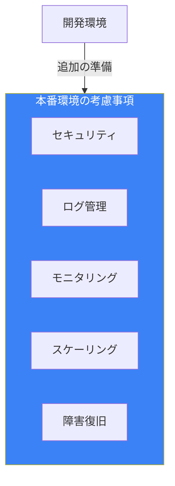
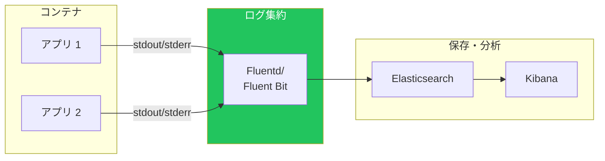
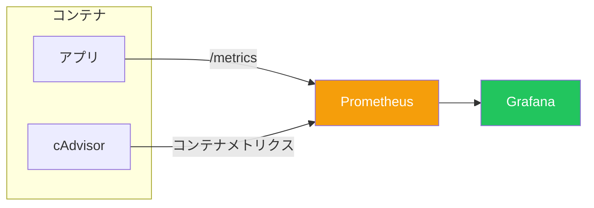
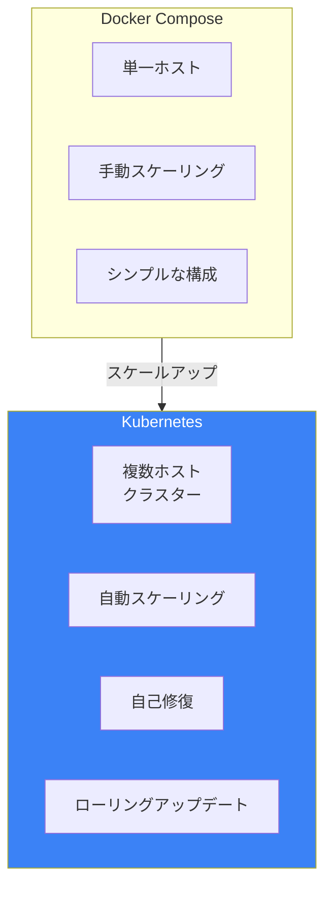

# Day 10: 本番環境への準備とベストプラクティス

## 今日学ぶこと

- コンテナのセキュリティ
- ログとモニタリング
- CI/CDへの統合
- 本番運用のベストプラクティス
- 次のステップ：Kubernetes入門

---

## 本番環境でのDocker

開発環境で動いたコンテナを本番環境で運用するには、追加の考慮事項があります。



---

## セキュリティのベストプラクティス

### 1. イメージの信頼性

```bash
# 公式イメージを使用
docker pull nginx  # Official Image

# イメージの署名を検証
docker trust inspect nginx:latest

# 脆弱性スキャン
docker scout cves nginx:latest
```

### 2. 最小権限の原則

```dockerfile
# 非rootユーザーで実行
FROM node:20-slim

RUN useradd --create-home --shell /bin/bash appuser
USER appuser

WORKDIR /home/appuser/app
COPY --chown=appuser:appuser . .

CMD ["node", "app.js"]
```

### 3. 読み取り専用ファイルシステム

```bash
# ファイルシステムを読み取り専用で起動
docker run --read-only \
  --tmpfs /tmp \
  --tmpfs /var/run \
  nginx
```

### 4. リソース制限

```bash
# CPU とメモリを制限
docker run -d \
  --memory="512m" \
  --cpus="1.0" \
  --pids-limit=100 \
  nginx
```

```yaml
# Docker Compose での設定
services:
  app:
    image: myapp
    deploy:
      resources:
        limits:
          cpus: '1.0'
          memory: 512M
        reservations:
          cpus: '0.5'
          memory: 256M
```

### 5. ネットワークの分離

```yaml
services:
  web:
    networks:
      - frontend

  api:
    networks:
      - frontend
      - backend

  db:
    networks:
      - backend  # webからはアクセス不可

networks:
  frontend:
  backend:
```

### セキュリティチェックリスト

| 項目 | 確認内容 |
|------|---------|
| ベースイメージ | 公式イメージか、定期的に更新されているか |
| ユーザー | 非rootで実行しているか |
| シークレット | イメージに含めていないか |
| 脆弱性 | スキャンを実行したか |
| ネットワーク | 必要最小限のポートのみ公開しているか |
| リソース | 制限を設定しているか |

---

## ログの管理

### Dockerのログドライバー

```bash
# デフォルト（json-file）
docker run -d nginx

# syslog に送信
docker run -d \
  --log-driver=syslog \
  --log-opt syslog-address=tcp://192.168.1.100:514 \
  nginx

# fluentd に送信
docker run -d \
  --log-driver=fluentd \
  --log-opt fluentd-address=localhost:24224 \
  nginx
```

### ログのベストプラクティス



1. **stdoutに出力**: ファイルではなく標準出力に
2. **構造化ログ**: JSON形式で出力
3. **ログ集約**: Fluentd、Logstashなどで収集
4. **ローテーション**: `--log-opt max-size=10m --log-opt max-file=3`

```bash
# ログサイズを制限
docker run -d \
  --log-opt max-size=10m \
  --log-opt max-file=3 \
  nginx
```

---

## モニタリング

### ヘルスチェック

```dockerfile
HEALTHCHECK --interval=30s --timeout=10s --retries=3 \
  CMD curl -f http://localhost/health || exit 1
```

```yaml
# Docker Compose
services:
  app:
    image: myapp
    healthcheck:
      test: ["CMD", "curl", "-f", "http://localhost/health"]
      interval: 30s
      timeout: 10s
      retries: 3
      start_period: 40s
```

### メトリクス収集



### Prometheus + Grafana の設定例

```yaml
services:
  app:
    image: myapp
    ports:
      - "8080:8080"

  prometheus:
    image: prom/prometheus
    ports:
      - "9090:9090"
    volumes:
      - ./prometheus.yml:/etc/prometheus/prometheus.yml

  grafana:
    image: grafana/grafana
    ports:
      - "3000:3000"
    depends_on:
      - prometheus
```

### docker stats コマンド

```bash
# リアルタイムでリソース使用状況を確認
docker stats

# 特定のコンテナのみ
docker stats web api db
```

---

## CI/CDへの統合

### GitHub Actions の例

```yaml
# .github/workflows/docker.yml
name: Docker Build and Push

on:
  push:
    branches: [main]

jobs:
  build:
    runs-on: ubuntu-latest
    steps:
      - uses: actions/checkout@v4

      - name: Set up Docker Buildx
        uses: docker/setup-buildx-action@v3

      - name: Login to Docker Hub
        uses: docker/login-action@v3
        with:
          username: ${{ secrets.DOCKERHUB_USERNAME }}
          password: ${{ secrets.DOCKERHUB_TOKEN }}

      - name: Build and push
        uses: docker/build-push-action@v5
        with:
          context: .
          push: true
          tags: user/app:latest,user/app:${{ github.sha }}
          cache-from: type=gha
          cache-to: type=gha,mode=max
```

### CI/CDパイプラインの流れ


### イメージのタグ戦略

```bash
# セマンティックバージョニング
myapp:1.0.0
myapp:1.0
myapp:1

# Gitコミットハッシュ
myapp:abc123f

# 環境別
myapp:staging
myapp:production

# 日付
myapp:2025-01-21
```

---

## 本番運用のベストプラクティス

### 1. イメージのバージョン固定

```yaml
# ❌ latest は避ける
services:
  web:
    image: nginx:latest

# ✅ 具体的なバージョンを指定
services:
  web:
    image: nginx:1.25.3
```

### 2. 再起動ポリシー

```yaml
services:
  app:
    image: myapp
    restart: unless-stopped
```

| ポリシー | 説明 |
|---------|------|
| `no` | 再起動しない（デフォルト） |
| `always` | 常に再起動 |
| `on-failure` | 異常終了時のみ再起動 |
| `unless-stopped` | 手動停止以外は再起動 |

### 3. グレースフルシャットダウン

```yaml
services:
  app:
    image: myapp
    stop_grace_period: 30s  # 停止までの猶予時間
```

### 4. 環境変数の管理

```yaml
services:
  app:
    image: myapp
    env_file:
      - .env.production
    secrets:
      - db_password

secrets:
  db_password:
    file: ./secrets/db_password.txt
```

### 5. バックアップ戦略

```bash
# ボリュームのバックアップ
docker run --rm \
  -v myapp-data:/data \
  -v $(pwd)/backup:/backup \
  alpine tar czf /backup/data-$(date +%Y%m%d).tar.gz /data
```

---

## トラブルシューティング

### よくある問題と解決方法

| 問題 | 確認コマンド | 解決方法 |
|------|-------------|---------|
| コンテナが起動しない | `docker logs container` | ログでエラーを確認 |
| メモリ不足 | `docker stats` | メモリ制限を増加 |
| ネットワーク接続できない | `docker network inspect` | ネットワーク設定を確認 |
| ディスク容量不足 | `docker system df` | 不要なリソースを削除 |

### デバッグテクニック

```bash
# コンテナ内でシェルを起動
docker exec -it container bash

# 停止したコンテナのログを確認
docker logs container

# イベントを監視
docker events

# リソース使用状況を確認
docker system df -v
```

---

## 次のステップ：Kubernetes

Dockerをマスターしたら、次はKubernetesです。

### なぜKubernetesが必要か



| 機能 | Docker Compose | Kubernetes |
|------|---------------|------------|
| 対象規模 | 小〜中規模 | 中〜大規模 |
| ホスト数 | 単一 | 複数（クラスター） |
| スケーリング | 手動 | 自動 |
| 自己修復 | 限定的 | 自動 |
| 学習コスト | 低 | 高 |

### Kubernetesの基本概念

```yaml
# Kubernetesのマニフェスト例
apiVersion: apps/v1
kind: Deployment
metadata:
  name: myapp
spec:
  replicas: 3
  selector:
    matchLabels:
      app: myapp
  template:
    metadata:
      labels:
        app: myapp
    spec:
      containers:
      - name: myapp
        image: myapp:1.0.0
        ports:
        - containerPort: 8080
```

### 学習リソース

- **Minikube**: ローカルでKubernetesを学習
- **kind**: Docker内でKubernetesを実行
- **Kubernetes公式チュートリアル**: 基礎から学べる

---

## 10日間のまとめ

### 学んだこと

| Day | トピック | 主な内容 |
|-----|---------|---------|
| 1 | Dockerの世界へ | コンテナの概念、VMとの違い |
| 2 | 環境セットアップ | Docker Desktop、Docker Hub |
| 3 | コンテナ操作 | run, stop, rm, logs, exec |
| 4 | イメージ理解 | レイヤー、タグ、レジストリ |
| 5 | Dockerfile | FROM, COPY, RUN, CMD |
| 6 | データ永続化 | Volumes, Bind Mounts |
| 7 | ネットワーク | Bridge, Port Mapping |
| 8 | Docker Compose | 複数コンテナの管理 |
| 9 | 実践Dockerfile | マルチステージ、最適化 |
| 10 | 本番運用 | セキュリティ、ログ、CI/CD |

### 重要なコマンド一覧

```bash
# コンテナ操作
docker run -d -p 8080:80 --name web nginx
docker stop web
docker rm web
docker logs -f web
docker exec -it web bash

# イメージ操作
docker pull nginx:1.25
docker build -t myapp:v1 .
docker push user/myapp:v1
docker images
docker rmi myapp:v1

# ボリューム
docker volume create mydata
docker run -v mydata:/data nginx

# ネットワーク
docker network create mynet
docker run --network mynet nginx

# Docker Compose
docker compose up -d
docker compose down
docker compose logs -f

# 管理
docker system df
docker system prune -a
```

---

## チェックリスト：本番環境への準備

- [ ] イメージは公式または信頼できるソースから
- [ ] 特定のバージョンタグを使用（latestは避ける）
- [ ] 非rootユーザーで実行
- [ ] リソース制限を設定
- [ ] ヘルスチェックを実装
- [ ] ログは標準出力に
- [ ] シークレットはイメージに含めない
- [ ] 脆弱性スキャンを実行
- [ ] バックアップ戦略を策定
- [ ] CI/CDパイプラインを構築

---

## 練習問題

### 問題1: セキュリティ強化
Day 5で作成したPythonアプリのDockerfileを、セキュリティベストプラクティスに従って改善してください。

### 問題2: CI/CD
GitHub Actionsを使って、以下を自動化するワークフローを作成してください：
1. Dockerイメージのビルド
2. Docker Hubへのプッシュ
3. （オプション）脆弱性スキャン

### チャレンジ問題
完全な本番環境構成を作成してください：
- アプリケーション（任意の言語）
- データベース（PostgreSQL）
- キャッシュ（Redis）
- リバースプロキシ（Nginx）
- ログ収集（Fluentd）

すべてDocker Composeで管理し、セキュリティとモニタリングのベストプラクティスを適用してください。

---

## 参考リンク

- [Docker セキュリティ](https://docs.docker.com/engine/security/)
- [Docker ログドライバー](https://docs.docker.com/config/containers/logging/)
- [CI/CD with Docker](https://docs.docker.com/build/ci/)
- [Kubernetes 公式チュートリアル](https://kubernetes.io/docs/tutorials/)
- [Docker Scout](https://docs.docker.com/scout/)

---

## おわりに

10日間でDockerの基礎から本番運用までを学びました。コンテナ技術は現代のソフトウェア開発において必須のスキルです。

次のステップとして：
- **実際のプロジェクトで使う**: 学んだことを実践で活かす
- **Kubernetesを学ぶ**: より大規模な運用に備える
- **クラウドサービス**: AWS ECS、Google Cloud Run、Azure Container Instances

コンテナの旅はここから始まります。Happy Containerizing!
