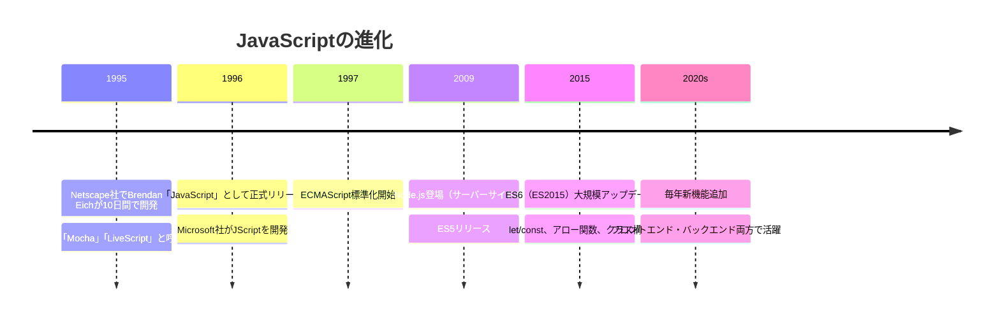
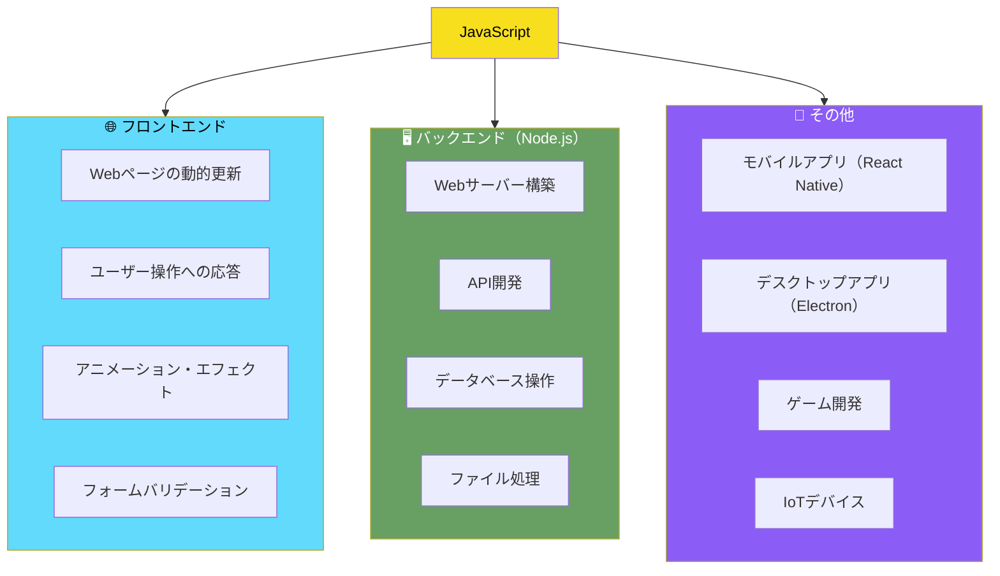
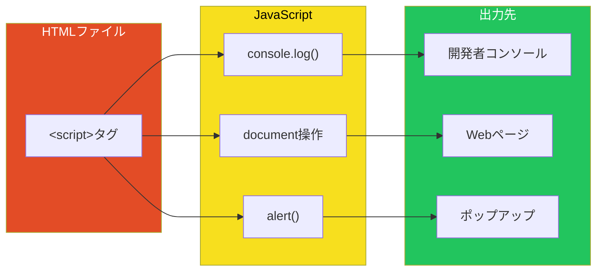
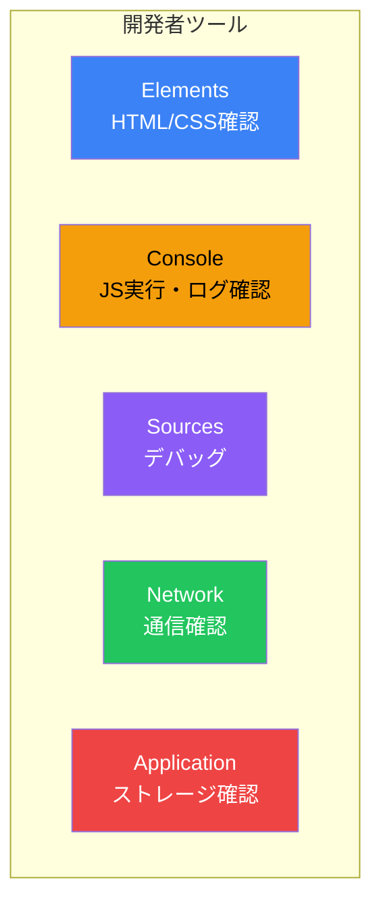

# Day 1: JavaScriptの世界へようこそ

## 今日学ぶこと

- JavaScriptとは何か、なぜ重要なのか
- 開発環境のセットアップ方法
- 最初のプログラム「Hello, World!」の作成
- ブラウザ開発者ツールの使い方

---

## JavaScriptとは何か

JavaScriptは、**Webの共通言語**です。世界中のほぼすべてのWebサイトがJavaScriptを使用しており、すべてのモダンブラウザ（デスクトップ、タブレット、スマートフォン）にJavaScriptインタプリタが搭載されています。これにより、JavaScriptは**歴史上最も広く普及したプログラミング言語**となりました。

### JavaScriptの歴史



> **豆知識**: 「JavaScript」という名前はJavaとの類似性を示唆しますが、JavaとJavaScriptは**全く別の言語**です。当時人気だったJavaの知名度を借りるためのマーケティング戦略でした。

### JavaScriptでできること



| 分野 | 説明 | 代表的なフレームワーク/ツール |
|------|------|------------------------------|
| Webフロントエンド | ブラウザ上で動作するUI構築 | React, Vue.js, Angular |
| Webバックエンド | サーバーサイド処理 | Node.js, Express, Fastify |
| モバイルアプリ | iOS/Androidアプリ開発 | React Native, Ionic |
| デスクトップアプリ | Windows/Mac/Linuxアプリ | Electron |

---

## 開発環境のセットアップ

JavaScriptを始める最大の利点は、**特別なソフトウェアをインストールする必要がない**ことです。Webブラウザさえあれば、すぐにコードを書いて実行できます。

### 必要なもの

1. **Webブラウザ**（以下のいずれか）
   - Google Chrome（推奨）
   - Mozilla Firefox
   - Microsoft Edge
   - Safari

2. **テキストエディタ**（より本格的な開発用）
   - Visual Studio Code（推奨・無料）
   - Sublime Text
   - Atom

### Visual Studio Codeのインストール

より快適に開発するために、Visual Studio Code（VS Code）のインストールをお勧めします。

1. [code.visualstudio.com](https://code.visualstudio.com/) にアクセス
2. お使いのOS用のインストーラをダウンロード
3. インストーラを実行してセットアップ

#### おすすめの拡張機能

| 拡張機能名 | 説明 |
|-----------|------|
| Live Server | HTMLファイルをローカルサーバーで即座にプレビュー |
| Prettier | コードを自動整形 |
| ESLint | コードの問題を検出 |
| JavaScript (ES6) code snippets | よく使うコードスニペット |

---

## 最初のプログラム：Hello, World!

プログラミングを学ぶ伝統として、最初に「Hello, World!」と表示するプログラムを作ります。

### 方法1: ブラウザのコンソールで実行

最も簡単な方法は、ブラウザの開発者ツールを使うことです。

1. ブラウザを開く（どのページでもOK）
2. 開発者ツールを開く

| ブラウザ | Windows/Linux | Mac |
|---------|---------------|-----|
| Chrome | `F12` または `Ctrl+Shift+J` | `Cmd+Option+J` |
| Firefox | `F12` または `Ctrl+Shift+K` | `Cmd+Option+K` |
| Edge | `F12` または `Ctrl+Shift+J` | `Cmd+Option+J` |
| Safari | - | `Cmd+Option+C`（開発メニューを有効化後） |

3. 「Console」タブをクリック
4. 以下のコードを入力してEnterキーを押す：

```javascript
console.log("Hello, World!");
```

**結果**: コンソールに `Hello, World!` と表示されます。

### 方法2: HTMLファイルで実行

より実践的な方法として、HTMLファイルにJavaScriptを埋め込む方法を学びましょう。

1. テキストエディタで新しいファイルを作成
2. 以下のコードを入力：

```html
<!DOCTYPE html>
<html lang="ja">
<head>
    <meta charset="UTF-8">
    <meta name="viewport" content="width=device-width, initial-scale=1.0">
    <title>My First JavaScript</title>
</head>
<body>
    <h1>JavaScriptを学ぼう</h1>
    <p id="output"></p>

    <script>
        // コンソールに出力
        console.log("Hello, World!");

        // ページに出力
        document.getElementById("output").textContent = "Hello, World!";

        // ポップアップで出力
        // alert("Hello, World!");
    </script>
</body>
</html>
```

3. `hello.html` として保存
4. ブラウザでファイルを開く

### コードの解説



| メソッド | 説明 | 用途 |
|---------|------|------|
| `console.log()` | 開発者コンソールに出力 | デバッグ、動作確認 |
| `document.getElementById()` | HTML要素を取得して操作 | ページ内容の動的変更 |
| `alert()` | ポップアップで表示 | ユーザーへの通知（現在はあまり使われない） |

---

## ブラウザ開発者ツールの活用

開発者ツールは、JavaScriptを学ぶ上で**最も重要なツール**です。

### 主要なタブ



| タブ | 説明 | 主な用途 |
|------|------|----------|
| Elements | HTML構造とCSSスタイルを確認・編集 | レイアウト調整 |
| Console | JavaScriptの実行とログ表示 | デバッグ、実験 |
| Sources | ソースコードの表示とデバッグ | ブレークポイント設定 |
| Network | ネットワーク通信の監視 | API呼び出し確認 |
| Application | ストレージ、Cookie確認 | データ保存の確認 |

### コンソールでの実験

開発者コンソールでは、JavaScriptを直接入力して実験できます。以下を試してみましょう：

```javascript
// 計算
2 + 3

// 文字列操作
"Hello" + " " + "World"

// 現在の日時
new Date()

// ページのタイトルを取得
document.title

// ページのタイトルを変更
document.title = "Changed by JavaScript!"
```

---

## まとめ

今日学んだことを振り返りましょう。

| 概念 | 説明 |
|------|------|
| JavaScript | Webの標準言語。フロントエンド、バックエンド、モバイルアプリなど幅広く使用 |
| 開発者ツール | ブラウザ内蔵の開発支援機能。F12で起動 |
| console.log() | デバッグ用の出力メソッド |
| `<script>`タグ | HTMLにJavaScriptを埋め込むためのタグ |

### 重要ポイント

1. JavaScriptはブラウザだけで始められる
2. 開発者ツールのConsoleタブは最強の学習環境
3. `console.log()`はデバッグの基本

---

## 練習問題

### 問題1: コンソールで計算
ブラウザの開発者コンソールを開き、以下の計算を実行してください：
- `100 + 200`
- `50 * 4`
- `1000 / 8`

### 問題2: Hello, [あなたの名前]
`console.log()`を使って、自分の名前を含むメッセージを出力してください。

例：`console.log("Hello, Taro!");`

### 問題3: HTMLファイルの作成
上記の「方法2」を参考に、自分でHTMLファイルを作成し、好きなメッセージをWebページに表示してください。

### チャレンジ問題
開発者ツールのConsoleで、以下を試してみましょう：
1. `document.body.style.backgroundColor = "lightblue"` を実行
2. 何が起きましたか？
3. 他の色（`"pink"`, `"yellow"`, `"#ff6600"`など）も試してみましょう

---

## 参考リンク

- [MDN Web Docs - JavaScript入門](https://developer.mozilla.org/ja/docs/Learn/JavaScript/First_steps)
- [JavaScript.info - 言語の紹介](https://ja.javascript.info/intro)
- [Chrome DevTools ドキュメント](https://developer.chrome.com/docs/devtools/)
- [Visual Studio Code ダウンロード](https://code.visualstudio.com/)

---

**次回予告**: Day 2では、JavaScriptの基本となる「値と変数」について学びます。数値、文字列、真偽値などのデータ型と、それらを格納する変数の使い方をマスターしましょう！
