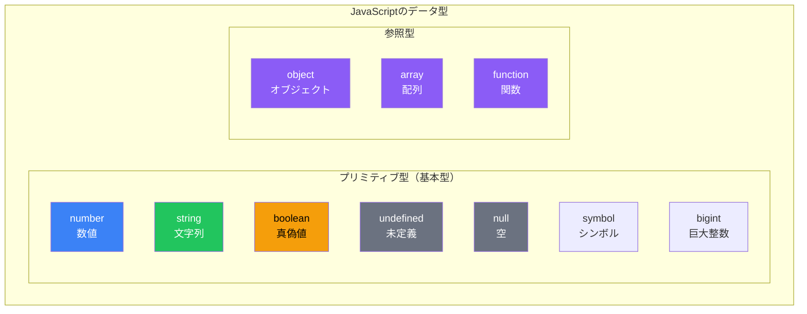
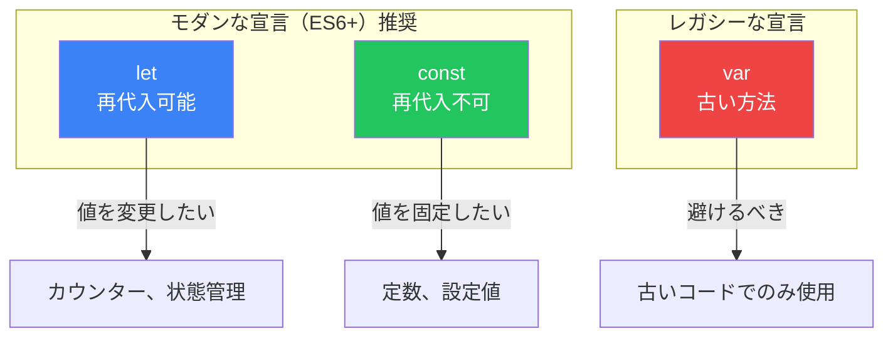

# Day 2: 値と変数

## 今日学ぶこと

- JavaScriptのデータ型を理解する
- 数値と文字列の操作方法
- 変数の宣言と使い方（let, const, var）
- 型変換の仕組み

---

## データ型とは

コンピュータプログラムは**値（value）**を操作することで動作します。JavaScriptでは、値はそれぞれ**データ型（type）**を持っています。データ型を理解することは、プログラミングの最も基本的なスキルの一つです。

### JavaScriptのデータ型



| データ型 | 説明 | 例 |
|----------|------|-----|
| `number` | 数値（整数・小数） | `42`, `3.14`, `-10` |
| `string` | 文字列 | `"Hello"`, `'World'` |
| `boolean` | 真偽値 | `true`, `false` |
| `undefined` | 未定義（値が設定されていない） | `undefined` |
| `null` | 空（意図的に値がない） | `null` |
| `symbol` | 一意の識別子（ES6+） | `Symbol("id")` |
| `bigint` | 巨大な整数（ES2020+） | `9007199254740991n` |

> **今日のフォーカス**: この章では、最もよく使う `number`、`string`、`boolean` を中心に学びます。

---

## 数値（number）

JavaScriptの数値型は、整数と小数（浮動小数点数）を区別しません。すべて同じ `number` 型です。

### 数値リテラル

```javascript
// 整数
let age = 25;
let year = 2026;
let negative = -100;

// 小数（浮動小数点数）
let pi = 3.14159;
let price = 19.99;

// 指数表記
let billion = 1e9;      // 1,000,000,000
let micro = 1e-6;       // 0.000001

// 2進数、8進数、16進数
let binary = 0b1010;    // 10（2進数）
let octal = 0o755;      // 493（8進数）
let hex = 0xff;         // 255（16進数）
```

### 算術演算

```javascript
console.log(10 + 3);    // 13（加算）
console.log(10 - 3);    // 7（減算）
console.log(10 * 3);    // 30（乗算）
console.log(10 / 3);    // 3.3333...（除算）
console.log(10 % 3);    // 1（剰余・余り）
console.log(10 ** 3);   // 1000（べき乗）
```

### 特殊な数値

JavaScriptには、いくつかの特殊な数値があります。

```javascript
console.log(Infinity);      // 無限大
console.log(-Infinity);     // 負の無限大
console.log(NaN);           // Not a Number（数値ではない）

// NaNが発生する例
console.log(0 / 0);         // NaN
console.log("hello" * 2);   // NaN
console.log(Math.sqrt(-1)); // NaN

// NaNの特殊な性質
console.log(NaN === NaN);   // false（NaNは自分自身とも等しくない！）
console.log(Number.isNaN(NaN)); // true（NaNかどうかを正しく判定）
```

### 浮動小数点数の注意点

```javascript
// 有名な問題
console.log(0.1 + 0.2);     // 0.30000000000000004（期待は0.3）

// 解決策：小数点以下を丸める
console.log((0.1 + 0.2).toFixed(1));  // "0.3"
console.log(Math.round((0.1 + 0.2) * 10) / 10); // 0.3
```

> **なぜこうなる？**: コンピュータは2進数で数値を扱うため、0.1のような10進数の小数を正確に表現できないことがあります。これは**浮動小数点誤差**と呼ばれます。

---

## 文字列（string）

文字列は、テキストデータを表現するためのデータ型です。

### 文字列リテラル

```javascript
// シングルクォート
let single = 'Hello, World!';

// ダブルクォート
let double = "Hello, World!";

// テンプレートリテラル（バッククォート）ES6+
let template = `Hello, World!`;

// どれを使っても結果は同じ
console.log(single === double);   // true
console.log(double === template); // true
```

### エスケープシーケンス

```javascript
// 特殊文字を含める
let newline = "Hello\nWorld";     // 改行
let tab = "Hello\tWorld";         // タブ
let quote = "He said \"Hi\"";     // ダブルクォート
let backslash = "C:\\Users\\";    // バックスラッシュ

console.log(newline);
// Hello
// World
```

| エスケープ | 意味 |
|-----------|------|
| `\n` | 改行 |
| `\t` | タブ |
| `\"` | ダブルクォート |
| `\'` | シングルクォート |
| `\\` | バックスラッシュ |

### 文字列の操作

```javascript
let str = "JavaScript";

// 長さ
console.log(str.length);        // 10

// 文字の取得（インデックスは0から始まる）
console.log(str[0]);            // "J"
console.log(str.charAt(4));     // "S"

// 部分文字列
console.log(str.slice(0, 4));   // "Java"
console.log(str.slice(4));      // "Script"
console.log(str.substring(0, 4)); // "Java"

// 大文字・小文字変換
console.log(str.toUpperCase()); // "JAVASCRIPT"
console.log(str.toLowerCase()); // "javascript"

// 検索
console.log(str.indexOf("Script")); // 4
console.log(str.includes("Java"));  // true

// 置換
console.log(str.replace("Java", "Type")); // "TypeScript"

// 分割
console.log("a,b,c".split(","));  // ["a", "b", "c"]

// 空白除去
console.log("  hello  ".trim()); // "hello"
```

### テンプレートリテラル（重要！）

ES6で導入されたテンプレートリテラルは、文字列操作を大幅に簡単にします。

```javascript
let name = "太郎";
let age = 25;

// 従来の方法（文字列結合）
let message1 = "私の名前は" + name + "です。" + age + "歳です。";

// テンプレートリテラル（推奨）
let message2 = `私の名前は${name}です。${age}歳です。`;

console.log(message2); // "私の名前は太郎です。25歳です。"

// 複数行も簡単
let multiline = `
  これは
  複数行の
  文字列です
`;

// 式も埋め込める
console.log(`2 + 3 = ${2 + 3}`); // "2 + 3 = 5"
```

---

## 真偽値（boolean）

真偽値は、`true`（真）または `false`（偽）のどちらかの値を持ちます。条件分岐で重要な役割を果たします。

```javascript
let isLoggedIn = true;
let hasPermission = false;

// 比較演算の結果は真偽値
console.log(10 > 5);    // true
console.log(10 < 5);    // false
console.log(10 === 10); // true
console.log("a" === "b"); // false
```

---

## 変数の宣言

変数は、値に名前をつけて保存する「箱」のようなものです。JavaScriptには3つの変数宣言方法があります。

### let, const, var の違い



| キーワード | 再代入 | 再宣言 | スコープ | 推奨度 |
|-----------|--------|--------|----------|--------|
| `const` | ❌ 不可 | ❌ 不可 | ブロック | ⭐⭐⭐ 最優先 |
| `let` | ✅ 可能 | ❌ 不可 | ブロック | ⭐⭐ 必要な時 |
| `var` | ✅ 可能 | ✅ 可能 | 関数 | ⭐ 避ける |

### const（定数）

```javascript
// 基本的にはconstを使う
const PI = 3.14159;
const APP_NAME = "MyApp";
const MAX_USERS = 100;

// 再代入はエラー
// PI = 3.14; // TypeError: Assignment to constant variable.

// ただし、オブジェクトや配列の中身は変更可能
const user = { name: "太郎" };
user.name = "次郎"; // OK（中身の変更）
// user = { name: "次郎" }; // エラー（再代入）

const numbers = [1, 2, 3];
numbers.push(4); // OK（中身の変更）
// numbers = [1, 2, 3, 4]; // エラー（再代入）
```

### let（変数）

```javascript
// 値が変わる可能性がある場合はlet
let count = 0;
count = 1;  // OK
count = 2;  // OK

let score;  // 初期値なしも可能（undefinedになる）
score = 100;

// 同じスコープで再宣言はエラー
// let count = 5; // SyntaxError: Identifier 'count' has already been declared
```

### var（非推奨）

```javascript
// varは古い方法（使わないことを推奨）
var oldStyle = "レガシーコード";

// varの問題点
var x = 1;
var x = 2; // 再宣言OK（バグの原因になりやすい）

// 関数スコープなのでブロックを無視
if (true) {
    var leaked = "漏れる";
}
console.log(leaked); // "漏れる"（ブロック外でもアクセス可能）

// letの場合
if (true) {
    let contained = "閉じ込められる";
}
// console.log(contained); // ReferenceError
```

### 命名規則

```javascript
// camelCase（キャメルケース）が一般的
let firstName = "太郎";
let lastName = "山田";
let isLoggedIn = true;
let maxRetryCount = 3;

// 定数は UPPER_SNAKE_CASE も使われる
const MAX_SIZE = 100;
const API_BASE_URL = "https://api.example.com";

// 使えない名前
// let 2name = "NG";    // 数字で始められない
// let my-name = "NG";  // ハイフン使用不可
// let class = "NG";    // 予約語は使用不可
```

---

## 型変換

JavaScriptは**動的型付け言語**なので、型変換が頻繁に起こります。

### 暗黙的な型変換（自動）

```javascript
// 文字列への変換
console.log("5" + 3);       // "53"（数値が文字列に）
console.log("Hello" + 123); // "Hello123"

// 数値への変換
console.log("5" - 3);       // 2（文字列が数値に）
console.log("5" * 2);       // 10
console.log("10" / 2);      // 5

// 真偽値への変換
console.log(!"");           // true（空文字はfalsy）
console.log(!0);            // true（0はfalsy）
console.log(!null);         // true（nullはfalsy）
```

### 明示的な型変換（手動）

```javascript
// 文字列への変換
String(123);        // "123"
(123).toString();   // "123"
123 + "";           // "123"

// 数値への変換
Number("123");      // 123
parseInt("123");    // 123（整数）
parseFloat("3.14"); // 3.14（小数）
+"123";             // 123（単項プラス演算子）

// 真偽値への変換
Boolean(1);         // true
Boolean(0);         // false
Boolean("hello");   // true
Boolean("");        // false
!!1;                // true（二重否定）
```

### Falsyな値とTruthyな値

```javascript
// Falsy（偽として扱われる値）
console.log(Boolean(false));     // false
console.log(Boolean(0));         // false
console.log(Boolean(-0));        // false
console.log(Boolean(""));        // false
console.log(Boolean(null));      // false
console.log(Boolean(undefined)); // false
console.log(Boolean(NaN));       // false

// Truthy（真として扱われる値）- 上記以外すべて
console.log(Boolean(true));      // true
console.log(Boolean(1));         // true
console.log(Boolean("hello"));   // true
console.log(Boolean([]));        // true（空配列も！）
console.log(Boolean({}));        // true（空オブジェクトも！）
```

| 値 | Boolean変換 |
|----|-------------|
| `false` | `false` |
| `0`, `-0` | `false` |
| `""` (空文字) | `false` |
| `null` | `false` |
| `undefined` | `false` |
| `NaN` | `false` |
| その他すべて | `true` |

---

## typeof演算子

値のデータ型を調べるには `typeof` 演算子を使います。

```javascript
console.log(typeof 42);          // "number"
console.log(typeof "hello");     // "string"
console.log(typeof true);        // "boolean"
console.log(typeof undefined);   // "undefined"
console.log(typeof null);        // "object"（歴史的なバグ）
console.log(typeof {});          // "object"
console.log(typeof []);          // "object"（配列もobject）
console.log(typeof function(){}); // "function"
```

> **注意**: `typeof null` が `"object"` を返すのはJavaScriptの歴史的なバグです。`null` は本来プリミティブ型です。

---

## まとめ

| 概念 | 説明 |
|------|------|
| プリミティブ型 | `number`, `string`, `boolean`, `null`, `undefined`, `symbol`, `bigint` |
| 変数宣言 | `const`（定数）、`let`（変数）、`var`（非推奨） |
| テンプレートリテラル | バッククォートで囲み、`${}`で値を埋め込む |
| 型変換 | 暗黙的（自動）と明示的（手動）がある |
| Falsy値 | `false`, `0`, `""`, `null`, `undefined`, `NaN` |

### 重要ポイント

1. **`const` を優先的に使う** - 再代入が必要な場合のみ `let`
2. **`var` は使わない** - スコープの問題があるため
3. **テンプレートリテラル**を使うと文字列操作が楽になる
4. **型変換**に注意 - 特に `==` と `===` の違い

---

## 練習問題

### 問題1: 変数の宣言
以下の値を適切な変数に格納してください（`const`か`let`を選択）：
- 円周率 3.14159
- ユーザーの年齢（変更される可能性あり）
- アプリケーション名 "MyApp"

### 問題2: 文字列操作
変数 `name` に自分の名前を格納し、テンプレートリテラルを使って「こんにちは、○○さん！」と表示してください。

### 問題3: 型の確認
以下の値それぞれの `typeof` の結果を予想し、コンソールで確認してください：
- `42`
- `"42"`
- `true`
- `null`
- `undefined`
- `[]`

### 問題4: 型変換
以下の式の結果を予想してください：
```javascript
"5" + 3
"5" - 3
"5" * "2"
"hello" - 1
```

### チャレンジ問題
ユーザーの名前、年齢、職業を変数に格納し、以下のような自己紹介文を作成してください：

```
私の名前は山田太郎です。
年齢は25歳で、エンジニアとして働いています。
来年は26歳になります。
```

---

## 参考リンク

- [MDN - JavaScript のデータ型とデータ構造](https://developer.mozilla.org/ja/docs/Web/JavaScript/Data_structures)
- [MDN - 文字列](https://developer.mozilla.org/ja/docs/Web/JavaScript/Reference/Global_Objects/String)
- [MDN - let](https://developer.mozilla.org/ja/docs/Web/JavaScript/Reference/Statements/let)
- [MDN - const](https://developer.mozilla.org/ja/docs/Web/JavaScript/Reference/Statements/const)
- [JavaScript.info - データ型](https://ja.javascript.info/types)

---

**次回予告**: Day 3では「演算子と式」について学びます。比較演算子、論理演算子、そして重要な `==` と `===` の違いをマスターしましょう！
