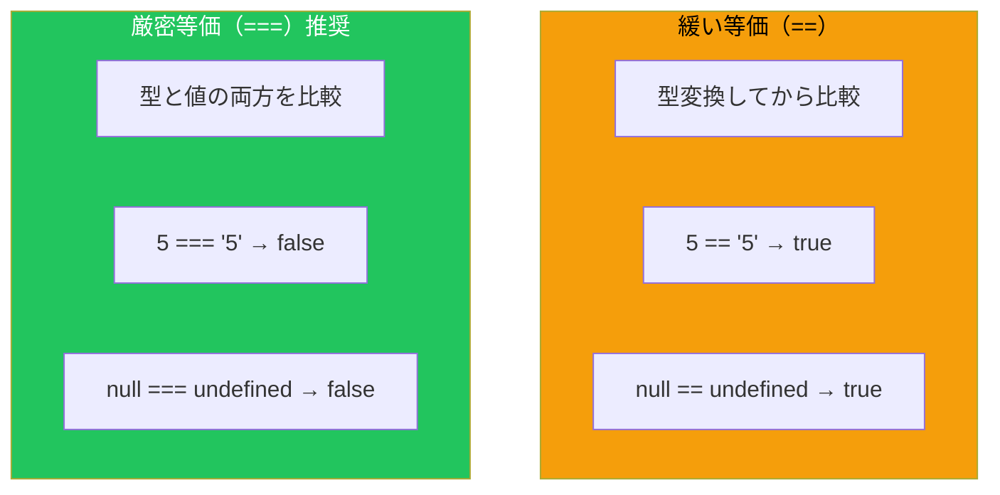
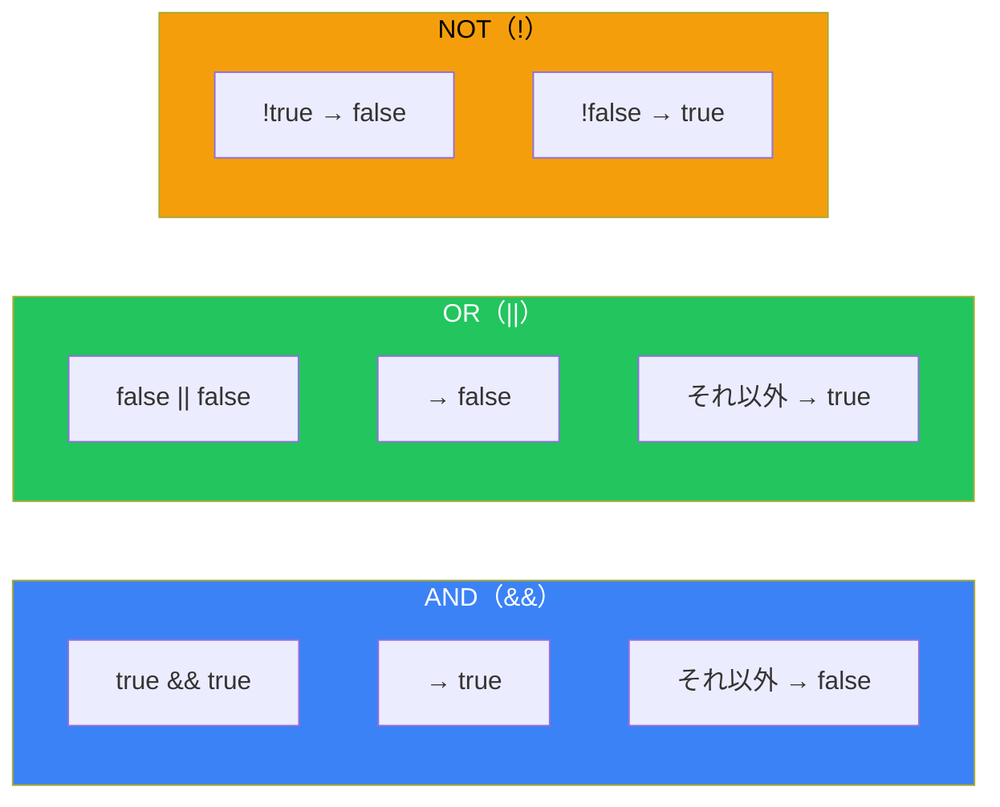
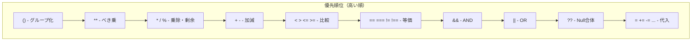

# Day 3: 演算子と式

## 今日学ぶこと

- 算術演算子で計算を行う
- 比較演算子で値を比較する（== vs === の違い）
- 論理演算子で条件を組み合わせる
- 代入演算子で効率的にコードを書く
- 演算子の優先順位を理解する

---

## 式（Expression）とは

**式**とは、値を生成するJavaScriptのコードの断片です。

```javascript
// これらはすべて式
42              // リテラル式：42を生成
"hello"         // リテラル式："hello"を生成
x               // 変数式：xの値を生成
2 + 3           // 演算式：5を生成
Math.max(1, 2)  // 関数呼び出し式：2を生成
```

**演算子（Operator）**は、式を組み合わせてより複雑な式を作ります。

---

## 算術演算子

数値の計算に使用する演算子です。

### 基本的な算術演算子

```javascript
let a = 10;
let b = 3;

console.log(a + b);   // 13（加算）
console.log(a - b);   // 7（減算）
console.log(a * b);   // 30（乗算）
console.log(a / b);   // 3.3333...（除算）
console.log(a % b);   // 1（剰余・余り）
console.log(a ** b);  // 1000（べき乗）10の3乗
```

| 演算子 | 名前 | 例 | 結果 |
|--------|------|-----|------|
| `+` | 加算 | `5 + 3` | `8` |
| `-` | 減算 | `5 - 3` | `2` |
| `*` | 乗算 | `5 * 3` | `15` |
| `/` | 除算 | `5 / 2` | `2.5` |
| `%` | 剰余 | `5 % 2` | `1` |
| `**` | べき乗 | `5 ** 2` | `25` |

### 単項演算子

```javascript
let x = 5;

// 正負の反転
console.log(-x);    // -5
console.log(+x);    // 5

// インクリメント・デクリメント
let count = 0;

count++;  // 後置インクリメント：countを使った後に+1
++count;  // 前置インクリメント：+1してからcountを使う
count--;  // 後置デクリメント
--count;  // 前置デクリメント

// 前置と後置の違い
let a = 5;
let b = a++;  // bは5、aは6（先に代入、後でインクリメント）

let c = 5;
let d = ++c;  // dは6、cも6（先にインクリメント、後で代入）
```

### 文字列の連結

`+` 演算子は文字列の連結にも使われます。

```javascript
console.log("Hello" + " " + "World");  // "Hello World"
console.log("Score: " + 100);          // "Score: 100"
console.log(1 + 2 + "3");              // "33"（1+2=3、3+"3"="33"）
console.log("1" + 2 + 3);              // "123"（"1"+2="12"、"12"+3="123"）
```

> **注意**: `+` は文字列が含まれると連結になります。計算したい場合は先に数値に変換しましょう。

---

## 比較演算子

値を比較して、真偽値（`true` または `false`）を返します。

### 等価性の比較



```javascript
// == （緩い等価）: 型変換してから比較
console.log(5 == "5");        // true（文字列"5"が数値5に変換される）
console.log(0 == false);      // true
console.log(null == undefined); // true
console.log("" == false);     // true

// === （厳密等価）: 型と値の両方を比較【推奨】
console.log(5 === "5");       // false（型が違う）
console.log(0 === false);     // false
console.log(null === undefined); // false
console.log("" === false);    // false

// != と !==
console.log(5 != "5");        // false（== の否定）
console.log(5 !== "5");       // true（=== の否定）
```

| 演算子 | 名前 | 説明 |
|--------|------|------|
| `==` | 緩い等価 | 型変換後に比較（避けるべき） |
| `===` | 厳密等価 | 型と値の両方を比較（推奨） |
| `!=` | 緩い不等価 | `==` の否定 |
| `!==` | 厳密不等価 | `===` の否定（推奨） |

> **ベストプラクティス**: 常に `===` と `!==` を使いましょう。`==` は予期しない型変換でバグの原因になります。

### 大小比較

```javascript
console.log(10 > 5);    // true
console.log(10 < 5);    // false
console.log(10 >= 10);  // true
console.log(10 <= 9);   // false

// 文字列の比較（辞書順）
console.log("apple" < "banana");  // true
console.log("Apple" < "apple");   // true（大文字は小文字より小さい）
console.log("10" < "9");          // true（文字列として比較！）

// 数値と文字列
console.log(10 < "9");            // false（"9"が数値に変換される）
```

| 演算子 | 名前 | 例 | 結果 |
|--------|------|-----|------|
| `>` | より大きい | `5 > 3` | `true` |
| `<` | より小さい | `5 < 3` | `false` |
| `>=` | 以上 | `5 >= 5` | `true` |
| `<=` | 以下 | `5 <= 3` | `false` |

---

## 論理演算子

真偽値を組み合わせて、より複雑な条件を作ります。

### AND（&&）、OR（||）、NOT（!）



```javascript
// AND（&&）：両方trueならtrue
console.log(true && true);    // true
console.log(true && false);   // false
console.log(false && true);   // false
console.log(false && false);  // false

// OR（||）：どちらかがtrueならtrue
console.log(true || true);    // true
console.log(true || false);   // true
console.log(false || true);   // true
console.log(false || false);  // false

// NOT（!）：反転
console.log(!true);   // false
console.log(!false);  // true
console.log(!!true);  // true（二重否定は元に戻る）
```

### 真理値表

| A | B | A && B | A \|\| B | !A |
|---|---|--------|----------|-----|
| true | true | true | true | false |
| true | false | false | true | false |
| false | true | false | true | true |
| false | false | false | false | true |

### 実践的な使用例

```javascript
let age = 25;
let hasLicense = true;

// 複数条件の組み合わせ
let canDrive = age >= 18 && hasLicense;
console.log(canDrive);  // true

let isWeekend = true;
let isHoliday = false;

// どちらかが休日
let isDayOff = isWeekend || isHoliday;
console.log(isDayOff);  // true
```

### 短絡評価（Short-circuit Evaluation）

論理演算子は「短絡評価」を行います。結果が確定した時点で評価を止めます。

```javascript
// &&: 左がfalsyなら左を返す、そうでなければ右を返す
console.log(false && "hello");  // false
console.log("hello" && "world"); // "world"
console.log("" && "hello");     // ""

// ||: 左がtruthyなら左を返す、そうでなければ右を返す
console.log(true || "hello");   // true
console.log(false || "hello");  // "hello"
console.log("" || "default");   // "default"

// 実践的な使い方
let username = "";
let displayName = username || "ゲスト";
console.log(displayName);  // "ゲスト"

// オブジェクトのプロパティ安全アクセス
let user = null;
let name = user && user.name;  // エラーにならずにnullを返す
```

### Null合体演算子（??）

ES2020で導入された `??` 演算子は、`null` または `undefined` の場合のみ右辺を返します。

```javascript
// || との違い
console.log(0 || "default");    // "default"（0はfalsy）
console.log(0 ?? "default");    // 0（0はnullでもundefinedでもない）

console.log("" || "default");   // "default"（空文字はfalsy）
console.log("" ?? "default");   // ""（空文字はnullでもundefinedでもない）

console.log(null ?? "default"); // "default"
console.log(undefined ?? "default"); // "default"

// 実践的な使い方
let config = {
    timeout: 0,  // 0秒という設定
    retries: null
};

// || だと0が無視される
let timeout1 = config.timeout || 30;  // 30（0がfalsyなので）
// ?? なら0も有効な値として扱う
let timeout2 = config.timeout ?? 30;  // 0

let retries = config.retries ?? 3;    // 3
```

---

## 代入演算子

変数に値を代入する演算子です。

### 複合代入演算子

```javascript
let x = 10;

x += 5;   // x = x + 5;  → 15
x -= 3;   // x = x - 3;  → 12
x *= 2;   // x = x * 2;  → 24
x /= 4;   // x = x / 4;  → 6
x %= 4;   // x = x % 4;  → 2
x **= 3;  // x = x ** 3; → 8

// 文字列にも使える
let str = "Hello";
str += " World";  // "Hello World"
```

| 演算子 | 等価な式 |
|--------|----------|
| `x += y` | `x = x + y` |
| `x -= y` | `x = x - y` |
| `x *= y` | `x = x * y` |
| `x /= y` | `x = x / y` |
| `x %= y` | `x = x % y` |
| `x **= y` | `x = x ** y` |

---

## 三項演算子（条件演算子）

`if-else` を1行で書ける便利な演算子です。

```javascript
// 構文: 条件 ? 真の場合の値 : 偽の場合の値

let age = 20;
let status = age >= 18 ? "成人" : "未成年";
console.log(status);  // "成人"

// 従来のif-else
let status2;
if (age >= 18) {
    status2 = "成人";
} else {
    status2 = "未成年";
}

// ネストも可能（読みにくいので避けた方が良い）
let score = 85;
let grade = score >= 90 ? "A" :
            score >= 80 ? "B" :
            score >= 70 ? "C" : "D";
console.log(grade);  // "B"
```

---

## 演算子の優先順位

複数の演算子がある場合、どの順序で評価されるかが重要です。



```javascript
// 例：優先順位による評価順序
console.log(2 + 3 * 4);      // 14（* が + より先）
console.log((2 + 3) * 4);    // 20（括弧で順序を変更）

console.log(true || false && false);  // true（&& が || より先）
console.log((true || false) && false); // false

// べき乗は右から左
console.log(2 ** 3 ** 2);    // 512（2 ** 9 = 512）
console.log((2 ** 3) ** 2);  // 64（8 ** 2 = 64）
```

| 優先度 | 演算子 | 結合性 |
|--------|--------|--------|
| 1 | `()` | - |
| 2 | `**` | 右から左 |
| 3 | `* / %` | 左から右 |
| 4 | `+ -` | 左から右 |
| 5 | `< > <= >=` | 左から右 |
| 6 | `== === != !==` | 左から右 |
| 7 | `&&` | 左から右 |
| 8 | `\|\|` | 左から右 |
| 9 | `??` | 左から右 |
| 10 | `= += -=` など | 右から左 |

> **ベストプラクティス**: 優先順位を覚えるより、括弧 `()` を使って明示的にしましょう。コードが読みやすくなります。

---

## typeof と instanceof

型を確認するための演算子です。

```javascript
// typeof: プリミティブ型の確認
console.log(typeof 42);          // "number"
console.log(typeof "hello");     // "string"
console.log(typeof true);        // "boolean"
console.log(typeof undefined);   // "undefined"
console.log(typeof null);        // "object"（歴史的バグ）
console.log(typeof {});          // "object"
console.log(typeof []);          // "object"
console.log(typeof function(){}); // "function"

// instanceof: オブジェクトの型確認
console.log([] instanceof Array);   // true
console.log({} instanceof Object);  // true
console.log(new Date() instanceof Date); // true
```

---

## まとめ

| カテゴリ | 演算子 | 説明 |
|----------|--------|------|
| 算術 | `+ - * / % **` | 計算を行う |
| 比較 | `== === != !== < > <= >=` | 値を比較してboolean返す |
| 論理 | `&& \|\| ! ??` | 条件を組み合わせる |
| 代入 | `= += -= *= /=` | 変数に値を代入 |
| 三項 | `? :` | 条件に応じて値を選択 |
| 型 | `typeof instanceof` | 型を確認 |

### 重要ポイント

1. **`===` を使う** - `==` は予期しない型変換を起こす
2. **短絡評価を活用** - デフォルト値の設定に便利
3. **`??` と `||` の違い** - `0` や `""` を有効な値として扱いたい場合は `??`
4. **括弧で明示** - 優先順位を覚えるより読みやすいコードを

---

## 練習問題

### 問題1: 比較演算子
以下の式の結果を予想してください：
```javascript
5 == "5"
5 === "5"
null == undefined
null === undefined
```

### 問題2: 論理演算子
以下の式の結果を予想してください：
```javascript
true && false
true || false
!true
true && true || false
```

### 問題3: 短絡評価
以下の式の結果を予想してください：
```javascript
"hello" && "world"
"" || "default"
0 ?? "fallback"
null ?? "fallback"
```

### 問題4: 複合代入
`x = 10` から始めて、以下の演算を順番に行った後の `x` の値は？
```javascript
x += 5
x *= 2
x -= 10
x /= 4
```

### チャレンジ問題
ユーザーの年齢と会員ステータスに基づいて、入場料を計算するコードを書いてください：
- 12歳未満：500円
- 12歳以上65歳未満：1000円
- 65歳以上：800円
- 会員の場合は上記から200円割引

三項演算子を使って1つの式で書いてみましょう。

---

## 参考リンク

- [MDN - 式と演算子](https://developer.mozilla.org/ja/docs/Web/JavaScript/Guide/Expressions_and_operators)
- [MDN - 等価性の比較と同一性](https://developer.mozilla.org/ja/docs/Web/JavaScript/Equality_comparisons_and_sameness)
- [MDN - 論理演算子](https://developer.mozilla.org/ja/docs/Web/JavaScript/Reference/Operators/Logical_Operators)
- [JavaScript.info - 比較](https://ja.javascript.info/comparison)

---

**次回予告**: Day 4では「条件分岐とループ」について学びます。`if`文、`switch`文、`for`ループ、`while`ループをマスターして、プログラムの流れを制御しましょう！
