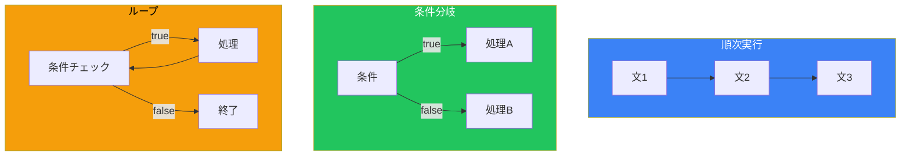
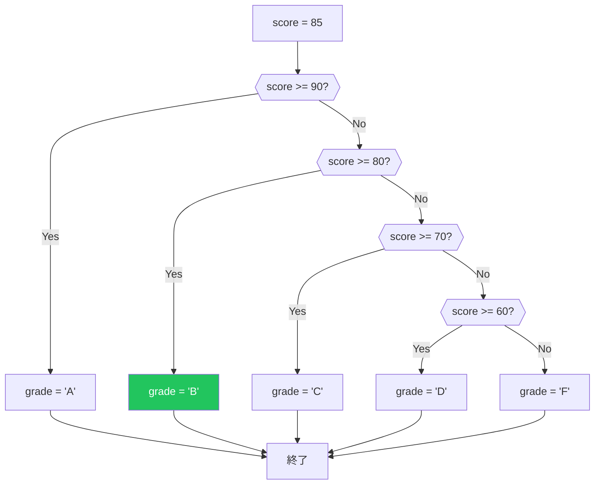
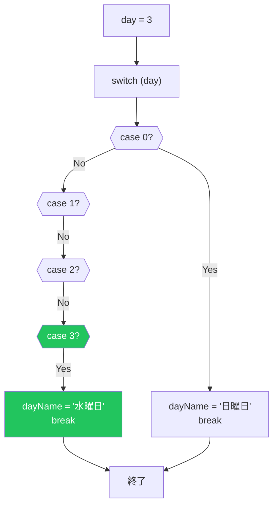
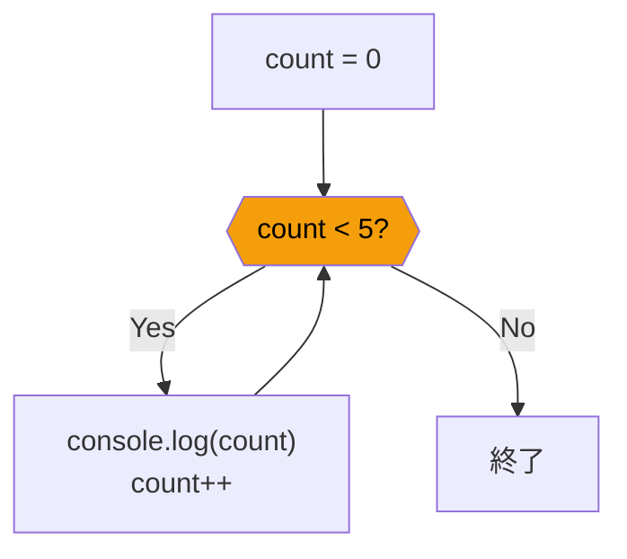
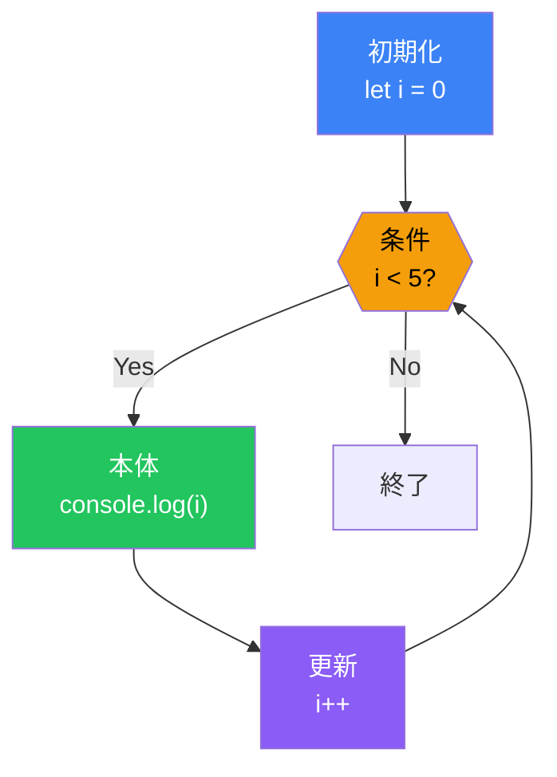
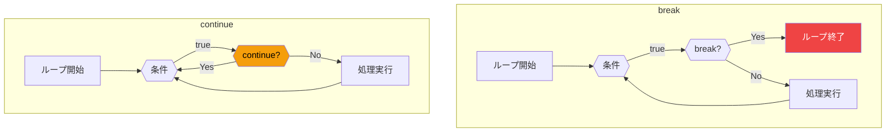

# Day 4: 条件分岐とループ

## 今日学ぶこと

- if文で条件に応じた処理を行う
- switch文で複数の条件を効率的に処理する
- while/do-whileループで繰り返し処理を行う
- forループで決まった回数の繰り返しを行う
- break/continueでループを制御する

---

## プログラムの流れ

プログラムは通常、上から下へ順番に実行されます。しかし、実際のプログラムでは条件によって処理を変えたり、同じ処理を繰り返したりする必要があります。



---

## if文

最も基本的な条件分岐です。条件が `true` の場合に処理を実行します。

### 基本的なif文

```javascript
let age = 20;

if (age >= 18) {
    console.log("成人です");
}
// 出力: "成人です"
```

### if-else文

条件が `false` の場合の処理も指定できます。

```javascript
let age = 15;

if (age >= 18) {
    console.log("成人です");
} else {
    console.log("未成年です");
}
// 出力: "未成年です"
```

### else if文

複数の条件を順番にチェックできます。

```javascript
let score = 85;
let grade;

if (score >= 90) {
    grade = "A";
} else if (score >= 80) {
    grade = "B";
} else if (score >= 70) {
    grade = "C";
} else if (score >= 60) {
    grade = "D";
} else {
    grade = "F";
}

console.log(`あなたの成績は ${grade} です`);
// 出力: "あなたの成績は B です"
```



### ネストしたif文

if文の中にif文を書くことができます（ただし深くなりすぎると読みにくい）。

```javascript
let isLoggedIn = true;
let isAdmin = true;

if (isLoggedIn) {
    if (isAdmin) {
        console.log("管理者としてログイン中");
    } else {
        console.log("一般ユーザーとしてログイン中");
    }
} else {
    console.log("ログインしてください");
}

// より良い書き方（&&を使う）
if (isLoggedIn && isAdmin) {
    console.log("管理者としてログイン中");
} else if (isLoggedIn) {
    console.log("一般ユーザーとしてログイン中");
} else {
    console.log("ログインしてください");
}
```

### 真偽値への自動変換

if文の条件には、真偽値以外の値も使えます。Falsyな値は `false`、Truthyな値は `true` として扱われます。

```javascript
let username = "";

if (username) {
    console.log(`こんにちは、${username}さん`);
} else {
    console.log("ユーザー名を入力してください");
}
// 出力: "ユーザー名を入力してください"（空文字はfalsy）

let items = [];

if (items.length) {
    console.log(`${items.length}個のアイテムがあります`);
} else {
    console.log("アイテムがありません");
}
// 出力: "アイテムがありません"（0はfalsy）
```

---

## switch文

1つの値に対して複数のケースを比較する場合に便利です。

### 基本的なswitch文

```javascript
let day = 3;
let dayName;

switch (day) {
    case 0:
        dayName = "日曜日";
        break;
    case 1:
        dayName = "月曜日";
        break;
    case 2:
        dayName = "火曜日";
        break;
    case 3:
        dayName = "水曜日";
        break;
    case 4:
        dayName = "木曜日";
        break;
    case 5:
        dayName = "金曜日";
        break;
    case 6:
        dayName = "土曜日";
        break;
    default:
        dayName = "無効な日";
}

console.log(dayName);  // "水曜日"
```



### breakを忘れるとフォールスルー

`break` を書かないと、次のケースも実行されます（フォールスルー）。

```javascript
let fruit = "りんご";

switch (fruit) {
    case "りんご":
        console.log("赤い果物");
        // breakがないので次も実行される
    case "バナナ":
        console.log("人気の果物");
        break;
    case "オレンジ":
        console.log("柑橘類");
        break;
}
// 出力:
// "赤い果物"
// "人気の果物"
```

### フォールスルーの活用

意図的にフォールスルーを使うこともあります。

```javascript
let month = 2;
let season;

switch (month) {
    case 12:
    case 1:
    case 2:
        season = "冬";
        break;
    case 3:
    case 4:
    case 5:
        season = "春";
        break;
    case 6:
    case 7:
    case 8:
        season = "夏";
        break;
    case 9:
    case 10:
    case 11:
        season = "秋";
        break;
    default:
        season = "無効な月";
}

console.log(season);  // "冬"
```

### switch vs if-else

| 状況 | 推奨 |
|------|------|
| 1つの値を複数の値と比較 | switch |
| 範囲の比較（>=, <=）| if-else |
| 複雑な条件（&&, \|\|）| if-else |
| 少ない条件（2〜3個）| if-else |

---

## whileループ

条件が `true` の間、処理を繰り返します。

### 基本的なwhileループ

```javascript
let count = 0;

while (count < 5) {
    console.log(`カウント: ${count}`);
    count++;
}
// 出力:
// カウント: 0
// カウント: 1
// カウント: 2
// カウント: 3
// カウント: 4
```



### 無限ループに注意

条件が常に `true` だと無限ループになります。

```javascript
// ⚠️ 危険！無限ループ
// while (true) {
//     console.log("止まらない！");
// }

// 正しい例：終了条件を必ず設定
let i = 0;
while (i < 10) {
    console.log(i);
    i++;  // これがないと無限ループ！
}
```

### do-whileループ

最低1回は実行したい場合に使います。

```javascript
let count = 0;

do {
    console.log(`カウント: ${count}`);
    count++;
} while (count < 5);

// whileとの違い：条件が最初からfalseでも1回は実行される
let x = 10;

do {
    console.log("これは実行される");
} while (x < 5);  // 条件はfalseだが、1回は実行済み

while (x < 5) {
    console.log("これは実行されない");
}
```

---

## forループ

決まった回数の繰り返しに最適です。

### 基本的なforループ

```javascript
for (let i = 0; i < 5; i++) {
    console.log(`インデックス: ${i}`);
}
// 出力:
// インデックス: 0
// インデックス: 1
// インデックス: 2
// インデックス: 3
// インデックス: 4
```

### forループの構造

```javascript
for (初期化; 条件; 更新) {
    // 繰り返す処理
}

// 各部分の実行順序
for (let i = 0; i < 3; i++) {
    console.log(i);
}
// 1. 初期化: let i = 0（1回だけ）
// 2. 条件チェック: i < 3 → true
// 3. 本体実行: console.log(0)
// 4. 更新: i++（iは1に）
// 5. 条件チェック: i < 3 → true
// 6. 本体実行: console.log(1)
// 7. 更新: i++（iは2に）
// 8. 条件チェック: i < 3 → true
// 9. 本体実行: console.log(2)
// 10. 更新: i++（iは3に）
// 11. 条件チェック: i < 3 → false
// 12. ループ終了
```



### さまざまなforループ

```javascript
// カウントダウン
for (let i = 5; i > 0; i--) {
    console.log(i);
}
// 5, 4, 3, 2, 1

// 2ずつ増加
for (let i = 0; i <= 10; i += 2) {
    console.log(i);
}
// 0, 2, 4, 6, 8, 10

// 複数の変数
for (let i = 0, j = 10; i < j; i++, j--) {
    console.log(`i=${i}, j=${j}`);
}
// i=0, j=10
// i=1, j=9
// ...
// i=4, j=6
```

### for...ofループ（配列用）

配列の要素を順番に取り出すのに便利です（Day 6で詳しく学びます）。

```javascript
const fruits = ["りんご", "バナナ", "オレンジ"];

for (const fruit of fruits) {
    console.log(fruit);
}
// りんご
// バナナ
// オレンジ
```

### for...inループ（オブジェクト用）

オブジェクトのプロパティを列挙します（Day 7で詳しく学びます）。

```javascript
const person = {
    name: "太郎",
    age: 25,
    city: "東京"
};

for (const key in person) {
    console.log(`${key}: ${person[key]}`);
}
// name: 太郎
// age: 25
// city: 東京
```

---

## break と continue

ループの流れを制御する文です。

### break：ループを終了

```javascript
for (let i = 0; i < 10; i++) {
    if (i === 5) {
        break;  // ループを完全に終了
    }
    console.log(i);
}
// 0, 1, 2, 3, 4（5以降は出力されない）

// 検索での使用例
const numbers = [1, 3, 5, 7, 9, 11];
let found = false;

for (const num of numbers) {
    if (num > 6) {
        console.log(`6より大きい最初の数: ${num}`);
        found = true;
        break;
    }
}
// 出力: "6より大きい最初の数: 7"
```

### continue：次の繰り返しへスキップ

```javascript
for (let i = 0; i < 10; i++) {
    if (i % 2 === 0) {
        continue;  // 偶数はスキップ
    }
    console.log(i);
}
// 1, 3, 5, 7, 9（奇数のみ出力）

// 特定の値をスキップ
const scores = [85, -1, 92, 78, -1, 88];

for (const score of scores) {
    if (score < 0) {
        continue;  // 無効なスコアをスキップ
    }
    console.log(`スコア: ${score}`);
}
```



### ラベル付きbreak/continue

ネストしたループで外側のループを制御できます。

```javascript
outer: for (let i = 0; i < 3; i++) {
    for (let j = 0; j < 3; j++) {
        if (i === 1 && j === 1) {
            break outer;  // 外側のループも終了
        }
        console.log(`i=${i}, j=${j}`);
    }
}
// i=0, j=0
// i=0, j=1
// i=0, j=2
// i=1, j=0
// （i=1, j=1でbreak outerが実行され、両方のループが終了）
```

---

## ループの使い分け

| ループ | 使用場面 |
|--------|----------|
| `for` | 回数が決まっている繰り返し |
| `while` | 条件が満たされる間の繰り返し |
| `do-while` | 最低1回は実行したい繰り返し |
| `for...of` | 配列の要素を順番に処理 |
| `for...in` | オブジェクトのプロパティを列挙 |

---

## 実践例：簡単なゲーム

```javascript
// 数当てゲーム（疑似コード）
const secretNumber = 7;  // 実際はMath.random()で生成
let attempts = 0;
let maxAttempts = 5;
let guessed = false;

while (attempts < maxAttempts && !guessed) {
    // 実際はユーザー入力を受け取る
    let guess = attempts + 5;  // ダミーの推測値

    attempts++;

    if (guess === secretNumber) {
        console.log(`正解！${attempts}回目で当たりました！`);
        guessed = true;
    } else if (guess < secretNumber) {
        console.log("もっと大きい数です");
    } else {
        console.log("もっと小さい数です");
    }
}

if (!guessed) {
    console.log(`残念！答えは ${secretNumber} でした`);
}
```

---

## まとめ

| 構文 | 用途 |
|------|------|
| `if-else` | 条件に応じて処理を分岐 |
| `switch` | 1つの値を複数のケースと比較 |
| `while` | 条件がtrueの間繰り返す |
| `do-while` | 最低1回実行してから条件チェック |
| `for` | 決まった回数の繰り返し |
| `break` | ループを終了 |
| `continue` | 次の繰り返しへスキップ |

### 重要ポイント

1. **if文**では`===`を使って比較する
2. **switch文**では`break`を忘れない
3. **whileループ**では無限ループに注意
4. **forループ**は初期化・条件・更新の3部構成
5. **break/continue**でループを柔軟に制御

---

## 練習問題

### 問題1: FizzBuzz
1から30までの数を出力してください。ただし：
- 3で割り切れる場合は「Fizz」
- 5で割り切れる場合は「Buzz」
- 両方で割り切れる場合は「FizzBuzz」

### 問題2: 階乗
5の階乗（5! = 5 × 4 × 3 × 2 × 1 = 120）を計算するプログラムを書いてください。

### 問題3: 最大値を見つける
配列 `[3, 7, 2, 9, 4, 1, 8]` から最大値を見つけるプログラムを書いてください（`Math.max()` を使わずに）。

### 問題4: switch文
曜日の番号（0-6）から曜日名と「平日」か「休日」かを出力するプログラムを書いてください。

### チャレンジ問題
九九の表を出力するプログラムを書いてください。

```
1 x 1 = 1
1 x 2 = 2
...
9 x 9 = 81
```

---

## 参考リンク

- [MDN - if...else](https://developer.mozilla.org/ja/docs/Web/JavaScript/Reference/Statements/if...else)
- [MDN - switch](https://developer.mozilla.org/ja/docs/Web/JavaScript/Reference/Statements/switch)
- [MDN - for](https://developer.mozilla.org/ja/docs/Web/JavaScript/Reference/Statements/for)
- [MDN - while](https://developer.mozilla.org/ja/docs/Web/JavaScript/Reference/Statements/while)
- [JavaScript.info - ループ: while と for](https://ja.javascript.info/while-for)

---

**次回予告**: Day 5では「関数」について学びます。コードを再利用可能な部品に分割し、より整理されたプログラムを書けるようになりましょう！
