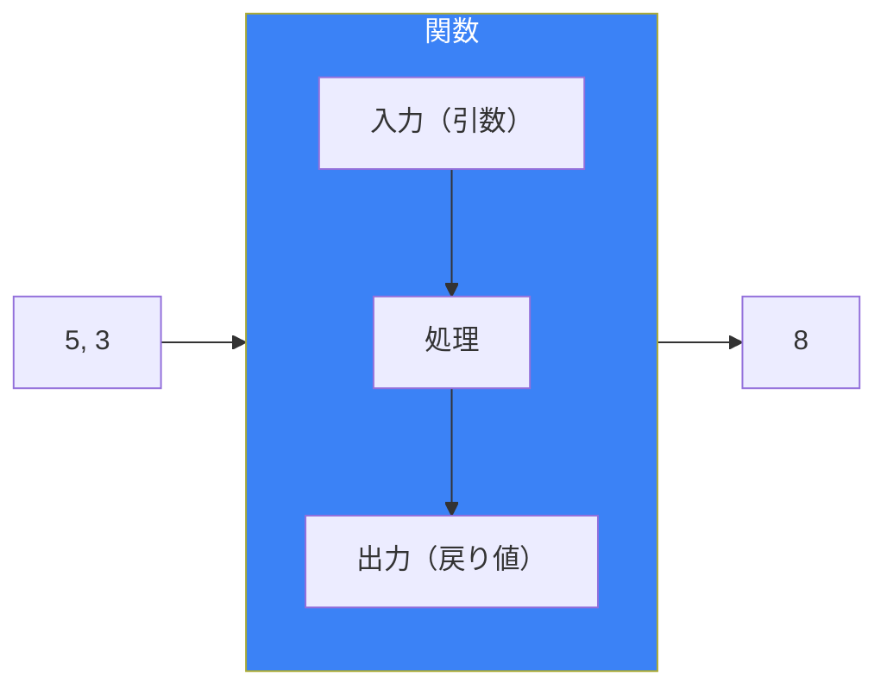
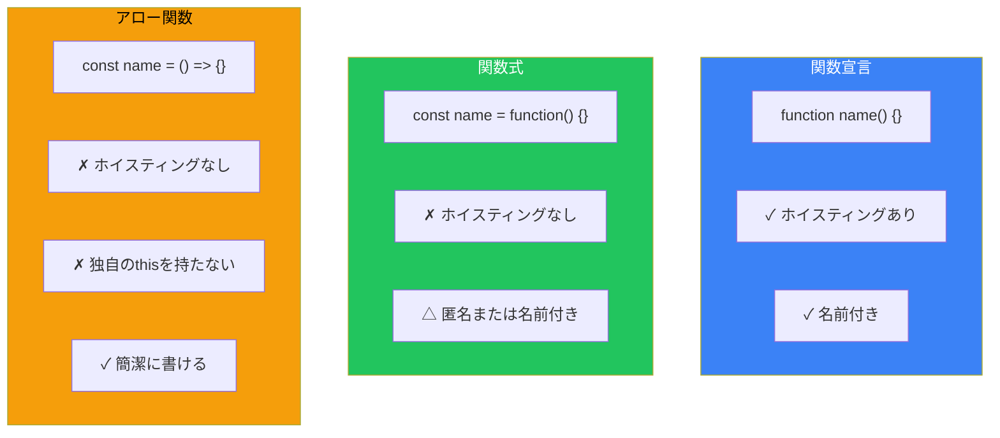
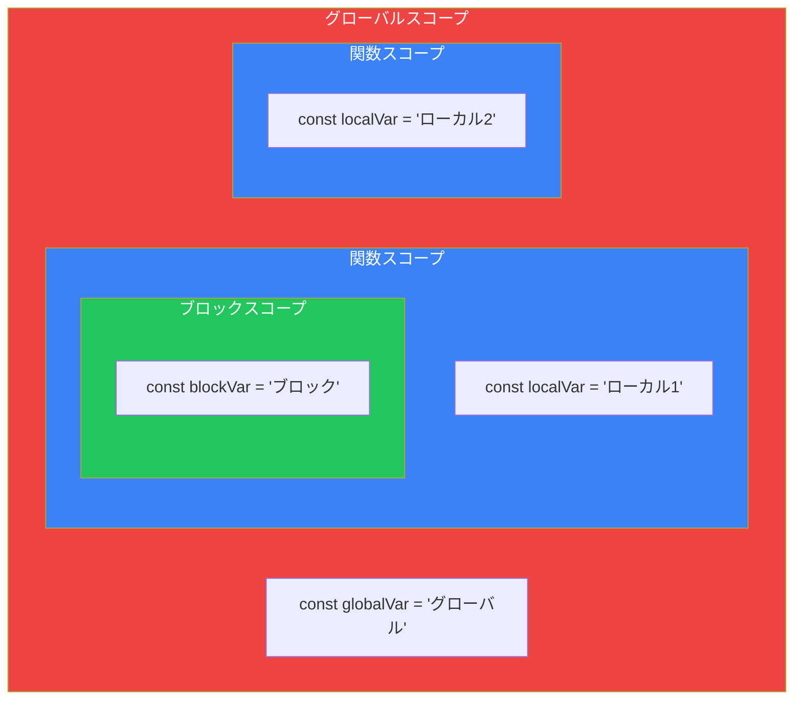
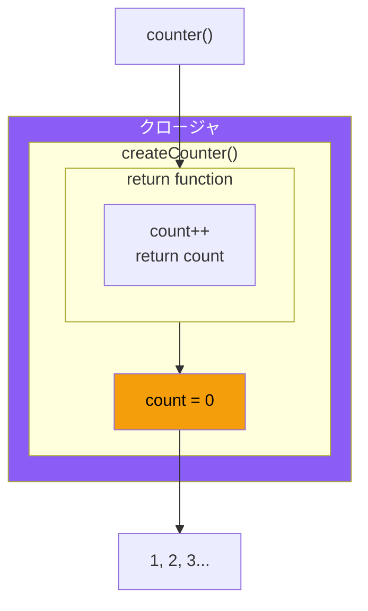
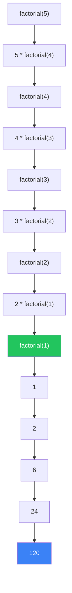

# Day 5: 関数

## 今日学ぶこと

- 関数の基本概念と定義方法
- 関数宣言と関数式の違い
- アロー関数の書き方
- 引数とデフォルト値
- 戻り値の使い方
- スコープとクロージャの基礎

---

## 関数とは

**関数**は、特定のタスクを実行するコードのまとまりです。一度定義すれば、何度でも呼び出して使えます。



### なぜ関数を使うのか

| メリット | 説明 |
|----------|------|
| 再利用性 | 同じコードを何度も書かなくて済む |
| 可読性 | コードに名前をつけて意図を明確にできる |
| 保守性 | 変更が必要な場合、1箇所だけ修正すれば良い |
| テスト | 小さな単位でテストできる |

---

## 関数の定義方法

JavaScriptには関数を定義する方法が複数あります。

### 関数宣言（Function Declaration）

最も基本的な方法です。

```javascript
function greet(name) {
    console.log(`こんにちは、${name}さん！`);
}

// 関数の呼び出し
greet("太郎");  // "こんにちは、太郎さん！"
greet("花子");  // "こんにちは、花子さん！"
```

### 関数式（Function Expression）

関数を変数に代入する方法です。

```javascript
const greet = function(name) {
    console.log(`こんにちは、${name}さん！`);
};

greet("太郎");  // "こんにちは、太郎さん！"
```

### アロー関数（Arrow Function）

ES6で導入された簡潔な書き方です。

```javascript
const greet = (name) => {
    console.log(`こんにちは、${name}さん！`);
};

greet("太郎");  // "こんにちは、太郎さん！"

// 1行で書ける場合は波括弧を省略可能
const square = (x) => x * x;
console.log(square(5));  // 25

// 引数が1つの場合は括弧も省略可能
const double = x => x * 2;
console.log(double(5));  // 10
```

### 定義方法の比較



| 特徴 | 関数宣言 | 関数式 | アロー関数 |
|------|----------|--------|------------|
| 構文 | `function name() {}` | `const name = function() {}` | `const name = () => {}` |
| ホイスティング | あり | なし | なし |
| this | 動的 | 動的 | 外側のthisを継承 |
| 推奨場面 | 通常の関数 | コールバック | 短いコールバック |

---

## 引数（パラメータ）

関数に渡す値を**引数**と呼びます。

### 基本的な引数

```javascript
function add(a, b) {
    return a + b;
}

console.log(add(5, 3));   // 8
console.log(add(10, 20)); // 30
```

### デフォルト引数

引数が渡されなかった場合のデフォルト値を設定できます。

```javascript
function greet(name = "ゲスト") {
    console.log(`こんにちは、${name}さん！`);
}

greet("太郎");  // "こんにちは、太郎さん！"
greet();        // "こんにちは、ゲストさん！"

// 複数のデフォルト引数
function createUser(name, age = 20, role = "user") {
    return { name, age, role };
}

console.log(createUser("太郎"));           // { name: "太郎", age: 20, role: "user" }
console.log(createUser("花子", 25));       // { name: "花子", age: 25, role: "user" }
console.log(createUser("管理者", 30, "admin")); // { name: "管理者", age: 30, role: "admin" }
```

### 残余引数（Rest Parameters）

任意の数の引数を配列として受け取れます。

```javascript
function sum(...numbers) {
    let total = 0;
    for (const num of numbers) {
        total += num;
    }
    return total;
}

console.log(sum(1, 2));           // 3
console.log(sum(1, 2, 3, 4, 5));  // 15

// 通常の引数と組み合わせ
function introduce(greeting, ...names) {
    for (const name of names) {
        console.log(`${greeting}、${name}さん！`);
    }
}

introduce("こんにちは", "太郎", "花子", "次郎");
// こんにちは、太郎さん！
// こんにちは、花子さん！
// こんにちは、次郎さん！
```

---

## 戻り値（Return Value）

関数は `return` 文で値を返すことができます。

```javascript
function add(a, b) {
    return a + b;
}

const result = add(5, 3);
console.log(result);  // 8

// 戻り値を直接使用
console.log(add(10, 20) * 2);  // 60
```

### 早期リターン

条件によって早めに関数を終了させることができます。

```javascript
function divide(a, b) {
    if (b === 0) {
        return "エラー：0で割ることはできません";
    }
    return a / b;
}

console.log(divide(10, 2));  // 5
console.log(divide(10, 0));  // "エラー：0で割ることはできません"

// ガード節パターン
function processUser(user) {
    if (!user) {
        return;  // undefinedを返す
    }
    if (!user.name) {
        return;
    }
    console.log(`処理中：${user.name}`);
}
```

### 複数の値を返す

オブジェクトや配列で複数の値を返せます。

```javascript
// オブジェクトで返す
function getMinMax(numbers) {
    return {
        min: Math.min(...numbers),
        max: Math.max(...numbers)
    };
}

const { min, max } = getMinMax([3, 1, 4, 1, 5]);
console.log(min, max);  // 1 5

// 配列で返す
function divideWithRemainder(a, b) {
    return [Math.floor(a / b), a % b];
}

const [quotient, remainder] = divideWithRemainder(10, 3);
console.log(quotient, remainder);  // 3 1
```

---

## スコープ

変数が参照できる範囲を**スコープ**と呼びます。

### グローバルスコープとローカルスコープ



```javascript
const globalVar = "グローバル";  // グローバルスコープ

function outer() {
    const outerVar = "外側";  // 関数スコープ

    function inner() {
        const innerVar = "内側";  // 関数スコープ
        console.log(globalVar);  // "グローバル"（アクセス可能）
        console.log(outerVar);   // "外側"（アクセス可能）
        console.log(innerVar);   // "内側"（アクセス可能）
    }

    inner();
    // console.log(innerVar);  // エラー！innerVarは見えない
}

outer();
// console.log(outerVar);  // エラー！outerVarは見えない
```

### ブロックスコープ

`let` と `const` はブロックスコープを持ちます。

```javascript
if (true) {
    const blockScoped = "ブロック内";
    var functionScoped = "関数/グローバル";
}

// console.log(blockScoped);  // エラー！
console.log(functionScoped);  // "関数/グローバル"（varは漏れる）
```

---

## クロージャ

関数が定義されたときのスコープを「記憶」する仕組みです。

```javascript
function createCounter() {
    let count = 0;  // この変数は関数の外からアクセスできない

    return function() {
        count++;
        return count;
    };
}

const counter = createCounter();
console.log(counter());  // 1
console.log(counter());  // 2
console.log(counter());  // 3

// 新しいカウンターは独立している
const counter2 = createCounter();
console.log(counter2());  // 1
```



### クロージャの実用例

```javascript
// プライベート変数
function createBankAccount(initialBalance) {
    let balance = initialBalance;

    return {
        deposit(amount) {
            balance += amount;
            return balance;
        },
        withdraw(amount) {
            if (amount > balance) {
                return "残高不足";
            }
            balance -= amount;
            return balance;
        },
        getBalance() {
            return balance;
        }
    };
}

const account = createBankAccount(1000);
console.log(account.getBalance());  // 1000
console.log(account.deposit(500));  // 1500
console.log(account.withdraw(200)); // 1300
// console.log(account.balance);    // undefined（直接アクセス不可）
```

---

## コールバック関数

他の関数に渡される関数を**コールバック関数**と呼びます。

```javascript
function processArray(arr, callback) {
    const result = [];
    for (const item of arr) {
        result.push(callback(item));
    }
    return result;
}

const numbers = [1, 2, 3, 4, 5];

// 関数を引数として渡す
const doubled = processArray(numbers, x => x * 2);
console.log(doubled);  // [2, 4, 6, 8, 10]

const squared = processArray(numbers, x => x * x);
console.log(squared);  // [1, 4, 9, 16, 25]
```

### 組み込みメソッドでのコールバック

```javascript
const numbers = [1, 2, 3, 4, 5];

// forEach：各要素に対して処理
numbers.forEach(num => console.log(num));

// map：各要素を変換
const doubled = numbers.map(num => num * 2);

// filter：条件に合う要素を抽出
const evens = numbers.filter(num => num % 2 === 0);

// find：条件に合う最初の要素
const found = numbers.find(num => num > 3);

// setTimeout：遅延実行
setTimeout(() => {
    console.log("3秒後に実行");
}, 3000);
```

---

## 即時実行関数式（IIFE）

定義と同時に実行される関数です。

```javascript
// IIFE（Immediately Invoked Function Expression）
(function() {
    const privateVar = "外からはアクセスできない";
    console.log("即時実行！");
})();

// アロー関数版
(() => {
    console.log("アロー関数のIIFE");
})();

// 戻り値を受け取る
const result = (function(a, b) {
    return a + b;
})(5, 3);

console.log(result);  // 8
```

---

## 再帰関数

自分自身を呼び出す関数です。

```javascript
// 階乗の計算
function factorial(n) {
    if (n <= 1) {
        return 1;
    }
    return n * factorial(n - 1);
}

console.log(factorial(5));  // 120 (5 * 4 * 3 * 2 * 1)

// フィボナッチ数列
function fibonacci(n) {
    if (n <= 1) {
        return n;
    }
    return fibonacci(n - 1) + fibonacci(n - 2);
}

console.log(fibonacci(10));  // 55
```



---

## まとめ

| 概念 | 説明 |
|------|------|
| 関数宣言 | `function name() {}` - ホイスティングあり |
| 関数式 | `const name = function() {}` - 変数に代入 |
| アロー関数 | `const name = () => {}` - 簡潔な構文 |
| デフォルト引数 | `function(a = 10)` - 省略時のデフォルト値 |
| 残余引数 | `function(...args)` - 可変長引数 |
| スコープ | 変数が参照できる範囲 |
| クロージャ | 外側のスコープを記憶する関数 |
| コールバック | 他の関数に渡される関数 |

### 重要ポイント

1. **アロー関数**は短いコールバックに便利
2. **デフォルト引数**で柔軟な関数を作れる
3. **早期リターン**でコードを読みやすく
4. **クロージャ**でプライベート変数を実現
5. **純粋関数**を心がける（副作用を最小限に）

---

## 練習問題

### 問題1: 基本的な関数
2つの数の平均を返す関数 `average(a, b)` を作成してください。

### 問題2: デフォルト引数
挨拶のメッセージを返す関数 `createGreeting(name, greeting = "こんにちは")` を作成してください。

### 問題3: アロー関数
配列の各要素を2乗した新しい配列を返すアロー関数を作成してください。

### 問題4: 高階関数
配列と関数を受け取り、各要素に関数を適用した結果を返す `myMap(arr, fn)` を作成してください。

### チャレンジ問題
クロージャを使って、以下の機能を持つカウンターを作成してください：
- `increment()`: 1増加
- `decrement()`: 1減少
- `getValue()`: 現在値を取得
- `reset()`: 0にリセット

---

## 参考リンク

- [MDN - 関数](https://developer.mozilla.org/ja/docs/Web/JavaScript/Guide/Functions)
- [MDN - アロー関数式](https://developer.mozilla.org/ja/docs/Web/JavaScript/Reference/Functions/Arrow_functions)
- [MDN - クロージャ](https://developer.mozilla.org/ja/docs/Web/JavaScript/Closures)
- [JavaScript.info - 関数](https://ja.javascript.info/function-basics)

---

**次回予告**: Day 6では「配列」について学びます。データのリストを効率的に管理し、map、filter、reduceなどの強力なメソッドをマスターしましょう！
