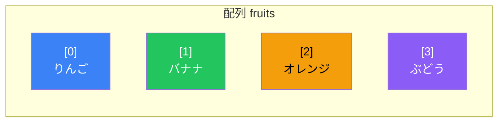
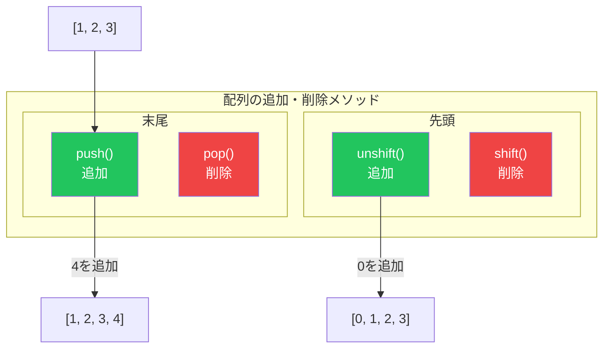
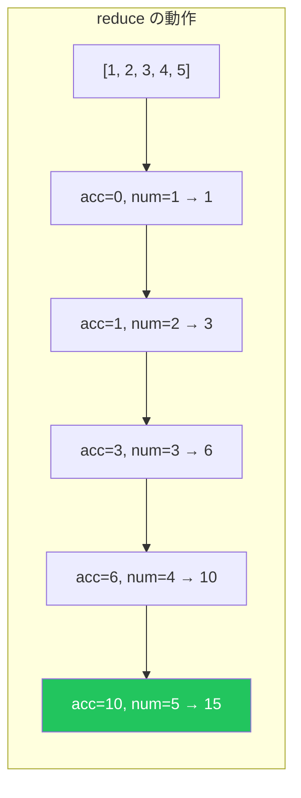

# Day 6: 配列

## 今日学ぶこと

- 配列の作成とアクセス方法
- 要素の追加・削除・変更
- 強力な配列メソッド（map, filter, reduce）
- 分割代入とスプレッド構文
- 配列の検索とソート

---

## 配列とは

**配列（Array）**は、複数の値を順序付けて格納するデータ構造です。各値は**要素（element）**と呼ばれ、**インデックス（index）**という番号で識別されます。



> **重要**: JavaScriptの配列インデックスは**0から始まります**。最初の要素は `[0]` です。

---

## 配列の作成

### 配列リテラル

最も一般的な方法です。

```javascript
// 空の配列
const empty = [];

// 値を持つ配列
const fruits = ["りんご", "バナナ", "オレンジ"];
const numbers = [1, 2, 3, 4, 5];
const mixed = [1, "hello", true, null];  // 異なる型を混在可能

// 多次元配列
const matrix = [
    [1, 2, 3],
    [4, 5, 6],
    [7, 8, 9]
];
```

### Array コンストラクタ

```javascript
// 長さを指定
const arr1 = new Array(5);  // 長さ5の空配列
console.log(arr1.length);   // 5

// 要素を指定
const arr2 = new Array(1, 2, 3);  // [1, 2, 3]

// Array.of()（ES6+）
const arr3 = Array.of(5);   // [5]（長さ1、要素が5）

// Array.from()（ES6+）
const arr4 = Array.from("hello");  // ["h", "e", "l", "l", "o"]
const arr5 = Array.from({ length: 5 }, (_, i) => i * 2);  // [0, 2, 4, 6, 8]
```

---

## 要素へのアクセス

### インデックスでアクセス

```javascript
const fruits = ["りんご", "バナナ", "オレンジ"];

console.log(fruits[0]);  // "りんご"
console.log(fruits[1]);  // "バナナ"
console.log(fruits[2]);  // "オレンジ"
console.log(fruits[3]);  // undefined（存在しない）

// 最後の要素
console.log(fruits[fruits.length - 1]);  // "オレンジ"

// ES2022: at()メソッド
console.log(fruits.at(-1));  // "オレンジ"（負のインデックス）
console.log(fruits.at(-2));  // "バナナ"
```

### 要素の変更

```javascript
const fruits = ["りんご", "バナナ", "オレンジ"];

fruits[1] = "メロン";
console.log(fruits);  // ["りんご", "メロン", "オレンジ"]

// 存在しないインデックスに代入
fruits[5] = "ぶどう";
console.log(fruits);  // ["りんご", "メロン", "オレンジ", empty × 2, "ぶどう"]
console.log(fruits.length);  // 6
```

---

## 配列の長さ

```javascript
const fruits = ["りんご", "バナナ", "オレンジ"];

console.log(fruits.length);  // 3

// 長さを変更（切り詰め）
fruits.length = 2;
console.log(fruits);  // ["りんご", "バナナ"]

// 長さを変更（拡張）
fruits.length = 5;
console.log(fruits);  // ["りんご", "バナナ", empty × 3]
```

---

## 要素の追加と削除

### 末尾の操作

```javascript
const fruits = ["りんご", "バナナ"];

// push(): 末尾に追加
fruits.push("オレンジ");
console.log(fruits);  // ["りんご", "バナナ", "オレンジ"]

// 複数追加
fruits.push("メロン", "ぶどう");
console.log(fruits);  // ["りんご", "バナナ", "オレンジ", "メロン", "ぶどう"]

// pop(): 末尾から削除
const last = fruits.pop();
console.log(last);    // "ぶどう"
console.log(fruits);  // ["りんご", "バナナ", "オレンジ", "メロン"]
```

### 先頭の操作

```javascript
const fruits = ["りんご", "バナナ"];

// unshift(): 先頭に追加
fruits.unshift("メロン");
console.log(fruits);  // ["メロン", "りんご", "バナナ"]

// shift(): 先頭から削除
const first = fruits.shift();
console.log(first);   // "メロン"
console.log(fruits);  // ["りんご", "バナナ"]
```



### splice(): 任意の位置で追加・削除

```javascript
const fruits = ["りんご", "バナナ", "オレンジ", "メロン"];

// 削除: splice(開始位置, 削除数)
const removed = fruits.splice(1, 2);
console.log(removed);  // ["バナナ", "オレンジ"]
console.log(fruits);   // ["りんご", "メロン"]

// 追加: splice(開始位置, 0, 追加する要素...)
fruits.splice(1, 0, "ぶどう", "いちご");
console.log(fruits);   // ["りんご", "ぶどう", "いちご", "メロン"]

// 置換: splice(開始位置, 削除数, 追加する要素...)
fruits.splice(1, 2, "キウイ");
console.log(fruits);   // ["りんご", "キウイ", "メロン"]
```

---

## 配列の結合とスライス

### concat(): 配列の結合

```javascript
const arr1 = [1, 2, 3];
const arr2 = [4, 5, 6];

const combined = arr1.concat(arr2);
console.log(combined);  // [1, 2, 3, 4, 5, 6]
console.log(arr1);      // [1, 2, 3]（元の配列は変更されない）

// 複数の配列を結合
const arr3 = [7, 8];
const all = arr1.concat(arr2, arr3);
console.log(all);  // [1, 2, 3, 4, 5, 6, 7, 8]
```

### slice(): 部分配列の取得

```javascript
const fruits = ["りんご", "バナナ", "オレンジ", "メロン", "ぶどう"];

// slice(開始, 終了) - 終了は含まない
console.log(fruits.slice(1, 3));   // ["バナナ", "オレンジ"]
console.log(fruits.slice(2));      // ["オレンジ", "メロン", "ぶどう"]
console.log(fruits.slice(-2));     // ["メロン", "ぶどう"]
console.log(fruits.slice(1, -1));  // ["バナナ", "オレンジ", "メロン"]

// 配列のコピー
const copy = fruits.slice();
console.log(copy);  // ["りんご", "バナナ", "オレンジ", "メロン", "ぶどう"]
```

---

## スプレッド構文

ES6で導入された強力な構文です。

```javascript
const arr1 = [1, 2, 3];
const arr2 = [4, 5, 6];

// 配列の結合
const combined = [...arr1, ...arr2];
console.log(combined);  // [1, 2, 3, 4, 5, 6]

// 配列のコピー（浅いコピー）
const copy = [...arr1];
console.log(copy);  // [1, 2, 3]

// 途中に要素を追加
const withMiddle = [...arr1, 10, 20, ...arr2];
console.log(withMiddle);  // [1, 2, 3, 10, 20, 4, 5, 6]

// 関数の引数として展開
const numbers = [5, 2, 8, 1, 9];
console.log(Math.max(...numbers));  // 9
```

---

## 分割代入

配列の要素を個別の変数に取り出せます。

```javascript
const fruits = ["りんご", "バナナ", "オレンジ"];

// 基本的な分割代入
const [first, second, third] = fruits;
console.log(first);   // "りんご"
console.log(second);  // "バナナ"
console.log(third);   // "オレンジ"

// 一部だけ取得
const [a, , c] = fruits;  // 2番目をスキップ
console.log(a, c);  // "りんご" "オレンジ"

// 残りを配列として取得
const [head, ...rest] = fruits;
console.log(head);  // "りんご"
console.log(rest);  // ["バナナ", "オレンジ"]

// デフォルト値
const [x, y, z, w = "デフォルト"] = fruits;
console.log(w);  // "デフォルト"

// 変数の交換
let a1 = 1, b1 = 2;
[a1, b1] = [b1, a1];
console.log(a1, b1);  // 2 1
```

---

## 高階関数（配列メソッド）

配列の各要素に対して関数を適用するメソッドです。

### forEach(): 各要素を処理

```javascript
const fruits = ["りんご", "バナナ", "オレンジ"];

fruits.forEach((fruit, index) => {
    console.log(`${index}: ${fruit}`);
});
// 0: りんご
// 1: バナナ
// 2: オレンジ
```

### map(): 変換して新しい配列を作成

```javascript
const numbers = [1, 2, 3, 4, 5];

const doubled = numbers.map(num => num * 2);
console.log(doubled);  // [2, 4, 6, 8, 10]

const squared = numbers.map(num => num ** 2);
console.log(squared);  // [1, 4, 9, 16, 25]

// オブジェクトの配列から特定のプロパティを抽出
const users = [
    { name: "太郎", age: 25 },
    { name: "花子", age: 30 },
    { name: "次郎", age: 20 }
];

const names = users.map(user => user.name);
console.log(names);  // ["太郎", "花子", "次郎"]
```

### filter(): 条件に合う要素を抽出

```javascript
const numbers = [1, 2, 3, 4, 5, 6, 7, 8, 9, 10];

const evens = numbers.filter(num => num % 2 === 0);
console.log(evens);  // [2, 4, 6, 8, 10]

const bigNumbers = numbers.filter(num => num > 5);
console.log(bigNumbers);  // [6, 7, 8, 9, 10]

// オブジェクトの配列をフィルタリング
const users = [
    { name: "太郎", age: 25, active: true },
    { name: "花子", age: 30, active: false },
    { name: "次郎", age: 20, active: true }
];

const activeUsers = users.filter(user => user.active);
console.log(activeUsers);
// [{ name: "太郎", age: 25, active: true }, { name: "次郎", age: 20, active: true }]
```

### reduce(): 配列を単一の値に集約

```javascript
const numbers = [1, 2, 3, 4, 5];

// 合計
const sum = numbers.reduce((acc, num) => acc + num, 0);
console.log(sum);  // 15

// 最大値
const max = numbers.reduce((acc, num) => (num > acc ? num : acc), numbers[0]);
console.log(max);  // 5

// オブジェクトへの変換
const fruits = ["りんご", "バナナ", "りんご", "オレンジ", "バナナ", "りんご"];

const count = fruits.reduce((acc, fruit) => {
    acc[fruit] = (acc[fruit] || 0) + 1;
    return acc;
}, {});

console.log(count);  // { りんご: 3, バナナ: 2, オレンジ: 1 }
```



### メソッドチェーン

```javascript
const users = [
    { name: "太郎", age: 25, score: 80 },
    { name: "花子", age: 30, score: 90 },
    { name: "次郎", age: 20, score: 70 },
    { name: "三郎", age: 35, score: 85 }
];

// 30歳以上のユーザーの平均スコア
const averageScore = users
    .filter(user => user.age >= 30)
    .map(user => user.score)
    .reduce((sum, score, _, arr) => sum + score / arr.length, 0);

console.log(averageScore);  // 87.5
```

---

## 検索メソッド

### find() / findIndex()

```javascript
const users = [
    { id: 1, name: "太郎" },
    { id: 2, name: "花子" },
    { id: 3, name: "次郎" }
];

// 条件に合う最初の要素
const user = users.find(u => u.id === 2);
console.log(user);  // { id: 2, name: "花子" }

// 条件に合う最初のインデックス
const index = users.findIndex(u => u.id === 2);
console.log(index);  // 1
```

### includes() / indexOf()

```javascript
const fruits = ["りんご", "バナナ", "オレンジ"];

// 存在確認
console.log(fruits.includes("バナナ"));  // true
console.log(fruits.includes("メロン"));  // false

// インデックス取得
console.log(fruits.indexOf("バナナ"));   // 1
console.log(fruits.indexOf("メロン"));   // -1（見つからない）
```

### some() / every()

```javascript
const numbers = [1, 2, 3, 4, 5];

// some: いずれかが条件を満たすか
console.log(numbers.some(num => num > 3));   // true
console.log(numbers.some(num => num > 10));  // false

// every: すべてが条件を満たすか
console.log(numbers.every(num => num > 0));  // true
console.log(numbers.every(num => num > 3));  // false
```

---

## ソート

### sort()

```javascript
// 文字列のソート
const fruits = ["オレンジ", "りんご", "バナナ"];
fruits.sort();
console.log(fruits);  // ["オレンジ", "バナナ", "りんご"]

// 数値のソート（注意が必要！）
const numbers = [10, 2, 30, 4, 5];
numbers.sort();  // 文字列としてソートされる
console.log(numbers);  // [10, 2, 30, 4, 5] → 間違い！

// 正しい数値ソート
numbers.sort((a, b) => a - b);
console.log(numbers);  // [2, 4, 5, 10, 30]

// 降順
numbers.sort((a, b) => b - a);
console.log(numbers);  // [30, 10, 5, 4, 2]
```

### reverse()

```javascript
const arr = [1, 2, 3, 4, 5];
arr.reverse();
console.log(arr);  // [5, 4, 3, 2, 1]
```

---

## 配列メソッドの分類

| メソッド | 破壊的 | 戻り値 | 用途 |
|----------|--------|--------|------|
| `push()` | ✅ | 新しい長さ | 末尾に追加 |
| `pop()` | ✅ | 削除した要素 | 末尾から削除 |
| `shift()` | ✅ | 削除した要素 | 先頭から削除 |
| `unshift()` | ✅ | 新しい長さ | 先頭に追加 |
| `splice()` | ✅ | 削除した要素 | 任意位置で追加/削除 |
| `sort()` | ✅ | ソート後の配列 | ソート |
| `reverse()` | ✅ | 反転後の配列 | 反転 |
| `concat()` | ❌ | 新しい配列 | 結合 |
| `slice()` | ❌ | 新しい配列 | 部分配列 |
| `map()` | ❌ | 新しい配列 | 変換 |
| `filter()` | ❌ | 新しい配列 | フィルタリング |
| `reduce()` | ❌ | 単一の値 | 集約 |

> **ベストプラクティス**: 元の配列を変更しない「非破壊的」メソッドを優先しましょう。

---

## まとめ

| 概念 | 説明 |
|------|------|
| 配列リテラル | `[]` で配列を作成 |
| インデックス | 0から始まる要素の位置 |
| スプレッド構文 | `...` で配列を展開 |
| 分割代入 | `[a, b] = arr` で要素を取り出す |
| map | 各要素を変換 |
| filter | 条件で絞り込み |
| reduce | 単一の値に集約 |

### 重要ポイント

1. **インデックスは0から**始まる
2. **スプレッド構文**で簡潔に配列操作
3. **map/filter/reduce**は非破壊的で安全
4. **sort()の数値ソート**には比較関数が必要
5. **メソッドチェーン**で複雑な処理を簡潔に

---

## 練習問題

### 問題1: 基本操作
配列 `[1, 2, 3]` に対して、先頭に0、末尾に4を追加して `[0, 1, 2, 3, 4]` を作成してください。

### 問題2: map
配列 `["hello", "world", "javascript"]` の各要素を大文字に変換してください。

### 問題3: filter
配列 `[1, 2, 3, 4, 5, 6, 7, 8, 9, 10]` から3の倍数だけを抽出してください。

### 問題4: reduce
配列 `[1, 2, 3, 4, 5]` の要素をすべて掛け合わせた結果（120）を求めてください。

### チャレンジ問題
以下のユーザーデータから、20歳以上のユーザーの名前を年齢順（昇順）で取得してください。

```javascript
const users = [
    { name: "太郎", age: 25 },
    { name: "花子", age: 18 },
    { name: "次郎", age: 30 },
    { name: "三郎", age: 15 },
    { name: "四郎", age: 22 }
];
```

---

## 参考リンク

- [MDN - Array](https://developer.mozilla.org/ja/docs/Web/JavaScript/Reference/Global_Objects/Array)
- [MDN - Array.prototype.map()](https://developer.mozilla.org/ja/docs/Web/JavaScript/Reference/Global_Objects/Array/map)
- [MDN - Array.prototype.filter()](https://developer.mozilla.org/ja/docs/Web/JavaScript/Reference/Global_Objects/Array/filter)
- [MDN - Array.prototype.reduce()](https://developer.mozilla.org/ja/docs/Web/JavaScript/Reference/Global_Objects/Array/reduce)
- [JavaScript.info - 配列](https://ja.javascript.info/array)

---

**次回予告**: Day 7では「オブジェクト」について学びます。キーと値のペアでデータを管理し、より複雑なデータ構造を扱えるようになりましょう！
