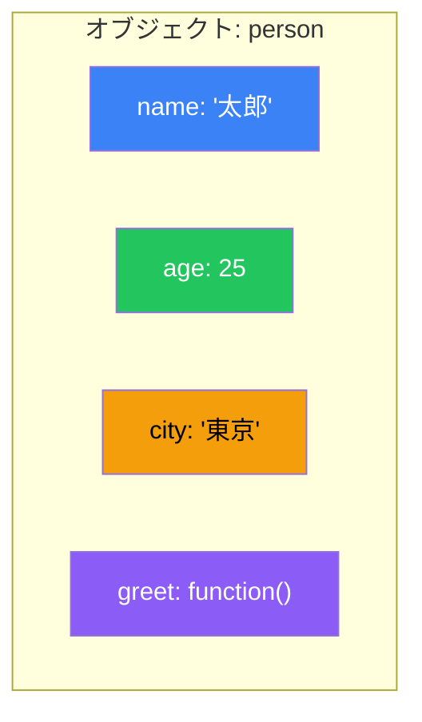

# Day 7: オブジェクト

## 今日学ぶこと

- オブジェクトの作成とプロパティへのアクセス
- プロパティの追加・変更・削除
- メソッドの定義と`this`キーワード
- オブジェクトの分割代入とスプレッド構文
- JSON形式でのデータ変換

---

## オブジェクトとは

**オブジェクト**は、関連するデータと機能をまとめたものです。**キー（名前）**と**値**のペアでデータを管理します。



---

## オブジェクトの作成

### オブジェクトリテラル

```javascript
// 空のオブジェクト
const empty = {};

// プロパティを持つオブジェクト
const person = {
    name: "太郎",
    age: 25,
    city: "東京"
};

// 入れ子のオブジェクト
const user = {
    name: "花子",
    address: {
        city: "大阪",
        zip: "530-0001"
    },
    hobbies: ["読書", "旅行"]
};
```

### プロパティの短縮記法（ES6+）

```javascript
const name = "太郎";
const age = 25;

// 従来の書き方
const person1 = { name: name, age: age };

// 短縮記法
const person2 = { name, age };
console.log(person2);  // { name: "太郎", age: 25 }
```

### 計算されたプロパティ名

```javascript
const key = "dynamicKey";

const obj = {
    [key]: "動的な値",
    [`${key}2`]: "別の値"
};

console.log(obj.dynamicKey);   // "動的な値"
console.log(obj.dynamicKey2);  // "別の値"
```

---

## プロパティへのアクセス

### ドット記法とブラケット記法

```javascript
const person = {
    name: "太郎",
    age: 25,
    "full-name": "山田太郎"  // ハイフンを含むキー
};

// ドット記法
console.log(person.name);  // "太郎"
console.log(person.age);   // 25

// ブラケット記法
console.log(person["name"]);       // "太郎"
console.log(person["full-name"]);  // "山田太郎"

// 変数でアクセス
const key = "age";
console.log(person[key]);  // 25
```

| 記法 | 構文 | 使用場面 |
|------|------|----------|
| ドット記法 | `obj.prop` | 通常のアクセス |
| ブラケット記法 | `obj["prop"]` | 変数や特殊文字を含むキー |

### オプショナルチェーン（?.）

存在しないプロパティにアクセスしてもエラーにならない安全な方法です。

```javascript
const user = {
    name: "太郎",
    address: {
        city: "東京"
    }
};

// 従来の方法
const zip1 = user.address && user.address.zip;

// オプショナルチェーン（ES2020+）
const zip2 = user.address?.zip;
console.log(zip2);  // undefined（エラーにならない）

// 深くネストしたアクセス
const country = user.address?.country?.name;
console.log(country);  // undefined

// メソッド呼び出しにも使える
const result = user.greet?.();  // undefinedを返す（エラーにならない）
```

---

## プロパティの追加・変更・削除

```javascript
const person = { name: "太郎" };

// 追加
person.age = 25;
person["city"] = "東京";
console.log(person);  // { name: "太郎", age: 25, city: "東京" }

// 変更
person.age = 26;
console.log(person.age);  // 26

// 削除
delete person.city;
console.log(person);  // { name: "太郎", age: 26 }

// プロパティの存在確認
console.log("name" in person);     // true
console.log("city" in person);     // false
console.log(person.hasOwnProperty("name"));  // true
```

---

## メソッド

オブジェクトのプロパティとして定義された関数を**メソッド**と呼びます。

```javascript
const person = {
    name: "太郎",
    age: 25,

    // メソッド（従来の書き方）
    greet: function() {
        console.log(`こんにちは、${this.name}です`);
    },

    // メソッド（短縮記法 - ES6+）
    introduce() {
        console.log(`${this.name}、${this.age}歳です`);
    }
};

person.greet();      // "こんにちは、太郎です"
person.introduce();  // "太郎、25歳です"
```

### this キーワード

`this`はメソッドを呼び出したオブジェクトを指します。

```javascript
const calculator = {
    value: 0,

    add(n) {
        this.value += n;
        return this;  // メソッドチェーン用
    },

    subtract(n) {
        this.value -= n;
        return this;
    },

    getResult() {
        return this.value;
    }
};

// メソッドチェーン
const result = calculator.add(10).add(5).subtract(3).getResult();
console.log(result);  // 12
```

> **注意**: アロー関数は独自の`this`を持たないため、メソッドには向きません。

---

## オブジェクトの反復処理

### for...in ループ

```javascript
const person = { name: "太郎", age: 25, city: "東京" };

for (const key in person) {
    console.log(`${key}: ${person[key]}`);
}
// name: 太郎
// age: 25
// city: 東京
```

### Object.keys() / Object.values() / Object.entries()

```javascript
const person = { name: "太郎", age: 25, city: "東京" };

// キーの配列
console.log(Object.keys(person));
// ["name", "age", "city"]

// 値の配列
console.log(Object.values(person));
// ["太郎", 25, "東京"]

// [キー, 値] ペアの配列
console.log(Object.entries(person));
// [["name", "太郎"], ["age", 25], ["city", "東京"]]

// entries を使った反復
for (const [key, value] of Object.entries(person)) {
    console.log(`${key}: ${value}`);
}
```

---

## オブジェクトの分割代入

```javascript
const person = {
    name: "太郎",
    age: 25,
    city: "東京",
    country: "日本"
};

// 基本的な分割代入
const { name, age } = person;
console.log(name, age);  // "太郎" 25

// 別名をつける
const { name: userName, age: userAge } = person;
console.log(userName, userAge);  // "太郎" 25

// デフォルト値
const { name: n, job = "未設定" } = person;
console.log(n, job);  // "太郎" "未設定"

// 残りを取得
const { name: personName, ...rest } = person;
console.log(personName);  // "太郎"
console.log(rest);        // { age: 25, city: "東京", country: "日本" }

// ネストしたオブジェクト
const user = {
    name: "花子",
    address: { city: "大阪", zip: "530-0001" }
};

const { address: { city, zip } } = user;
console.log(city, zip);  // "大阪" "530-0001"
```

### 関数の引数での分割代入

```javascript
function greet({ name, age }) {
    console.log(`${name}さん（${age}歳）、こんにちは！`);
}

const person = { name: "太郎", age: 25 };
greet(person);  // "太郎さん（25歳）、こんにちは！"

// デフォルト値付き
function createUser({ name, role = "user", active = true } = {}) {
    return { name, role, active };
}

console.log(createUser({ name: "太郎" }));
// { name: "太郎", role: "user", active: true }
```

---

## スプレッド構文

```javascript
const person = { name: "太郎", age: 25 };

// オブジェクトのコピー（浅いコピー）
const copy = { ...person };
console.log(copy);  // { name: "太郎", age: 25 }

// オブジェクトのマージ
const details = { city: "東京", job: "エンジニア" };
const fullPerson = { ...person, ...details };
console.log(fullPerson);
// { name: "太郎", age: 25, city: "東京", job: "エンジニア" }

// プロパティの上書き
const updated = { ...person, age: 26 };
console.log(updated);  // { name: "太郎", age: 26 }

// 条件付きプロパティ
const includeCity = true;
const obj = {
    name: "太郎",
    ...(includeCity && { city: "東京" })
};
```

---

## JSON

**JSON（JavaScript Object Notation）**は、データ交換用のテキスト形式です。

```javascript
const person = {
    name: "太郎",
    age: 25,
    hobbies: ["読書", "旅行"]
};

// オブジェクト → JSON文字列
const jsonString = JSON.stringify(person);
console.log(jsonString);
// '{"name":"太郎","age":25,"hobbies":["読書","旅行"]}'

// 整形して出力
console.log(JSON.stringify(person, null, 2));
/*
{
  "name": "太郎",
  "age": 25,
  "hobbies": [
    "読書",
    "旅行"
  ]
}
*/

// JSON文字列 → オブジェクト
const parsed = JSON.parse(jsonString);
console.log(parsed.name);  // "太郎"
```

| メソッド | 説明 |
|----------|------|
| `JSON.stringify()` | オブジェクト → JSON文字列 |
| `JSON.parse()` | JSON文字列 → オブジェクト |

---

## Object のユーティリティメソッド

```javascript
const person = { name: "太郎", age: 25 };

// オブジェクトのフリーズ（変更不可に）
Object.freeze(person);
person.age = 30;  // 無視される（strictモードではエラー）
console.log(person.age);  // 25

// シール（プロパティの追加/削除を禁止、値の変更は可能）
const obj = { x: 1 };
Object.seal(obj);
obj.x = 2;  // OK
obj.y = 3;  // 無視される

// オブジェクトの状態確認
console.log(Object.isFrozen(person));  // true
console.log(Object.isSealed(obj));     // true

// オブジェクトの作成（プロトタイプ指定）
const proto = { greet() { console.log("Hello"); } };
const child = Object.create(proto);
child.greet();  // "Hello"

// プロパティのコピー
const target = { a: 1 };
const source = { b: 2 };
Object.assign(target, source);
console.log(target);  // { a: 1, b: 2 }
```

---

## まとめ

| 概念 | 説明 |
|------|------|
| オブジェクトリテラル | `{}` でオブジェクトを作成 |
| ドット記法 | `obj.prop` でアクセス |
| ブラケット記法 | `obj["prop"]` で動的アクセス |
| オプショナルチェーン | `?.` で安全にアクセス |
| メソッド | オブジェクト内の関数 |
| this | メソッドを呼び出したオブジェクト |
| 分割代入 | `{ a, b } = obj` で取り出す |
| スプレッド構文 | `...` でオブジェクトを展開 |
| JSON | データ交換用のテキスト形式 |

### 重要ポイント

1. **ドット記法が基本**、変数や特殊文字ではブラケット記法
2. **オプショナルチェーン**でnull/undefinedエラーを防ぐ
3. **分割代入**でコードを簡潔に
4. **スプレッド構文**でイミュータブルな更新
5. **JSON**はAPI通信で必須

---

## 練習問題

### 問題1: オブジェクトの作成
名前、年齢、趣味（配列）を持つオブジェクトを作成し、趣味を1つ追加してください。

### 問題2: 分割代入
以下のオブジェクトから`title`と`author`を分割代入で取り出してください。
```javascript
const book = { title: "JavaScript入門", author: "山田太郎", year: 2024 };
```

### 問題3: スプレッド構文
`{ a: 1, b: 2 }` と `{ c: 3, d: 4 }` をマージして新しいオブジェクトを作成してください。

### 問題4: JSON
オブジェクト `{ name: "太郎", scores: [80, 90, 85] }` をJSON文字列に変換し、再びオブジェクトに戻してください。

### チャレンジ問題
以下のユーザーデータを、IDをキーとするオブジェクトに変換してください。
```javascript
const users = [
    { id: 1, name: "太郎" },
    { id: 2, name: "花子" },
    { id: 3, name: "次郎" }
];
// 期待結果: { 1: { id: 1, name: "太郎" }, 2: {...}, 3: {...} }
```

---

## 参考リンク

- [MDN - オブジェクト](https://developer.mozilla.org/ja/docs/Web/JavaScript/Reference/Global_Objects/Object)
- [MDN - JSON](https://developer.mozilla.org/ja/docs/Web/JavaScript/Reference/Global_Objects/JSON)
- [MDN - 分割代入](https://developer.mozilla.org/ja/docs/Web/JavaScript/Reference/Operators/Destructuring_assignment)
- [JavaScript.info - オブジェクト](https://ja.javascript.info/object)

---

**次回予告**: Day 8では「クラスとモジュール」について学びます。オブジェクト指向プログラミングの基礎と、コードを整理するためのモジュールシステムをマスターしましょう！
