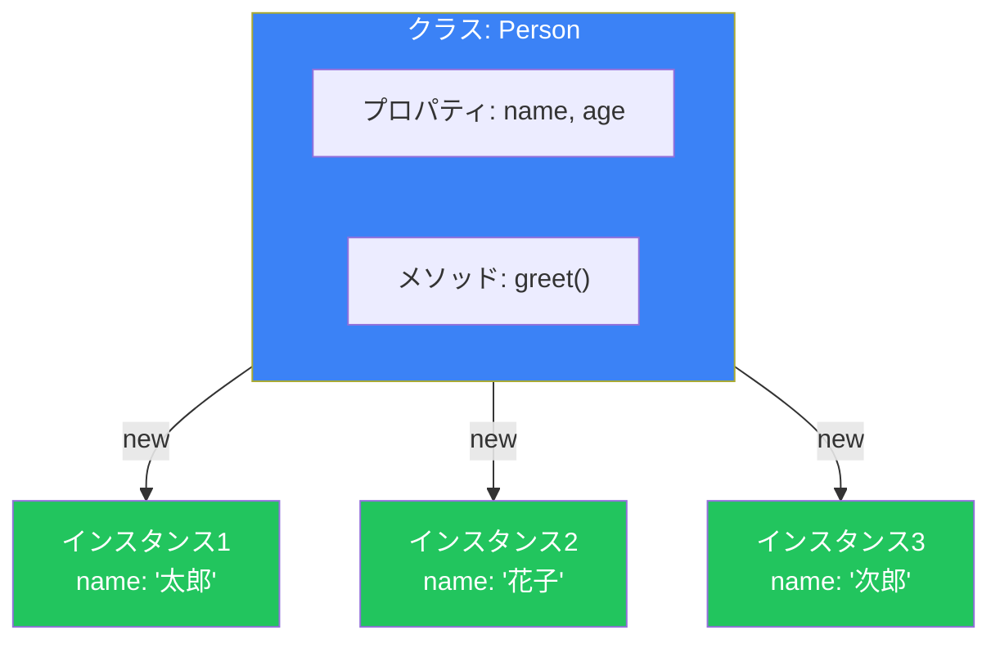
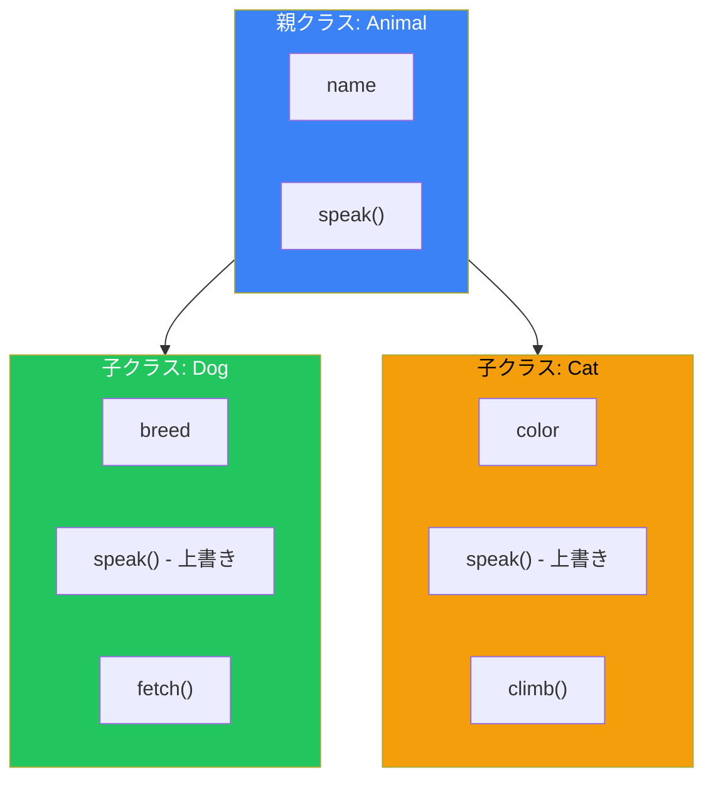
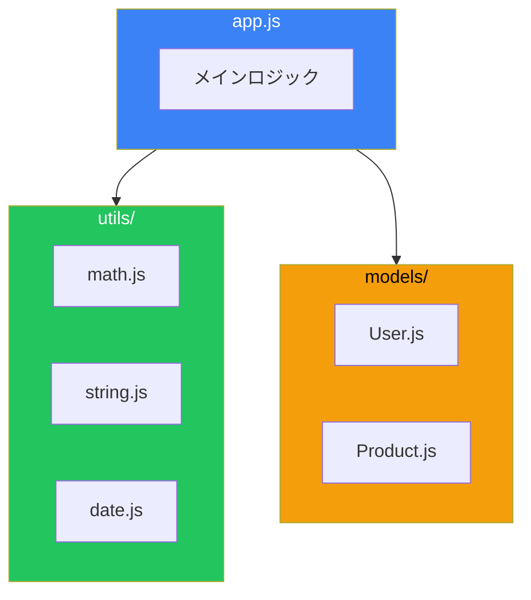

# Day 8: クラスとモジュール

## 今日学ぶこと

- クラスの基本構文とインスタンス化
- コンストラクタとメソッド
- 継承（extends、super）
- 静的メソッドとプロパティ
- モジュールシステム（import/export）

---

## クラスとは

**クラス**は、オブジェクトを作成するための設計図（テンプレート）です。ES6で導入されました。



---

## クラスの基本構文

```javascript
class Person {
    // コンストラクタ：インスタンス作成時に呼ばれる
    constructor(name, age) {
        this.name = name;
        this.age = age;
    }

    // メソッド
    greet() {
        console.log(`こんにちは、${this.name}です`);
    }

    // メソッド
    introduce() {
        console.log(`${this.name}、${this.age}歳です`);
    }
}

// インスタンスの作成
const person1 = new Person("太郎", 25);
const person2 = new Person("花子", 30);

person1.greet();      // "こんにちは、太郎です"
person2.introduce();  // "花子、30歳です"

console.log(person1.name);  // "太郎"
console.log(person2.age);   // 30
```

---

## ゲッターとセッター

プロパティへのアクセスをカスタマイズできます。

```javascript
class Rectangle {
    constructor(width, height) {
        this._width = width;
        this._height = height;
    }

    // ゲッター
    get width() {
        return this._width;
    }

    get height() {
        return this._height;
    }

    get area() {
        return this._width * this._height;
    }

    // セッター
    set width(value) {
        if (value <= 0) throw new Error("幅は正の数である必要があります");
        this._width = value;
    }

    set height(value) {
        if (value <= 0) throw new Error("高さは正の数である必要があります");
        this._height = value;
    }
}

const rect = new Rectangle(10, 5);
console.log(rect.area);    // 50（メソッド呼び出しではなくプロパティのようにアクセス）

rect.width = 20;
console.log(rect.area);    // 100

// rect.width = -5;        // Error: 幅は正の数である必要があります
```

---

## 静的メソッドとプロパティ

インスタンスではなく、クラス自体に属するメソッドとプロパティです。

```javascript
class MathUtils {
    static PI = 3.14159;

    static add(a, b) {
        return a + b;
    }

    static multiply(a, b) {
        return a * b;
    }

    static circleArea(radius) {
        return MathUtils.PI * radius ** 2;
    }
}

// クラスから直接呼び出す（インスタンス不要）
console.log(MathUtils.PI);           // 3.14159
console.log(MathUtils.add(5, 3));    // 8
console.log(MathUtils.circleArea(5)); // 78.53975

// インスタンスからはアクセスできない
// const utils = new MathUtils();
// utils.add(5, 3);  // Error
```

---

## 継承

既存のクラスを拡張して新しいクラスを作成します。



```javascript
// 親クラス
class Animal {
    constructor(name) {
        this.name = name;
    }

    speak() {
        console.log(`${this.name}が鳴きます`);
    }

    eat() {
        console.log(`${this.name}が食べます`);
    }
}

// 子クラス
class Dog extends Animal {
    constructor(name, breed) {
        super(name);  // 親クラスのコンストラクタを呼び出す
        this.breed = breed;
    }

    // メソッドのオーバーライド
    speak() {
        console.log(`${this.name}がワンワンと吠えます`);
    }

    // 新しいメソッド
    fetch() {
        console.log(`${this.name}がボールを取ってきます`);
    }
}

class Cat extends Animal {
    speak() {
        console.log(`${this.name}がニャーと鳴きます`);
    }

    climb() {
        console.log(`${this.name}が木に登ります`);
    }
}

const dog = new Dog("ポチ", "柴犬");
const cat = new Cat("タマ");

dog.speak();   // "ポチがワンワンと吠えます"
dog.eat();     // "ポチが食べます"（親から継承）
dog.fetch();   // "ポチがボールを取ってきます"

cat.speak();   // "タマがニャーと鳴きます"
cat.climb();   // "タマが木に登ります"

console.log(dog instanceof Dog);    // true
console.log(dog instanceof Animal); // true
```

### super キーワード

```javascript
class Employee {
    constructor(name, salary) {
        this.name = name;
        this.salary = salary;
    }

    getInfo() {
        return `${this.name}: ${this.salary}円`;
    }
}

class Manager extends Employee {
    constructor(name, salary, department) {
        super(name, salary);  // 親のコンストラクタを呼び出す
        this.department = department;
    }

    getInfo() {
        // 親のメソッドを呼び出して拡張
        return `${super.getInfo()} (${this.department}部門)`;
    }
}

const manager = new Manager("田中", 500000, "開発");
console.log(manager.getInfo());  // "田中: 500000円 (開発部門)"
```

---

## プライベートフィールド（ES2022+）

`#`で始まるフィールドはクラス外からアクセスできません。

```javascript
class BankAccount {
    #balance = 0;  // プライベートフィールド

    constructor(initialBalance) {
        this.#balance = initialBalance;
    }

    deposit(amount) {
        if (amount > 0) {
            this.#balance += amount;
        }
    }

    withdraw(amount) {
        if (amount > 0 && amount <= this.#balance) {
            this.#balance -= amount;
            return amount;
        }
        return 0;
    }

    getBalance() {
        return this.#balance;
    }
}

const account = new BankAccount(1000);
account.deposit(500);
console.log(account.getBalance());  // 1500

// console.log(account.#balance);  // SyntaxError: プライベートフィールド
```

---

## モジュールシステム

コードを複数のファイルに分割して管理します。

### エクスポート（export）

```javascript
// math.js

// 名前付きエクスポート
export const PI = 3.14159;

export function add(a, b) {
    return a + b;
}

export function multiply(a, b) {
    return a * b;
}

// クラスのエクスポート
export class Calculator {
    add(a, b) { return a + b; }
    subtract(a, b) { return a - b; }
}

// デフォルトエクスポート（1ファイル1つ）
export default function subtract(a, b) {
    return a - b;
}
```

### インポート（import）

```javascript
// app.js

// 名前付きインポート
import { PI, add, multiply } from './math.js';

console.log(PI);        // 3.14159
console.log(add(5, 3)); // 8

// 別名でインポート
import { add as sum } from './math.js';
console.log(sum(5, 3)); // 8

// すべてをインポート
import * as MathUtils from './math.js';
console.log(MathUtils.PI);
console.log(MathUtils.multiply(4, 5));

// デフォルトインポート
import subtract from './math.js';
console.log(subtract(10, 3)); // 7

// デフォルトと名前付きを同時に
import subtract, { PI, add } from './math.js';
```

### モジュールの構成例



---

## 実践例：ユーザー管理システム

```javascript
// User.js
export class User {
    #password;

    constructor(name, email, password) {
        this.name = name;
        this.email = email;
        this.#password = password;
    }

    checkPassword(input) {
        return this.#password === input;
    }

    getInfo() {
        return `${this.name} <${this.email}>`;
    }
}

// Admin.js
import { User } from './User.js';

export class Admin extends User {
    static permissions = ['create', 'read', 'update', 'delete'];

    constructor(name, email, password, department) {
        super(name, email, password);
        this.department = department;
        this.role = 'admin';
    }

    getInfo() {
        return `[Admin] ${super.getInfo()} - ${this.department}`;
    }

    hasPermission(action) {
        return Admin.permissions.includes(action);
    }
}

// app.js
import { User } from './User.js';
import { Admin } from './Admin.js';

const user = new User("太郎", "taro@example.com", "secret123");
const admin = new Admin("管理者", "admin@example.com", "admin456", "IT");

console.log(user.getInfo());   // "太郎 <taro@example.com>"
console.log(admin.getInfo());  // "[Admin] 管理者 <admin@example.com> - IT"
console.log(admin.hasPermission('delete'));  // true
```

---

## まとめ

| 概念 | 説明 |
|------|------|
| class | オブジェクトの設計図 |
| constructor | インスタンス作成時に呼ばれるメソッド |
| this | インスタンス自身を参照 |
| extends | クラスを継承 |
| super | 親クラスを参照 |
| static | クラス自体に属するメンバー |
| #field | プライベートフィールド |
| export | モジュールから公開 |
| import | モジュールを読み込む |

### 重要ポイント

1. **クラス**はオブジェクト生成のテンプレート
2. **継承**でコードを再利用
3. **super**で親クラスにアクセス
4. **プライベートフィールド**でカプセル化
5. **モジュール**でコードを整理

---

## 練習問題

### 問題1: 基本的なクラス
`name`と`price`を持つ`Product`クラスを作成し、`getInfo()`メソッドで「商品名: 価格円」を返すようにしてください。

### 問題2: 継承
`Product`クラスを継承して、`discount`プロパティを持つ`SaleProduct`クラスを作成してください。`getFinalPrice()`メソッドで割引後の価格を返すようにしてください。

### 問題3: 静的メソッド
`Counter`クラスを作成し、静的メソッド`getCount()`で作成されたインスタンスの総数を返すようにしてください。

### チャレンジ問題
図形を表す`Shape`クラス（抽象的な親クラス）と、`Circle`、`Rectangle`クラスを作成し、それぞれ`getArea()`メソッドで面積を計算できるようにしてください。

---

## 参考リンク

- [MDN - クラス](https://developer.mozilla.org/ja/docs/Web/JavaScript/Reference/Classes)
- [MDN - export](https://developer.mozilla.org/ja/docs/Web/JavaScript/Reference/Statements/export)
- [MDN - import](https://developer.mozilla.org/ja/docs/Web/JavaScript/Reference/Statements/import)
- [JavaScript.info - クラス](https://ja.javascript.info/classes)

---

**次回予告**: Day 9では「非同期処理」について学びます。Promise、async/awaitをマスターして、APIからデータを取得できるようになりましょう！
