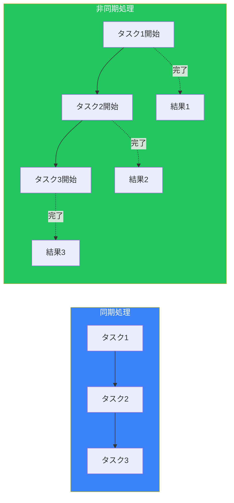
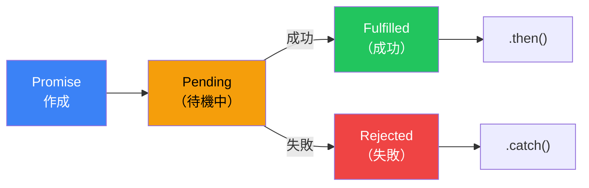
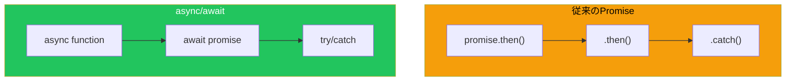

# Day 9: 非同期処理

## 今日学ぶこと

- 同期処理と非同期処理の違い
- コールバック関数
- Promise
- async/await
- fetch API でデータ取得

---

## 同期処理と非同期処理



### 同期処理（Synchronous）

コードが上から順番に、1つずつ実行されます。

```javascript
console.log("1番目");
console.log("2番目");
console.log("3番目");
// 出力: "1番目" → "2番目" → "3番目"
```

### 非同期処理（Asynchronous）

時間のかかる処理を待たずに、次の処理に進みます。

```javascript
console.log("1番目");

setTimeout(() => {
    console.log("2番目（1秒後）");
}, 1000);

console.log("3番目");

// 出力: "1番目" → "3番目" → "2番目（1秒後）"
```

### なぜ非同期処理が必要か？

| 処理の種類 | 例 | 理由 |
|-----------|-----|------|
| ネットワーク通信 | API呼び出し | サーバーからの応答を待つ |
| ファイル操作 | ファイル読み込み | ディスクアクセスに時間がかかる |
| タイマー | setTimeout | 指定時間後に実行 |
| ユーザー入力 | クリック、キー入力 | いつ発生するか分からない |

---

## コールバック関数

非同期処理の完了後に実行する関数を渡すパターンです。

```javascript
function fetchData(callback) {
    setTimeout(() => {
        const data = { name: "太郎", age: 25 };
        callback(data);  // データ取得後にコールバックを実行
    }, 1000);
}

fetchData((data) => {
    console.log("データを受信:", data);
});

console.log("データ取得中...");

// 出力:
// "データ取得中..."
// "データを受信:" { name: "太郎", age: 25 }
```

### コールバック地獄（Callback Hell）

コールバックをネストすると、コードが読みにくくなります。

```javascript
// コールバック地獄の例
getUser(userId, (user) => {
    getOrders(user.id, (orders) => {
        getOrderDetails(orders[0].id, (details) => {
            getProduct(details.productId, (product) => {
                console.log(product);
                // さらにネストが続く...
            });
        });
    });
});
```

この問題を解決するために、**Promise** が導入されました。

---

## Promise

**Promise** は「将来の値」を表すオブジェクトです。非同期処理の結果を扱う標準的な方法です。



### Promise の3つの状態

| 状態 | 説明 |
|------|------|
| pending | 処理中（まだ結果が決まっていない） |
| fulfilled | 成功（値が確定した） |
| rejected | 失敗（エラーが発生した） |

### Promise の作成

```javascript
const promise = new Promise((resolve, reject) => {
    // 非同期処理
    setTimeout(() => {
        const success = true;

        if (success) {
            resolve("成功しました！");  // 成功時
        } else {
            reject("エラーが発生しました");  // 失敗時
        }
    }, 1000);
});
```

### Promise の使用（then/catch）

```javascript
promise
    .then((result) => {
        console.log(result);  // "成功しました！"
    })
    .catch((error) => {
        console.log(error);   // エラー時に実行
    })
    .finally(() => {
        console.log("処理完了");  // 成功・失敗に関わらず実行
    });
```

### Promise チェーン

`.then()` を繋げて、順番に処理を実行できます。

```javascript
function fetchUser(id) {
    return new Promise((resolve) => {
        setTimeout(() => {
            resolve({ id, name: "太郎" });
        }, 500);
    });
}

function fetchOrders(userId) {
    return new Promise((resolve) => {
        setTimeout(() => {
            resolve([{ id: 1, item: "本" }, { id: 2, item: "ペン" }]);
        }, 500);
    });
}

// Promise チェーン
fetchUser(1)
    .then((user) => {
        console.log("ユーザー:", user);
        return fetchOrders(user.id);
    })
    .then((orders) => {
        console.log("注文:", orders);
    })
    .catch((error) => {
        console.log("エラー:", error);
    });
```

### Promise の静的メソッド

```javascript
// すべての Promise が成功したら
Promise.all([
    fetch("/api/users"),
    fetch("/api/products"),
    fetch("/api/orders")
])
.then(([users, products, orders]) => {
    console.log("全データ取得完了");
});

// 最初に完了した Promise の結果を取得
Promise.race([
    fetch("/api/fast"),
    fetch("/api/slow")
])
.then((result) => {
    console.log("最速の結果:", result);
});

// すべての Promise が完了したら（成功・失敗問わず）
Promise.allSettled([
    Promise.resolve("成功"),
    Promise.reject("失敗")
])
.then((results) => {
    console.log(results);
    // [{ status: "fulfilled", value: "成功" },
    //  { status: "rejected", reason: "失敗" }]
});
```

| メソッド | 説明 |
|----------|------|
| `Promise.all()` | すべて成功で完了、1つでも失敗で即reject |
| `Promise.race()` | 最初に完了したものの結果 |
| `Promise.allSettled()` | すべて完了を待つ（成功・失敗問わず） |
| `Promise.any()` | 最初に成功したものの結果 |

---

## async/await

**async/await** は Promise をより読みやすく書くための構文です（ES2017+）。



### 基本構文

```javascript
// async 関数の宣言
async function fetchData() {
    // await で Promise の完了を待つ
    const result = await somePromise;
    return result;
}

// アロー関数でも使える
const fetchData = async () => {
    const result = await somePromise;
    return result;
};
```

### Promise vs async/await

```javascript
// Promise を使った場合
function getData() {
    return fetch("/api/data")
        .then(response => response.json())
        .then(data => {
            console.log(data);
            return data;
        });
}

// async/await を使った場合
async function getData() {
    const response = await fetch("/api/data");
    const data = await response.json();
    console.log(data);
    return data;
}
```

### エラーハンドリング

```javascript
async function fetchUser(id) {
    try {
        const response = await fetch(`/api/users/${id}`);

        if (!response.ok) {
            throw new Error(`HTTP error: ${response.status}`);
        }

        const user = await response.json();
        return user;
    } catch (error) {
        console.error("ユーザー取得エラー:", error);
        throw error;  // 必要に応じて再スロー
    }
}
```

### 並列実行

```javascript
// 順次実行（遅い）
async function sequential() {
    const user = await fetchUser(1);      // 1秒待つ
    const orders = await fetchOrders(1);  // さらに1秒待つ
    // 合計: 2秒
}

// 並列実行（速い）
async function parallel() {
    const [user, orders] = await Promise.all([
        fetchUser(1),    // 同時に開始
        fetchOrders(1)   // 同時に開始
    ]);
    // 合計: 1秒（最も遅い処理の時間）
}
```

---

## fetch API

**fetch** はネットワークリクエストを行うための標準APIです。

### 基本的な GET リクエスト

```javascript
// シンプルなGETリクエスト
async function getUsers() {
    const response = await fetch("https://api.example.com/users");
    const users = await response.json();
    return users;
}

// 使用例
getUsers().then(users => console.log(users));
```

### POST リクエスト

```javascript
async function createUser(userData) {
    const response = await fetch("https://api.example.com/users", {
        method: "POST",
        headers: {
            "Content-Type": "application/json"
        },
        body: JSON.stringify(userData)
    });

    const newUser = await response.json();
    return newUser;
}

// 使用例
createUser({ name: "太郎", email: "taro@example.com" })
    .then(user => console.log("作成されたユーザー:", user));
```

### レスポンスの処理

```javascript
async function fetchData(url) {
    const response = await fetch(url);

    // ステータスコードの確認
    console.log(response.status);     // 200, 404, 500 など
    console.log(response.ok);         // true (200-299) or false
    console.log(response.statusText); // "OK", "Not Found" など

    // レスポンスヘッダー
    console.log(response.headers.get("Content-Type"));

    // ボディの取得（形式に応じて）
    const json = await response.json();    // JSON
    // const text = await response.text();  // テキスト
    // const blob = await response.blob();  // バイナリ

    return json;
}
```

### エラーハンドリング

```javascript
async function fetchWithErrorHandling(url) {
    try {
        const response = await fetch(url);

        // HTTP エラーのチェック
        if (!response.ok) {
            throw new Error(`HTTP error! status: ${response.status}`);
        }

        return await response.json();
    } catch (error) {
        if (error.name === "TypeError") {
            // ネットワークエラー
            console.error("ネットワークエラー:", error.message);
        } else {
            // その他のエラー
            console.error("エラー:", error.message);
        }
        throw error;
    }
}
```

---

## 実践例：APIからデータを取得して表示

```javascript
// ユーザー一覧を取得して表示
async function displayUsers() {
    const loadingEl = document.getElementById("loading");
    const userListEl = document.getElementById("user-list");
    const errorEl = document.getElementById("error");

    try {
        // ローディング表示
        loadingEl.textContent = "読み込み中...";
        errorEl.textContent = "";

        // データ取得
        const response = await fetch("https://jsonplaceholder.typicode.com/users");

        if (!response.ok) {
            throw new Error("ユーザー情報の取得に失敗しました");
        }

        const users = await response.json();

        // 表示
        userListEl.innerHTML = users
            .map(user => `
                <div class="user-card">
                    <h3>${user.name}</h3>
                    <p>Email: ${user.email}</p>
                    <p>City: ${user.address.city}</p>
                </div>
            `)
            .join("");

    } catch (error) {
        errorEl.textContent = `エラー: ${error.message}`;
    } finally {
        loadingEl.textContent = "";
    }
}

// ページ読み込み時に実行
displayUsers();
```

### 複数APIからデータを取得

```javascript
async function fetchDashboardData() {
    try {
        // 並列でデータ取得
        const [users, posts, comments] = await Promise.all([
            fetch("https://api.example.com/users").then(r => r.json()),
            fetch("https://api.example.com/posts").then(r => r.json()),
            fetch("https://api.example.com/comments").then(r => r.json())
        ]);

        return {
            totalUsers: users.length,
            totalPosts: posts.length,
            totalComments: comments.length
        };
    } catch (error) {
        console.error("ダッシュボードデータの取得に失敗:", error);
        throw error;
    }
}
```

---

## まとめ

| 概念 | 説明 |
|------|------|
| 同期処理 | 順番に1つずつ実行 |
| 非同期処理 | 待たずに次へ進む |
| コールバック | 完了後に呼ばれる関数 |
| Promise | 将来の値を表すオブジェクト |
| async/await | Promiseを同期的に書く構文 |
| fetch | HTTPリクエスト用API |

### 重要ポイント

1. **非同期処理**はUI応答性を保つために必須
2. **Promise**で非同期処理を扱いやすく
3. **async/await**で同期的な見た目に
4. **try/catch**でエラーハンドリング
5. **Promise.all**で並列実行を効率化

---

## 練習問題

### 問題1: Promise の作成
2秒後に「完了！」というメッセージを返すPromiseを作成してください。

### 問題2: async/await
以下のURLからデータを取得し、最初の5件のタイトルを表示する関数を作成してください。
```
https://jsonplaceholder.typicode.com/posts
```

### 問題3: エラーハンドリング
存在しないURLにアクセスした場合にエラーメッセージを表示する関数を作成してください。

### 問題4: 並列実行
以下の2つのURLから同時にデータを取得し、両方の結果を配列で返す関数を作成してください。
```
https://jsonplaceholder.typicode.com/users
https://jsonplaceholder.typicode.com/posts
```

### チャレンジ問題
検索機能を実装してください：テキスト入力に応じてAPIからユーザーを検索し、300ms のデバウンス処理を追加してください。

---

## 参考リンク

- [MDN - Promise](https://developer.mozilla.org/ja/docs/Web/JavaScript/Reference/Global_Objects/Promise)
- [MDN - async/await](https://developer.mozilla.org/ja/docs/Learn/JavaScript/Asynchronous/Promises)
- [MDN - fetch API](https://developer.mozilla.org/ja/docs/Web/API/Fetch_API)
- [JavaScript.info - Promise](https://ja.javascript.info/promise-basics)

---

**次回予告**: Day 10では「DOMとイベント」について学びます。Webページを動的に操作し、ユーザーインタラクションを実装する方法をマスターしましょう！
