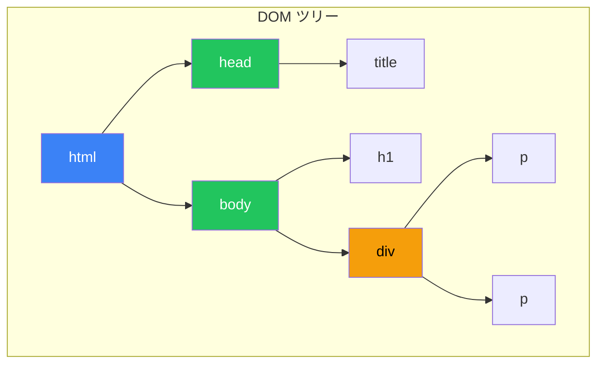
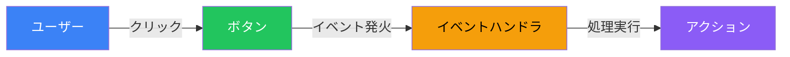
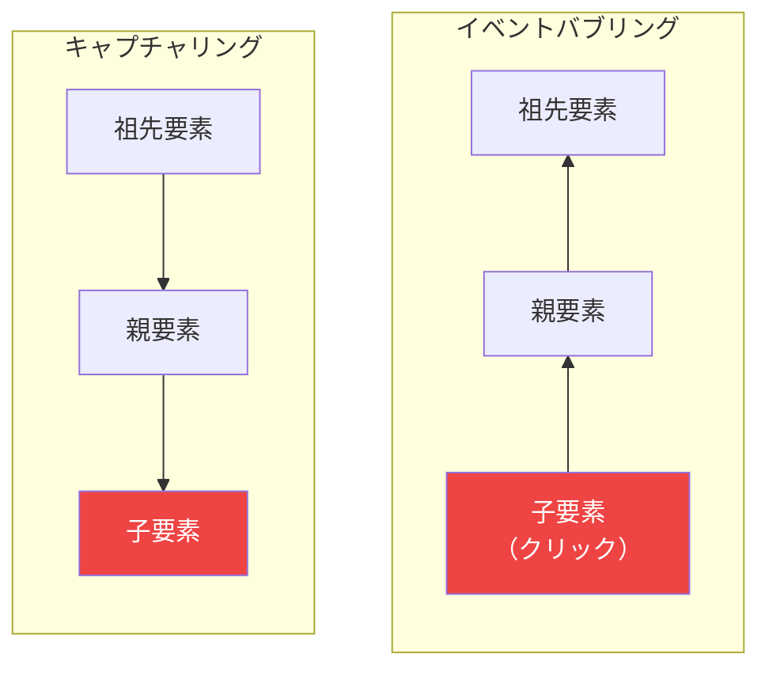

# Day 10: DOMとイベント

## 今日学ぶこと

- DOMとは何か
- 要素の取得（querySelector等）
- 要素の操作（内容・スタイル・属性）
- イベントリスナー
- 総合プロジェクト：Todoアプリ

---

## DOMとは

**DOM（Document Object Model）**は、HTMLをJavaScriptで操作するためのインターフェースです。



```html
<!DOCTYPE html>
<html>
  <head>
    <title>サンプル</title>
  </head>
  <body>
    <h1>見出し</h1>
    <div>
      <p>段落1</p>
      <p>段落2</p>
    </div>
  </body>
</html>
```

---

## 要素の取得

### querySelector / querySelectorAll

CSSセレクタで要素を取得する最も便利な方法です。

```javascript
// 単一の要素を取得
const header = document.querySelector("h1");
const firstButton = document.querySelector(".btn");
const submitBtn = document.querySelector("#submit-btn");

// 複数の要素を取得（NodeList）
const allParagraphs = document.querySelectorAll("p");
const allButtons = document.querySelectorAll(".btn");

// NodeList をループ
allParagraphs.forEach((p) => {
    console.log(p.textContent);
});
```

### その他の取得メソッド

```javascript
// IDで取得
const element = document.getElementById("my-id");

// クラス名で取得（HTMLCollection）
const elements = document.getElementsByClassName("my-class");

// タグ名で取得（HTMLCollection）
const paragraphs = document.getElementsByTagName("p");

// name属性で取得
const inputs = document.getElementsByName("email");
```

| メソッド | 戻り値 | 取得対象 |
|----------|--------|----------|
| `querySelector()` | Element | 最初の1つ |
| `querySelectorAll()` | NodeList | すべて |
| `getElementById()` | Element | ID指定 |
| `getElementsByClassName()` | HTMLCollection | クラス名 |
| `getElementsByTagName()` | HTMLCollection | タグ名 |

---

## 要素の内容操作

### textContent と innerHTML

```javascript
const div = document.querySelector("#content");

// テキストのみ（HTMLタグは無視）
console.log(div.textContent);
div.textContent = "新しいテキスト";

// HTMLを含む内容
console.log(div.innerHTML);
div.innerHTML = "<strong>太字</strong>のテキスト";

// HTMLを含めず安全に表示（XSS対策）
div.textContent = "<script>危険</script>";  // そのまま表示される
```

> **注意**: ユーザー入力を `innerHTML` に入れるとXSS攻撃のリスクがあります。`textContent` を使いましょう。

### 要素の作成と追加

```javascript
// 要素の作成
const newDiv = document.createElement("div");
newDiv.textContent = "新しい要素";
newDiv.className = "card";

// 親要素に追加
const container = document.querySelector("#container");
container.appendChild(newDiv);

// 特定の位置に挿入
const firstChild = container.firstElementChild;
container.insertBefore(newDiv, firstChild);  // 先頭に挿入

// モダンな追加メソッド
container.append(newDiv);        // 末尾に追加
container.prepend(newDiv);       // 先頭に追加
container.after(newDiv);         // 要素の後に追加
container.before(newDiv);        // 要素の前に追加
```

### 要素の削除

```javascript
// 要素を削除
const element = document.querySelector("#target");
element.remove();

// 親から子を削除（古い方法）
const parent = document.querySelector("#parent");
const child = document.querySelector("#child");
parent.removeChild(child);

// すべての子要素を削除
container.innerHTML = "";
// または
while (container.firstChild) {
    container.removeChild(container.firstChild);
}
```

---

## スタイルの操作

### style プロパティ

```javascript
const box = document.querySelector(".box");

// インラインスタイルを設定
box.style.backgroundColor = "blue";
box.style.color = "white";
box.style.padding = "20px";
box.style.borderRadius = "8px";

// スタイルを取得
console.log(box.style.backgroundColor);

// 複数のスタイルをまとめて設定
box.style.cssText = "background: red; color: white; padding: 10px;";
```

> **注意**: CSSのプロパティ名はキャメルケースに変換（`background-color` → `backgroundColor`）

### classList

クラスの追加・削除・切り替えを行います。

```javascript
const element = document.querySelector(".card");

// クラスの追加
element.classList.add("active");
element.classList.add("highlight", "important");  // 複数追加

// クラスの削除
element.classList.remove("active");

// クラスの切り替え（あれば削除、なければ追加）
element.classList.toggle("visible");

// クラスの存在確認
if (element.classList.contains("active")) {
    console.log("activeクラスがあります");
}

// クラスの置き換え
element.classList.replace("old-class", "new-class");
```

---

## 属性の操作

```javascript
const link = document.querySelector("a");

// 属性の取得
console.log(link.getAttribute("href"));
console.log(link.href);  // プロパティとしてもアクセス可能

// 属性の設定
link.setAttribute("href", "https://example.com");
link.setAttribute("target", "_blank");

// 属性の削除
link.removeAttribute("target");

// 属性の存在確認
if (link.hasAttribute("href")) {
    console.log("href属性があります");
}

// data-* カスタム属性
const card = document.querySelector(".card");
card.dataset.id = "123";        // data-id="123"
card.dataset.userName = "太郎"; // data-user-name="太郎"
console.log(card.dataset.id);   // "123"
```

---

## イベント

ユーザーの操作やブラウザの動作に反応するための仕組みです。



### イベントリスナーの登録

```javascript
const button = document.querySelector("#my-button");

// addEventListener（推奨）
button.addEventListener("click", () => {
    console.log("ボタンがクリックされました");
});

// 名前付き関数を使う場合
function handleClick() {
    console.log("クリック！");
}
button.addEventListener("click", handleClick);

// イベントリスナーの削除
button.removeEventListener("click", handleClick);
```

### よく使うイベント

| イベント | 発火タイミング |
|----------|----------------|
| `click` | クリック時 |
| `dblclick` | ダブルクリック時 |
| `mouseenter` | マウスが要素に入った時 |
| `mouseleave` | マウスが要素から出た時 |
| `keydown` | キーを押した時 |
| `keyup` | キーを離した時 |
| `submit` | フォーム送信時 |
| `change` | 値が変更された時 |
| `input` | 入力時（リアルタイム） |
| `focus` | フォーカス時 |
| `blur` | フォーカスが外れた時 |
| `load` | 読み込み完了時 |
| `DOMContentLoaded` | DOM構築完了時 |

### イベントオブジェクト

```javascript
button.addEventListener("click", (event) => {
    // イベント情報
    console.log(event.type);        // "click"
    console.log(event.target);      // クリックされた要素
    console.log(event.currentTarget); // リスナーが登録された要素

    // マウス位置
    console.log(event.clientX, event.clientY);  // ビューポート基準
    console.log(event.pageX, event.pageY);      // ページ基準

    // デフォルト動作を防ぐ
    event.preventDefault();

    // イベントの伝播を止める
    event.stopPropagation();
});

// キーボードイベント
document.addEventListener("keydown", (event) => {
    console.log(event.key);     // "Enter", "a", "Escape" など
    console.log(event.code);    // "Enter", "KeyA", "Escape" など
    console.log(event.shiftKey); // Shiftキーが押されているか
    console.log(event.ctrlKey);  // Ctrlキーが押されているか
});
```

### イベントの伝播（バブリング）



```javascript
// イベントバブリング（デフォルト）
parent.addEventListener("click", () => {
    console.log("親がクリックされました");
});

child.addEventListener("click", (event) => {
    console.log("子がクリックされました");
    event.stopPropagation();  // バブリングを止める
});

// キャプチャリングフェーズで処理
parent.addEventListener("click", () => {
    console.log("親（キャプチャ）");
}, true);  // 第3引数にtrue
```

### イベント委譲（Event Delegation）

親要素に1つのリスナーを登録し、子要素のイベントを処理します。

```javascript
// 悪い例：各ボタンにリスナーを登録
document.querySelectorAll(".delete-btn").forEach(btn => {
    btn.addEventListener("click", () => {
        // 削除処理
    });
});

// 良い例：親要素に委譲
const list = document.querySelector("#task-list");
list.addEventListener("click", (event) => {
    // クリックされた要素を確認
    if (event.target.classList.contains("delete-btn")) {
        const taskItem = event.target.closest(".task-item");
        taskItem.remove();
    }
});
```

---

## フォームの操作

```javascript
const form = document.querySelector("#my-form");
const nameInput = document.querySelector("#name");
const emailInput = document.querySelector("#email");

// 値の取得と設定
console.log(nameInput.value);
nameInput.value = "太郎";

// フォーム送信イベント
form.addEventListener("submit", (event) => {
    event.preventDefault();  // ページリロードを防ぐ

    const formData = {
        name: nameInput.value,
        email: emailInput.value
    };

    console.log("送信データ:", formData);

    // フォームをリセット
    form.reset();
});

// リアルタイム入力検証
nameInput.addEventListener("input", (event) => {
    const value = event.target.value;
    if (value.length < 3) {
        nameInput.classList.add("error");
    } else {
        nameInput.classList.remove("error");
    }
});
```

---

## 総合プロジェクト：Todoアプリ

学んだことを活かして、シンプルなTodoアプリを作りましょう。

### HTML

```html
<!DOCTYPE html>
<html lang="ja">
<head>
    <meta charset="UTF-8">
    <meta name="viewport" content="width=device-width, initial-scale=1.0">
    <title>Todo App</title>
    <style>
        * { box-sizing: border-box; }
        body { font-family: sans-serif; max-width: 500px; margin: 50px auto; padding: 20px; }
        h1 { text-align: center; color: #333; }
        .input-area { display: flex; gap: 10px; margin-bottom: 20px; }
        #todo-input { flex: 1; padding: 10px; font-size: 16px; border: 2px solid #ddd; border-radius: 5px; }
        #add-btn { padding: 10px 20px; background: #3b82f6; color: white; border: none; border-radius: 5px; cursor: pointer; }
        #add-btn:hover { background: #2563eb; }
        #todo-list { list-style: none; padding: 0; }
        .todo-item { display: flex; align-items: center; padding: 15px; margin-bottom: 10px; background: #f9f9f9; border-radius: 5px; }
        .todo-item.completed { opacity: 0.6; }
        .todo-item.completed .todo-text { text-decoration: line-through; }
        .todo-text { flex: 1; margin-left: 10px; }
        .delete-btn { padding: 5px 10px; background: #ef4444; color: white; border: none; border-radius: 3px; cursor: pointer; }
        .filter-area { display: flex; gap: 10px; margin-bottom: 20px; }
        .filter-btn { padding: 5px 15px; border: 1px solid #ddd; background: white; border-radius: 3px; cursor: pointer; }
        .filter-btn.active { background: #3b82f6; color: white; border-color: #3b82f6; }
    </style>
</head>
<body>
    <h1>Todo App</h1>

    <div class="input-area">
        <input type="text" id="todo-input" placeholder="タスクを入力...">
        <button id="add-btn">追加</button>
    </div>

    <div class="filter-area">
        <button class="filter-btn active" data-filter="all">すべて</button>
        <button class="filter-btn" data-filter="active">未完了</button>
        <button class="filter-btn" data-filter="completed">完了</button>
    </div>

    <ul id="todo-list"></ul>

    <script src="app.js"></script>
</body>
</html>
```

### JavaScript (app.js)

```javascript
// DOM要素の取得
const todoInput = document.querySelector("#todo-input");
const addBtn = document.querySelector("#add-btn");
const todoList = document.querySelector("#todo-list");
const filterArea = document.querySelector(".filter-area");

// Todoリストのデータ
let todos = JSON.parse(localStorage.getItem("todos")) || [];
let currentFilter = "all";

// Todoを保存
function saveTodos() {
    localStorage.setItem("todos", JSON.stringify(todos));
}

// Todoをレンダリング
function renderTodos() {
    // フィルタリング
    const filteredTodos = todos.filter(todo => {
        if (currentFilter === "active") return !todo.completed;
        if (currentFilter === "completed") return todo.completed;
        return true;
    });

    // HTMLを生成
    todoList.innerHTML = filteredTodos
        .map(todo => `
            <li class="todo-item ${todo.completed ? "completed" : ""}" data-id="${todo.id}">
                <input type="checkbox" ${todo.completed ? "checked" : ""}>
                <span class="todo-text">${escapeHtml(todo.text)}</span>
                <button class="delete-btn">削除</button>
            </li>
        `)
        .join("");
}

// HTMLエスケープ（XSS対策）
function escapeHtml(text) {
    const div = document.createElement("div");
    div.textContent = text;
    return div.innerHTML;
}

// Todoを追加
function addTodo() {
    const text = todoInput.value.trim();
    if (!text) return;

    const todo = {
        id: Date.now(),
        text,
        completed: false
    };

    todos.push(todo);
    saveTodos();
    renderTodos();
    todoInput.value = "";
    todoInput.focus();
}

// イベントリスナー：追加ボタン
addBtn.addEventListener("click", addTodo);

// イベントリスナー：Enterキー
todoInput.addEventListener("keypress", (event) => {
    if (event.key === "Enter") {
        addTodo();
    }
});

// イベントリスナー：リスト操作（イベント委譲）
todoList.addEventListener("click", (event) => {
    const todoItem = event.target.closest(".todo-item");
    if (!todoItem) return;

    const id = Number(todoItem.dataset.id);

    // チェックボックス
    if (event.target.type === "checkbox") {
        const todo = todos.find(t => t.id === id);
        if (todo) {
            todo.completed = event.target.checked;
            saveTodos();
            renderTodos();
        }
    }

    // 削除ボタン
    if (event.target.classList.contains("delete-btn")) {
        todos = todos.filter(t => t.id !== id);
        saveTodos();
        renderTodos();
    }
});

// イベントリスナー：フィルター
filterArea.addEventListener("click", (event) => {
    if (!event.target.classList.contains("filter-btn")) return;

    // アクティブ状態を更新
    document.querySelectorAll(".filter-btn").forEach(btn => {
        btn.classList.remove("active");
    });
    event.target.classList.add("active");

    // フィルターを適用
    currentFilter = event.target.dataset.filter;
    renderTodos();
});

// 初期レンダリング
renderTodos();
```

### 完成した機能

- タスクの追加（ボタン/Enterキー）
- タスクの完了/未完了切り替え
- タスクの削除
- フィルター（すべて/未完了/完了）
- ローカルストレージでデータ永続化
- XSS対策（HTMLエスケープ）

---

## まとめ

| 概念 | 説明 |
|------|------|
| DOM | HTMLを操作するインターフェース |
| querySelector | CSSセレクタで要素を取得 |
| textContent | テキストの取得・設定 |
| innerHTML | HTMLを含む内容の取得・設定 |
| classList | クラスの追加・削除・切り替え |
| addEventListener | イベントリスナーの登録 |
| event.preventDefault | デフォルト動作を防ぐ |
| イベント委譲 | 親要素でイベントを処理 |

### 重要ポイント

1. **querySelector**が最も便利な要素取得方法
2. **textContent**でXSS対策
3. **classList**でクラス操作
4. **イベント委譲**で効率的なイベント処理
5. **localStorage**でデータ永続化

---

## 練習問題

### 問題1: 要素の取得と操作
ボタンをクリックすると、段落のテキストが「変更されました！」に変わるコードを書いてください。

### 問題2: スタイルの切り替え
ボタンをクリックするたびに、ボックスの背景色が赤と青で切り替わるコードを書いてください。

### 問題3: 入力検証
テキスト入力欄に5文字未満の場合は赤枠、5文字以上の場合は緑枠にするコードを書いてください。

### チャレンジ問題
Todoアプリに「編集機能」を追加してください。タスクをダブルクリックすると編集モードになり、テキストを変更できるようにしてください。

---

## 参考リンク

- [MDN - DOM入門](https://developer.mozilla.org/ja/docs/Web/API/Document_Object_Model/Introduction)
- [MDN - イベント](https://developer.mozilla.org/ja/docs/Learn/JavaScript/Building_blocks/Events)
- [MDN - querySelector](https://developer.mozilla.org/ja/docs/Web/API/Document/querySelector)
- [JavaScript.info - ドキュメント](https://ja.javascript.info/document)

---

## おめでとうございます！

10日間のJavaScript学習が完了しました！

### 学んだこと

1. **Day 1**: JavaScriptの基礎と開発環境
2. **Day 2**: 値と変数
3. **Day 3**: 演算子と式
4. **Day 4**: 条件分岐とループ
5. **Day 5**: 関数
6. **Day 6**: 配列
7. **Day 7**: オブジェクト
8. **Day 8**: クラスとモジュール
9. **Day 9**: 非同期処理
10. **Day 10**: DOMとイベント

### 次のステップ

- フレームワーク（React, Vue, Angular）を学ぶ
- Node.jsでサーバーサイド開発
- TypeScriptで型安全なコードを書く
- 実際のプロジェクトを作って経験を積む

学習を続けて、素晴らしいWebアプリケーションを作りましょう！
