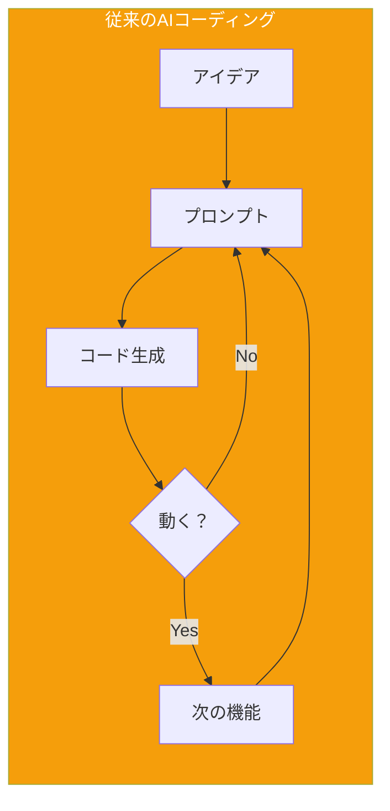
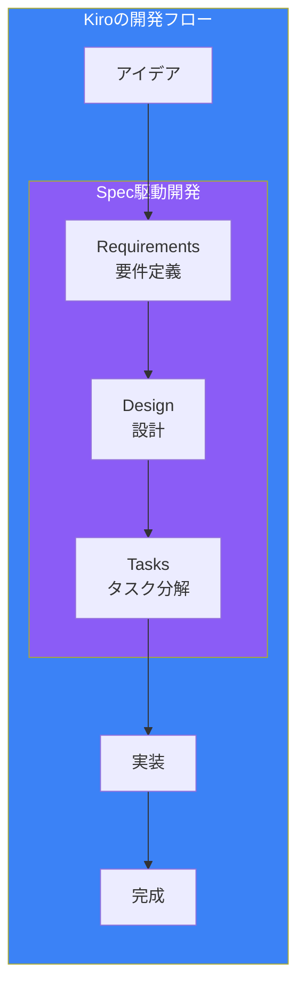
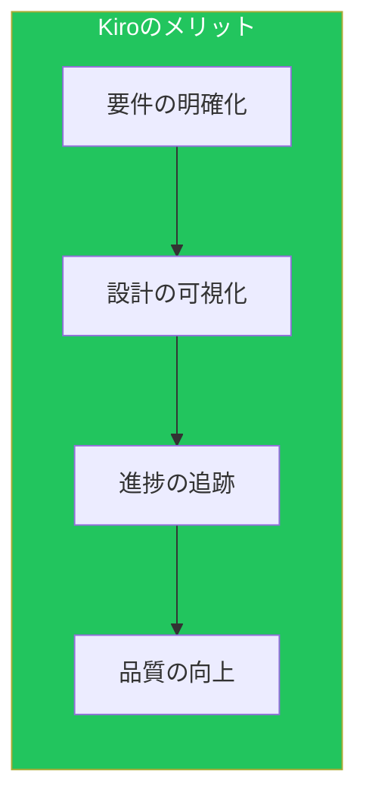
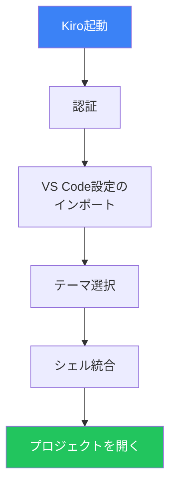
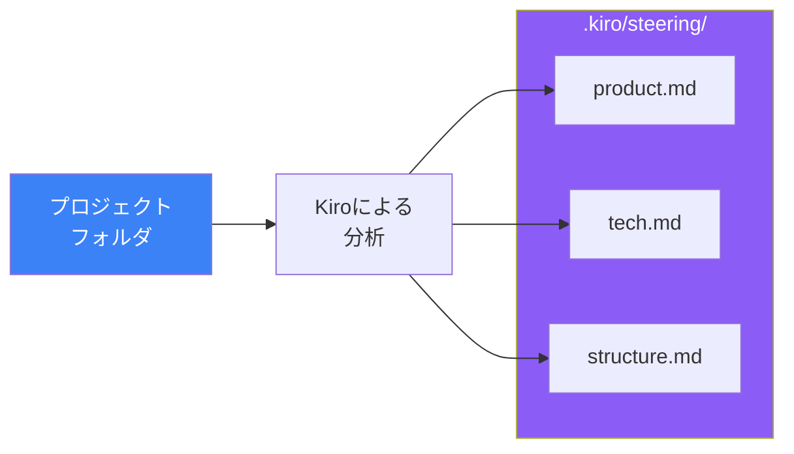

# Day 1: Kiroの世界へようこそ

## 今日学ぶこと

- Kiroとは何か、なぜ今注目されているのか
- 従来のAIコーディングツールとの違い
- Kiroのインストールと初期設定
- 最初のプロジェクトの開始

---

## AIコーディングツールの進化

2023年以降、AIコーディングツールは急速に進化してきました。GitHub Copilot、Cursor、Claude Codeなど、多くのツールが登場し、開発者の生産性を大きく向上させています。

しかし、これらのツールには共通の課題がありました。

### 「Vibe Coding」の問題



従来のAIコーディングでは、開発者はプロンプトを何度も調整し、生成されたコードが動くまで試行錯誤を繰り返します。これは「Vibe Coding」（雰囲気でコーディング）と呼ばれ、以下の問題を引き起こします：

| 問題 | 影響 |
|------|------|
| **要件の曖昧さ** | 何を作りたいのか明確でないまま開発が進む |
| **ドキュメントの欠如** | 後から見返しても何をしたか分からない |
| **テストの不足** | 要件が不明確なのでテストも書けない |
| **技術的負債** | 場当たり的なコードが積み重なる |

---

## Kiroとは

Kiroは、2025年7月にAWSが発表した**エージェント型IDE**です。VS Codeと同じCode OSSをベースにしており、VS Codeユーザーなら違和感なく使い始められます。



### Kiroの特徴

Kiroが他のAIコーディングツールと異なる点は、**Spec駆動開発（Spec-Driven Development）** というアプローチです。

| 特徴 | 説明 |
|------|------|
| **Spec駆動開発** | コードを書く前に要件・設計・タスクを明確化 |
| **エージェント型** | AIがファイル操作やコマンド実行を自律的に行う |
| **Steering** | プロジェクトのルールや規約をAIに教える |
| **Hooks** | ファイル変更などのイベントで自動処理を実行 |
| **MCP連携** | 外部ツールやデータソースとの統合 |
| **Powers** | 専門知識をワンクリックで追加 |

### なぜKiroを使うのか



1. **要件の明確化**: 曖昧なアイデアを構造化された要件に変換
2. **設計の可視化**: アーキテクチャやデータフローを文書化
3. **進捗の追跡**: タスクの完了状況をリアルタイムで確認
4. **品質の向上**: 要件からテストまでのトレーサビリティ

---

## Kiroのインストール

### 動作環境

Kiroは以下の環境で動作します：

- **macOS**: Apple Silicon (M1以降) / Intel
- **Windows**: Windows 10以降
- **Linux**: 主要なディストリビューション

### インストール手順

1. **ダウンロード**: [kiro.dev](https://kiro.dev) にアクセスし、お使いのOSに対応したインストーラーをダウンロード

2. **インストール**: ダウンロードしたファイルを開き、画面の指示に従ってインストール

3. **起動**: Kiro IDEを起動

### 初期設定

Kiroを初めて起動すると、いくつかの設定画面が表示されます。



#### 1. 認証

ソーシャルログイン（Google、GitHubなど）またはAWS認証でログインします。AWSアカウントは必須ではありません。

#### 2. VS Code設定のインポート（オプション）

既存のVS Codeユーザーは、設定や拡張機能をインポートできます。これにより、キーバインドやテーマなどの設定を引き継げます。

#### 3. テーマ選択

ダークテーマまたはライトテーマを選択します。

#### 4. シェル統合

Kiroがターミナルコマンドを実行できるように、シェル統合を許可します。これにより、AIがビルドやテストの実行、ファイル操作などを行えるようになります。

---

## 最初のプロジェクト

Kiroのセットアップが完了したら、最初のプロジェクトを開いてみましょう。

### プロジェクトを開く

3つの方法でプロジェクトを開けます：

1. **メニューから**: File > Open Folder でプロジェクトフォルダを選択
2. **ドラッグ＆ドロップ**: プロジェクトフォルダをKiroにドラッグ
3. **コマンドラインから**: `kiro .` を実行

### Kiroパネルを開く

アクティビティバー（左端のアイコン列）にある**Kiroゴーストアイコン**をクリックすると、Kiroパネルが開きます。

```
┌─────────────────────────────────────────────┐
│ [Ghost Icon]  Kiro                          │
├─────────────────────────────────────────────┤
│                                             │
│  💬 Chat                                    │
│  📋 Specs                                   │
│  🔧 Hooks                                   │
│  🔌 MCP                                     │
│                                             │
└─────────────────────────────────────────────┘
```

### Steeringドキュメントの生成

Kiroの最も重要な最初のステップは、**Steeringドキュメント**の生成です。

Kiroパネルから「**Generate Steering Docs**」を選択すると、Kiroがプロジェクトを分析し、以下の3つのファイルを `.kiro/steering/` フォルダに生成します：

| ファイル | 内容 |
|----------|------|
| **product.md** | プロダクトの目的、ユーザー、機能 |
| **tech.md** | 使用技術、フレームワーク、ライブラリ |
| **structure.md** | ディレクトリ構造、命名規則、アーキテクチャ |



これらのファイルがあることで、Kiroはあなたのプロジェクトの文脈を理解し、より適切な提案やコード生成を行えるようになります。

---

## Kiroの画面構成

Kiroの画面はVS Codeとほぼ同じですが、いくつかの追加機能があります。

```
┌─────────────────────────────────────────────────────────────────┐
│ Menu Bar                                                        │
├────┬────────────────────────────────────────────────────────────┤
│    │                                                            │
│ A  │                                                            │
│ c  │              Editor Area                                   │
│ t  │                                                            │
│ i  │                                                            │
│ v  ├────────────────────────────────────────────────────────────┤
│ i  │                                                            │
│ t  │              Panel (Terminal, Output, etc.)                │
│ y  │                                                            │
│    │                                                            │
│ B  ├────────────────────────────────────────────────────────────┤
│ a  │              Kiro Chat Panel                               │
│ r  │                                                            │
│    │                                                            │
└────┴────────────────────────────────────────────────────────────┘
```

### 主要な要素

| 要素 | 説明 |
|------|------|
| **Activity Bar** | 左端のアイコン列。Kiroゴーストアイコンがここにある |
| **Editor Area** | コードを編集するメインエリア |
| **Panel** | ターミナル、出力、問題などを表示 |
| **Kiro Chat Panel** | AIとの対話、Specs、Hooks、MCPの管理 |

---

## 料金プラン

Kiroは2025年10月にパブリックプレビューを終了し、有料プランに移行しました。

| プラン | 月額 | エージェント操作 |
|--------|------|------------------|
| **Free** | $0 | 50回/月 |
| **Pro** | $19 | 1,000回/月 |
| **Pro+** | $39 | 3,000回/月 |

> **注意**: 料金プランは変更される可能性があります。最新情報は [kiro.dev](https://kiro.dev) で確認してください。

---

## まとめ

| 概念 | 説明 |
|------|------|
| **Kiro** | AWSが提供するエージェント型IDE |
| **Spec駆動開発** | 要件→設計→タスクの順序で開発を進める手法 |
| **Steering** | プロジェクトの情報をAIに伝えるドキュメント |
| **Code OSS** | VS Codeと同じ基盤なので移行しやすい |

### 重要ポイント

1. **Kiroは「考えてから作る」を支援するツール**
2. **VS Codeからの移行はスムーズ**
3. **Steeringドキュメントがプロジェクト理解の基盤**
4. **無料プランで試せる**

---

## 練習問題

### 問題1: 基本

Kiroをインストールし、既存のプロジェクト（または新規フォルダ）を開いてください。Steeringドキュメントを生成し、3つのファイル（product.md、tech.md、structure.md）の内容を確認してください。

### 問題2: 応用

生成されたSteeringドキュメントを確認し、プロジェクトの説明が正確かどうか確認してください。不正確な部分があれば、手動で修正してみてください。

### チャレンジ問題

VS CodeからKiroに移行する場合、どのような設定や拡張機能が引き継がれるか調べてください。また、Kiro固有の機能（Specs、Hooks、MCP）について、それぞれどのような場面で役立ちそうか考えてみてください。

---

## 参考リンク

- [Kiro公式サイト](https://kiro.dev/)
- [Kiro Documentation](https://kiro.dev/docs/)
- [Getting Started](https://kiro.dev/docs/getting-started/)
- [Introducing Kiro Blog Post](https://kiro.dev/blog/introducing-kiro/)

---

**次回予告**: Day 2では「ステアリングファイル」について詳しく学びます。プロジェクトのルールや規約をKiroに教える方法を理解しましょう。
