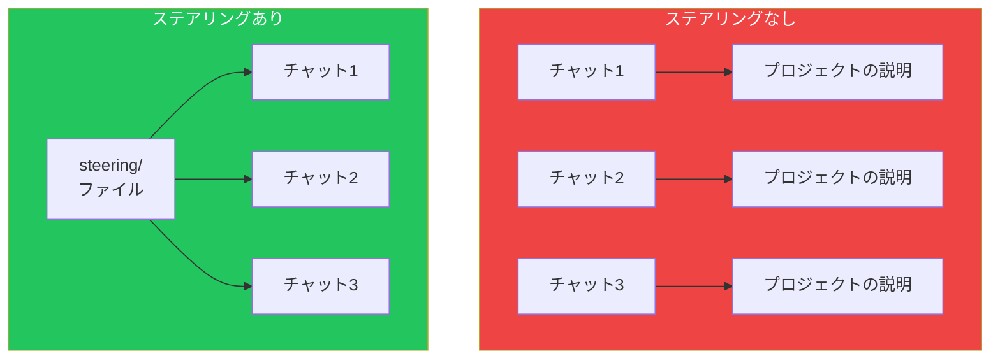
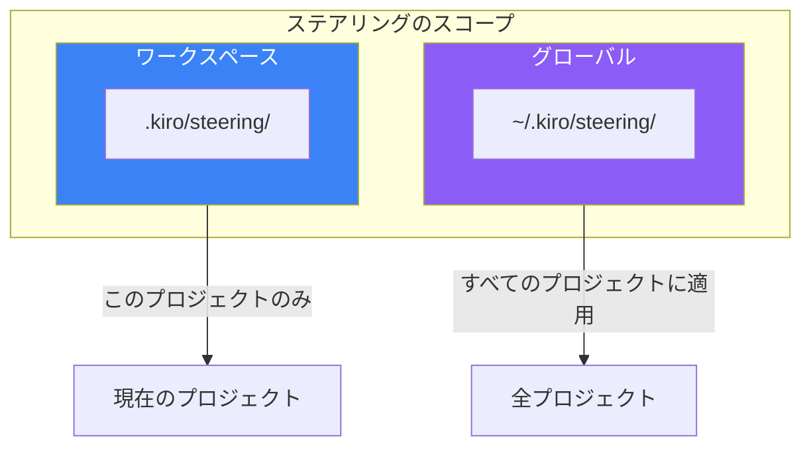
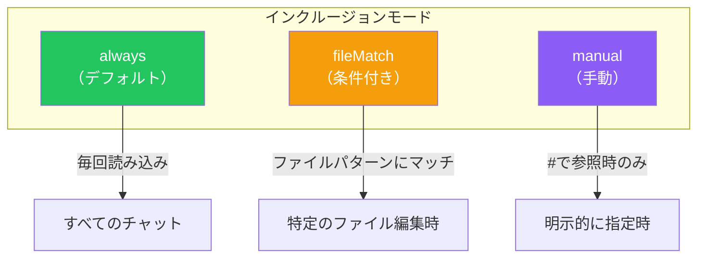

# Day 2: ステアリングファイル

## 今日学ぶこと

- ステアリングファイルの役割と重要性
- 3つの基本ファイル（product.md、tech.md、structure.md）
- インクルージョンモードの設定
- カスタムステアリングファイルの作成

---

## ステアリングファイルとは

ステアリング（Steering）とは、**Kiroに永続的な知識を与えるMarkdownファイル**です。毎回のチャットで同じことを説明する代わりに、ステアリングファイルにプロジェクトの規約やパターンを記述しておくことで、Kiroは一貫してそれに従います。



### なぜステアリングが重要か

| 課題 | ステアリングによる解決 |
|------|----------------------|
| **毎回同じ説明が必要** | 一度書けば自動的に適用 |
| **一貫性のない提案** | プロジェクトルールに従った提案 |
| **コンテキストの欠如** | 常にプロジェクト情報を保持 |
| **チーム間の差異** | 共有ルールで統一 |

---

## ステアリングファイルの種類

Kiroは2つのスコープでステアリングファイルをサポートします。



### ワークスペースステアリング

プロジェクトルートの `.kiro/steering/` フォルダに配置します。そのプロジェクト固有のパターンや規約を定義します。

```
my-project/
├── .kiro/
│   └── steering/
│       ├── product.md
│       ├── tech.md
│       └── structure.md
└── src/
```

### グローバルステアリング

ホームディレクトリの `~/.kiro/steering/` フォルダに配置します。すべてのワークスペースに適用される共通ルールを定義します。

```
~/.kiro/
└── steering/
    ├── coding-style.md
    └── commit-conventions.md
```

> **優先順位**: ワークスペースとグローバルで指示が競合する場合、**ワークスペースが優先**されます。これにより、グローバルなルールを設定しつつ、特定のプロジェクトで上書きできます。

---

## 基本の3ファイル

Kiroが自動生成する3つの基本ステアリングファイルを詳しく見ていきましょう。

### 1. product.md

プロダクトの目的、ユーザー、機能を定義します。技術的な決定をビジネス目標に合わせるために使用されます。

```markdown
# Product Overview

## Purpose
タスク管理アプリケーション。個人とチームがタスクを整理し、
進捗を追跡できるようにする。

## Target Users
- 個人ユーザー：日々のタスク管理
- 小規模チーム：プロジェクト管理

## Key Features
- タスクの作成、編集、削除
- 優先度とラベルによる分類
- 期限の設定とリマインダー
- チームメンバーへの割り当て

## Business Goals
- ユーザー獲得の増加
- 有料プランへのコンバージョン向上
```

### 2. tech.md

使用技術、フレームワーク、技術的制約を文書化します。一貫したツール選択のために使用されます。

```markdown
# Technical Stack

## Frontend
- Framework: Next.js 15
- Language: TypeScript 5
- UI Library: React 19
- Styling: Tailwind CSS 4

## Backend
- Runtime: Node.js 22
- API: tRPC
- Database: PostgreSQL 16
- ORM: Prisma

## Infrastructure
- Hosting: Vercel
- Database Hosting: Supabase
- CI/CD: GitHub Actions

## Constraints
- IE11サポート不要
- モバイルファースト設計
- Core Web Vitals基準を満たすこと
```

### 3. structure.md

ファイル構成、命名規則、アーキテクチャパターンを概説します。

```markdown
# Project Structure

## Directory Layout
```
src/
├── app/           # Next.js App Router
├── components/    # 再利用可能なUIコンポーネント
│   ├── ui/       # 基本UIコンポーネント
│   └── features/ # 機能別コンポーネント
├── lib/          # ユーティリティ関数
├── hooks/        # カスタムフック
├── types/        # TypeScript型定義
└── styles/       # グローバルスタイル
```

## Naming Conventions
- コンポーネント: PascalCase (例: TaskCard.tsx)
- フック: camelCase with 'use' prefix (例: useTaskList.ts)
- ユーティリティ: camelCase (例: formatDate.ts)
- 型定義: PascalCase with suffix (例: TaskType.ts)

## Architecture Patterns
- コンポーネントはContainer/Presentationalパターン
- 状態管理はReact Context + useReducer
- API呼び出しはtRPCのhooksを使用
```

---

## インクルージョンモード

ステアリングファイルがいつKiroのコンテキストに読み込まれるかを制御できます。ファイルの先頭にYAMLフロントマターを追加します。



### always（デフォルト）

すべてのKiroインタラクションで自動的に読み込まれます。コア標準など、常に適用すべきルールに使用します。

```yaml
---
inclusion: always
---

# Coding Standards

すべてのコードは以下に従うこと：
- ESLint設定に従う
- Prettierでフォーマット
- コメントは英語で記述
```

### fileMatch（条件付き）

特定のファイルパターンにマッチするときだけ読み込まれます。ドメイン固有のガイダンスに使用します。

```yaml
---
inclusion:
  fileMatch:
    - "**/*.tsx"
    - "**/*.jsx"
---

# React Component Guidelines

## Component Structure
- propsはinterfaceで定義
- デフォルトエクスポートを使用
- スタイルはTailwind classを使用

## Hooks
- カスタムフックはuseプレフィックス
- 副作用はuseEffectで管理
```

### manual（手動）

チャットで `#steering-file-name` 構文を使って明示的に参照したときだけ読み込まれます。

```yaml
---
inclusion: manual
---

# Database Migration Guide

このガイドはデータベースマイグレーション作業時に参照してください。
チャットで #database-migration と入力して使用します。
```

---

## カスタムステアリングファイルの作成

自動生成される3ファイル以外にも、プロジェクト固有のルールを追加できます。

### 作成方法

1. Kiroパネルで「+」ボタンをクリック
2. または `.kiro/steering/` フォルダに直接ファイルを作成

### おすすめのカスタムファイル

| ファイル名 | 内容 |
|-----------|------|
| **api-conventions.md** | REST/GraphQL APIの設計ルール |
| **testing-guidelines.md** | テストの書き方、カバレッジ要件 |
| **security-rules.md** | セキュリティ要件、禁止事項 |
| **git-workflow.md** | ブランチ戦略、コミットメッセージ |
| **error-handling.md** | エラー処理のパターン |

### 例: testing-guidelines.md

```yaml
---
inclusion:
  fileMatch:
    - "**/*.test.ts"
    - "**/*.test.tsx"
    - "**/*.spec.ts"
---

# Testing Guidelines

## Test Structure
- Arrange-Act-Assert パターンを使用
- テストは独立して実行可能であること
- モックは最小限に

## Naming Convention
- describe: 対象のコンポーネント/関数名
- it: 「should + 期待される動作」

## Example
```typescript
describe('TaskCard', () => {
  it('should render task title', () => {
    // Arrange
    const task = { title: 'Test Task' };

    // Act
    render(<TaskCard task={task} />);

    // Assert
    expect(screen.getByText('Test Task')).toBeInTheDocument();
  });
});
```

## Coverage Requirements
- 新規コード: 80%以上
- クリティカルパス: 100%
```

---

## ファイル参照の活用

ステアリングファイルから実際のワークスペースファイルを参照できます。

```markdown
# API Design

APIエンドポイントは以下のスキーマに従ってください：

#[[file:src/schemas/api.schema.ts]]

エラーレスポンスの形式：

#[[file:src/types/error.types.ts]]
```

この記法を使うと、Kiroは参照されたファイルの内容も考慮してコード生成を行います。

---

## ベストプラクティス

### 1. 単一の責務

各ファイルは1つのドメインに焦点を当てます。

```
❌ general-rules.md （すべてを詰め込む）
✓ api-conventions.md
✓ component-patterns.md
✓ testing-guidelines.md
```

### 2. 説明的な名前

ファイル名から内容が分かるようにします。

```
❌ rules.md
❌ stuff.md
✓ rest-api-conventions.md
✓ react-component-patterns.md
```

### 3. 理由を説明

ルールだけでなく、なぜそのルールがあるのかを説明します。

```markdown
## Error Handling

例外はカスタムエラークラスを使用してください。

**理由**:
- エラーの種類を型で区別できる
- スタックトレースが保持される
- エラーメッセージの一貫性が保てる
```

### 4. コード例を含める

抽象的な説明よりも、具体例が効果的です。

```markdown
## 悪い例
```typescript
// Don't do this
const data = await fetch(url);
```

## 良い例
```typescript
// Do this instead
try {
  const response = await fetch(url);
  if (!response.ok) {
    throw new ApiError(response.status, response.statusText);
  }
  return await response.json();
} catch (error) {
  logger.error('API call failed', { url, error });
  throw error;
}
```
```

### 5. センシティブ情報を避ける

APIキーや認証情報を含めないでください。

```markdown
❌ API_KEY=sk-xxxxx
✓ 環境変数 API_KEY を使用してください
```

---

## まとめ

| 概念 | 説明 |
|------|------|
| **ステアリング** | Kiroに永続的な知識を与えるMarkdownファイル |
| **ワークスペース** | `.kiro/steering/` - プロジェクト固有 |
| **グローバル** | `~/.kiro/steering/` - 全プロジェクト共通 |
| **インクルージョン** | always / fileMatch / manual で読み込みタイミングを制御 |

### 重要ポイント

1. **ステアリングは「一度書けば何度も使える」**
2. **3つの基本ファイルで基盤を作る**
3. **fileMatchで必要なときだけ読み込む**
4. **理由と具体例を含めて効果的に**

---

## 練習問題

### 問題1: 基本

自分のプロジェクトで自動生成されたステアリングファイル（product.md、tech.md、structure.md）を確認し、不足している情報を追加してください。

### 問題2: 応用

`testing-guidelines.md` ステアリングファイルを作成してください。以下を含めること：
- テストファイルにのみ適用されるfileMatch設定
- テストの命名規則
- 最低限のカバレッジ要件

### チャレンジ問題

チーム開発を想定し、以下のステアリングファイルを作成してください：
1. `git-workflow.md` - ブランチ戦略とコミットメッセージ規約
2. `security-rules.md` - セキュリティ要件と禁止事項

グローバルステアリングとして使えるものと、プロジェクト固有のものを区別して考えてください。

---

## 参考リンク

- [Kiro Steering Documentation](https://kiro.dev/docs/steering/)
- [Teaching Kiro new tricks with agent steering and MCP](https://kiro.dev/blog/teaching-kiro-new-tricks-with-agent-steering-and-mcp/)
- [Your first project - Steering Files](https://kiro.dev/docs/getting-started/first-project/)

---

**次回予告**: Day 3では「エージェントチャット」について学びます。コンテキストプロバイダーを使った効果的な対話方法を習得しましょう。
