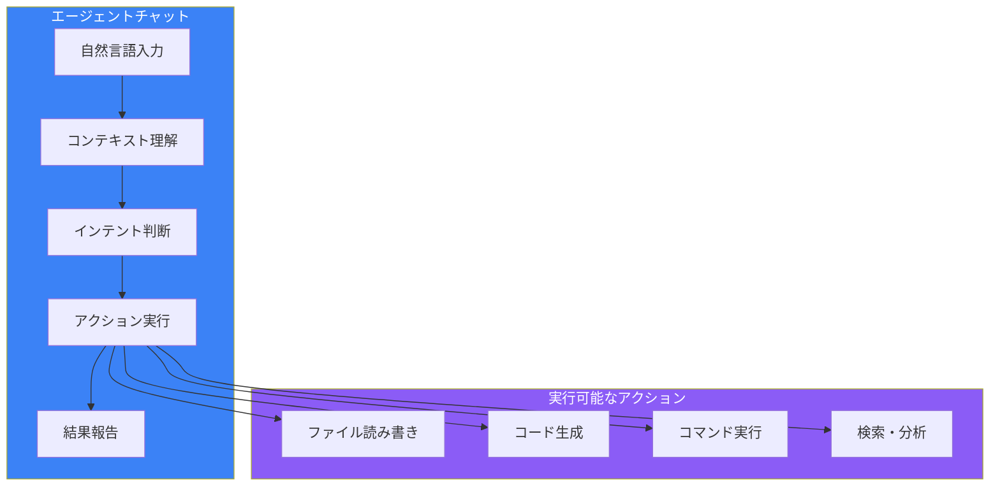
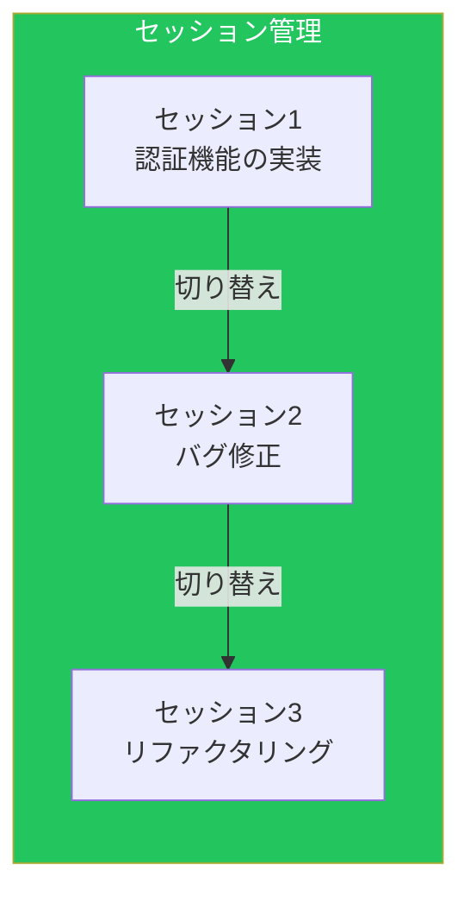
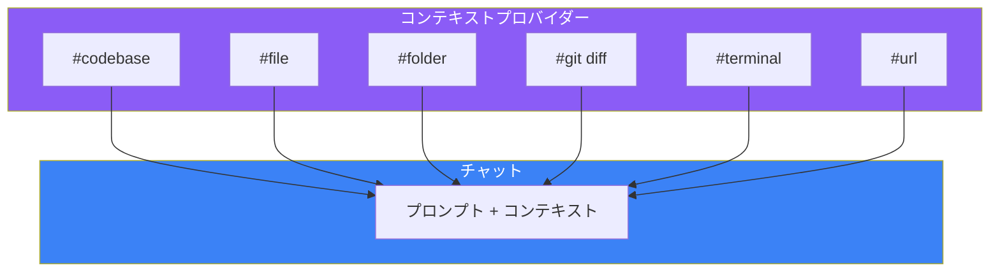
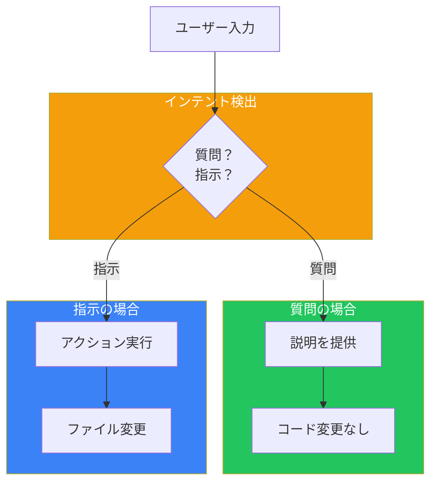
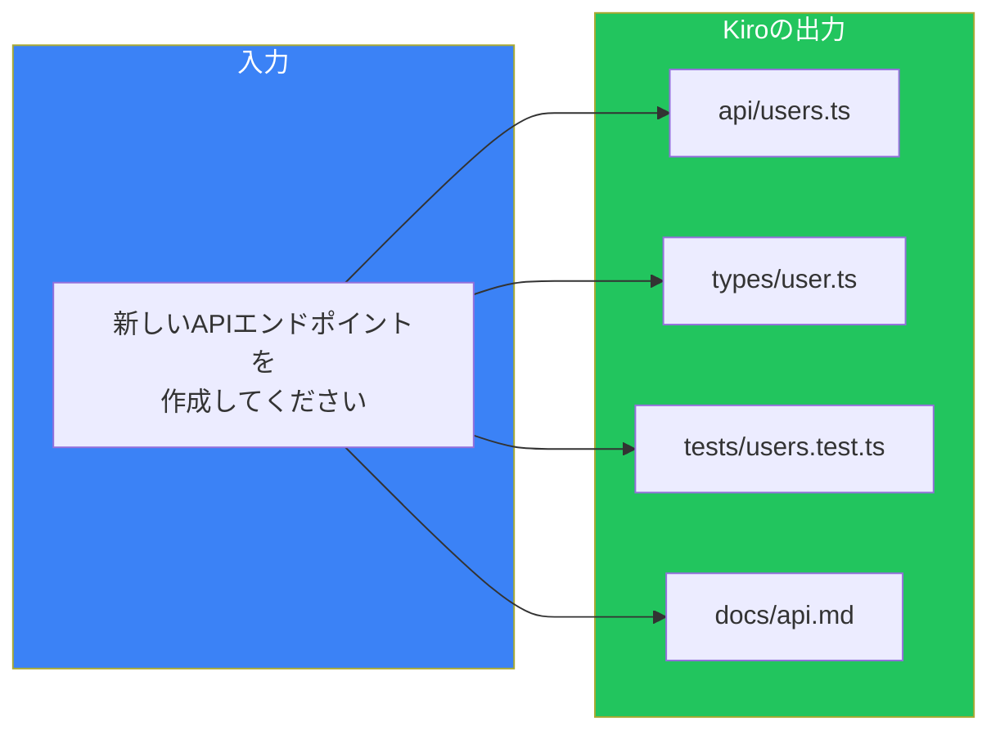

# Day 3: エージェントチャット

## 今日学ぶこと

- エージェントチャットの基本操作
- コンテキストプロバイダーの活用
- インテント検出と自動判断
- 効果的なプロンプトの書き方

---

## エージェントチャットとは

KiroのエージェントチャットはただのAIチャットではありません。プロジェクト全体のコンテキストを理解し、ファイル操作やコマンド実行を**自律的に**行える対話インターフェースです。



### 従来のAIチャットとの違い

| 機能 | 従来のAIチャット | Kiroエージェントチャット |
|------|-----------------|------------------------|
| **コンテキスト** | 会話履歴のみ | プロジェクト全体 + Steering |
| **ファイル操作** | コピペで手動 | 自動的に読み書き |
| **コマンド実行** | 提案のみ | 許可を得て実行 |
| **マルチファイル** | 困難 | 複数ファイルを同時編集 |

---

## チャットの基本操作

### チャットパネルを開く

Kiroパネルの「Chat」タブ、または以下のショートカットで開けます：

- **Mac**: `Cmd + Shift + I`
- **Windows/Linux**: `Ctrl + Shift + I`

### 基本的な会話

```
You: このプロジェクトの構造を説明してください

Kiro: このプロジェクトはNext.js 15を使用したWebアプリケーションです。

      主なディレクトリ構造：
      - src/app/ - App Routerによるページ
      - src/components/ - 再利用可能なコンポーネント
      - src/lib/ - ユーティリティ関数
      ...
```

### セッション管理

複数の会話スレッドを管理できます：



- **新規セッション**: 新しいトピックの開始
- **セッション切り替え**: 過去の会話に戻る
- **履歴検索**: コード変更やコマンド出力を検索

---

## コンテキストプロバイダー

コンテキストプロバイダーは、チャットに追加情報を提供する仕組みです。`#` に続けてプロバイダー名を入力します。



### 主要なコンテキストプロバイダー

| プロバイダー | 説明 | 使用例 |
|-------------|------|--------|
| `#codebase` | 関連ファイルを自動検索 | `#codebase 認証の仕組みを説明して` |
| `#file` | 特定ファイルを参照 | `#file:src/auth.ts このコードをレビューして` |
| `#folder` | フォルダ内容を含める | `#folder:src/components UIコンポーネントを一覧化して` |
| `#git diff` | 現在の変更差分 | `#git diff この変更のレビューをして` |
| `#terminal` | ターミナル履歴・出力 | `#terminal エラーの原因を分析して` |
| `#url` | Webドキュメント | `#url:https://react.dev Reactの新機能を要約して` |
| `#code` | コードスニペット | 選択コードを参照 |
| `#repository` | プロジェクト構造 | `#repository アーキテクチャを分析して` |
| `#current` | アクティブなエディタファイル | `#current このファイルの問題を見つけて` |
| `#steering` | ステアリングファイル | `#steering:api-rules APIルールを確認して` |
| `#docs` | ドキュメント内容 | `#docs プロジェクトドキュメントを参照` |
| `#spec` | 要件・設計ファイル | `#spec:auth-feature 認証の要件を確認` |
| `#mcp` | MCPツール | `#mcp 利用可能なツールを表示` |

### プロバイダーの組み合わせ

複数のプロバイダーを組み合わせて、より精度の高い回答を得られます：

```
#codebase #file:src/auth.ts

認証システムがデータベースとどのように連携しているか説明してください
```

この例では：
1. `#codebase` で関連ファイルを自動検索
2. `#file:src/auth.ts` で認証の主要ファイルを明示的に参照
3. 両方のコンテキストを使って回答を生成

---

## インテント検出

Kiroは質問の**意図（インテント）** を自動的に判断します。



### 質問（説明を求める）

```
"この関数はどのように動作しますか？"
"認証フローを説明してください"
"なぜこのパターンを使用していますか？"
```

→ Kiroは**説明のみ**を提供し、コードは変更しません。

### 指示（アクションを求める）

```
"ログインコンポーネントを作成してください"
"このバグを修正してください"
"テストを追加してください"
```

→ Kiroは**ファイルを作成・編集**します。

### 明示的な指示

意図を明確にしたい場合は、動詞を使います：

| 意図 | 使用する動詞 |
|------|-------------|
| 作成 | create, add, implement |
| 修正 | fix, correct, repair |
| 変更 | update, modify, change |
| 削除 | remove, delete |
| 説明 | explain, describe, how does |

---

## マルチファイル編集

Kiroの強力な機能の一つが、複数ファイルの同時編集です。



### 例：新機能の追加

```
ユーザープロフィール編集機能を追加してください。
以下を含めること：
- コンポーネント
- APIエンドポイント
- 型定義
- テスト
```

Kiroは必要なすべてのファイルを作成し、既存のコードとの整合性を保ちます。

---

## 効果的なプロンプトの書き方

### 1. 具体的に書く

```
❌ "認証を追加して"

✓ "JWTを使用したユーザー認証を追加してください。
    - /api/auth/login エンドポイント
    - /api/auth/logout エンドポイント
    - トークンは24時間で期限切れ"
```

### 2. コンテキストを提供

```
❌ "このエラーを直して"

✓ "#terminal #file:src/api.ts
    このエラーを直してください。
    ターミナルにTypeErrorが表示されています。"
```

### 3. 制約を明示

```
❌ "フォームを作って"

✓ "ユーザー登録フォームを作成してください。
    制約：
    - React Hook Formを使用
    - Zodでバリデーション
    - 既存のUIコンポーネントを再利用"
```

### 4. 段階的に依頼

複雑なタスクは分割します：

```
Step 1: "まず、ユーザーモデルの型定義を作成してください"
Step 2: "次に、そのモデルを使ったCRUD APIを作成してください"
Step 3: "最後に、APIのテストを追加してください"
```

---

## 実践例

### 例1：コードレビュー

```
#git diff

この変更をレビューしてください。
特に以下の点を確認：
- セキュリティ上の問題
- パフォーマンスへの影響
- 既存コードとの一貫性
```

### 例2：バグ修正

```
#terminal #codebase

「Cannot read property 'map' of undefined」というエラーが
発生しています。原因を特定して修正してください。
```

### 例3：リファクタリング

```
#file:src/components/Dashboard.tsx

このコンポーネントをリファクタリングしてください：
1. 大きすぎるので、小さなコンポーネントに分割
2. ロジックはカスタムフックに抽出
3. 既存の機能は維持
```

### 例4：ドキュメント作成

```
#folder:src/api

このAPIディレクトリのREADMEを作成してください。
各エンドポイントの説明と使用例を含めてください。
```

---

## チャットのベストプラクティス

### Do（推奨）

1. **コンテキストプロバイダーを活用**
   - 関連ファイルを明示的に参照
   - エラー情報があればターミナルを含める

2. **具体的な要件を記述**
   - 何を達成したいか明確に
   - 技術的制約があれば記載

3. **段階的にタスクを進める**
   - 大きなタスクは分割
   - 各ステップの結果を確認

### Don't（避けるべき）

1. **曖昧な指示**
   - 「いい感じにして」
   - 「なんかおかしいから直して」

2. **コンテキストなしの質問**
   - ファイルを参照せずにエラーについて質問

3. **一度に大量の変更を依頼**
   - レビューが困難になる

---

## まとめ

| 概念 | 説明 |
|------|------|
| **エージェントチャット** | プロジェクト全体を理解した対話インターフェース |
| **コンテキストプロバイダー** | `#` で追加情報を提供 |
| **インテント検出** | 質問と指示を自動判断 |
| **マルチファイル編集** | 複数ファイルを同時に変更 |

### 重要ポイント

1. **#プロバイダーでコンテキストを豊かに**
2. **具体的な要件と制約を記述**
3. **質問と指示を明確に区別**
4. **複雑なタスクは段階的に**

---

## 練習問題

### 問題1: 基本

`#codebase` プロバイダーを使って、プロジェクトの主要な機能について質問してください。Kiroがどのようなファイルを参照するか確認しましょう。

### 問題2: 応用

以下のシナリオでプロンプトを作成してください：
1. テストが失敗している原因を調査
2. 新しいユーティリティ関数を追加
3. 既存コードのパフォーマンスを改善

### チャレンジ問題

複数のコンテキストプロバイダーを組み合わせて、以下を実行してください：
1. `#git diff` で最近の変更を確認
2. `#terminal` でテスト結果を確認
3. 変更に関連するバグを特定して修正を依頼

---

## 参考リンク

- [Kiro Agentic Chat Documentation](https://kiro.dev/docs/chat/)
- [Context Providers Reference](https://kiro.dev/docs/chat/context-providers/)
- [Best Practices for AI-Assisted Coding](https://kiro.dev/blog/kiro-and-the-future-of-software-development/)

---

**次回予告**: Day 4では「Specs入門」を学びます。Kiroの核心機能であるSpec駆動開発の基礎を理解しましょう。
