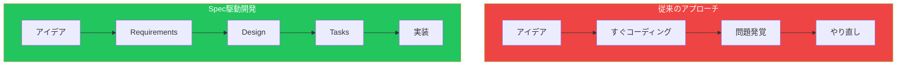
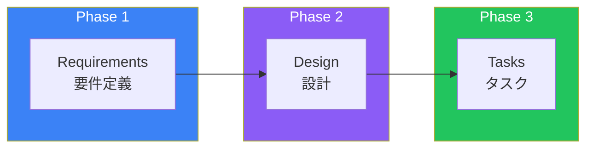
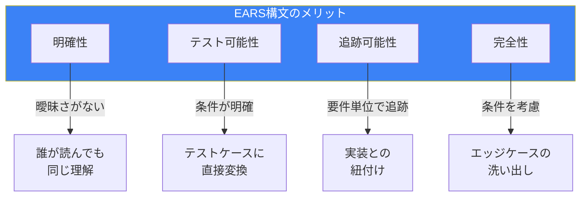

# Day 4: Specs入門

## 今日学ぶこと

- Spec駆動開発とは何か
- Specsの3つのフェーズ
- EARS構文による要件定義
- 最初のSpecの作成

---

## Spec駆動開発とは

Spec駆動開発は、**コードを書く前に要件・設計・タスクを明確化**するアプローチです。これはKiroの中核機能であり、「Vibe Coding」の問題を解決します。



### なぜSpec駆動開発なのか

| 従来の問題 | Spec駆動の解決 |
|-----------|---------------|
| 要件が曖昧なまま開発 | 明確な要件を文書化 |
| 設計なしに実装 | アーキテクチャを事前に設計 |
| 進捗が見えない | タスク単位で進捗を追跡 |
| 後からテストを書く | 要件からテストを導出 |
| ドキュメントがない | 要件・設計が自動的にドキュメント化 |

---

## Specsの3つのフェーズ

Kiro Specsは3つのフェーズで構成されます。



### Phase 1: Requirements（要件定義）

ユーザーストーリーと受け入れ条件を定義します。**EARS構文**を使用して、曖昧さのない要件を記述します。

```
.kiro/specs/user-auth/
└── requirements.md
```

### Phase 2: Design（設計）

技術的なアーキテクチャと実装方針を文書化します。コンポーネントの相互作用やデータフローを記述します。

```
.kiro/specs/user-auth/
├── requirements.md
└── design.md
```

### Phase 3: Tasks（タスク）

具体的な実装タスクを分解します。各タスクは追跡可能で、依存関係も明示されます。

```
.kiro/specs/user-auth/
├── requirements.md
├── design.md
└── tasks.md
```

---

## EARS構文

EARS（Easy Approach to Requirements Syntax）は、要件を明確に記述するための構文です。

### 基本構文

```
WHEN [条件/イベント] THE SYSTEM SHALL [期待される動作]
```

### 例

```markdown
## User Story: ログイン機能

### 要件

1. WHEN a user enters valid credentials
   THE SYSTEM SHALL authenticate the user and redirect to dashboard

2. WHEN a user enters invalid credentials
   THE SYSTEM SHALL display an error message and remain on login page

3. WHEN a user is already logged in
   THE SYSTEM SHALL redirect to dashboard without re-authentication

4. WHEN a login session exceeds 24 hours
   THE SYSTEM SHALL automatically log out the user
```

### EARS構文のメリット



| メリット | 説明 |
|----------|------|
| **明確性** | 要件が曖昧さなく、誰が読んでも同じ理解 |
| **テスト可能性** | 各要件がそのままテストケースに変換可能 |
| **追跡可能性** | 個々の要件を実装まで追跡できる |
| **完全性** | WHEN条件を考えることでエッジケースを洗い出せる |

---

## 最初のSpecを作成する

### Step 1: Specの開始

Kiroパネルの「Specs」セクションで「+」ボタンをクリック、またはチャットで「Spec」を選択します。

### Step 2: 機能の説明

自然言語で作りたい機能を説明します：

```
ユーザー登録機能を作成したい。
- メールアドレスとパスワードで登録
- パスワードは8文字以上
- 登録後に確認メールを送信
- メール内のリンクをクリックして有効化
```

### Step 3: Requirements の生成

Kiroがあなたの説明をEARS構文の要件に変換します：

```markdown
# User Registration Feature

## User Stories

### US-1: Basic Registration
As a new user, I want to register with email and password
so that I can create an account.

### US-2: Email Verification
As a registered user, I want to verify my email
so that my account becomes active.

## Requirements

### Registration Process

1. WHEN a user submits registration form with valid email and password
   THE SYSTEM SHALL create a new user account with "pending" status

2. WHEN a user submits password less than 8 characters
   THE SYSTEM SHALL display validation error "Password must be at least 8 characters"

3. WHEN a user submits email already registered
   THE SYSTEM SHALL display error "Email already in use"

### Email Verification

4. WHEN a new account is created
   THE SYSTEM SHALL send verification email within 5 seconds

5. WHEN user clicks verification link
   THE SYSTEM SHALL activate the account and redirect to login

6. WHEN verification link is older than 24 hours
   THE SYSTEM SHALL display "Link expired" and offer to resend
```

### Step 4: レビューと調整

生成された要件を確認し、必要に応じて修正します。足りない要件があれば追加できます。

```
追加要件：
- パスワードには大文字・小文字・数字を含む必要がある
- 確認メールは1時間に3回まで再送可能
```

---

## Specファイルの構造

Specは `.kiro/specs/` フォルダに保存されます。

```
.kiro/
└── specs/
    └── user-registration/
        ├── requirements.md    # 要件定義
        ├── design.md          # 設計（Day 5で学習）
        └── tasks.md           # タスク（Day 5で学習）
```

### requirements.md の例

```markdown
---
feature: User Registration
version: 1.0
status: draft
---

# User Registration

## Overview
Allow new users to create accounts using email and password,
with email verification for account activation.

## User Stories

### US-1: Basic Registration
**As a** new visitor
**I want to** register with my email and password
**So that** I can create an account to use the application

**Acceptance Criteria:**
- [ ] Registration form with email and password fields
- [ ] Password validation (minimum 8 characters)
- [ ] Duplicate email check
- [ ] Success message after registration

### US-2: Email Verification
**As a** registered user
**I want to** verify my email address
**So that** my account becomes active

**Acceptance Criteria:**
- [ ] Verification email sent automatically
- [ ] Clickable verification link
- [ ] Account activation upon link click
- [ ] Link expiration after 24 hours

## Functional Requirements

### FR-1: Registration Form Validation
WHEN a user submits the registration form
THE SYSTEM SHALL validate:
- Email format is valid
- Password is at least 8 characters
- Password contains uppercase, lowercase, and number

### FR-2: Account Creation
WHEN validation passes
THE SYSTEM SHALL:
- Create user record with "pending" status
- Hash password using bcrypt
- Generate unique verification token

### FR-3: Verification Email
WHEN a new account is created
THE SYSTEM SHALL send verification email containing:
- Welcome message
- Verification link with token
- Link expiration notice (24 hours)

## Non-Functional Requirements

### NFR-1: Performance
- Registration should complete within 3 seconds
- Email should be sent within 5 seconds of registration

### NFR-2: Security
- Passwords must be hashed (never stored in plain text)
- Verification tokens must be cryptographically random
- Rate limit: 3 verification emails per hour
```

---

## Specのステータス管理

Specには以下のステータスがあります：


| ステータス | 説明 |
|-----------|------|
| **draft** | 作成中、まだ確定していない |
| **review** | レビュー待ち |
| **approved** | 承認済み、実装可能 |
| **implementing** | 実装中 |
| **completed** | 完了 |

---

## 要件定義のベストプラクティス

### 1. ユーザー視点で書く

```
❌ "データベースにユーザーを保存する"

✓ "WHEN a user completes registration
    THE SYSTEM SHALL save user information securely"
```

### 2. 測定可能にする

```
❌ "パスワードは十分に長いこと"

✓ "WHEN password is less than 8 characters
    THE SYSTEM SHALL reject and display error"
```

### 3. エッジケースを考慮

```markdown
## Happy Path
WHEN user enters valid data
THE SYSTEM SHALL create account

## Edge Cases
WHEN user enters email with + symbol (e.g., user+test@example.com)
THE SYSTEM SHALL accept as valid email

WHEN user's session times out during registration
THE SYSTEM SHALL preserve form data and allow retry

WHEN email service is unavailable
THE SYSTEM SHALL queue email and retry within 5 minutes
```

### 4. 非機能要件も含める

```markdown
## Non-Functional Requirements

### Performance
- Registration: < 3 seconds response time
- Email delivery: < 5 seconds after registration

### Security
- All passwords hashed with bcrypt (cost factor 12)
- HTTPS required for all endpoints
- Rate limiting: 5 registration attempts per IP per hour

### Accessibility
- Form must be keyboard navigable
- Error messages announced by screen readers
```

---

## まとめ

| 概念 | 説明 |
|------|------|
| **Spec駆動開発** | コードの前に要件・設計・タスクを定義 |
| **EARS構文** | WHEN...THE SYSTEM SHALL で要件を記述 |
| **3フェーズ** | Requirements → Design → Tasks |
| **トレーサビリティ** | 要件からテストまで追跡可能 |

### 重要ポイント

1. **「考えてから作る」を実現するツール**
2. **EARS構文で曖昧さを排除**
3. **ユーザーストーリーで目的を明確に**
4. **エッジケースと非機能要件も忘れずに**

---

## 練習問題

### 問題1: 基本

以下の機能のユーザーストーリーを書いてください：
- ユーザーがプロフィール画像をアップロードする機能

### 問題2: 応用

以下の機能についてEARS構文で要件を5つ以上書いてください：
- パスワードリセット機能

要件に含めること：
- リセットメールの送信
- トークンの有効期限
- 新しいパスワードの検証
- エラーケース

### チャレンジ問題

Kiroを使って、以下の機能のSpecを作成してください：
- 商品をカートに追加する機能

生成された要件を確認し、足りないエッジケースがあれば追加してください。

---

## 参考リンク

- [Kiro Specs Documentation](https://kiro.dev/docs/specs/)
- [Specs Concepts](https://kiro.dev/docs/specs/concepts/)
- [EARS Requirements Syntax](https://alistairmavin.com/ears/)

---

**次回予告**: Day 5では「Specs実践」を学びます。Designフェーズでの設計文書の作成と、Tasksフェーズでのタスク管理を習得しましょう。
