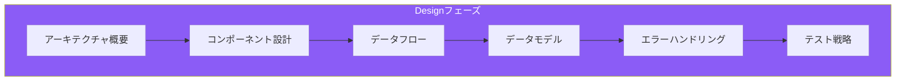
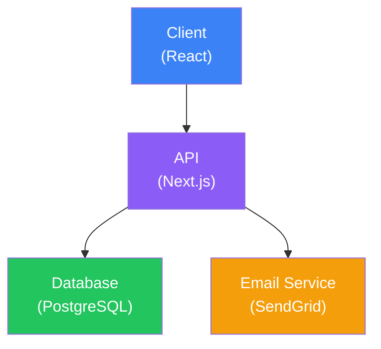
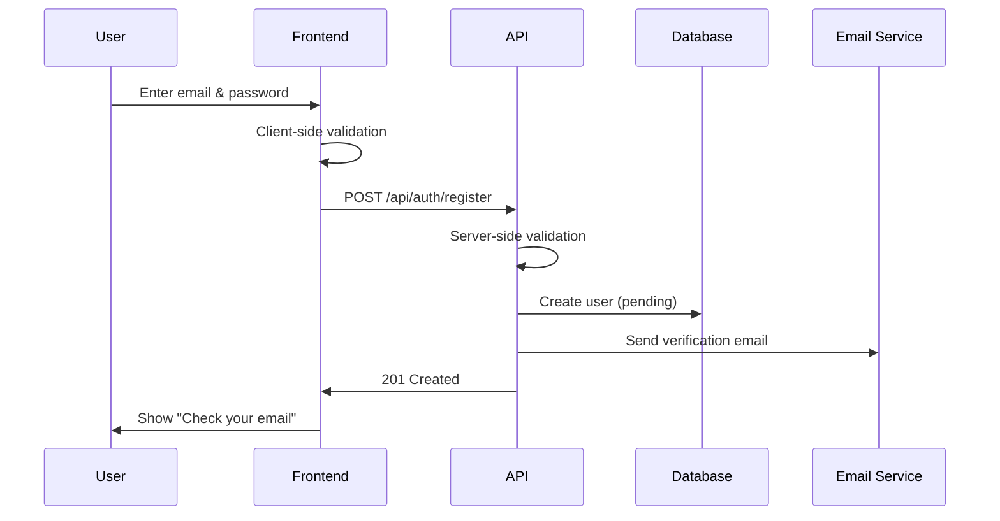
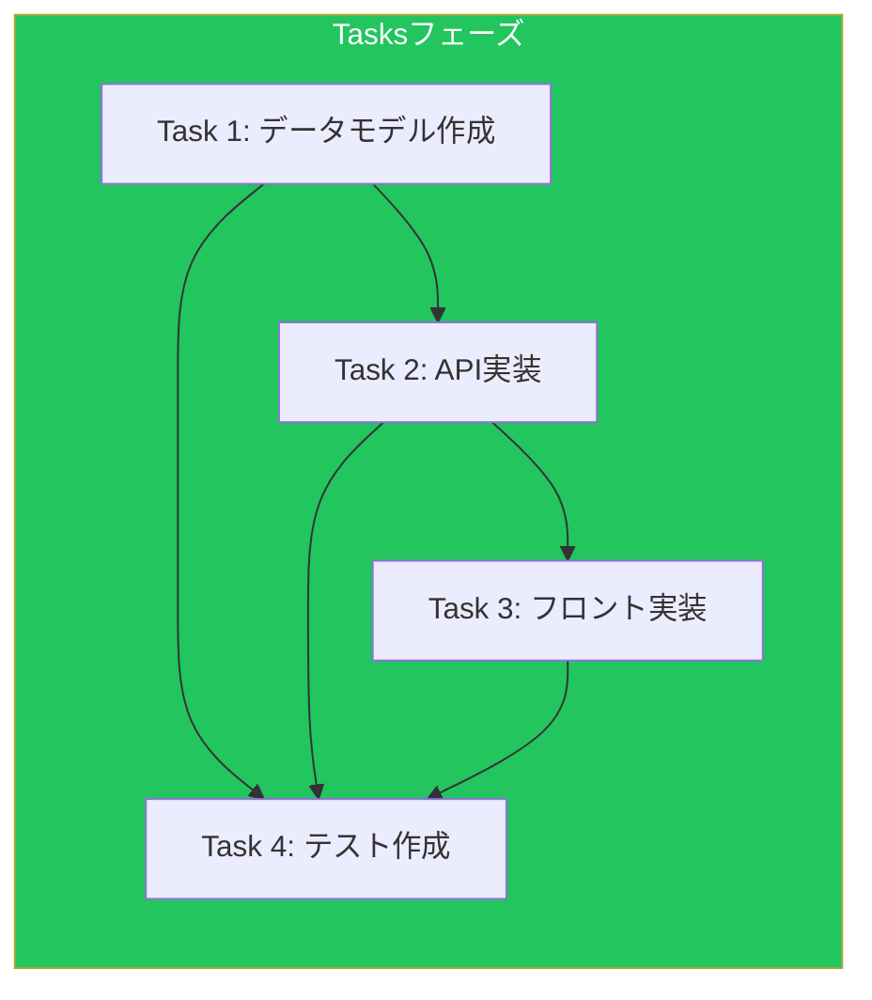
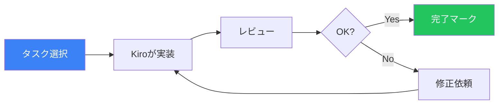
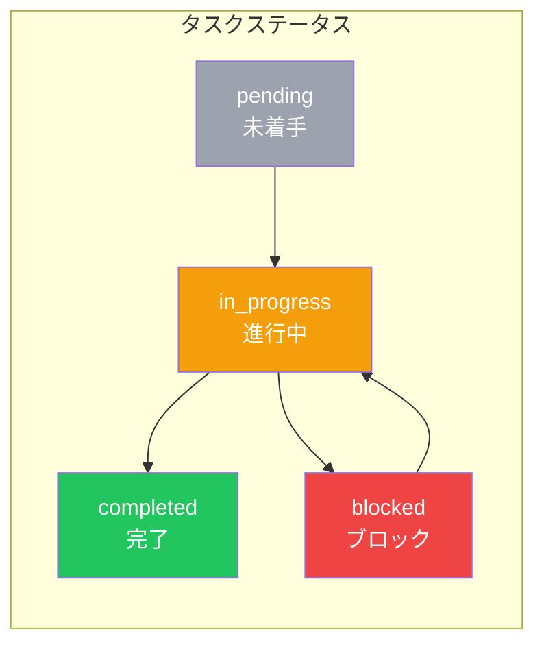
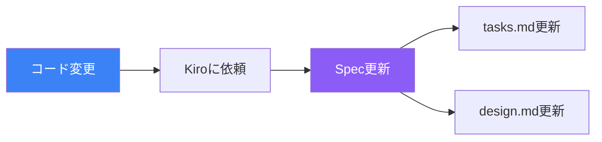

# Day 5: Specs実践

## 今日学ぶこと

- Designフェーズでの設計文書作成
- Tasksフェーズでのタスク管理
- タスクの実行と進捗追跡
- Specの更新と同期

---

## Designフェーズ

Requirementsフェーズで「何を作るか」を定義したら、次はDesignフェーズで「どのように作るか」を設計します。



### design.md の構成

```markdown
# User Registration - Design

## Architecture Overview



## Component Design

### Frontend Components
- `RegistrationForm`: メインフォームコンポーネント
- `PasswordStrengthIndicator`: パスワード強度表示
- `EmailVerificationPage`: メール確認ページ

### Backend Endpoints
- `POST /api/auth/register`: ユーザー登録
- `GET /api/auth/verify`: メール確認
- `POST /api/auth/resend-verification`: 確認メール再送

## Data Flow

### Registration Flow


## Data Models

### User Model
```typescript
interface User {
  id: string;
  email: string;
  passwordHash: string;
  status: 'pending' | 'active' | 'suspended';
  verificationToken: string | null;
  verificationExpiry: Date | null;
  createdAt: Date;
  updatedAt: Date;
}
```

## Error Handling

| Error Case | HTTP Status | Response |
|------------|-------------|----------|
| Invalid email format | 400 | `{ error: "INVALID_EMAIL" }` |
| Password too weak | 400 | `{ error: "WEAK_PASSWORD" }` |
| Email already exists | 409 | `{ error: "EMAIL_EXISTS" }` |
| Server error | 500 | `{ error: "INTERNAL_ERROR" }` |

## Testing Strategy

### Unit Tests
- Form validation logic
- Password strength calculation
- Token generation

### Integration Tests
- Registration API endpoint
- Email verification flow
- Database operations

### E2E Tests
- Complete registration flow
- Error handling scenarios
```

---

## Tasksフェーズ

Designが完了したら、具体的な実装タスクに分解します。



### tasks.md の構成

```markdown
# User Registration - Tasks

## Task Overview

| ID | Task | Status | Dependencies |
|----|------|--------|--------------|
| T1 | Database schema | pending | - |
| T2 | User model | pending | T1 |
| T3 | Registration API | pending | T2 |
| T4 | Email service integration | pending | T2 |
| T5 | Registration form | pending | T3 |
| T6 | Verification page | pending | T3, T4 |
| T7 | Unit tests | pending | T2, T3 |
| T8 | E2E tests | pending | T5, T6 |

## Detailed Tasks

### T1: Database Schema

**Description**: Create database schema for users table

**Files to create/modify**:
- `prisma/schema.prisma`

**Subtasks**:
- [ ] Define User model
- [ ] Add indexes for email
- [ ] Run migration

**Acceptance criteria**:
- Schema matches design spec
- Migration runs successfully

---

### T2: User Model

**Description**: Implement User model with validation

**Files to create/modify**:
- `src/models/user.ts`
- `src/types/user.ts`

**Subtasks**:
- [ ] Create TypeScript interface
- [ ] Implement validation functions
- [ ] Add password hashing utility

**Acceptance criteria**:
- TypeScript types match schema
- Validation covers all rules

---

### T3: Registration API

**Description**: Implement registration endpoint

**Files to create/modify**:
- `src/app/api/auth/register/route.ts`

**Subtasks**:
- [ ] Implement POST handler
- [ ] Add input validation
- [ ] Handle duplicate email
- [ ] Return appropriate responses

**Acceptance criteria**:
- All error cases handled
- Matches API design spec

---

### T4: Email Service Integration

**Description**: Integrate SendGrid for verification emails

**Files to create/modify**:
- `src/services/email.ts`
- `src/templates/verification-email.tsx`

**Subtasks**:
- [ ] Set up SendGrid client
- [ ] Create email template
- [ ] Implement send function

**Acceptance criteria**:
- Email sent within 5 seconds
- Template includes all required info

---

### T5: Registration Form

**Description**: Build registration form component

**Files to create/modify**:
- `src/components/auth/RegistrationForm.tsx`
- `src/components/auth/PasswordStrengthIndicator.tsx`

**Subtasks**:
- [ ] Create form with React Hook Form
- [ ] Add Zod validation
- [ ] Implement password strength indicator
- [ ] Handle API errors

**Acceptance criteria**:
- Form matches design mockup
- All validation rules enforced

---

### T6: Verification Page

**Description**: Build email verification page

**Files to create/modify**:
- `src/app/auth/verify/page.tsx`
- `src/app/api/auth/verify/route.ts`

**Subtasks**:
- [ ] Create verification page
- [ ] Implement verify API
- [ ] Handle expired tokens
- [ ] Add resend functionality

**Acceptance criteria**:
- Verification flow complete
- Expired links handled gracefully
```

---

## タスクの実行

Kiroパネルからタスクを選択して実行できます。

### タスク実行の流れ



### 実行例

1. **タスクを選択**: 「T3: Registration API」をクリック
2. **Kiroが実装**: 設計に基づいてコードを生成
3. **レビュー**: 生成されたコードを確認
4. **修正または承認**: 必要に応じて修正を依頼

```
You: T3のRegistration APIを実装してください

Kiro: T3: Registration API を実装します。

      設計仕様に基づいて以下のファイルを作成/更新しました：

      Created: src/app/api/auth/register/route.ts
      - POST handler実装
      - 入力バリデーション (Zod)
      - 重複メールチェック
      - パスワードハッシュ化
      - 適切なHTTPステータス返却

      実装の詳細：
      ...
```

---

## 進捗追跡

タスクのステータスはリアルタイムで更新されます。



### 進捗の可視化

```
User Registration Tasks
━━━━━━━━━━━━━━━━━━━━━━━━━━━━━━━━━━━━━━━━━━━
[████████████████░░░░░░░░░░░░░░░░] 50%

✓ T1: Database schema         [completed]
✓ T2: User model              [completed]
● T3: Registration API        [in_progress]
○ T4: Email service           [pending]
○ T5: Registration form       [pending]
○ T6: Verification page       [pending]
○ T7: Unit tests              [pending]
○ T8: E2E tests               [pending]
```

---

## Specの更新と同期

実装中に要件や設計が変わることがあります。Kiroはこの変更を同期します。

### コードからSpecへの更新



```
You: パスワードの最小文字数を10文字に変更しました。
     Specを更新してください。

Kiro: 以下のSpecファイルを更新しました：

      requirements.md:
      - FR-1: パスワード要件を10文字以上に変更

      design.md:
      - Data Models: 検証ルールのコメント更新

      tasks.md:
      - T5: 受け入れ条件の更新
```

### SpecからコードへのFix

```
You: requirements.mdにエラーレート制限の要件を追加しました。
     コードを更新してください。

Kiro: 新しい要件を確認しました。

      追加された要件:
      "WHEN more than 5 registration attempts from same IP within 1 hour
       THE SYSTEM SHALL block further attempts"

      以下のファイルを更新しました：
      - src/app/api/auth/register/route.ts
        - Rate limiting middleware追加
        - エラーレスポンス追加

      tasks.mdも更新しました：
      - T3のサブタスクにレート制限実装を追加
```

---

## 実践例：完全なSpec作成フロー

### Step 1: 機能の説明

```
商品検索機能を作成したい。
- キーワードで商品を検索
- カテゴリでフィルタリング
- 価格範囲でフィルタリング
- 結果をページネーション
```

### Step 2: Requirements生成

Kiroが生成した要件を確認・調整します。

### Step 3: Design生成

```
要件が確定しました。設計に進んでください。
以下を含めること：
- 検索APIの設計
- フロントエンドコンポーネント設計
- データモデル
```

### Step 4: Tasks生成

```
設計が確定しました。タスクに分解してください。
依存関係も明示してください。
```

### Step 5: 実装開始

```
T1から順番に実装を開始してください。
各タスク完了後に確認します。
```

---

## ベストプラクティス

### 1. 小さなタスクに分割

```
❌ Task: 認証システム全体を実装

✓ Task 1: ユーザーモデル作成
✓ Task 2: 登録API実装
✓ Task 3: ログインAPI実装
✓ Task 4: 登録フォーム実装
```

### 2. 依存関係を明示

```markdown
| Task | Dependencies |
|------|--------------|
| T3: Registration API | T1: Schema, T2: Model |
| T5: Registration Form | T3: API |
```

### 3. 受け入れ条件を具体的に

```markdown
**Acceptance criteria**:
- [ ] All 5 unit tests pass
- [ ] No TypeScript errors
- [ ] API response time < 200ms
- [ ] Code coverage > 80%
```

### 4. 定期的に同期

実装が進んだら、Specとの整合性を確認します：

```
現在のコードとSpecの差分を確認してください。
不整合があれば教えてください。
```

---

## まとめ

| フェーズ | 内容 | 成果物 |
|---------|------|--------|
| **Requirements** | 何を作るか | requirements.md |
| **Design** | どう作るか | design.md |
| **Tasks** | 何をするか | tasks.md |

### 重要ポイント

1. **Designは実装の青写真**
2. **タスクは小さく、依存関係を明示**
3. **進捗をリアルタイムで追跡**
4. **Specとコードは常に同期**

---

## 練習問題

### 問題1: 基本

Day 4で作成したユーザー登録のRequirementsに対して、Design文書を作成してください。以下を含めること：
- アーキテクチャ図（Mermaid）
- データモデル
- エラーハンドリング表

### 問題2: 応用

以下の機能のタスク分解を行ってください：
- ブログ記事の投稿機能

要件：
- タイトルと本文を入力
- 下書き保存と公開
- 画像のアップロード
- タグの設定

### チャレンジ問題

Kiroを使って、以下の一連の流れを実践してください：
1. 「お気に入り機能」のRequirements作成
2. Designの生成
3. Tasksの生成
4. 最初のタスクの実装

実装後、Specが正しく更新されるか確認してください。

---

## 参考リンク

- [Kiro Specs Documentation](https://kiro.dev/docs/specs/)
- [Specs Best Practices](https://kiro.dev/docs/specs/best-practices/)
- [Working with Tasks](https://kiro.dev/docs/specs/tasks/)

---

**次回予告**: Day 6では「Hooks入門」を学びます。ファイル変更などのイベントをトリガーとした自動化の基礎を理解しましょう。
