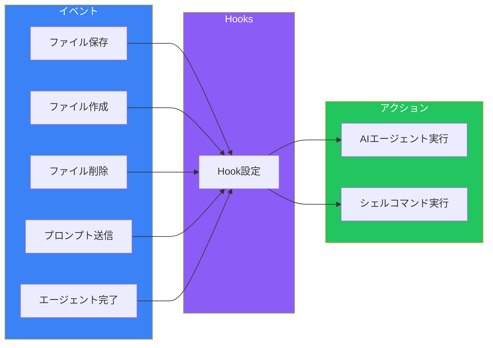
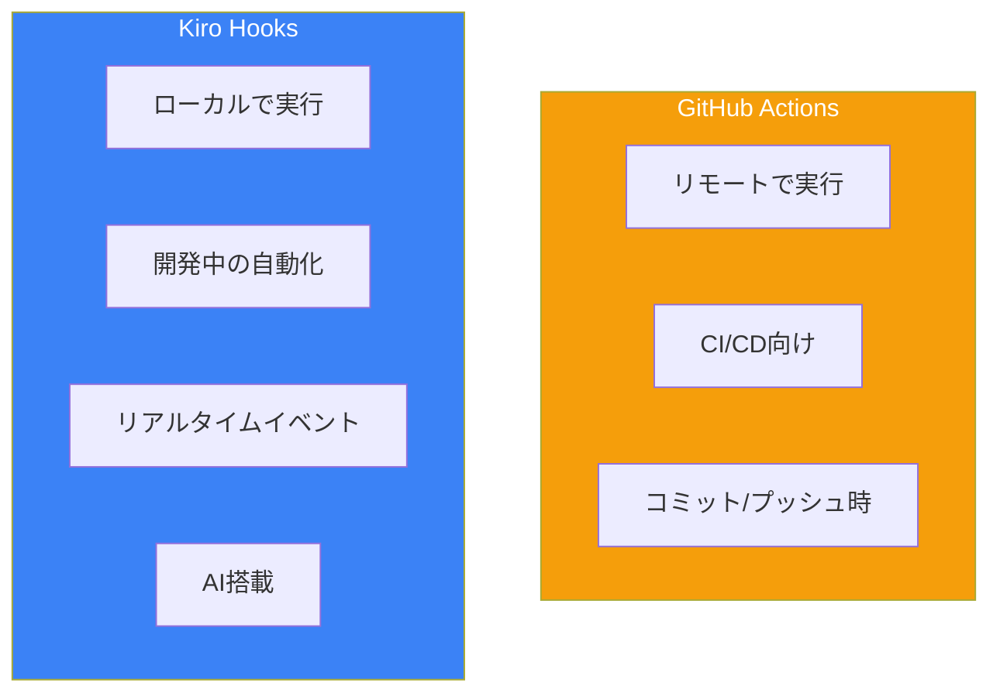

# Day 6: Hooks入門

## 今日学ぶこと

- Hooksとは何か、なぜ便利か
- 6種類のトリガータイプ
- 基本的なHookの作成
- ファイルパターンの指定

---

## Hooksとは

HooksはKiroのイベント駆動型自動化機能です。ファイルの保存、作成、削除などのイベントに応じて、AIエージェントやシェルコマンドを自動実行できます。



### Hooksのメリット

| 従来の方法 | Hooksを使う |
|-----------|------------|
| 保存後に手動でフォーマット | 保存時に自動フォーマット |
| テストファイルを手動で作成 | コンポーネント作成時に自動生成 |
| 毎回手動でリントを実行 | 保存時に自動リント |
| コード変更後に手動でドキュメント更新 | 変更時に自動更新 |

### GitHub Actionsとの比較



---

## トリガータイプ

Kiro Hooksには6つのトリガータイプがあります。

### 1. onSave（ファイル保存時）

ファイルが保存されたときにトリガーされます。

```yaml
trigger: onSave
pattern: "**/*.tsx"
```

**ユースケース**:
- 自動フォーマット
- リンティング
- 関連ファイルの更新
- テストの実行

### 2. onCreate（ファイル作成時）

新しいファイルが作成されたときにトリガーされます。

```yaml
trigger: onCreate
pattern: "src/components/**/*.tsx"
```

**ユースケース**:
- テストファイルの自動生成
- ライセンスヘッダーの追加
- ボイラープレートの挿入

### 3. onDelete（ファイル削除時）

ファイルが削除されたときにトリガーされます。

```yaml
trigger: onDelete
pattern: "src/**/*.ts"
```

**ユースケース**:
- 関連ファイルのクリーンアップ
- インポート参照の更新
- ドキュメントの更新

### 4. onPromptSubmit（プロンプト送信時）

チャットでプロンプトを送信したときにトリガーされます。

```yaml
trigger: onPromptSubmit
```

**ユースケース**:
- コンテキストの追加
- プロンプトの検証
- 監査ログの記録

### 5. onAgentStop（エージェント完了時）

AIエージェントの処理が完了したときにトリガーされます。

```yaml
trigger: onAgentStop
```

**ユースケース**:
- コードのコンパイル/テスト
- フォーマットの適用
- レビューとフィードバック

### 6. manual（手動トリガー）

明示的に実行を指示したときのみトリガーされます。

```yaml
trigger: manual
```

**ユースケース**:
- コードレビュー
- ドキュメント生成
- セキュリティスキャン

---

## Hookの作成

### 方法1: Kiroパネルから

1. Kiroパネルで「Hooks」セクションの「+」をクリック
2. 自然言語でHookを説明
3. Enterまたは「Submit」をクリック

```
Reactコンポーネントを保存したとき、対応するテストファイルが
存在しなければ作成してください。
```

### 方法2: コマンドパレットから

1. `Cmd + Shift + P`（Mac）または `Ctrl + Shift + P`（Windows/Linux）
2. 「Kiro: Open Kiro Hook UI」を検索
3. 指示に従って設定

### Hook設定ファイル

Hookは `.kiro/hooks/` フォルダに保存されます：

```
.kiro/
└── hooks/
    ├── auto-test.yaml
    ├── format-on-save.yaml
    └── update-docs.yaml
```

---

## 基本的なHook設定

### YAML形式

```yaml
# .kiro/hooks/auto-test.yaml
name: Auto Generate Test
description: Automatically generate test files for new components
trigger: onCreate
pattern: "src/components/**/*.tsx"
action: agent
instructions: |
  A new React component has been created.
  1. Check if a corresponding test file exists in __tests__/
  2. If not, create one with basic render tests
  3. Include tests for any props defined in the component
  4. Run the test to verify it passes
```

### 設定項目の説明

| 項目 | 必須 | 説明 |
|------|------|------|
| `name` | Yes | Hookの名前 |
| `description` | No | Hookの説明 |
| `trigger` | Yes | トリガータイプ |
| `pattern` | No* | ファイルパターン（ファイルイベント用） |
| `action` | Yes | `agent` または `shell` |
| `instructions` | Yes* | AIへの指示（action: agentの場合） |
| `command` | Yes* | 実行コマンド（action: shellの場合） |

---

## ファイルパターン

ファイルベースのトリガーでは、globパターンを使用してターゲットファイルを指定します。

### 基本パターン

```yaml
# すべてのTypeScriptファイル
pattern: "**/*.ts"

# srcフォルダ内のコンポーネント
pattern: "src/components/**/*.tsx"

# 特定のフォルダ内のファイル
pattern: "src/api/*.ts"

# テストファイルを除外（設定でサポートされている場合）
pattern: "src/**/*.ts"
exclude: "**/*.test.ts"
```

### パターンの例

| パターン | マッチするファイル |
|----------|------------------|
| `*.ts` | ルートのtsファイル |
| `**/*.ts` | すべてのtsファイル |
| `src/*.ts` | src直下のtsファイル |
| `src/**/*.ts` | src配下のすべてのtsファイル |
| `**/*.{ts,tsx}` | tsとtsxファイル |
| `!**/*.test.ts` | テストファイルを除外 |

---

## アクションタイプ

### Agent Action

AIエージェントに指示を実行させます。

```yaml
action: agent
instructions: |
  When a React component is saved:
  1. Check if the component has proper TypeScript types
  2. Verify all props are documented
  3. Suggest improvements if needed
```

**特徴**:
- AIの理解力を活用
- 複雑なタスクに対応
- コンテキストを考慮した判断

### Shell Action

シェルコマンドを実行します。

```yaml
action: shell
command: "npm run lint -- ${file}"
```

**特徴**:
- 高速実行
- クレジット消費なし
- シンプルなタスク向け

### 環境変数

Shell Actionで使用できる変数：

| 変数 | 説明 |
|------|------|
| `${file}` | 対象ファイルのパス |
| `${USER_PROMPT}` | ユーザーのプロンプト（onPromptSubmit時） |
| `${workspaceFolder}` | ワークスペースのルートパス |

---

## 実践例

### 例1: 保存時の自動フォーマット

```yaml
# .kiro/hooks/format-on-save.yaml
name: Format on Save
description: Run Prettier on saved files
trigger: onSave
pattern: "**/*.{ts,tsx,js,jsx}"
action: shell
command: "npx prettier --write ${file}"
```

### 例2: コンポーネント作成時のテスト生成

```yaml
# .kiro/hooks/auto-test.yaml
name: Auto Generate Test
description: Generate test file for new components
trigger: onCreate
pattern: "src/components/**/*.tsx"
action: agent
instructions: |
  A new React component has been created at ${file}.

  1. Analyze the component's props and functionality
  2. Create a test file at the corresponding __tests__ location
  3. Include:
     - Basic render test
     - Props validation tests
     - Event handler tests if applicable
  4. Use React Testing Library patterns
  5. Run the test to verify it works
```

### 例3: 削除時のクリーンアップ

```yaml
# .kiro/hooks/cleanup-on-delete.yaml
name: Cleanup Related Files
description: Remove related files when a component is deleted
trigger: onDelete
pattern: "src/components/**/*.tsx"
action: agent
instructions: |
  A component file has been deleted: ${file}

  1. Check for related test files
  2. Check for related style files
  3. Check for related story files (Storybook)
  4. Remove any related files that exist
  5. Update any imports that reference the deleted file
```

### 例4: プロンプト送信時のコンテキスト追加

```yaml
# .kiro/hooks/add-context.yaml
name: Add Project Context
description: Add relevant context before agent processes prompt
trigger: onPromptSubmit
action: agent
instructions: |
  Before processing the user's request, consider:

  1. Current project conventions (check .kiro/steering/)
  2. Related files that might be affected
  3. Any recent changes in git diff

  Then proceed with the user's request while
  following project guidelines.
```

---

## Hookの管理

### 有効化/無効化

Kiroパネルから個別のHookを有効/無効にできます。

```
Hooks
├── ✓ Format on Save          [enabled]
├── ✓ Auto Generate Test      [enabled]
└── ○ Cleanup on Delete       [disabled]
```

### 編集と削除

1. Kiroパネルで対象のHookをクリック
2. 編集画面で変更または削除

### 実行ログの確認

Hookの実行結果は出力パネルで確認できます：

1. View > Output（または `Cmd/Ctrl + Shift + U`）
2. ドロップダウンから「Kiro - Hooks」を選択

---

## まとめ

| 概念 | 説明 |
|------|------|
| **Hooks** | イベント駆動型の自動化機能 |
| **トリガー** | onSave, onCreate, onDelete, onPromptSubmit, onAgentStop, manual |
| **パターン** | globパターンでファイルを指定 |
| **アクション** | agent（AI実行）または shell（コマンド実行） |

### 重要ポイント

1. **Hooksは「やり忘れ」を防ぐ**
2. **ファイルイベントでリアルタイム自動化**
3. **AIとシェルコマンドを使い分ける**
4. **パターンで適用範囲を限定**

---

## 練習問題

### 問題1: 基本

以下のHookを作成してください：
- トリガー: ファイル保存時
- パターン: すべてのTypeScriptファイル
- アクション: シェルコマンド
- 内容: ESLintを実行

### 問題2: 応用

以下のHookを作成してください：
- トリガー: Reactコンポーネント作成時
- アクション: AIエージェント
- 内容:
  - propsのTypeScript型を確認
  - 型が不足していれば追加を提案

### チャレンジ問題

チーム開発を想定し、以下のHookセットを作成してください：
1. 保存時の自動フォーマット（Prettier）
2. APIファイル変更時のドキュメント更新
3. テストファイル作成時のテンプレート挿入

---

## 参考リンク

- [Kiro Hooks Documentation](https://kiro.dev/docs/hooks/)
- [Hook Types](https://kiro.dev/docs/hooks/types/)
- [Hook Actions](https://kiro.dev/docs/hooks/actions/)

---

**次回予告**: Day 7では「Hooks実践」を学びます。より高度なHookパターンと、チーム開発での活用方法を習得しましょう。
