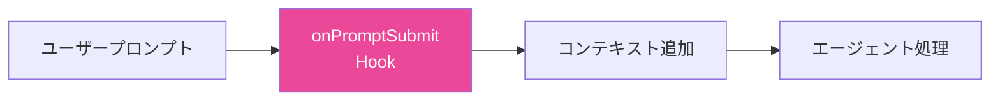
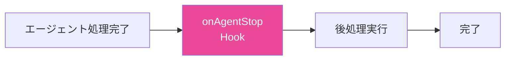
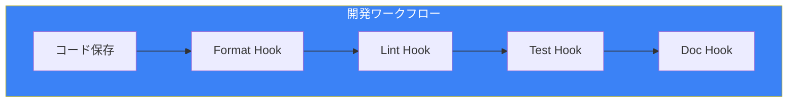

# Day 7: Hooks実践

## 今日学ぶこと

- 高度なHookパターン
- コンテキストHooksの活用
- Hooksの連携とワークフロー
- チーム開発でのベストプラクティス

---

## 高度なHookパターン

Day 6で学んだ基本を発展させ、より実践的なHookパターンを見ていきましょう。

### パターン1: 条件付き実行

ファイルの内容に基づいて異なる処理を行います。

```yaml
# .kiro/hooks/smart-lint.yaml
name: Smart Lint
description: Run appropriate linter based on file type
trigger: onSave
pattern: "src/**/*.{ts,tsx,css,scss}"
action: agent
instructions: |
  A file has been saved: ${file}

  Based on the file extension:
  - For .ts/.tsx files: Run ESLint and fix auto-fixable issues
  - For .css/.scss files: Run Stylelint and fix auto-fixable issues

  Only report errors that couldn't be auto-fixed.
  Keep fixes minimal and non-breaking.
```

### パターン2: 複数ファイルの同期

関連ファイルを自動的に同期します。

```yaml
# .kiro/hooks/sync-types.yaml
name: Sync Type Definitions
description: Keep API types in sync with schema
trigger: onSave
pattern: "prisma/schema.prisma"
action: agent
instructions: |
  The Prisma schema has been updated.

  1. Run `npx prisma generate` to update the client
  2. Check src/types/ for any types that need updating
  3. If API response types don't match the schema, update them
  4. Run TypeScript compiler to verify no type errors

  Report any breaking changes that need manual attention.
```

### パターン3: セキュリティチェック

コードのセキュリティ問題を自動検出します。

```yaml
# .kiro/hooks/security-check.yaml
name: Security Check
description: Check for common security issues
trigger: onSave
pattern: "src/**/*.{ts,tsx}"
action: agent
instructions: |
  Check the saved file for security issues:

  1. Hard-coded secrets (API keys, passwords, tokens)
  2. SQL injection vulnerabilities
  3. XSS vulnerabilities in React components
  4. Unsafe use of eval() or Function()
  5. Insecure random number generation

  If issues are found:
  - Mark the line with a comment: // SECURITY: [issue description]
  - Provide a suggested fix

  Don't make changes automatically for security issues.
```

---

## コンテキストHooks

`onPromptSubmit` と `onAgentStop` は、AIの動作をカスタマイズする強力なHooksです。

### onPromptSubmit の活用



#### 例: プロジェクトルールの強制

```yaml
# .kiro/hooks/enforce-rules.yaml
name: Enforce Project Rules
description: Add project rules to every prompt
trigger: onPromptSubmit
action: agent
instructions: |
  Before processing the user's request, ensure:

  ## Code Style
  - Use functional components with hooks (no class components)
  - All functions must have TypeScript return types
  - Use named exports, not default exports

  ## Naming
  - Components: PascalCase
  - Functions/variables: camelCase
  - Constants: UPPER_SNAKE_CASE

  ## Testing
  - Every new component needs a test file
  - Use React Testing Library, not Enzyme

  Now process the user's request while following these rules.
```

#### 例: コンテキストの自動追加

```yaml
# .kiro/hooks/auto-context.yaml
name: Auto Add Context
description: Automatically include relevant context
trigger: onPromptSubmit
action: agent
instructions: |
  Analyze the user's prompt and automatically include
  relevant context:

  1. If mentioning a component, include its current implementation
  2. If mentioning an API, include the route handler
  3. If mentioning a type, include the type definition
  4. If mentioning tests, include existing test patterns

  Add this context silently before processing the request.
```

### onAgentStop の活用



#### 例: 自動テスト実行

```yaml
# .kiro/hooks/auto-test-run.yaml
name: Auto Test Run
description: Run tests after agent makes changes
trigger: onAgentStop
action: shell
command: "npm test -- --changedSince=HEAD --passWithNoTests"
```

#### 例: コードレビュー

```yaml
# .kiro/hooks/auto-review.yaml
name: Auto Code Review
description: Review changes made by the agent
trigger: onAgentStop
action: agent
instructions: |
  Review the changes just made by the agent:

  1. Check for potential bugs or logic errors
  2. Verify TypeScript types are correct
  3. Ensure error handling is appropriate
  4. Check for performance concerns
  5. Verify the changes match the original request

  If issues are found, list them clearly.
  Don't make automatic changes - just report findings.
```

---

## Hooksの連携

複数のHooksを組み合わせてワークフローを構築します。



### 例: 完全な品質保証ワークフロー

```yaml
# .kiro/hooks/1-format.yaml
name: "1. Format Code"
trigger: onSave
pattern: "src/**/*.{ts,tsx}"
action: shell
command: "npx prettier --write ${file}"
---
# .kiro/hooks/2-lint.yaml
name: "2. Lint Code"
trigger: onSave
pattern: "src/**/*.{ts,tsx}"
action: shell
command: "npx eslint ${file} --fix"
---
# .kiro/hooks/3-typecheck.yaml
name: "3. Type Check"
trigger: onSave
pattern: "src/**/*.{ts,tsx}"
action: shell
command: "npx tsc --noEmit"
```

### 実行順序の制御

Hooksは名前のアルファベット順で実行されます。番号プレフィックスで順序を制御できます：

```
.kiro/hooks/
├── 1-format.yaml      # 最初に実行
├── 2-lint.yaml        # 2番目
├── 3-typecheck.yaml   # 3番目
└── 4-test.yaml        # 最後
```

---

## チーム開発でのベストプラクティス

### 1. Hooksをバージョン管理

`.kiro/hooks/` フォルダをgitで管理し、チーム全体で共有します。

```bash
# .gitignore には含めない
# .kiro/hooks/ はコミットする
```

### 2. 共通Hooksと個人Hooksの分離

```
.kiro/
├── hooks/              # チーム共通（コミット）
│   ├── format.yaml
│   └── lint.yaml
└── hooks-local/        # 個人用（.gitignore）
    └── my-custom.yaml
```

### 3. Hooksのドキュメント化

```yaml
# .kiro/hooks/README.yaml
name: Hooks Documentation
description: |
  ## Available Hooks

  | Hook | Trigger | Description |
  |------|---------|-------------|
  | format | onSave | Auto-format with Prettier |
  | lint | onSave | Run ESLint |
  | test-gen | onCreate | Generate test files |

  ## Setup Requirements
  - Node.js 18+
  - npm packages: prettier, eslint

  ## Customization
  See individual hook files for configuration.
```

### 4. パフォーマンスの考慮

```yaml
# 良い例: 特定のフォルダに限定
pattern: "src/components/**/*.tsx"

# 悪い例: すべてのファイル
pattern: "**/*"
```

### 5. エラーハンドリング

```yaml
# .kiro/hooks/safe-format.yaml
name: Safe Format
trigger: onSave
pattern: "src/**/*.ts"
action: shell
command: "npx prettier --write ${file} || echo 'Format failed, continuing...'"
```

---

## 実践例: プロジェクトセットアップ

新しいプロジェクトで使える包括的なHooksセットを作成します。

### 開発効率化Hooks

```yaml
# .kiro/hooks/dev-format.yaml
name: Dev Format
description: Format code on save
trigger: onSave
pattern: "**/*.{ts,tsx,js,jsx,json,md}"
action: shell
command: "npx prettier --write ${file}"
```

```yaml
# .kiro/hooks/dev-imports.yaml
name: Dev Import Organizer
description: Organize imports on save
trigger: onSave
pattern: "src/**/*.{ts,tsx}"
action: agent
instructions: |
  Organize imports in the saved file:
  1. Group by: external packages, internal modules, relative imports
  2. Sort alphabetically within groups
  3. Remove unused imports
  Keep the changes minimal.
```

### 品質管理Hooks

```yaml
# .kiro/hooks/quality-test-gen.yaml
name: Quality Test Generator
description: Generate tests for new components
trigger: onCreate
pattern: "src/components/**/*.tsx"
action: agent
instructions: |
  A new component was created: ${file}

  Generate a comprehensive test file:
  1. Test rendering without errors
  2. Test all props variations
  3. Test user interactions
  4. Test accessibility basics

  Place in __tests__/ with .test.tsx extension.
```

```yaml
# .kiro/hooks/quality-review.yaml
name: Quality Review
description: Review agent changes
trigger: onAgentStop
action: agent
instructions: |
  Review the recent changes for quality:

  Checklist:
  - [ ] No TypeScript errors
  - [ ] All new functions have return types
  - [ ] Error handling is appropriate
  - [ ] No console.log left in production code
  - [ ] No TODO comments without issue links

  Report any issues found.
```

### ドキュメント更新Hooks

```yaml
# .kiro/hooks/docs-api.yaml
name: Docs API Update
description: Update API documentation
trigger: onSave
pattern: "src/app/api/**/*.ts"
action: agent
instructions: |
  An API route was modified: ${file}

  Update the API documentation:
  1. Check docs/api/ for existing documentation
  2. Update endpoint description if changed
  3. Update request/response examples
  4. Update error codes if changed

  Keep documentation in sync with implementation.
```

---

## まとめ

| パターン | 用途 |
|---------|------|
| **条件付き実行** | ファイル種類に応じた処理 |
| **複数ファイル同期** | 関連ファイルの自動更新 |
| **セキュリティチェック** | 脆弱性の自動検出 |
| **コンテキストHooks** | AI動作のカスタマイズ |
| **Hooks連携** | ワークフローの自動化 |

### 重要ポイント

1. **コンテキストHooksでAIを賢く**
2. **複数Hooksの連携で完全なワークフロー**
3. **チームでHooksを共有・標準化**
4. **パフォーマンスとスコープのバランス**

---

## 練習問題

### 問題1: 基本

`onAgentStop` トリガーを使って、エージェントの変更後に自動的にgit diffを表示するHookを作成してください。

### 問題2: 応用

以下の要件を満たすHooksセットを作成してください：
1. TypeScriptファイル保存時にフォーマット
2. コンポーネント作成時にStorybookストーリーを生成
3. エージェント完了時にTypeScriptエラーをチェック

### チャレンジ問題

`onPromptSubmit` を使って、以下を実現するHookを作成してください：
- ユーザーのプロンプトを分析
- 関連するSpecファイルを自動的にコンテキストに追加
- プロジェクトの技術スタックに合った提案を強制

---

## 参考リンク

- [Kiro Hooks Documentation](https://kiro.dev/docs/hooks/)
- [Hook Best Practices](https://kiro.dev/docs/hooks/best-practices/)
- [Hook Management](https://kiro.dev/docs/hooks/management/)

---

**次回予告**: Day 8では「MCP連携」を学びます。外部ツールやデータソースとKiroを接続する方法を習得しましょう。
