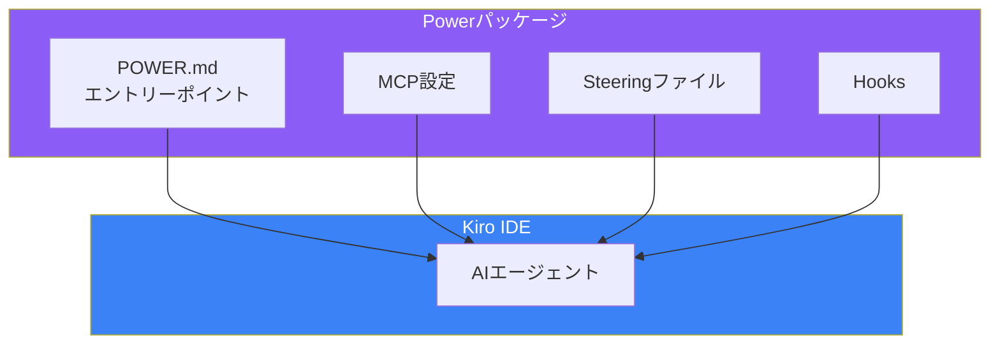
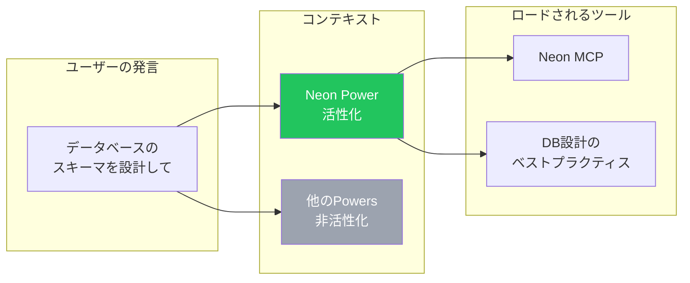
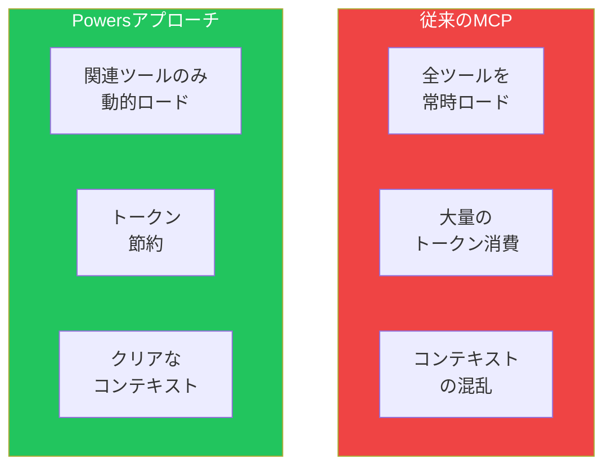

# Day 9: Powers活用

## 今日学ぶこと

- Powersとは何か
- 動的コンテキストローディング
- パートナーPowersの活用
- カスタムPowersの作成

---

## Powersとは

Powersは、MCP、Steering、Hooksを1つのパッケージにまとめた再利用可能な機能拡張です。ワンクリックで専門知識をKiroに追加できます。



### PowersとMCPの違い

| 特徴 | MCP | Powers |
|------|-----|--------|
| **構成要素** | ツールのみ | MCP + Steering + Hooks |
| **コンテキスト** | 常にロード | 動的にロード |
| **専門知識** | ツールの使い方のみ | ベストプラクティス込み |
| **設定** | JSON手動設定 | ワンクリック |

---

## 動的コンテキストローディング

Powersの革新的な点は**動的コンテキストローディング**です。必要なときだけ関連するコンテキストをロードします。



### 従来のアプローチの問題



---

## パートナーPowers

Kiroは主要なテクノロジーパートナーと連携したPowersを提供しています。

### 利用可能なPowers

| Power | カテゴリ | 提供機能 |
|-------|---------|----------|
| **Supabase** | Backend | DB操作、認証、ストレージ |
| **Neon** | Database | PostgreSQL、ブランチング |
| **Stripe** | Payment | 決済、サブスクリプション |
| **Netlify** | Deployment | デプロイ、サーバレス |
| **Postman** | API | APIテスト、ドキュメント |
| **Datadog** | Monitoring | モニタリング、ログ |
| **Dynatrace** | Observability | パフォーマンス分析 |
| **Figma** | Design | デザインシステム |
| **Amazon Aurora** | Database | AWS DB |
| **Strands Agents** | AI | AIエージェント開発 |

### Powersのインストール

#### 方法1: Kiro IDE から

1. Kiroパネルで「Powers」タブを開く
2. 利用可能なPowersを閲覧
3. 「Install」をクリック
4. 必要に応じてAPIキーを設定

#### 方法2: kiro.dev から

1. [kiro.dev/powers](https://kiro.dev/powers) にアクセス
2. 目的のPowerを選択
3. 「Add to Kiro」をクリック

---

## Powerの使用例

### 例1: Supabase Power

```
Supabaseでユーザー認証を実装してください。
- メール/パスワード認証
- Google OAuth
- セッション管理
```

Kiroは自動的に：
1. Supabase Powerをアクティブ化
2. Supabase MCPツールを使用
3. Supabaseのベストプラクティスに従ったコードを生成

### 例2: Neon Power

```
Neonでデータベースのブランチを作成し、
新しいマイグレーションをテストしてください。
```

Kiroは：
1. Neon Powerをアクティブ化
2. ブランチ作成のワークフローを案内
3. マイグレーションのベストプラクティスを適用

### 例3: Stripe Power

```
Stripeでサブスクリプション決済を実装してください。
- 月額プランと年額プラン
- トライアル期間
- Webhook処理
```

Kiroは：
1. Stripe Powerをアクティブ化
2. Stripe APIの最新の推奨パターンを適用
3. Webhookのセキュリティベストプラクティスを含める

---

## Powerの構造

Powerは以下のファイルで構成されます。

```
my-power/
├── POWER.md           # エントリーポイント
├── mcp.json           # MCP設定
├── steering/
│   ├── best-practices.md
│   └── patterns.md
└── hooks/
    └── auto-validate.yaml
```

### POWER.md

Powerのエントリーポイントとなるファイルです。

```markdown
---
name: My Custom Power
version: 1.0.0
description: Custom power for specific workflows
triggers:
  - "database"
  - "schema"
  - "migration"
---

# My Custom Power

## Available Tools

This power provides the following MCP tools:
- `db_query`: Execute database queries
- `db_migrate`: Run migrations

## Best Practices

When working with databases:
1. Always use transactions for multiple operations
2. Add indexes for frequently queried columns
3. Use prepared statements to prevent SQL injection

## Activation

This power activates when you mention:
- Database operations
- Schema design
- Migrations
```

### トリガーキーワード

`triggers` で指定したキーワードがプロンプトに含まれると、Powerが自動的にアクティブ化されます。

---

## カスタムPowersの作成

チーム固有のワークフローをPowerとしてパッケージ化できます。

### Step 1: ディレクトリ構造の作成

```bash
mkdir -p .kiro/powers/my-team-power
cd .kiro/powers/my-team-power
```

### Step 2: POWER.md の作成

```markdown
---
name: My Team Power
version: 1.0.0
description: Team-specific development workflows
triggers:
  - "api"
  - "endpoint"
  - "rest"
---

# My Team API Power

## Purpose

Standardize API development across the team.

## Tools

- Custom API validation
- Auto-documentation generation
- Contract testing

## Guidelines

### API Design

- Use RESTful conventions
- Version APIs with /v1/ prefix
- Return consistent error formats

### Response Format

```json
{
  "data": {},
  "meta": {
    "timestamp": "ISO-8601",
    "version": "1.0"
  }
}
```

### Error Format

```json
{
  "error": {
    "code": "ERROR_CODE",
    "message": "Human readable message",
    "details": {}
  }
}
```
```

### Step 3: Steeringファイルの追加

```markdown
<!-- .kiro/powers/my-team-power/steering/api-patterns.md -->
---
inclusion: always
---

# API Development Patterns

## Endpoint Naming

- Use plural nouns: `/users`, `/products`
- Use kebab-case: `/user-profiles`
- Avoid verbs in URLs

## HTTP Methods

| Method | Usage |
|--------|-------|
| GET | Retrieve resources |
| POST | Create new resource |
| PUT | Full update |
| PATCH | Partial update |
| DELETE | Remove resource |
```

### Step 4: Hooksの追加

```yaml
# .kiro/powers/my-team-power/hooks/validate-api.yaml
name: Validate API
trigger: onSave
pattern: "src/api/**/*.ts"
action: agent
instructions: |
  Validate the API endpoint against team standards:
  1. Check response format matches specification
  2. Verify error handling is consistent
  3. Ensure proper HTTP status codes
```

---

## Powersの共有

### チーム内共有

```bash
# Gitで管理
git add .kiro/powers/my-team-power
git commit -m "Add team API power"
git push
```

### コミュニティ共有

GitHub URLからPowersをインポートできます：

```
Power URL: https://github.com/myorg/my-power
```

---

## Powersのベストプラクティス

### 1. 明確なトリガー設定

```yaml
# 良い例: 具体的なトリガー
triggers:
  - "supabase"
  - "auth"
  - "realtime"

# 悪い例: 曖昧なトリガー
triggers:
  - "database"  # 他のDB Powerと競合
```

### 2. 段階的なコンテキスト

```markdown
# POWER.md

## Quick Reference
（基本的な使い方を簡潔に）

## Detailed Guide
（詳細な説明は参照時のみ）
```

### 3. バージョン管理

```yaml
---
name: My Power
version: 2.0.0
breaking_changes:
  - "Removed deprecated tool X"
  - "Changed response format"
---
```

---

## まとめ

| 概念 | 説明 |
|------|------|
| **Powers** | MCP + Steering + Hooksのパッケージ |
| **動的ロード** | 必要なときだけコンテキストをロード |
| **トリガー** | キーワードでPowerを自動アクティブ化 |
| **パートナー** | 主要サービスとの公式連携 |

### 重要ポイント

1. **Powersでワンクリック機能追加**
2. **動的ローディングでコンテキスト最適化**
3. **チーム固有のワークフローをPower化**
4. **トリガーで必要なときだけアクティブ化**

---

## 練習問題

### 問題1: 基本

利用可能なパートナーPowersを確認し、1つをインストールしてください。そのPowerの機能を使って簡単なタスクを実行してください。

### 問題2: 応用

以下の要件を満たすカスタムPowerを作成してください：
- トリガー: "component", "ui", "react"
- 内容: Reactコンポーネント開発のベストプラクティス
- Hook: コンポーネント保存時の自動チェック

### チャレンジ問題

チームの開発ワークフローをPowerとしてパッケージ化してください：
1. API開発ガイドライン
2. テスト戦略
3. コードレビューチェックリスト

GitHubリポジトリで共有できる形式で作成してください。

---

## 参考リンク

- [Kiro Powers](https://kiro.dev/powers/)
- [Introducing Kiro Powers Blog](https://kiro.dev/blog/introducing-powers/)
- [Creating Custom Powers](https://kiro.dev/docs/powers/custom/)

---

**次回予告**: Day 10では「Kiro CLI & 総合演習」を学びます。CLIの使い方と、これまで学んだすべてを組み合わせた実践的なワークフローを習得しましょう。
