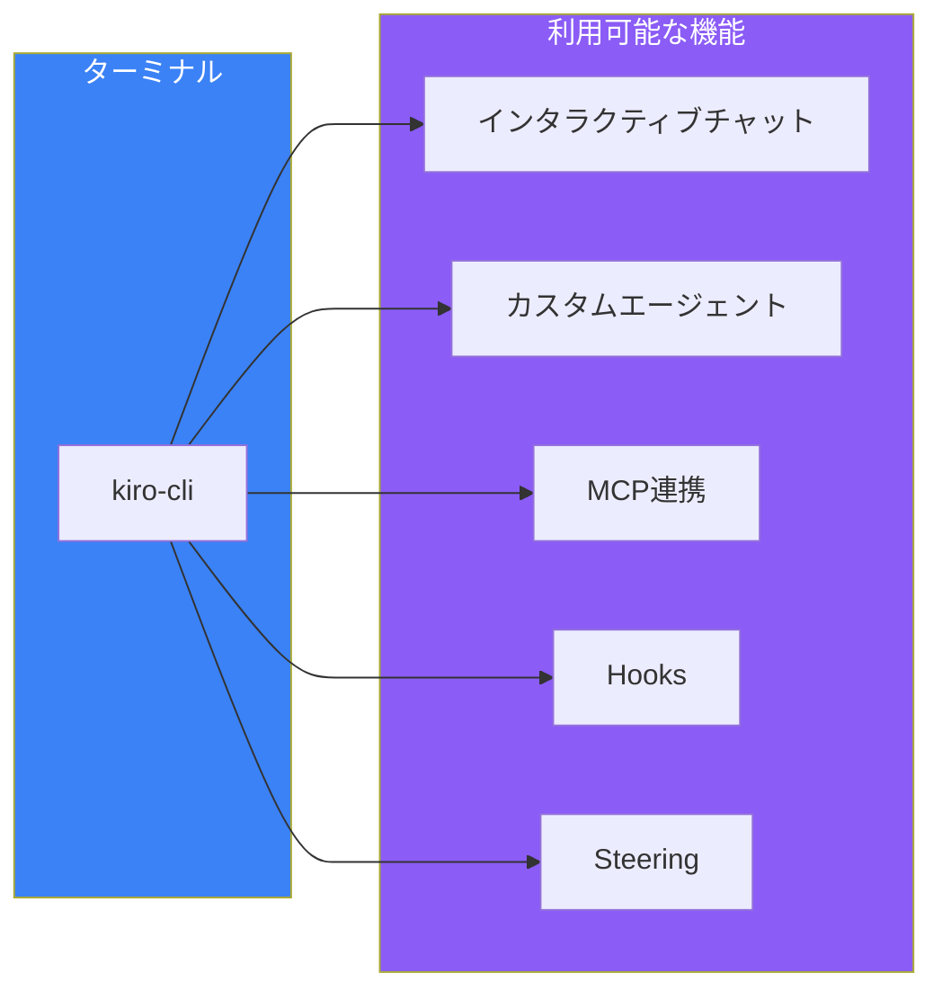
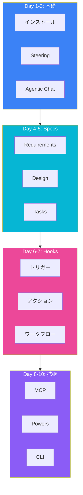
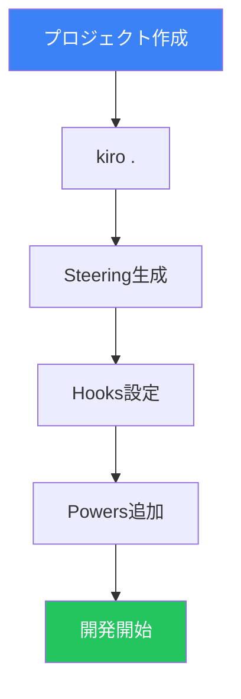
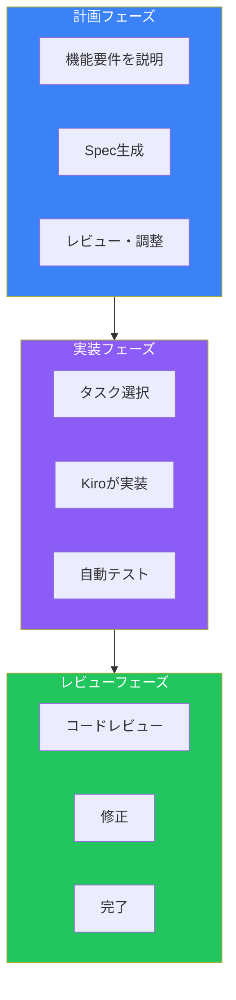

# Day 10: Kiro CLI & 総合演習

## 今日学ぶこと

- Kiro CLIの基本
- ターミナルからのKiro活用
- 10日間の総まとめ
- 実践的な開発ワークフロー

---

## Kiro CLIとは

Kiro CLIは、ターミナルからKiroの機能を使えるコマンドラインインターフェースです。IDEを開かずにAIアシスタントを活用できます。



### IDE版との違い

| 機能 | Kiro IDE | Kiro CLI |
|------|----------|----------|
| **インターフェース** | GUI | ターミナル |
| **チャット** | パネル | インタラクティブ |
| **ファイル編集** | エディタ | 自動/確認 |
| **Specs** | UIで管理 | ファイル直接 |
| **Hooks** | GUI設定 | 設定ファイル |

---

## インストールと基本操作

### インストール

```bash
curl -fsSL https://cli.kiro.dev/install | bash
```

macOSとLinuxで利用可能です。

### 基本的な使い方

```bash
# プロジェクトディレクトリで起動
cd my-project
kiro-cli
```

### 対話モード

```
$ kiro-cli

Welcome to Kiro CLI!

You: プロジェクトの構造を説明してください

Kiro: このプロジェクトはNext.js 15を使用したWebアプリケーションです...

You: /exit
Goodbye!
```

---

## CLIコマンド

### 基本コマンド

| コマンド | 説明 |
|---------|------|
| `kiro-cli` | 対話モードを開始 |
| `kiro-cli "プロンプト"` | 単発のプロンプトを実行 |
| `kiro-cli --help` | ヘルプを表示 |
| `kiro-cli --version` | バージョンを表示 |

### 対話モード内のコマンド

| コマンド | 説明 |
|---------|------|
| `/exit` | 対話を終了 |
| `/clear` | 会話履歴をクリア |
| `/help` | コマンド一覧を表示 |
| `/model` | モデルを切り替え |

### 使用例

```bash
# 単発の質問
kiro-cli "このファイルの問題点を指摘してください" < src/api.ts

# パイプで入力
cat error.log | kiro-cli "このエラーの原因を分析してください"

# 対話モード
kiro-cli
```

---

## CLIでのワークフロー

### コードレビュー

```bash
# git diffの結果をレビュー
git diff | kiro-cli "このコード変更をレビューしてください"
```

### バグ修正

```bash
# エラーログを分析
npm run build 2>&1 | kiro-cli "このビルドエラーを修正する方法を教えてください"
```

### ドキュメント生成

```bash
# ファイルからREADMEを生成
kiro-cli "src/utils/フォルダの関数についてREADMEを生成してください"
```

---

## 10日間の総まとめ

これまで学んだKiroの機能を振り返りましょう。



### 機能マップ

| Day | 機能 | 目的 |
|-----|------|------|
| 1 | インストール・基礎 | Kiroの概要理解 |
| 2 | Steering | プロジェクト知識の共有 |
| 3 | Agentic Chat | 効果的な対話 |
| 4 | Specs (Requirements) | 要件の明確化 |
| 5 | Specs (Design/Tasks) | 設計とタスク管理 |
| 6 | Hooks基礎 | イベント駆動自動化 |
| 7 | Hooks実践 | 高度な自動化 |
| 8 | MCP | 外部ツール連携 |
| 9 | Powers | ワンクリック機能追加 |
| 10 | CLI・総合 | ターミナル活用・統合 |

---

## 実践的な開発ワークフロー

すべての機能を組み合わせた実践的なワークフローを構築しましょう。

### プロジェクト初期設定



#### 1. Steeringの設定

```bash
# Kiroでプロジェクトを開く
kiro .

# Steeringドキュメントを生成
# (Kiroパネルから "Generate Steering Docs")
```

#### 2. 基本Hooksの設定

```yaml
# .kiro/hooks/format.yaml
name: Auto Format
trigger: onSave
pattern: "**/*.{ts,tsx}"
action: shell
command: "npx prettier --write ${file}"
```

```yaml
# .kiro/hooks/lint.yaml
name: Auto Lint
trigger: onSave
pattern: "**/*.{ts,tsx}"
action: shell
command: "npx eslint ${file} --fix"
```

#### 3. Powers の追加

必要なPowersをインストール（Supabase、Stripe等）

### 機能開発フロー



#### Step 1: 機能の要件定義

```
ユーザー通知機能を追加してください。
- メール通知
- プッシュ通知
- アプリ内通知
- 通知設定のカスタマイズ
```

#### Step 2: Specの生成と確認

Kiroが生成したRequirements、Design、Tasksを確認

#### Step 3: タスクの実行

```
T1: 通知モデルの作成から開始してください
```

#### Step 4: 自動検証

Hooksが自動的に：
- フォーマット
- リント
- 型チェック
- テスト実行

#### Step 5: レビューと修正

```
#git diff

この変更をレビューしてください。
特にセキュリティの観点から確認してください。
```

---

## ベストプラクティスまとめ

### Steering

- **3つの基本ファイルを最新に保つ**
- **fileMatchで必要なときだけロード**
- **具体例とコードを含める**

### Specs

- **EARS構文で曖昧さを排除**
- **タスクは小さく、依存関係を明示**
- **Specとコードを同期**

### Hooks

- **保存時の自動チェックを設定**
- **チームで共有・標準化**
- **パフォーマンスを考慮したパターン設定**

### MCP & Powers

- **必要なツールだけ有効化**
- **環境変数で機密情報管理**
- **チーム固有のPowersを作成**

---

## トラブルシューティング

### よくある問題

| 問題 | 解決策 |
|------|--------|
| Kiroの応答が遅い | Steeringファイルを最適化、不要なMCPを無効化 |
| Hooksが動作しない | パターンとトリガーを確認、ログを確認 |
| MCPに接続できない | 環境変数と前提条件を確認 |
| Specが正しく生成されない | 要件の説明を具体的に |

### デバッグ方法

```bash
# Kiro CLIのログを確認
kiro-cli --verbose

# MCP接続をテスト
# (Kiroパネル > Output > Kiro - MCP Logs)

# Hookの実行ログを確認
# (Kiroパネル > Output > Kiro - Hooks)
```

---

## 次のステップ

10日間のKiro学習を完了しました。さらに深く学ぶために：

### 公式リソース

- [Kiro Documentation](https://kiro.dev/docs/)
- [Kiro Blog](https://kiro.dev/blog/)
- [Kiro GitHub](https://github.com/kirodotdev/Kiro)

### コミュニティ

- Kiroフォーラムに参加
- カスタムPowersを共有
- フィードバックを送信

### 実践

- 実際のプロジェクトでKiroを使用
- チームにKiroを導入
- ワークフローを継続的に改善

---

## まとめ

| Day | 学んだこと |
|-----|-----------|
| 1 | Kiroの基礎、インストール |
| 2 | Steeringでプロジェクト知識を共有 |
| 3 | Agentic Chatで効果的に対話 |
| 4 | Specsで要件を明確化 |
| 5 | Design/Tasksで設計と実装管理 |
| 6 | Hooksでイベント駆動自動化 |
| 7 | 高度なHooksパターン |
| 8 | MCPで外部ツール連携 |
| 9 | Powersでワンクリック機能追加 |
| 10 | CLI活用と総合ワークフロー |

### Kiro習得の鍵

1. **Spec駆動開発を実践する**
2. **Steeringでプロジェクト知識を蓄積する**
3. **Hooksで反復作業を自動化する**
4. **MCPとPowersで能力を拡張する**
5. **継続的にワークフローを改善する**

---

## 最終練習問題

### 総合演習

以下の要件でミニプロジェクトを作成してください：

1. **Steeringの設定**
   - product.md: TODOアプリ
   - tech.md: Next.js + TypeScript
   - structure.md: 適切な構成

2. **Specsの作成**
   - タスク追加機能のRequirements
   - Design（API設計、コンポーネント設計）
   - Tasks分解

3. **Hooksの設定**
   - 保存時の自動フォーマット
   - コンポーネント作成時のテスト生成

4. **実装**
   - Specsに基づいてタスクを実行
   - Kiroの提案を活用

5. **レビュー**
   - `#git diff` でコードレビュー
   - 改善点を反映

### 評価ポイント

- [ ] Steeringが適切に設定されている
- [ ] SpecsがEARS構文で書かれている
- [ ] Hooksが動作している
- [ ] コードがSpecsと一致している
- [ ] テストが追加されている

---

## 参考リンク

- [Kiro CLI Documentation](https://kiro.dev/docs/cli/)
- [Kiro Best Practices](https://kiro.dev/docs/best-practices/)
- [Kiro Changelog](https://kiro.dev/changelog/)

---

**おめでとうございます！** 10日間のKiro学習を完了しました。これからはKiroを活用して、より効率的で品質の高い開発を実現してください。
