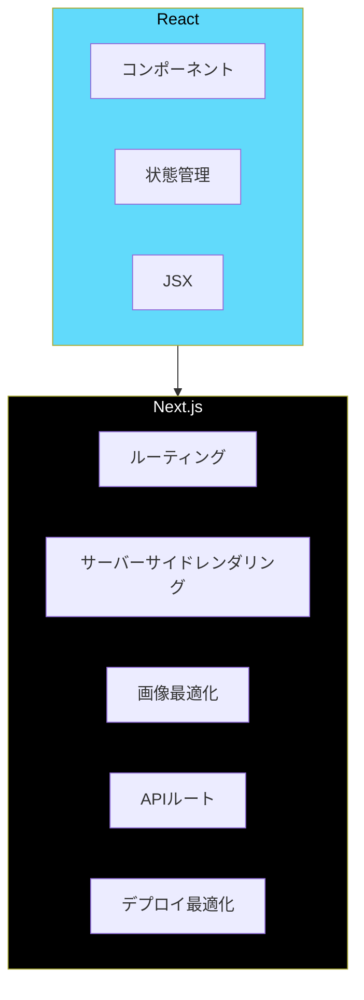
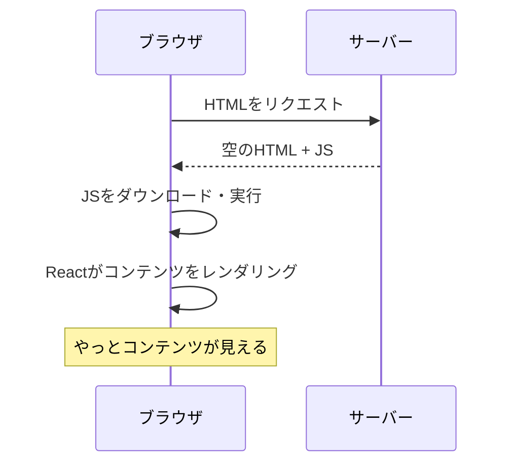
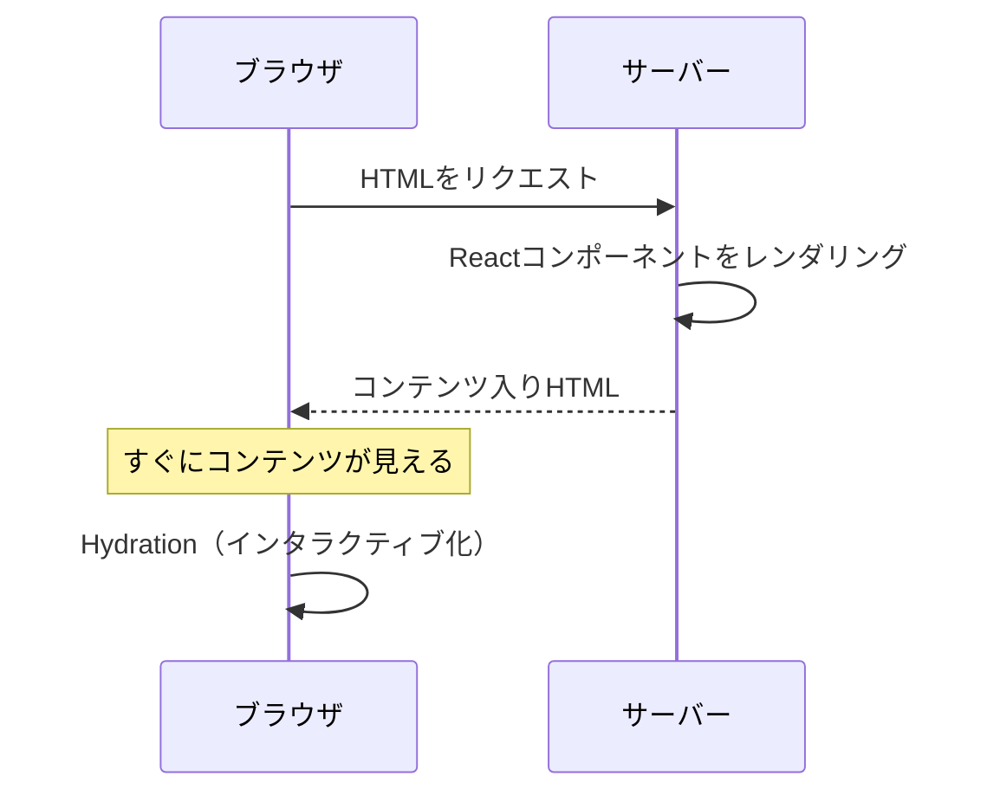
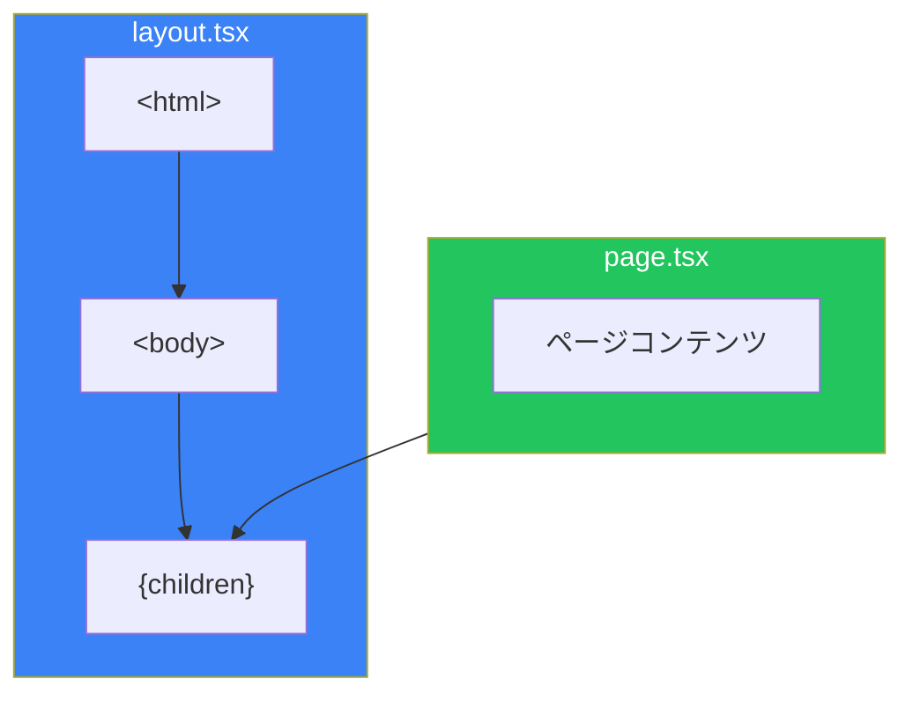
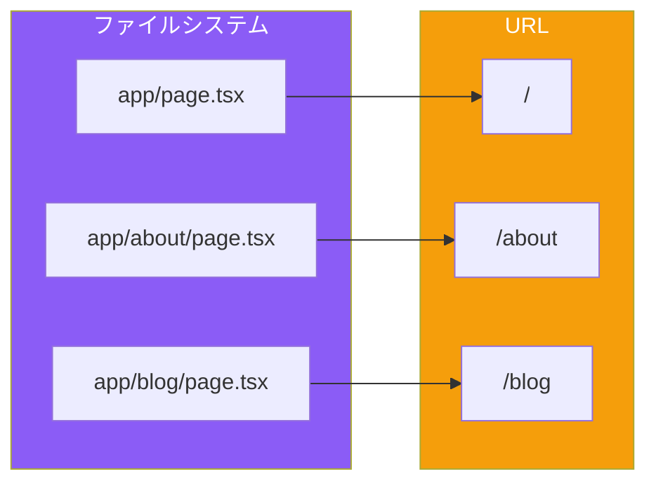

# Day 1: Next.jsへようこそ

## 今日学ぶこと

- Next.jsとは何か、Reactとの関係性
- なぜNext.jsを使うのか
- App Routerの概要
- プロジェクトのセットアップ
- ディレクトリ構造の理解

---

## Next.jsとは

**Next.js**は、Vercel社が開発したReactベースのフルスタックWebフレームワークです。Reactが提供する「UIを構築するためのライブラリ」という機能に加えて、ルーティング、サーバーサイドレンダリング、最適化など、本格的なWebアプリケーションに必要な機能を提供します。



### ReactとNext.jsの関係

Reactは「UIを構築するためのライブラリ」です。コンポーネント、状態管理、JSXといった強力な機能を提供しますが、以下のような機能は含まれていません：

- **ルーティング**: ページ間のナビゲーション
- **サーバーサイドレンダリング**: SEOやパフォーマンスの向上
- **ビルド最適化**: 本番環境向けの最適化
- **ファイル構成の規約**: プロジェクト構造のベストプラクティス

Next.jsは、これらの機能をReactの上に構築し、すぐに本格的なアプリケーション開発を始められる環境を提供します。

---

## なぜNext.jsを使うのか

### 1. サーバーサイドレンダリング（SSR）

従来のReactアプリケーション（Create React Appなど）は、クライアントサイドでのみレンダリングされます。これには問題があります：



Next.jsでは、サーバーでHTMLを生成して送信できます：



### 2. ファイルベースルーティング

URLの構造がファイルシステムの構造と一致します。設定ファイルなしでルーティングが完成します。

```
app/
├── page.tsx          → /
├── about/
│   └── page.tsx      → /about
└── blog/
    ├── page.tsx      → /blog
    └── [slug]/
        └── page.tsx  → /blog/記事スラッグ
```

### 3. Server Components

Next.js 13以降のApp Routerでは、**React Server Components**がデフォルトで有効です。サーバーでのみ実行されるコンポーネントにより、以下が実現できます：

- データベースへの直接アクセス
- APIキーなどの機密情報をクライアントに露出しない
- JavaScriptバンドルサイズの削減

### 4. 本番対応の最適化

- 自動的なコード分割
- 画像の最適化
- フォントの最適化
- 静的・動的レンダリングの自動判定

---

## プロジェクトのセットアップ

Next.jsプロジェクトを作成しましょう。

### 新規プロジェクトの作成

```bash
npx create-next-app@latest my-nextjs-app
```

インタラクティブな質問に答えます：

```
✔ Would you like to use TypeScript? … Yes
✔ Would you like to use ESLint? … Yes
✔ Would you like to use Tailwind CSS? … Yes
✔ Would you like your code inside a `src/` directory? … Yes
✔ Would you like to use App Router? (recommended) … Yes
✔ Would you like to use Turbopack for next dev? … Yes
✔ Would you like to customize the import alias (@/*)? … No
```

### 開発サーバーの起動

```bash
cd my-nextjs-app
npm run dev
```

ブラウザで `http://localhost:3000` を開くと、Next.jsのウェルカムページが表示されます。

---

## ディレクトリ構造

作成されたプロジェクトの構造を確認しましょう：

```
my-nextjs-app/
├── src/
│   └── app/                 # App Router のルート
│       ├── layout.tsx       # ルートレイアウト
│       ├── page.tsx         # ホームページ
│       ├── globals.css      # グローバルCSS
│       └── favicon.ico      # ファビコン
├── public/                  # 静的ファイル
├── next.config.ts           # Next.js設定
├── tailwind.config.ts       # Tailwind CSS設定
├── tsconfig.json            # TypeScript設定
└── package.json             # 依存関係
```

### 重要なファイルの役割

| ファイル | 役割 |
|----------|------|
| `app/layout.tsx` | 全ページ共通のレイアウト（html, body タグを含む） |
| `app/page.tsx` | `/` にアクセスした時に表示されるページ |
| `next.config.ts` | Next.jsの動作設定 |
| `public/` | 画像などの静的ファイル置き場 |

---

## 最初のページを編集する

`src/app/page.tsx` を開いて、シンプルなページに書き換えましょう：

```tsx
export default function HomePage() {
  return (
    <main className="min-h-screen flex items-center justify-center">
      <div className="text-center">
        <h1 className="text-4xl font-bold mb-4">
          Welcome to My Next.js App
        </h1>
        <p className="text-gray-600">
          Next.jsで作った最初のページです
        </p>
      </div>
    </main>
  );
}
```

ファイルを保存すると、ブラウザが自動的に更新されます（Hot Module Replacement）。

---

## レイアウトを理解する

`src/app/layout.tsx` を見てみましょう：

```tsx
import type { Metadata } from "next";
import { Inter } from "next/font/google";
import "./globals.css";

const inter = Inter({ subsets: ["latin"] });

export const metadata: Metadata = {
  title: "Create Next App",
  description: "Generated by create next app",
};

export default function RootLayout({
  children,
}: {
  children: React.ReactNode;
}) {
  return (
    <html lang="en">
      <body className={inter.className}>{children}</body>
    </html>
  );
}
```

### ポイント

1. **`<html>` と `<body>` タグ**: ルートレイアウトには必須
2. **`children`**: 現在のページの内容がここに挿入される
3. **`metadata`**: ページのタイトルや説明（SEO用）
4. **フォント設定**: `next/font` でフォントを最適化



---

## 新しいページを追加する

`/about` ページを作成しましょう。

### ファイルを作成

```bash
mkdir -p src/app/about
```

`src/app/about/page.tsx` を作成：

```tsx
export default function AboutPage() {
  return (
    <main className="min-h-screen p-8">
      <h1 className="text-3xl font-bold mb-4">About Us</h1>
      <p className="text-gray-600">
        これはAboutページです。
      </p>
    </main>
  );
}
```

ブラウザで `http://localhost:3000/about` にアクセスすると、新しいページが表示されます。

### ルーティングの仕組み



---

## ナビゲーションを追加する

ページ間を移動できるようにしましょう。Next.jsでは `Link` コンポーネントを使います。

### Linkコンポーネント

`src/app/page.tsx` を更新：

```tsx
import Link from "next/link";

export default function HomePage() {
  return (
    <main className="min-h-screen flex items-center justify-center">
      <div className="text-center">
        <h1 className="text-4xl font-bold mb-4">
          Welcome to My Next.js App
        </h1>
        <p className="text-gray-600 mb-8">
          Next.jsで作った最初のページです
        </p>
        <Link
          href="/about"
          className="text-blue-600 hover:underline"
        >
          About ページへ →
        </Link>
      </div>
    </main>
  );
}
```

### なぜ `<a>` ではなく `Link` を使うのか

| 方法 | 動作 |
|------|------|
| `<a href="/about">` | ページ全体をリロード |
| `<Link href="/about">` | クライアントサイドナビゲーション（高速） |

`Link` コンポーネントは、ページ遷移時にJavaScriptのみで画面を更新します。これにより：

- **高速**: 全ページを再読み込みしない
- **状態保持**: アプリケーションの状態が維持される
- **プリフェッチ**: リンクがビューポートに入ると事前読み込み

---

## まとめ

| 概念 | 説明 |
|------|------|
| Next.js | Reactベースのフルスタックフレームワーク |
| App Router | ファイルベースのルーティングシステム |
| layout.tsx | 複数ページで共有されるレイアウト |
| page.tsx | 各URLに対応するページコンポーネント |
| Link | クライアントサイドナビゲーション用コンポーネント |

### 重要ポイント

1. **Next.jsはReactを拡張する**: Reactの知識がそのまま活かせる
2. **ファイル = ルート**: ファイルを作るだけでページができる
3. **サーバーファースト**: デフォルトでサーバーサイドレンダリング
4. **開発体験が良い**: Hot Reload、TypeScript対応

---

## 練習問題

### 問題1: 基本
`/contact` ページを作成し、「お問い合わせ」という見出しと連絡先情報を表示してください。

### 問題2: 応用
ホームページに、`/about` と `/contact` へのナビゲーションリンクを並べて表示してください。

### チャレンジ問題
共通のナビゲーションバーを `layout.tsx` に追加し、全ページで表示されるようにしてください。

---

## 参考リンク

- [Next.js 公式ドキュメント](https://nextjs.org/docs)
- [Next.js インストールガイド](https://nextjs.org/docs/getting-started/installation)
- [App Router 入門](https://nextjs.org/docs/app)

---

**次回予告**: Day 2では「App Routerとルーティング」について深く学びます。動的ルーティング、ルートグループ、そして特殊なファイル（loading.tsx、error.tsx）について探求します。
