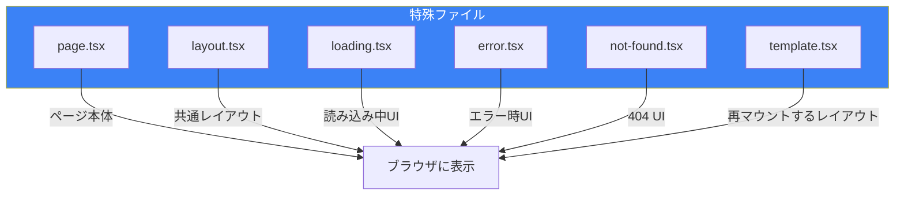
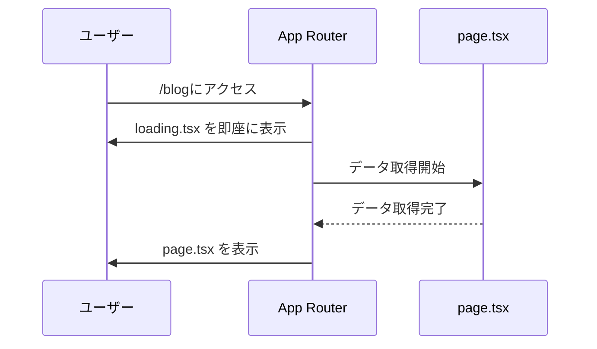
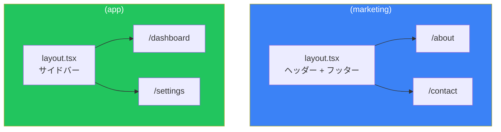
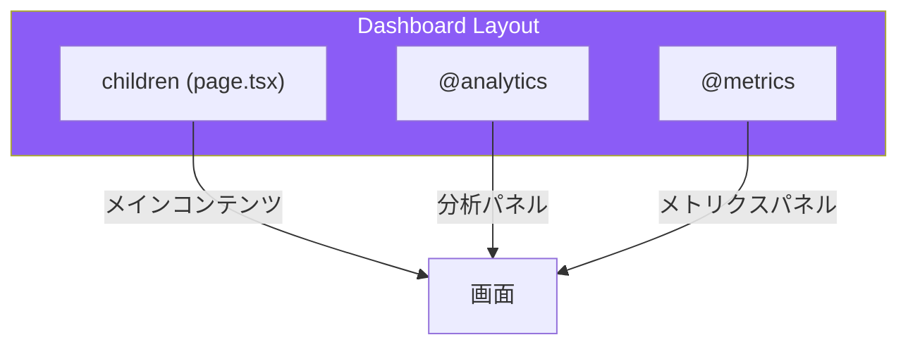

# Day 2: App Routerとルーティング

## 今日学ぶこと

- App Routerの特殊ファイル
- 動的ルーティング（[slug]）
- ルートグループ（(group)）
- パラレルルートとインターセプトルート
- loading.tsx、error.tsx、not-found.tsx

---

## App Routerの特殊ファイル

App Routerでは、ファイル名に特別な意味があります。これらを**規約（Convention）**と呼びます。



### 各ファイルの役割

| ファイル | 役割 | 表示タイミング |
|----------|------|----------------|
| `page.tsx` | ページのメインコンテンツ | URLにアクセスした時 |
| `layout.tsx` | 共通レイアウト（状態保持） | 常に |
| `loading.tsx` | ローディングUI | データ取得中 |
| `error.tsx` | エラーUI | エラー発生時 |
| `not-found.tsx` | 404ページ | ページが見つからない時 |
| `template.tsx` | レイアウト（状態リセット） | ナビゲーション時に再マウント |

---

## loading.tsxでローディングUIを表示

データ取得中に自動的に表示されるローディングUIを作成できます。

```tsx
// src/app/blog/loading.tsx
export default function BlogLoading() {
  return (
    <div className="animate-pulse">
      <div className="h-8 bg-gray-200 rounded w-1/3 mb-4"></div>
      <div className="space-y-3">
        <div className="h-4 bg-gray-200 rounded"></div>
        <div className="h-4 bg-gray-200 rounded w-5/6"></div>
        <div className="h-4 bg-gray-200 rounded w-4/6"></div>
      </div>
    </div>
  );
}
```

### 仕組み



Reactの `<Suspense>` を使って、Next.jsが自動的にローディング状態を処理します。

---

## error.tsxでエラーをハンドリング

エラーが発生した時に表示するUIを定義できます。

```tsx
// src/app/blog/error.tsx
"use client"; // Error componentは必ずClient Component

import { useEffect } from "react";

export default function BlogError({
  error,
  reset,
}: {
  error: Error & { digest?: string };
  reset: () => void;
}) {
  useEffect(() => {
    console.error(error);
  }, [error]);

  return (
    <div className="text-center py-10">
      <h2 className="text-2xl font-bold text-red-600 mb-4">
        エラーが発生しました
      </h2>
      <p className="text-gray-600 mb-4">{error.message}</p>
      <button
        onClick={reset}
        className="px-4 py-2 bg-blue-600 text-white rounded hover:bg-blue-700"
      >
        もう一度試す
      </button>
    </div>
  );
}
```

### 重要なポイント

- `"use client"` が必須（イベントハンドラを使うため）
- `reset` 関数で再レンダリングを試行できる
- エラーは親のlayoutには影響しない（エラー境界として機能）

---

## not-found.tsxで404ページをカスタマイズ

存在しないページにアクセスした時のUIを定義します。

```tsx
// src/app/not-found.tsx
import Link from "next/link";

export default function NotFound() {
  return (
    <div className="min-h-screen flex items-center justify-center">
      <div className="text-center">
        <h1 className="text-6xl font-bold text-gray-300 mb-4">404</h1>
        <h2 className="text-2xl font-semibold mb-2">
          ページが見つかりません
        </h2>
        <p className="text-gray-600 mb-6">
          お探しのページは存在しないか、移動した可能性があります。
        </p>
        <Link
          href="/"
          className="px-4 py-2 bg-blue-600 text-white rounded hover:bg-blue-700"
        >
          ホームに戻る
        </Link>
      </div>
    </div>
  );
}
```

プログラムから404を発生させることもできます：

```tsx
import { notFound } from "next/navigation";

export default async function BlogPost({ params }: { params: { slug: string } }) {
  const post = await getPost(params.slug);

  if (!post) {
    notFound(); // not-found.tsxが表示される
  }

  return <article>{/* ... */}</article>;
}
```

---

## 動的ルーティング

URLの一部を変数として受け取る動的なルートを作成できます。

### 基本的な動的ルート

```
app/
└── blog/
    └── [slug]/
        └── page.tsx    → /blog/hello-world, /blog/nextjs-guide など
```

```tsx
// src/app/blog/[slug]/page.tsx
type Props = {
  params: Promise<{ slug: string }>;
};

export default async function BlogPost({ params }: Props) {
  const { slug } = await params;

  return (
    <article>
      <h1>記事: {slug}</h1>
    </article>
  );
}
```

### 複数のセグメント

```
app/
└── shop/
    └── [category]/
        └── [product]/
            └── page.tsx    → /shop/electronics/iphone
```

```tsx
// src/app/shop/[category]/[product]/page.tsx
type Props = {
  params: Promise<{
    category: string;
    product: string;
  }>;
};

export default async function ProductPage({ params }: Props) {
  const { category, product } = await params;

  return (
    <div>
      <p>カテゴリ: {category}</p>
      <p>商品: {product}</p>
    </div>
  );
}
```

### Catch-allルート

```
app/
└── docs/
    └── [...slug]/
        └── page.tsx    → /docs/a, /docs/a/b, /docs/a/b/c
```

```tsx
// src/app/docs/[...slug]/page.tsx
type Props = {
  params: Promise<{ slug: string[] }>;
};

export default async function DocsPage({ params }: Props) {
  const { slug } = await params;
  // /docs/getting-started/installation → ["getting-started", "installation"]

  return (
    <div>
      <p>パス: {slug.join(" / ")}</p>
    </div>
  );
}
```

### Optional Catch-all

```
app/
└── docs/
    └── [[...slug]]/
        └── page.tsx    → /docs, /docs/a, /docs/a/b
```

二重の角括弧 `[[...slug]]` で、ルートパス（`/docs`）も含めてマッチします。

---

## ルートグループ

フォルダ名を括弧で囲むと、URLに影響を与えずにルートをグループ化できます。

### 用途1: レイアウトの共有

```
app/
├── (marketing)/
│   ├── layout.tsx      # マーケティングページ用レイアウト
│   ├── about/
│   │   └── page.tsx    → /about
│   └── contact/
│       └── page.tsx    → /contact
└── (app)/
    ├── layout.tsx      # アプリ用レイアウト
    ├── dashboard/
    │   └── page.tsx    → /dashboard
    └── settings/
        └── page.tsx    → /settings
```



### 用途2: コードの整理

```
app/
├── (auth)/
│   ├── login/
│   │   └── page.tsx    → /login
│   └── register/
│       └── page.tsx    → /register
└── (main)/
    └── page.tsx        → /
```

---

## パラレルルート

同じURLで複数のページを同時にレンダリングできます。ダッシュボードのような複雑なUIに便利です。

### ディレクトリ構造

```
app/
└── dashboard/
    ├── layout.tsx
    ├── page.tsx
    ├── @analytics/
    │   └── page.tsx
    └── @metrics/
        └── page.tsx
```

### レイアウトでスロットを受け取る

```tsx
// src/app/dashboard/layout.tsx
export default function DashboardLayout({
  children,
  analytics,
  metrics,
}: {
  children: React.ReactNode;
  analytics: React.ReactNode;
  metrics: React.ReactNode;
}) {
  return (
    <div className="grid grid-cols-2 gap-4">
      <div className="col-span-2">{children}</div>
      <div>{analytics}</div>
      <div>{metrics}</div>
    </div>
  );
}
```



---

## インターセプトルート

現在のページを離れずに、別のルートをモーダルとして表示できます。

### ユースケース

- 写真ギャラリーで、クリックした写真をモーダルで表示
- ログインフォームをモーダルで表示
- 商品のクイックビュー

### ディレクトリ構造

```
app/
├── @modal/
│   └── (.)photo/
│       └── [id]/
│           └── page.tsx    # モーダル版
├── photo/
│   └── [id]/
│       └── page.tsx        # フルページ版
└── layout.tsx
```

### インターセプトの記法

| 記法 | 説明 |
|------|------|
| `(.)` | 同じレベル |
| `(..)` | 1つ上のレベル |
| `(..)(..)` | 2つ上のレベル |
| `(...)` | ルートから |

---

## searchParamsの取得

URLのクエリパラメータを取得できます。

```tsx
// /search?q=nextjs&page=2
type Props = {
  searchParams: Promise<{ q?: string; page?: string }>;
};

export default async function SearchPage({ searchParams }: Props) {
  const { q, page } = await searchParams;

  return (
    <div>
      <h1>検索結果: {q}</h1>
      <p>ページ: {page || 1}</p>
    </div>
  );
}
```

---

## プログラムによるナビゲーション

クライアントコンポーネントでは、`useRouter` フックを使ってナビゲーションを制御できます。

```tsx
"use client";

import { useRouter } from "next/navigation";

export default function NavigationButtons() {
  const router = useRouter();

  return (
    <div className="space-x-4">
      <button onClick={() => router.push("/dashboard")}>
        ダッシュボードへ
      </button>
      <button onClick={() => router.back()}>
        戻る
      </button>
      <button onClick={() => router.refresh()}>
        更新
      </button>
    </div>
  );
}
```

### useRouterのメソッド

| メソッド | 説明 |
|----------|------|
| `push(url)` | 指定URLに移動 |
| `replace(url)` | 履歴を置き換えて移動 |
| `back()` | 前のページに戻る |
| `forward()` | 次のページに進む |
| `refresh()` | 現在のページを更新 |
| `prefetch(url)` | ページをプリフェッチ |

---

## まとめ

| 概念 | 説明 |
|------|------|
| 特殊ファイル | page, layout, loading, error, not-found |
| 動的ルート | `[slug]`, `[...slug]`, `[[...slug]]` |
| ルートグループ | `(group)` でURLに影響なくグループ化 |
| パラレルルート | `@slot` で同時に複数ビューを表示 |
| インターセプト | `(.)`, `(..)` などでモーダル表示 |

### 重要ポイント

1. **規約ベース**: ファイル名に意味がある
2. **自動ローディング**: loading.tsxでSuspense境界を自動作成
3. **エラー境界**: error.tsxでエラーを局所化
4. **柔軟なルーティング**: 動的、グループ、パラレル、インターセプト

---

## 練習問題

### 問題1: 基本
`/products/[id]` の動的ルートを作成し、商品IDを表示してください。

### 問題2: 応用
ブログセクション（`/blog`, `/blog/[slug]`）にカスタムの `loading.tsx` と `error.tsx` を追加してください。

### チャレンジ問題
`(marketing)` と `(app)` のルートグループを作成し、それぞれに異なるレイアウト（ヘッダー有無など）を適用してください。

---

## 参考リンク

- [Routing Fundamentals](https://nextjs.org/docs/app/building-your-application/routing)
- [Dynamic Routes](https://nextjs.org/docs/app/building-your-application/routing/dynamic-routes)
- [Route Groups](https://nextjs.org/docs/app/building-your-application/routing/route-groups)
- [Parallel Routes](https://nextjs.org/docs/app/building-your-application/routing/parallel-routes)

---

**次回予告**: Day 3では「Server ComponentsとClient Components」について学びます。どちらをいつ使うか、コンポーネント境界の設計について深く探求します。
