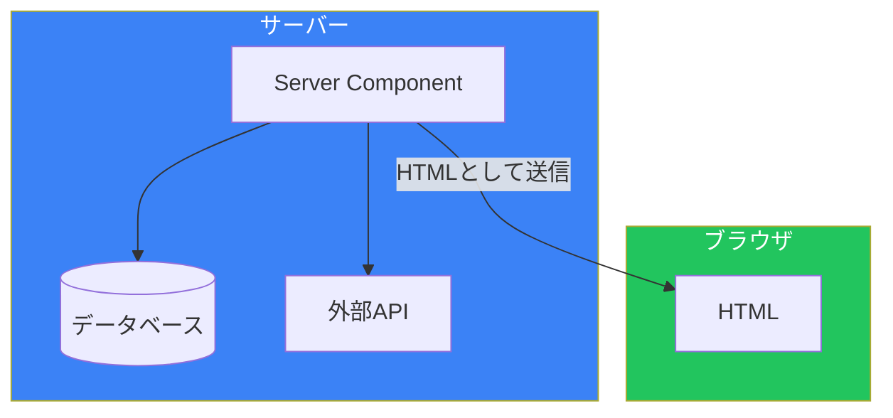
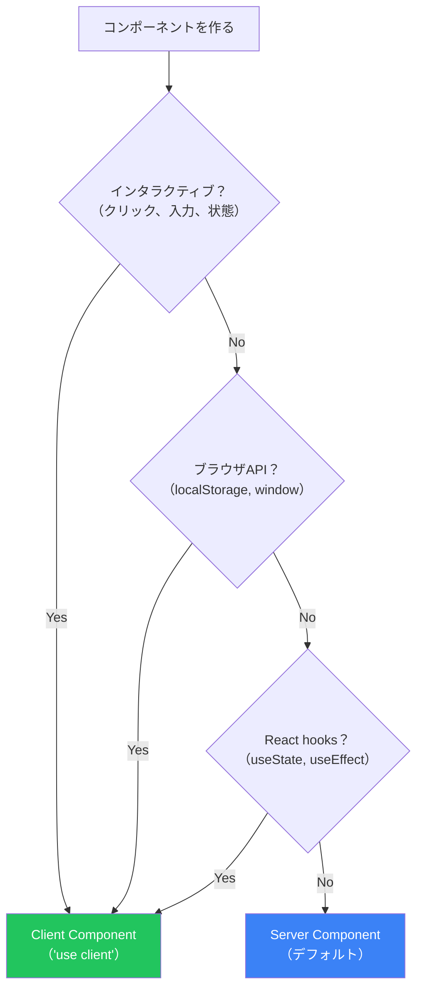
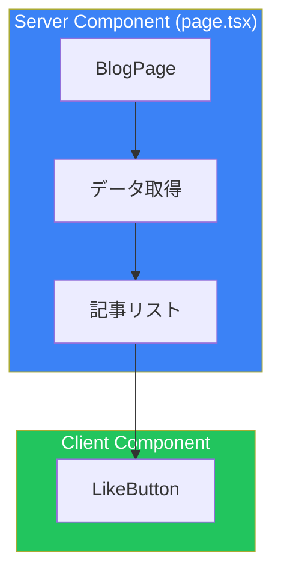
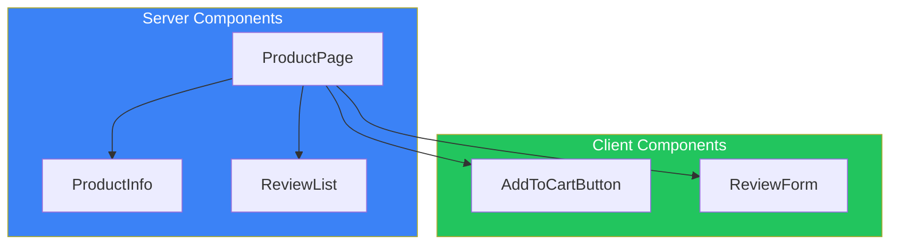

# Day 3: Server ComponentsとClient Components

## 今日学ぶこと

- Server Componentsとは何か
- Client Componentsとは何か
- "use client"ディレクティブの使い方
- いつどちらを使うか
- コンポーネント境界の設計

---

## React Server Components（RSC）とは

**React Server Components（RSC）**は、サーバーでのみ実行されるReactコンポーネントです。Next.js App Routerでは、すべてのコンポーネントがデフォルトでServer Componentsになります。



### Server Componentsのメリット

1. **データベースに直接アクセス**: サーバー上で実行されるため、APIを経由せずDBに接続可能
2. **機密情報の保護**: APIキーやトークンがクライアントに露出しない
3. **バンドルサイズ削減**: サーバーのみで使用するライブラリがクライアントに送信されない
4. **初期ロード高速化**: HTMLがサーバーで生成されるため、すぐにコンテンツが表示される

### Server Componentの例

```tsx
// このコンポーネントはサーバーでのみ実行される
// "use client"がないので、デフォルトでServer Component

import { db } from "@/lib/database";

export default async function UserProfile({ userId }: { userId: string }) {
  // データベースに直接アクセス（サーバーでのみ実行）
  const user = await db.user.findUnique({
    where: { id: userId },
  });

  return (
    <div className="p-4 border rounded">
      <h2 className="text-xl font-bold">{user?.name}</h2>
      <p className="text-gray-600">{user?.email}</p>
    </div>
  );
}
```

---

## Client Componentsとは

**Client Components**は、ブラウザで実行されるReactコンポーネントです。インタラクティブな機能（クリック、入力、状態管理など）が必要な場合に使用します。

### "use client"ディレクティブ

ファイルの先頭に `"use client"` を追加すると、そのファイルとその子コンポーネントはClient Componentsになります。

```tsx
"use client";

import { useState } from "react";

export default function Counter() {
  const [count, setCount] = useState(0);

  return (
    <div className="p-4 border rounded">
      <p className="text-2xl mb-4">カウント: {count}</p>
      <button
        onClick={() => setCount(count + 1)}
        className="px-4 py-2 bg-blue-600 text-white rounded"
      >
        +1
      </button>
    </div>
  );
}
```

### Client Componentsが必要な場合

| 機能 | 理由 |
|------|------|
| イベントハンドラ（onClick, onChange） | ブラウザでのユーザー操作 |
| useState, useReducer | クライアント側の状態管理 |
| useEffect | ブラウザAPIへのアクセス |
| ブラウザAPI（localStorage, window） | サーバーには存在しない |
| React hooks（useContext, useRef） | クライアントで動作するhooks |

---

## Server vs Client: 使い分け



### 判断チャート

| 要件 | 推奨 |
|------|------|
| データ取得のみ | Server Component |
| 静的なUI表示 | Server Component |
| フォーム入力 | Client Component |
| ボタンクリック | Client Component |
| アニメーション | Client Component |
| 認証状態の表示 | 状況による（詳細は後述） |

---

## コンポーネント境界の設計

Server ComponentsとClient Componentsを効果的に組み合わせることが重要です。

### 悪い例: 全体をClient Componentに

```tsx
// ❌ 悪い例: 必要以上にClient Componentにしている
"use client";

import { useEffect, useState } from "react";

export default function BlogPage() {
  const [posts, setPosts] = useState([]);

  useEffect(() => {
    fetch("/api/posts")
      .then((res) => res.json())
      .then(setPosts);
  }, []);

  return (
    <div>
      <h1>Blog</h1>
      {posts.map((post) => (
        <article key={post.id}>
          <h2>{post.title}</h2>
          <p>{post.content}</p>
          <LikeButton postId={post.id} />
        </article>
      ))}
    </div>
  );
}
```

### 良い例: 境界を適切に設定

```tsx
// ✅ 良い例: Server Componentでデータ取得
// src/app/blog/page.tsx (Server Component)

import { getPosts } from "@/lib/posts";
import { LikeButton } from "@/components/LikeButton";

export default async function BlogPage() {
  const posts = await getPosts(); // サーバーでデータ取得

  return (
    <div>
      <h1>Blog</h1>
      {posts.map((post) => (
        <article key={post.id}>
          <h2>{post.title}</h2>
          <p>{post.content}</p>
          {/* インタラクティブな部分のみClient Component */}
          <LikeButton postId={post.id} />
        </article>
      ))}
    </div>
  );
}
```

```tsx
// src/components/LikeButton.tsx
"use client";

import { useState } from "react";

export function LikeButton({ postId }: { postId: string }) {
  const [liked, setLiked] = useState(false);

  return (
    <button
      onClick={() => setLiked(!liked)}
      className={liked ? "text-red-500" : "text-gray-500"}
    >
      {liked ? "❤️" : "🤍"} いいね
    </button>
  );
}
```



---

## Client ComponentでServer Componentを使う

Client Componentは、`children`としてServer Componentを受け取ることができます。

### パターン: インタラクティブなラッパー

```tsx
// src/components/Accordion.tsx
"use client";

import { useState } from "react";

export function Accordion({
  title,
  children,
}: {
  title: string;
  children: React.ReactNode;
}) {
  const [isOpen, setIsOpen] = useState(false);

  return (
    <div className="border rounded">
      <button
        onClick={() => setIsOpen(!isOpen)}
        className="w-full p-4 text-left font-bold"
      >
        {title} {isOpen ? "▲" : "▼"}
      </button>
      {isOpen && <div className="p-4 border-t">{children}</div>}
    </div>
  );
}
```

```tsx
// src/app/faq/page.tsx (Server Component)
import { Accordion } from "@/components/Accordion";
import { getFAQ } from "@/lib/faq";

export default async function FAQPage() {
  const faqs = await getFAQ(); // サーバーでデータ取得

  return (
    <div>
      <h1>FAQ</h1>
      {faqs.map((faq) => (
        <Accordion key={faq.id} title={faq.question}>
          {/* このコンテンツはServer Componentとしてレンダリング */}
          <p>{faq.answer}</p>
        </Accordion>
      ))}
    </div>
  );
}
```

---

## よくある間違い

### 間違い1: Server ComponentでHooksを使う

```tsx
// ❌ エラー: Server Componentでは useState は使えない
import { useState } from "react";

export default function Profile() {
  const [name, setName] = useState(""); // Error!
  return <div>{name}</div>;
}
```

### 間違い2: Client ComponentでasyncをつけたデータFFetch

```tsx
// ❌ エラー: Client Componentでは async/await は直接使えない
"use client";

export default async function Profile() {
  const user = await fetchUser(); // Error!
  return <div>{user.name}</div>;
}
```

Client Componentでデータを取得する場合は `useEffect` を使います：

```tsx
"use client";

import { useEffect, useState } from "react";

export default function Profile() {
  const [user, setUser] = useState(null);

  useEffect(() => {
    fetchUser().then(setUser);
  }, []);

  if (!user) return <div>Loading...</div>;
  return <div>{user.name}</div>;
}
```

### 間違い3: 不必要に"use client"を追加

```tsx
// ❌ 不要: インタラクティブな機能がないのに "use client" を追加
"use client";

export default function Header() {
  return (
    <header>
      <h1>My Site</h1>
    </header>
  );
}
```

```tsx
// ✅ 良い: Server Componentのまま
export default function Header() {
  return (
    <header>
      <h1>My Site</h1>
    </header>
  );
}
```

---

## 実践: コンポーネント設計

### シナリオ: 商品詳細ページ

- 商品情報の表示（静的）
- 「カートに追加」ボタン（インタラクティブ）
- レビュー一覧（静的）
- レビュー投稿フォーム（インタラクティブ）



### 実装例

```tsx
// src/app/products/[id]/page.tsx (Server Component)
import { getProduct, getReviews } from "@/lib/products";
import { AddToCartButton } from "@/components/AddToCartButton";
import { ReviewForm } from "@/components/ReviewForm";

export default async function ProductPage({
  params,
}: {
  params: Promise<{ id: string }>;
}) {
  const { id } = await params;
  const [product, reviews] = await Promise.all([
    getProduct(id),
    getReviews(id),
  ]);

  return (
    <div className="max-w-4xl mx-auto p-4">
      {/* 商品情報（静的） */}
      <section className="mb-8">
        <h1 className="text-3xl font-bold">{product.name}</h1>
        <p className="text-2xl text-gray-600">¥{product.price}</p>
        <p className="mt-4">{product.description}</p>

        {/* カートボタン（インタラクティブ） */}
        <AddToCartButton productId={id} />
      </section>

      {/* レビュー一覧（静的） */}
      <section className="mb-8">
        <h2 className="text-xl font-bold mb-4">レビュー</h2>
        {reviews.map((review) => (
          <div key={review.id} className="border-b py-4">
            <p className="font-bold">{review.author}</p>
            <p>{review.content}</p>
          </div>
        ))}
      </section>

      {/* レビュー投稿（インタラクティブ） */}
      <ReviewForm productId={id} />
    </div>
  );
}
```

---

## まとめ

| 概念 | 説明 |
|------|------|
| Server Components | サーバーでのみ実行、デフォルト |
| Client Components | ブラウザで実行、"use client"が必要 |
| コンポーネント境界 | インタラクティブな部分のみClient |

### 設計原則

1. **デフォルトはServer Component**: "use client"は必要な時だけ
2. **葉をClientに**: ツリーの末端（ボタン、フォーム）をClient Componentに
3. **データ取得はServer**: 可能な限りサーバーでデータを取得
4. **バンドルサイズを意識**: 大きなライブラリはサーバーで使う

---

## 練習問題

### 問題1: 基本
以下のコンポーネントはServer/Clientどちらにすべきですか？
- ナビゲーションバー（リンクのみ）
- 検索フォーム
- フッター（静的テキスト）
- モーダルダイアログ

### 問題2: 応用
ユーザープロフィールページを作成してください。Server Componentで以下のユーザー情報を取得・表示し、Client Componentで「フォローする」ボタンを実装してください。

### チャレンジ問題
タブコンポーネントを作成してください。タブの切り替え（Client）と、各タブのコンテンツ（Server Componentからのデータ）を組み合わせて実装してください。

---

## 参考リンク

- [Server Components](https://nextjs.org/docs/app/building-your-application/rendering/server-components)
- [Client Components](https://nextjs.org/docs/app/building-your-application/rendering/client-components)
- [Composition Patterns](https://nextjs.org/docs/app/building-your-application/rendering/composition-patterns)

---

**次回予告**: Day 4では「データフェッチング」について学びます。Server Componentsでのデータ取得、キャッシュ戦略、並列フェッチについて探求します。
