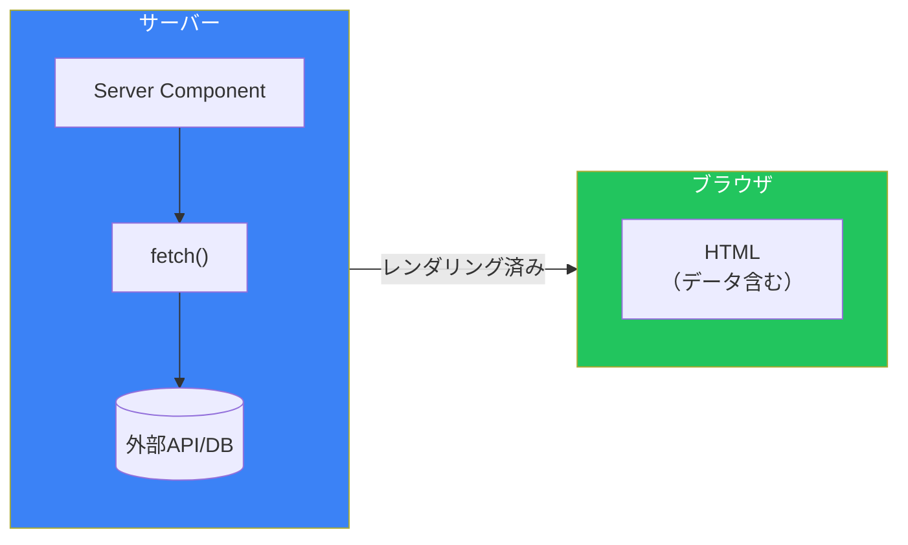
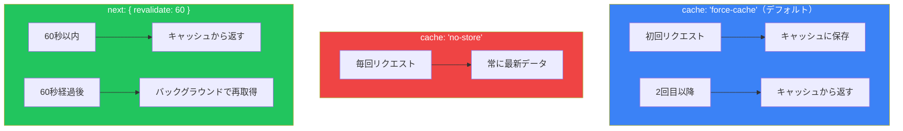
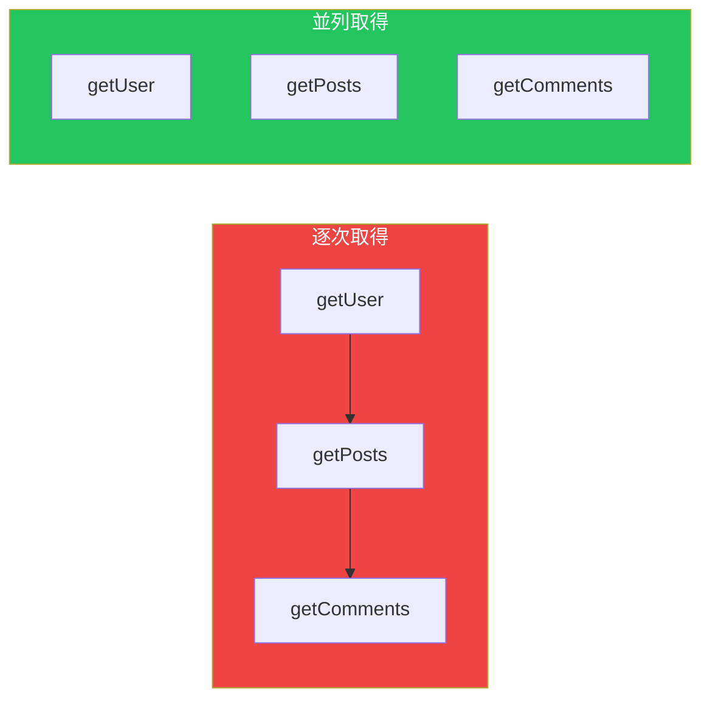
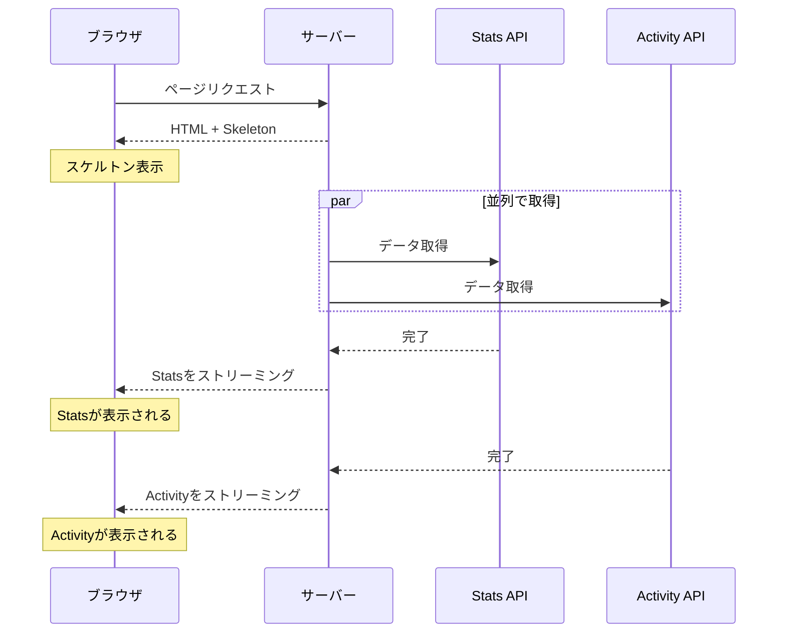

# Day 4: データフェッチング

## 今日学ぶこと

- Server Componentsでのデータ取得
- fetch APIの拡張機能
- キャッシュと再検証
- 並列データフェッチング
- エラーハンドリング

---

## Server Componentsでのデータ取得

App Routerでは、Server Componentsで直接`async/await`を使ってデータを取得できます。これが推奨される方法です。



### 基本的なデータ取得

```tsx
// src/app/users/page.tsx

type User = {
  id: number;
  name: string;
  email: string;
};

async function getUsers(): Promise<User[]> {
  const res = await fetch("https://jsonplaceholder.typicode.com/users");

  if (!res.ok) {
    throw new Error("Failed to fetch users");
  }

  return res.json();
}

export default async function UsersPage() {
  const users = await getUsers();

  return (
    <div className="p-4">
      <h1 className="text-2xl font-bold mb-4">ユーザー一覧</h1>
      <ul className="space-y-2">
        {users.map((user) => (
          <li key={user.id} className="p-2 border rounded">
            <p className="font-bold">{user.name}</p>
            <p className="text-gray-600">{user.email}</p>
          </li>
        ))}
      </ul>
    </div>
  );
}
```

---

## fetch APIの拡張

Next.jsは、Web標準の`fetch` APIを拡張して、キャッシュと再検証の機能を追加しています。

### キャッシュオプション

```tsx
// デフォルト: キャッシュあり（静的）
const res = await fetch("https://api.example.com/data");

// キャッシュなし（毎回取得）
const res = await fetch("https://api.example.com/data", {
  cache: "no-store",
});

// 時間ベースの再検証（60秒後に再取得）
const res = await fetch("https://api.example.com/data", {
  next: { revalidate: 60 },
});
```

### キャッシュの動作



### いつどのオプションを使うか

| オプション | ユースケース |
|------------|--------------|
| デフォルト（キャッシュ） | 変更頻度が低いデータ（ブログ記事など） |
| `cache: "no-store"` | リアルタイムデータ（株価、在庫数など） |
| `next: { revalidate: N }` | 定期的に更新されるデータ（ニュースなど） |

---

## 並列データフェッチング

複数のデータを取得する場合、並列で取得することでパフォーマンスを向上できます。

### 逐次取得（遅い）

```tsx
// ❌ 悪い例: 逐次取得（waterfall）
export default async function Dashboard() {
  const user = await getUser();      // 1秒
  const posts = await getPosts();    // 1秒
  const comments = await getComments(); // 1秒
  // 合計: 3秒
}
```

### 並列取得（速い）

```tsx
// ✅ 良い例: 並列取得
export default async function Dashboard() {
  const [user, posts, comments] = await Promise.all([
    getUser(),      // 1秒
    getPosts(),     // 1秒
    getComments(),  // 1秒
  ]);
  // 合計: 1秒（最も遅いものに依存）
}
```



---

## データ取得のパターン

### パターン1: ページレベルでの取得

```tsx
// src/app/dashboard/page.tsx
export default async function DashboardPage() {
  const data = await getDashboardData();

  return (
    <div>
      <Header user={data.user} />
      <Stats stats={data.stats} />
      <RecentActivity activities={data.activities} />
    </div>
  );
}
```

### パターン2: コンポーネントレベルでの取得

```tsx
// src/app/dashboard/page.tsx
export default function DashboardPage() {
  return (
    <div>
      <Header />
      <Stats />
      <RecentActivity />
    </div>
  );
}

// src/components/Stats.tsx
export default async function Stats() {
  const stats = await getStats(); // このコンポーネントで取得

  return (
    <div className="grid grid-cols-3 gap-4">
      <StatCard title="売上" value={stats.sales} />
      <StatCard title="注文" value={stats.orders} />
      <StatCard title="ユーザー" value={stats.users} />
    </div>
  );
}
```

### どちらを選ぶか

| パターン | メリット | デメリット |
|----------|----------|------------|
| ページレベル | データの依存関係を管理しやすい | 全データが揃うまで表示されない |
| コンポーネントレベル | 各コンポーネントが独立してロード | 重複リクエストの可能性 |

---

## Suspenseでストリーミング

`loading.tsx`または`<Suspense>`を使って、データ取得中にローディングUIを表示できます。

### コンポーネントレベルのSuspense

```tsx
import { Suspense } from "react";

export default function DashboardPage() {
  return (
    <div>
      <h1>ダッシュボード</h1>

      <Suspense fallback={<StatsSkeleton />}>
        <Stats />
      </Suspense>

      <Suspense fallback={<ActivitySkeleton />}>
        <RecentActivity />
      </Suspense>
    </div>
  );
}
```



### スケルトンコンポーネント

```tsx
// src/components/StatsSkeleton.tsx
export function StatsSkeleton() {
  return (
    <div className="grid grid-cols-3 gap-4">
      {[1, 2, 3].map((i) => (
        <div key={i} className="animate-pulse">
          <div className="h-4 bg-gray-200 rounded w-1/2 mb-2" />
          <div className="h-8 bg-gray-200 rounded" />
        </div>
      ))}
    </div>
  );
}
```

---

## エラーハンドリング

### try-catchでの処理

```tsx
async function getUser(id: string) {
  try {
    const res = await fetch(`https://api.example.com/users/${id}`);

    if (!res.ok) {
      throw new Error(`Failed to fetch user: ${res.status}`);
    }

    return res.json();
  } catch (error) {
    console.error("Error fetching user:", error);
    return null;
  }
}

export default async function UserPage({
  params,
}: {
  params: Promise<{ id: string }>;
}) {
  const { id } = await params;
  const user = await getUser(id);

  if (!user) {
    return <div>ユーザーが見つかりません</div>;
  }

  return <div>{user.name}</div>;
}
```

### error.tsxでの処理

エラーをthrowすると、最も近い`error.tsx`がレンダリングされます。

```tsx
// src/lib/users.ts
export async function getUser(id: string) {
  const res = await fetch(`https://api.example.com/users/${id}`);

  if (!res.ok) {
    throw new Error("Failed to fetch user");
  }

  return res.json();
}
```

```tsx
// src/app/users/[id]/error.tsx
"use client";

export default function UserError({
  error,
  reset,
}: {
  error: Error;
  reset: () => void;
}) {
  return (
    <div className="text-center py-10">
      <h2 className="text-xl font-bold text-red-600">
        ユーザーの取得に失敗しました
      </h2>
      <button
        onClick={reset}
        className="mt-4 px-4 py-2 bg-blue-600 text-white rounded"
      >
        再試行
      </button>
    </div>
  );
}
```

### notFoundでの404

```tsx
import { notFound } from "next/navigation";

export default async function UserPage({
  params,
}: {
  params: Promise<{ id: string }>;
}) {
  const { id } = await params;
  const user = await getUser(id);

  if (!user) {
    notFound(); // not-found.tsxを表示
  }

  return <div>{user.name}</div>;
}
```

---

## データの再検証

### オンデマンド再検証

特定のアクション後にキャッシュを無効化できます。

```tsx
// src/app/actions.ts
"use server";

import { revalidatePath, revalidateTag } from "next/cache";

export async function createPost(formData: FormData) {
  // 投稿を作成
  await db.post.create({ ... });

  // パスを再検証
  revalidatePath("/blog");

  // または、タグで再検証
  revalidateTag("posts");
}
```

### タグベースの再検証

```tsx
// データ取得時にタグを付ける
const posts = await fetch("https://api.example.com/posts", {
  next: { tags: ["posts"] },
});

// 再検証時
revalidateTag("posts"); // "posts"タグがついた全てのfetchを無効化
```

---

## 実践: ブログアプリのデータ取得

```tsx
// src/lib/posts.ts
export async function getPosts() {
  const res = await fetch("https://api.example.com/posts", {
    next: { revalidate: 3600 }, // 1時間ごとに再検証
  });

  if (!res.ok) throw new Error("Failed to fetch posts");
  return res.json();
}

export async function getPost(slug: string) {
  const res = await fetch(`https://api.example.com/posts/${slug}`, {
    next: { tags: [`post-${slug}`] },
  });

  if (!res.ok) return null;
  return res.json();
}

export async function getComments(postId: string) {
  const res = await fetch(
    `https://api.example.com/posts/${postId}/comments`,
    { cache: "no-store" } // コメントは常に最新
  );

  if (!res.ok) throw new Error("Failed to fetch comments");
  return res.json();
}
```

```tsx
// src/app/blog/[slug]/page.tsx
import { Suspense } from "react";
import { notFound } from "next/navigation";
import { getPost } from "@/lib/posts";
import { Comments, CommentsSkeleton } from "@/components/Comments";

export default async function BlogPostPage({
  params,
}: {
  params: Promise<{ slug: string }>;
}) {
  const { slug } = await params;
  const post = await getPost(slug);

  if (!post) {
    notFound();
  }

  return (
    <article className="max-w-2xl mx-auto p-4">
      <h1 className="text-3xl font-bold mb-4">{post.title}</h1>
      <div className="prose" dangerouslySetInnerHTML={{ __html: post.content }} />

      <section className="mt-8">
        <h2 className="text-xl font-bold mb-4">コメント</h2>
        <Suspense fallback={<CommentsSkeleton />}>
          <Comments postId={post.id} />
        </Suspense>
      </section>
    </article>
  );
}
```

---

## まとめ

| 概念 | 説明 |
|------|------|
| Server Componentでのfetch | async/awaitでデータを直接取得 |
| キャッシュオプション | force-cache, no-store, revalidate |
| 並列取得 | Promise.allで高速化 |
| Suspense | ストリーミングでUX向上 |
| 再検証 | revalidatePath, revalidateTag |

### 重要ポイント

1. **Server Componentでデータ取得**: クライアントに余計なJSを送らない
2. **適切なキャッシュ戦略**: データの性質に合わせて選択
3. **並列取得を活用**: ウォーターフォールを避ける
4. **Suspenseでストリーミング**: 部分的に表示を開始

---

## 練習問題

### 問題1: 基本
外部APIからユーザー一覧を取得し、1時間ごとに再検証するページを作成してください。

### 問題2: 応用
ダッシュボードページを作成し、3つの異なるAPIからデータを並列取得してください。各セクションにSuspenseとスケルトンを適用してください。

### チャレンジ問題
ブログ記事の作成後に`revalidateTag`を使ってブログ一覧を再検証する機能を実装してください。

---

## 参考リンク

- [Data Fetching](https://nextjs.org/docs/app/building-your-application/data-fetching)
- [Caching](https://nextjs.org/docs/app/building-your-application/caching)
- [Revalidating](https://nextjs.org/docs/app/building-your-application/data-fetching/revalidating)

---

**次回予告**: Day 5では「Server Actions」について学びます。フォーム処理、ミューテーション、楽観的UI更新について探求します。
