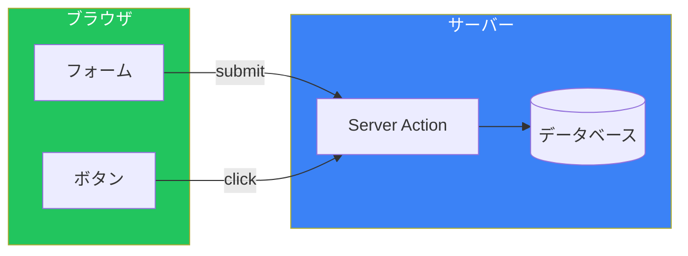
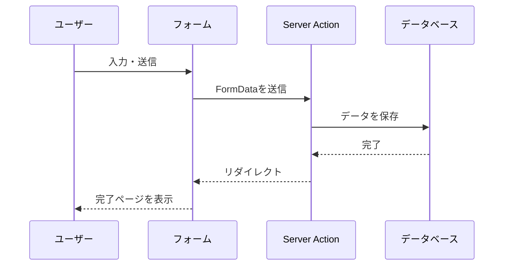
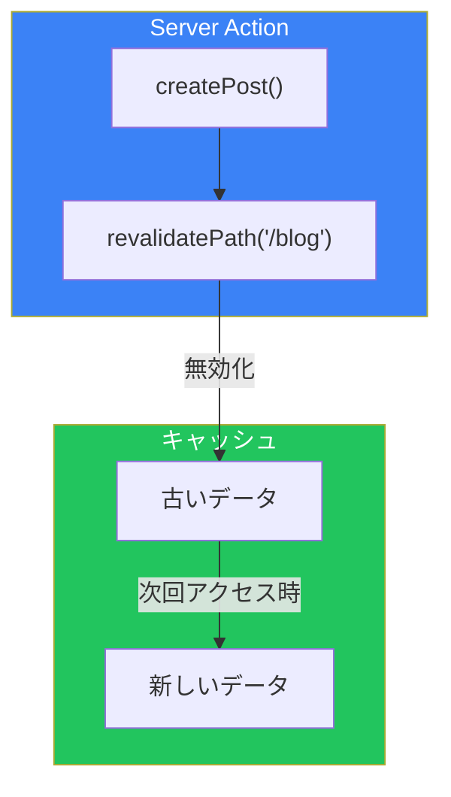
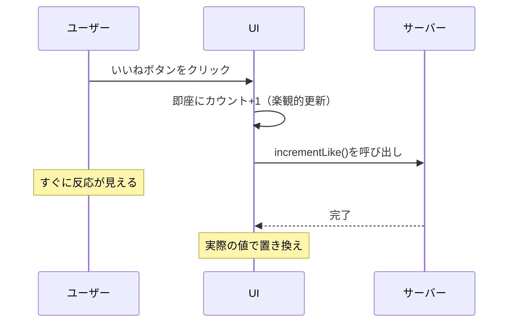

# Day 5: Server Actions

## 今日学ぶこと

- Server Actionsとは何か
- "use server"ディレクティブ
- フォーム処理
- ミューテーション
- 楽観的UI更新

---

## Server Actionsとは

**Server Actions**は、サーバー上で実行される非同期関数です。フォームの送信やデータの変更（ミューテーション）をシンプルに処理できます。



### Server Actionsの特徴

| 特徴 | 説明 |
|------|------|
| サーバーで実行 | 機密データを安全に扱える |
| Progressive Enhancement | JSなしでも動作 |
| シンプル | APIルートを書く必要がない |
| 自動キャッシュ無効化 | revalidatePathと連携 |

---

## "use server"ディレクティブ

Server Actionsを定義するには、`"use server"`を使います。

### ファイル全体をServer Actionsにする

```tsx
// src/app/actions.ts
"use server";

export async function createPost(formData: FormData) {
  const title = formData.get("title") as string;
  const content = formData.get("content") as string;

  await db.post.create({
    data: { title, content },
  });
}

export async function deletePost(id: string) {
  await db.post.delete({
    where: { id },
  });
}
```

### 関数単位で定義する

```tsx
// src/app/blog/page.tsx
export default function BlogPage() {
  async function handleSubmit(formData: FormData) {
    "use server";

    const title = formData.get("title") as string;
    // サーバーで実行される処理
  }

  return (
    <form action={handleSubmit}>
      <input name="title" />
      <button type="submit">作成</button>
    </form>
  );
}
```

---

## フォーム処理の基本

### シンプルなフォーム

```tsx
// src/app/contact/page.tsx
import { redirect } from "next/navigation";

async function submitContact(formData: FormData) {
  "use server";

  const name = formData.get("name") as string;
  const email = formData.get("email") as string;
  const message = formData.get("message") as string;

  // データを保存
  await db.contact.create({
    data: { name, email, message },
  });

  // 完了ページにリダイレクト
  redirect("/contact/thanks");
}

export default function ContactPage() {
  return (
    <form action={submitContact} className="max-w-md mx-auto p-4">
      <div className="mb-4">
        <label className="block mb-1">お名前</label>
        <input
          name="name"
          required
          className="w-full border rounded p-2"
        />
      </div>

      <div className="mb-4">
        <label className="block mb-1">メールアドレス</label>
        <input
          name="email"
          type="email"
          required
          className="w-full border rounded p-2"
        />
      </div>

      <div className="mb-4">
        <label className="block mb-1">メッセージ</label>
        <textarea
          name="message"
          required
          rows={4}
          className="w-full border rounded p-2"
        />
      </div>

      <button
        type="submit"
        className="w-full bg-blue-600 text-white py-2 rounded"
      >
        送信
      </button>
    </form>
  );
}
```

### フォームの流れ



---

## useFormStatusでローディング状態

`useFormStatus`フックを使って、フォーム送信中の状態を取得できます。

```tsx
// src/components/SubmitButton.tsx
"use client";

import { useFormStatus } from "react-dom";

export function SubmitButton({ children }: { children: React.ReactNode }) {
  const { pending } = useFormStatus();

  return (
    <button
      type="submit"
      disabled={pending}
      className={`w-full py-2 rounded text-white ${
        pending ? "bg-gray-400" : "bg-blue-600 hover:bg-blue-700"
      }`}
    >
      {pending ? "送信中..." : children}
    </button>
  );
}
```

```tsx
// src/app/contact/page.tsx
import { SubmitButton } from "@/components/SubmitButton";

export default function ContactPage() {
  return (
    <form action={submitContact}>
      {/* フォームフィールド */}
      <SubmitButton>送信</SubmitButton>
    </form>
  );
}
```

> **注意**: `useFormStatus`は、`<form>`の子孫コンポーネントでのみ動作します。

---

## useActionStateでバリデーション

`useActionState`を使って、Server Actionの結果（エラーメッセージなど）を管理できます。

```tsx
// src/app/actions.ts
"use server";

type ActionState = {
  error?: string;
  success?: boolean;
};

export async function createAccount(
  prevState: ActionState,
  formData: FormData
): Promise<ActionState> {
  const email = formData.get("email") as string;
  const password = formData.get("password") as string;

  // バリデーション
  if (!email.includes("@")) {
    return { error: "有効なメールアドレスを入力してください" };
  }

  if (password.length < 8) {
    return { error: "パスワードは8文字以上必要です" };
  }

  // アカウント作成
  try {
    await db.user.create({
      data: { email, password: hashPassword(password) },
    });
    return { success: true };
  } catch {
    return { error: "アカウントの作成に失敗しました" };
  }
}
```

```tsx
// src/app/signup/page.tsx
"use client";

import { useActionState } from "react";
import { createAccount } from "@/app/actions";
import { SubmitButton } from "@/components/SubmitButton";

export default function SignupPage() {
  const [state, formAction] = useActionState(createAccount, {});

  return (
    <form action={formAction} className="max-w-md mx-auto p-4">
      {state.error && (
        <div className="mb-4 p-3 bg-red-100 text-red-600 rounded">
          {state.error}
        </div>
      )}

      {state.success && (
        <div className="mb-4 p-3 bg-green-100 text-green-600 rounded">
          アカウントが作成されました！
        </div>
      )}

      <div className="mb-4">
        <label className="block mb-1">メールアドレス</label>
        <input
          name="email"
          type="email"
          required
          className="w-full border rounded p-2"
        />
      </div>

      <div className="mb-4">
        <label className="block mb-1">パスワード</label>
        <input
          name="password"
          type="password"
          required
          className="w-full border rounded p-2"
        />
      </div>

      <SubmitButton>アカウント作成</SubmitButton>
    </form>
  );
}
```

---

## キャッシュの再検証

データを変更した後、関連するページのキャッシュを無効化します。

```tsx
// src/app/actions.ts
"use server";

import { revalidatePath, revalidateTag } from "next/cache";

export async function createPost(formData: FormData) {
  const title = formData.get("title") as string;
  const content = formData.get("content") as string;

  await db.post.create({
    data: { title, content },
  });

  // 方法1: パスを再検証
  revalidatePath("/blog");

  // 方法2: タグを再検証
  revalidateTag("posts");
}

export async function deletePost(id: string) {
  await db.post.delete({
    where: { id },
  });

  revalidatePath("/blog");
}
```



---

## フォーム外でのServer Action

ボタンクリックなど、フォーム以外からもServer Actionsを呼び出せます。

```tsx
// src/app/actions.ts
"use server";

export async function incrementLike(postId: string) {
  await db.post.update({
    where: { id: postId },
    data: { likes: { increment: 1 } },
  });

  revalidatePath(`/blog/${postId}`);
}
```

```tsx
// src/components/LikeButton.tsx
"use client";

import { incrementLike } from "@/app/actions";
import { useTransition } from "react";

export function LikeButton({ postId }: { postId: string }) {
  const [isPending, startTransition] = useTransition();

  const handleClick = () => {
    startTransition(() => {
      incrementLike(postId);
    });
  };

  return (
    <button
      onClick={handleClick}
      disabled={isPending}
      className="flex items-center gap-2"
    >
      {isPending ? "..." : "❤️"} いいね
    </button>
  );
}
```

---

## 楽観的UI更新

`useOptimistic`を使って、サーバーの応答を待たずにUIを更新できます。

```tsx
// src/components/LikeButton.tsx
"use client";

import { incrementLike } from "@/app/actions";
import { useOptimistic, useTransition } from "react";

export function LikeButton({
  postId,
  initialLikes,
}: {
  postId: string;
  initialLikes: number;
}) {
  const [isPending, startTransition] = useTransition();
  const [optimisticLikes, addOptimisticLike] = useOptimistic(
    initialLikes,
    (state) => state + 1
  );

  const handleClick = () => {
    startTransition(async () => {
      addOptimisticLike(null); // 即座にUIを更新
      await incrementLike(postId); // サーバーで実行
    });
  };

  return (
    <button
      onClick={handleClick}
      disabled={isPending}
      className="flex items-center gap-2"
    >
      ❤️ {optimisticLikes}
    </button>
  );
}
```



---

## 実践: Todoアプリ

```tsx
// src/app/actions.ts
"use server";

import { revalidatePath } from "next/cache";

export async function addTodo(formData: FormData) {
  const title = formData.get("title") as string;

  await db.todo.create({
    data: { title, completed: false },
  });

  revalidatePath("/todos");
}

export async function toggleTodo(id: string) {
  const todo = await db.todo.findUnique({ where: { id } });

  await db.todo.update({
    where: { id },
    data: { completed: !todo?.completed },
  });

  revalidatePath("/todos");
}

export async function deleteTodo(id: string) {
  await db.todo.delete({ where: { id } });
  revalidatePath("/todos");
}
```

```tsx
// src/app/todos/page.tsx
import { addTodo, toggleTodo, deleteTodo } from "@/app/actions";

async function getTodos() {
  return db.todo.findMany({ orderBy: { createdAt: "desc" } });
}

export default async function TodosPage() {
  const todos = await getTodos();

  return (
    <div className="max-w-md mx-auto p-4">
      <h1 className="text-2xl font-bold mb-4">Todo List</h1>

      {/* 追加フォーム */}
      <form action={addTodo} className="mb-4 flex gap-2">
        <input
          name="title"
          required
          placeholder="新しいタスク..."
          className="flex-1 border rounded p-2"
        />
        <button
          type="submit"
          className="px-4 py-2 bg-blue-600 text-white rounded"
        >
          追加
        </button>
      </form>

      {/* Todoリスト */}
      <ul className="space-y-2">
        {todos.map((todo) => (
          <li
            key={todo.id}
            className="flex items-center gap-2 p-2 border rounded"
          >
            <form action={toggleTodo.bind(null, todo.id)}>
              <button type="submit">
                {todo.completed ? "✅" : "⬜"}
              </button>
            </form>

            <span className={todo.completed ? "line-through" : ""}>
              {todo.title}
            </span>

            <form
              action={deleteTodo.bind(null, todo.id)}
              className="ml-auto"
            >
              <button type="submit" className="text-red-500">
                🗑️
              </button>
            </form>
          </li>
        ))}
      </ul>
    </div>
  );
}
```

---

## まとめ

| 概念 | 説明 |
|------|------|
| Server Actions | サーバーで実行される非同期関数 |
| "use server" | Server Actionsを定義するディレクティブ |
| useFormStatus | フォーム送信中の状態を取得 |
| useActionState | アクションの結果を管理 |
| useOptimistic | 楽観的UI更新 |

### 重要ポイント

1. **APIルート不要**: Server Actionsで直接データを操作
2. **Progressive Enhancement**: JSなしでも動作
3. **自動再検証**: revalidatePathで簡単にキャッシュ更新
4. **楽観的更新**: useOptimisticで即座にUI反映

---

## 練習問題

### 問題1: 基本
コメント投稿フォームを作成してください。送信中はボタンを無効化し、「送信中...」と表示してください。

### 問題2: 応用
バリデーション付きのユーザー登録フォームを作成してください。エラーメッセージを表示し、成功時はリダイレクトしてください。

### チャレンジ問題
いいねボタンを楽観的更新で実装してください。ボタンをクリックするとすぐにカウントが増え、サーバーで処理が完了したら実際の値に置き換わるようにしてください。

---

## 参考リンク

- [Server Actions](https://nextjs.org/docs/app/building-your-application/data-fetching/server-actions-and-mutations)
- [Forms](https://nextjs.org/docs/app/building-your-application/data-fetching/forms)
- [useFormStatus](https://react.dev/reference/react-dom/hooks/useFormStatus)
- [useOptimistic](https://react.dev/reference/react/useOptimistic)

---

**次回予告**: Day 6では「画像・フォント・メタデータ最適化」について学びます。next/image、next/font、そしてSEO対策について探求します。
