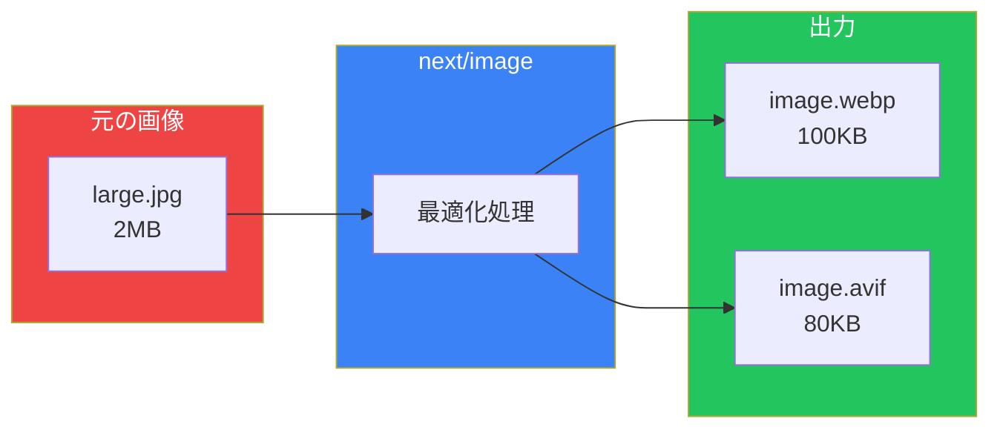
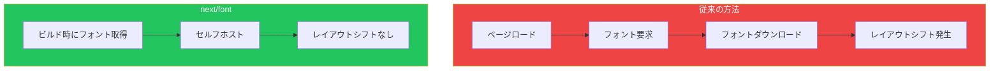

# Day 6: 画像・フォント・メタデータ最適化

## 今日学ぶこと

- next/imageコンポーネント
- next/fontによるフォント最適化
- メタデータAPI
- OGP（Open Graph Protocol）設定
- SEO対策

---

## next/imageによる画像最適化

`next/image`コンポーネントは、画像を自動的に最適化します。



### 基本的な使い方

```tsx
import Image from "next/image";

export default function Hero() {
  return (
    <div className="relative h-[500px]">
      <Image
        src="/images/hero.jpg"
        alt="ヒーロー画像"
        fill
        className="object-cover"
        priority
      />
    </div>
  );
}
```

### next/imageの主要なprops

| prop | 説明 |
|------|------|
| `src` | 画像のパス（必須） |
| `alt` | 代替テキスト（必須） |
| `width` / `height` | 画像のサイズ |
| `fill` | 親要素いっぱいに広げる |
| `priority` | LCP画像として優先読み込み |
| `placeholder` | ロード中の表示（"blur"など） |
| `quality` | 画質（1-100、デフォルト75） |

### サイズ指定のパターン

```tsx
// パターン1: 固定サイズ
<Image
  src="/logo.png"
  alt="ロゴ"
  width={200}
  height={50}
/>

// パターン2: 親要素に合わせる（fill）
<div className="relative w-full h-64">
  <Image
    src="/banner.jpg"
    alt="バナー"
    fill
    className="object-cover"
  />
</div>

// パターン3: レスポンシブ
<Image
  src="/photo.jpg"
  alt="写真"
  width={800}
  height={600}
  className="w-full h-auto"
/>
```

### 外部画像の設定

外部ドメインの画像を使用する場合は、`next.config.ts`で許可が必要です。

```ts
// next.config.ts
import type { NextConfig } from "next";

const nextConfig: NextConfig = {
  images: {
    remotePatterns: [
      {
        protocol: "https",
        hostname: "images.unsplash.com",
      },
      {
        protocol: "https",
        hostname: "cdn.example.com",
        pathname: "/images/**",
      },
    ],
  },
};

export default nextConfig;
```

### placeholderでローディング表示

```tsx
import Image from "next/image";

export default function Photo() {
  return (
    <Image
      src="/large-photo.jpg"
      alt="写真"
      width={800}
      height={600}
      placeholder="blur"
      blurDataURL="data:image/jpeg;base64,/9j/4AAQSkZJRg..."
    />
  );
}
```

ローカル画像の場合、`blurDataURL`は自動生成されます：

```tsx
import Image from "next/image";
import heroImage from "@/public/images/hero.jpg";

export default function Hero() {
  return (
    <Image
      src={heroImage}
      alt="ヒーロー"
      placeholder="blur"
      // blurDataURLは自動生成される
    />
  );
}
```

---

## next/fontによるフォント最適化

`next/font`は、フォントを自動的に最適化し、レイアウトシフトを防ぎます。



### Google Fontsの使用

```tsx
// src/app/layout.tsx
import { Inter, Noto_Sans_JP } from "next/font/google";

const inter = Inter({
  subsets: ["latin"],
  display: "swap",
  variable: "--font-inter",
});

const notoSansJP = Noto_Sans_JP({
  subsets: ["latin"],
  weight: ["400", "700"],
  display: "swap",
  variable: "--font-noto-sans-jp",
});

export default function RootLayout({
  children,
}: {
  children: React.ReactNode;
}) {
  return (
    <html lang="ja" className={`${inter.variable} ${notoSansJP.variable}`}>
      <body className="font-sans">{children}</body>
    </html>
  );
}
```

### Tailwind CSSとの連携

```ts
// tailwind.config.ts
import type { Config } from "tailwindcss";

const config: Config = {
  theme: {
    extend: {
      fontFamily: {
        sans: ["var(--font-noto-sans-jp)", "sans-serif"],
        display: ["var(--font-inter)", "sans-serif"],
      },
    },
  },
};

export default config;
```

```tsx
// 使用例
<h1 className="font-display text-4xl">英語の見出し</h1>
<p className="font-sans">日本語の本文</p>
```

### ローカルフォントの使用

```tsx
import localFont from "next/font/local";

const myFont = localFont({
  src: [
    {
      path: "../fonts/MyFont-Regular.woff2",
      weight: "400",
      style: "normal",
    },
    {
      path: "../fonts/MyFont-Bold.woff2",
      weight: "700",
      style: "normal",
    },
  ],
  variable: "--font-my-font",
});
```

---

## メタデータAPI

Next.jsは、ページのメタデータを設定するための強力なAPIを提供します。

### 静的メタデータ

```tsx
// src/app/page.tsx
import type { Metadata } from "next";

export const metadata: Metadata = {
  title: "ホーム | My Site",
  description: "Next.jsで作成したウェブサイトです",
  keywords: ["Next.js", "React", "Web開発"],
};

export default function HomePage() {
  return <main>...</main>;
}
```

### 動的メタデータ

```tsx
// src/app/blog/[slug]/page.tsx
import type { Metadata } from "next";

type Props = {
  params: Promise<{ slug: string }>;
};

export async function generateMetadata({ params }: Props): Promise<Metadata> {
  const { slug } = await params;
  const post = await getPost(slug);

  return {
    title: `${post.title} | My Blog`,
    description: post.excerpt,
    openGraph: {
      title: post.title,
      description: post.excerpt,
      images: [post.coverImage],
    },
  };
}

export default async function BlogPost({ params }: Props) {
  const { slug } = await params;
  const post = await getPost(slug);
  return <article>...</article>;
}
```

### ルートレイアウトでのデフォルト設定

```tsx
// src/app/layout.tsx
import type { Metadata } from "next";

export const metadata: Metadata = {
  title: {
    default: "My Site",
    template: "%s | My Site",
  },
  description: "Next.jsで作成したウェブサイト",
  metadataBase: new URL("https://example.com"),
};
```

`template`を使うと、子ページのタイトルが自動的にフォーマットされます：

- 子ページ: `title: "ブログ"` → `"ブログ | My Site"`

---

## OGP（Open Graph Protocol）設定

SNSでシェアされた時の表示を設定します。

```tsx
// src/app/layout.tsx
import type { Metadata } from "next";

export const metadata: Metadata = {
  title: "My Site",
  description: "Next.jsで作成したサイト",
  openGraph: {
    title: "My Site",
    description: "Next.jsで作成したサイト",
    url: "https://example.com",
    siteName: "My Site",
    images: [
      {
        url: "https://example.com/og-image.jpg",
        width: 1200,
        height: 630,
        alt: "My Site",
      },
    ],
    locale: "ja_JP",
    type: "website",
  },
  twitter: {
    card: "summary_large_image",
    title: "My Site",
    description: "Next.jsで作成したサイト",
    images: ["https://example.com/og-image.jpg"],
  },
};
```

### OGP画像の自動生成

`opengraph-image.tsx`を作成すると、OGP画像を動的に生成できます。

```tsx
// src/app/opengraph-image.tsx
import { ImageResponse } from "next/og";

export const runtime = "edge";

export const alt = "My Site";
export const size = { width: 1200, height: 630 };
export const contentType = "image/png";

export default async function Image() {
  return new ImageResponse(
    (
      <div
        style={{
          fontSize: 48,
          background: "linear-gradient(to bottom, #1e3a8a, #3b82f6)",
          width: "100%",
          height: "100%",
          display: "flex",
          alignItems: "center",
          justifyContent: "center",
          color: "white",
        }}
      >
        My Site
      </div>
    ),
    { ...size }
  );
}
```

### ブログ記事のOGP画像

```tsx
// src/app/blog/[slug]/opengraph-image.tsx
import { ImageResponse } from "next/og";

export const runtime = "edge";
export const alt = "Blog Post";
export const size = { width: 1200, height: 630 };
export const contentType = "image/png";

export default async function Image({
  params,
}: {
  params: { slug: string };
}) {
  const post = await getPost(params.slug);

  return new ImageResponse(
    (
      <div
        style={{
          fontSize: 40,
          background: "#000",
          width: "100%",
          height: "100%",
          display: "flex",
          flexDirection: "column",
          alignItems: "center",
          justifyContent: "center",
          color: "white",
          padding: 40,
        }}
      >
        <div style={{ fontSize: 24, marginBottom: 20 }}>Blog</div>
        <div style={{ textAlign: "center" }}>{post.title}</div>
      </div>
    ),
    { ...size }
  );
}
```

---

## SEO対策

### robots.txt

```tsx
// src/app/robots.ts
import type { MetadataRoute } from "next";

export default function robots(): MetadataRoute.Robots {
  return {
    rules: {
      userAgent: "*",
      allow: "/",
      disallow: ["/admin/", "/api/"],
    },
    sitemap: "https://example.com/sitemap.xml",
  };
}
```

### sitemap.xml

```tsx
// src/app/sitemap.ts
import type { MetadataRoute } from "next";

export default async function sitemap(): Promise<MetadataRoute.Sitemap> {
  const posts = await getAllPosts();

  const blogUrls = posts.map((post) => ({
    url: `https://example.com/blog/${post.slug}`,
    lastModified: post.updatedAt,
    changeFrequency: "weekly" as const,
    priority: 0.8,
  }));

  return [
    {
      url: "https://example.com",
      lastModified: new Date(),
      changeFrequency: "yearly",
      priority: 1,
    },
    {
      url: "https://example.com/about",
      lastModified: new Date(),
      changeFrequency: "monthly",
      priority: 0.5,
    },
    ...blogUrls,
  ];
}
```

### JSON-LD構造化データ

```tsx
// src/app/blog/[slug]/page.tsx
export default async function BlogPost({
  params,
}: {
  params: Promise<{ slug: string }>;
}) {
  const { slug } = await params;
  const post = await getPost(slug);

  const jsonLd = {
    "@context": "https://schema.org",
    "@type": "BlogPosting",
    headline: post.title,
    description: post.excerpt,
    author: {
      "@type": "Person",
      name: post.author,
    },
    datePublished: post.publishedAt,
    dateModified: post.updatedAt,
  };

  return (
    <>
      <script
        type="application/ld+json"
        dangerouslySetInnerHTML={{ __html: JSON.stringify(jsonLd) }}
      />
      <article>...</article>
    </>
  );
}
```

---

## 実践: ブログサイトの最適化

```tsx
// src/app/layout.tsx
import type { Metadata } from "next";
import { Inter, Noto_Sans_JP } from "next/font/google";
import "./globals.css";

const inter = Inter({
  subsets: ["latin"],
  variable: "--font-inter",
});

const notoSansJP = Noto_Sans_JP({
  subsets: ["latin"],
  weight: ["400", "700"],
  variable: "--font-noto-sans-jp",
});

export const metadata: Metadata = {
  title: {
    default: "Tech Blog",
    template: "%s | Tech Blog",
  },
  description: "Web開発に関する技術ブログ",
  metadataBase: new URL("https://tech-blog.example.com"),
  openGraph: {
    type: "website",
    locale: "ja_JP",
    siteName: "Tech Blog",
  },
  twitter: {
    card: "summary_large_image",
  },
};

export default function RootLayout({
  children,
}: {
  children: React.ReactNode;
}) {
  return (
    <html lang="ja" className={`${inter.variable} ${notoSansJP.variable}`}>
      <body className="font-sans">{children}</body>
    </html>
  );
}
```

---

## まとめ

| 概念 | 説明 |
|------|------|
| next/image | 画像の自動最適化、遅延読み込み |
| next/font | フォントの最適化、レイアウトシフト防止 |
| Metadata API | 静的/動的メタデータの設定 |
| OGP | SNSシェア時の表示設定 |
| SEO | robots.txt、sitemap.xml、構造化データ |

### 重要ポイント

1. **画像は常にnext/imageを使う**: 自動最適化と遅延読み込み
2. **フォントはnext/fontで**: レイアウトシフトを防ぐ
3. **メタデータは各ページで設定**: SEOとソーシャル共有の最適化
4. **構造化データを追加**: 検索エンジンの理解を助ける

---

## 練習問題

### 問題1: 基本
画像ギャラリーページを作成し、`next/image`で最適化された画像を表示してください。外部画像（Unsplashなど）も含めてください。

### 問題2: 応用
ブログ記事ページに動的メタデータを設定してください。タイトル、説明、OGP画像を記事データから生成してください。

### チャレンジ問題
動的OGP画像生成を実装してください。ブログ記事のタイトルをOGP画像に含め、カスタムフォントを使用してください。

---

## 参考リンク

- [next/image](https://nextjs.org/docs/app/api-reference/components/image)
- [next/font](https://nextjs.org/docs/app/building-your-application/optimizing/fonts)
- [Metadata](https://nextjs.org/docs/app/building-your-application/optimizing/metadata)
- [generateMetadata](https://nextjs.org/docs/app/api-reference/functions/generate-metadata)

---

**次回予告**: Day 7では「レンダリング戦略」について学びます。静的生成、動的レンダリング、ストリーミング、ISRの使い分けを探求します。
