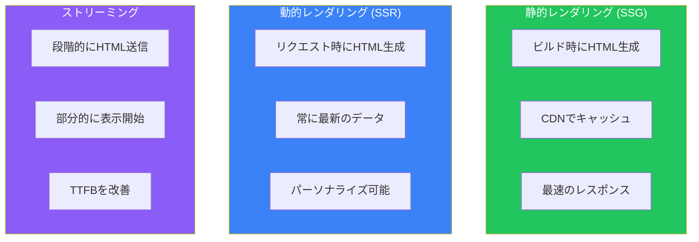
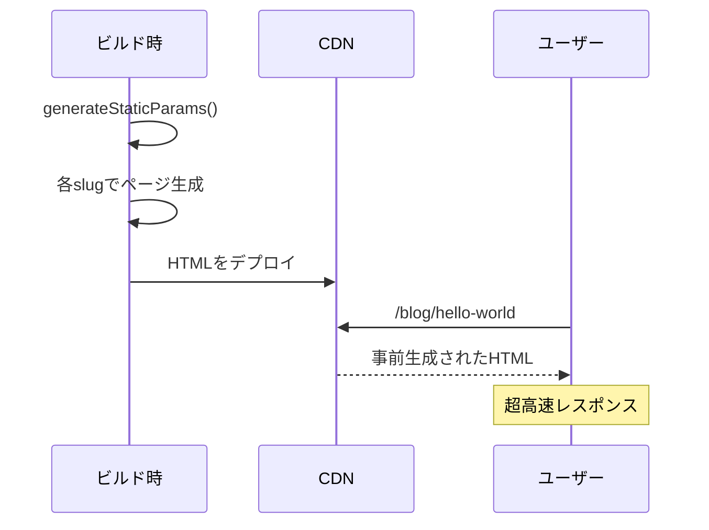
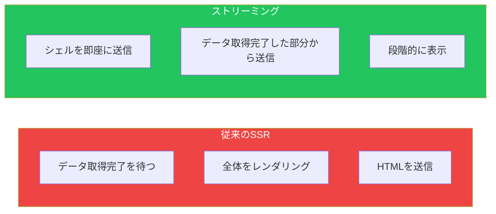
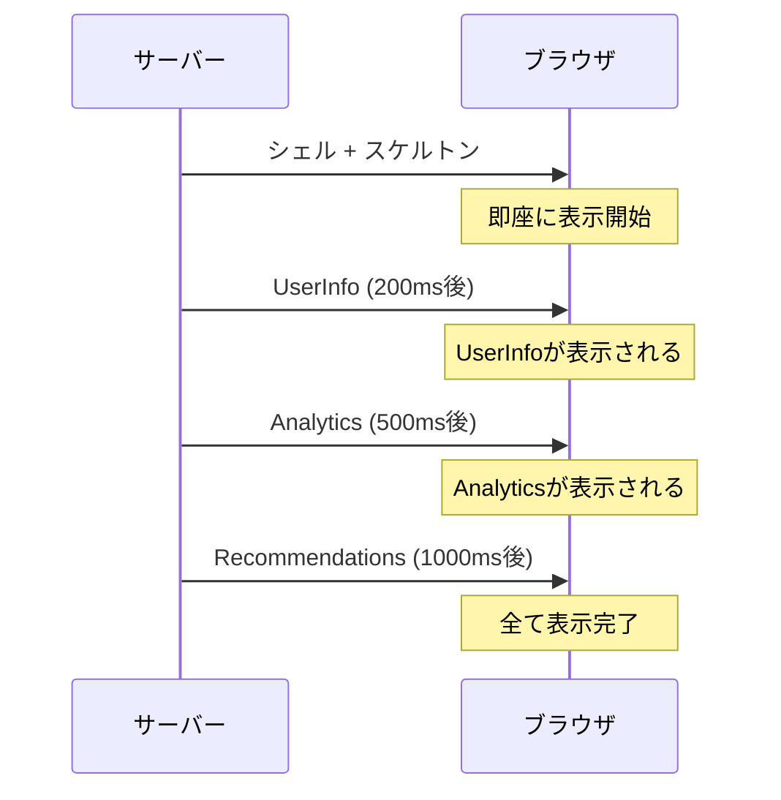
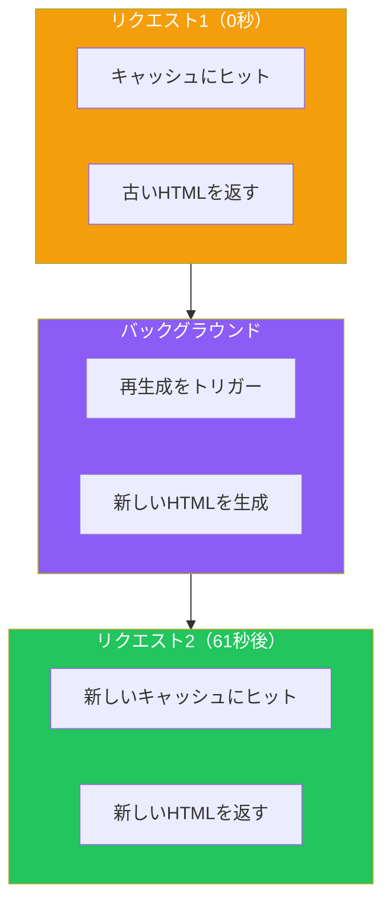
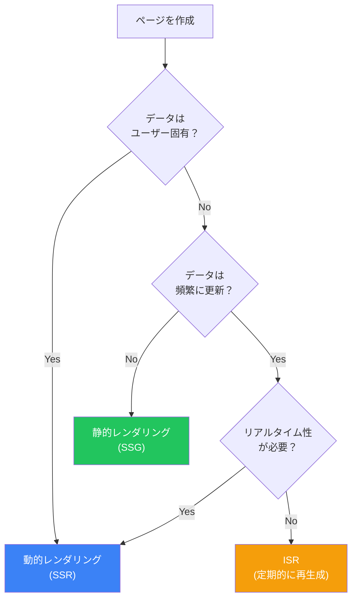

# Day 7: レンダリング戦略

## 今日学ぶこと

- 静的レンダリング（SSG）
- 動的レンダリング（SSR）
- ストリーミングとSuspense
- ISR（Incremental Static Regeneration）
- 適切な戦略の選択方法

---

## レンダリング戦略の概要

Next.jsでは、ページやコンポーネントごとに最適なレンダリング戦略を選択できます。



---

## 静的レンダリング（SSG）

**静的レンダリング**は、ビルド時にHTMLを生成します。これがNext.jsのデフォルトの動作です。

### いつ静的レンダリングになるか

- `fetch`のキャッシュがデフォルト（`force-cache`）
- 動的な関数（`cookies()`, `headers()`など）を使用していない
- 動的なルートパラメータを使用していない（または`generateStaticParams`で事前生成）

```tsx
// 静的にレンダリングされる
export default async function BlogPage() {
  const posts = await fetch("https://api.example.com/posts", {
    // キャッシュがデフォルト
  });

  return (
    <ul>
      {posts.map((post) => (
        <li key={post.id}>{post.title}</li>
      ))}
    </ul>
  );
}
```

### generateStaticParamsで動的ルートを静的生成

```tsx
// src/app/blog/[slug]/page.tsx

// ビルド時に生成するパスを指定
export async function generateStaticParams() {
  const posts = await getAllPosts();

  return posts.map((post) => ({
    slug: post.slug,
  }));
}

export default async function BlogPost({
  params,
}: {
  params: Promise<{ slug: string }>;
}) {
  const { slug } = await params;
  const post = await getPost(slug);

  return <article>{post.content}</article>;
}
```



### 静的レンダリングの利点

| 利点 | 説明 |
|------|------|
| 高速 | CDNから直接配信 |
| 低コスト | サーバー処理が不要 |
| SEO最適 | 完全なHTMLが即座に利用可能 |
| 信頼性 | サーバーダウンの影響を受けない |

---

## 動的レンダリング（SSR）

**動的レンダリング**は、リクエストごとにHTMLを生成します。

### いつ動的レンダリングになるか

- `fetch`で`cache: "no-store"`を使用
- 動的な関数を使用（`cookies()`, `headers()`, `searchParams`）
- `export const dynamic = "force-dynamic"`を設定

```tsx
// 動的にレンダリングされる
import { cookies } from "next/headers";

export default async function DashboardPage() {
  const cookieStore = await cookies();
  const token = cookieStore.get("token");

  const user = await fetch("https://api.example.com/user", {
    headers: { Authorization: `Bearer ${token?.value}` },
    cache: "no-store",
  });

  return <div>Welcome, {user.name}</div>;
}
```

### 動的レンダリングを強制する

```tsx
// src/app/dashboard/page.tsx

// このページは常に動的にレンダリングされる
export const dynamic = "force-dynamic";

export default async function DashboardPage() {
  // ...
}
```

### 動的関数

以下の関数を使用すると、自動的に動的レンダリングになります：

| 関数 | 用途 |
|------|------|
| `cookies()` | Cookieの読み取り |
| `headers()` | リクエストヘッダーの読み取り |
| `searchParams` | URLクエリパラメータ |
| `useSearchParams()` | クライアント側でクエリパラメータ |

```tsx
// searchParamsを使用（動的）
type Props = {
  searchParams: Promise<{ q?: string }>;
};

export default async function SearchPage({ searchParams }: Props) {
  const { q } = await searchParams;
  const results = await search(q);

  return <SearchResults results={results} />;
}
```

---

## ストリーミングとSuspense

**ストリーミング**は、HTMLを段階的に送信し、部分的にページを表示できます。



### loading.tsxでルートレベルのストリーミング

```tsx
// src/app/dashboard/loading.tsx
export default function DashboardLoading() {
  return (
    <div className="animate-pulse">
      <div className="h-8 bg-gray-200 rounded w-1/4 mb-4" />
      <div className="grid grid-cols-3 gap-4">
        <div className="h-32 bg-gray-200 rounded" />
        <div className="h-32 bg-gray-200 rounded" />
        <div className="h-32 bg-gray-200 rounded" />
      </div>
    </div>
  );
}
```

### Suspenseでコンポーネントレベルのストリーミング

```tsx
import { Suspense } from "react";

export default function DashboardPage() {
  return (
    <div>
      <h1>ダッシュボード</h1>

      {/* 高速なデータ */}
      <Suspense fallback={<UserSkeleton />}>
        <UserInfo />
      </Suspense>

      {/* 遅いデータ */}
      <Suspense fallback={<AnalyticsSkeleton />}>
        <Analytics />
      </Suspense>

      {/* 別の遅いデータ */}
      <Suspense fallback={<RecommendationsSkeleton />}>
        <Recommendations />
      </Suspense>
    </div>
  );
}
```



---

## ISR（Incremental Static Regeneration）

**ISR**は、静的ページを指定した間隔で再生成します。静的の高速さと動的の新鮮さを両立できます。

### 時間ベースのISR

```tsx
// 60秒ごとに再生成
export const revalidate = 60;

export default async function NewsPage() {
  const news = await fetch("https://api.example.com/news");
  return <NewsList news={news} />;
}
```

または、`fetch`ごとに設定：

```tsx
const news = await fetch("https://api.example.com/news", {
  next: { revalidate: 60 },
});
```

### ISRの動作



### オンデマンドISR

Server Actionやルートハンドラから手動で再検証できます。

```tsx
// src/app/actions.ts
"use server";

import { revalidatePath, revalidateTag } from "next/cache";

export async function publishPost(formData: FormData) {
  // 投稿を公開
  await db.post.create({ ... });

  // パスを再検証
  revalidatePath("/blog");

  // または、タグを再検証
  revalidateTag("posts");
}
```

---

## レンダリング戦略の選択

### 判断フローチャート



### ユースケース別の推奨

| ページタイプ | 推奨戦略 | 理由 |
|-------------|----------|------|
| ランディングページ | SSG | 変更頻度が低い |
| ブログ記事 | SSG + ISR | 公開後は変更少ない |
| 商品一覧 | ISR | 在庫・価格が変わる |
| 商品詳細 | ISR | 在庫が変わる |
| ダッシュボード | SSR | ユーザー固有 |
| 検索結果 | SSR | クエリごとに異なる |
| SNSフィード | SSR + Streaming | リアルタイム + 高速 |

---

## 実践: ECサイトのレンダリング戦略

```tsx
// src/app/products/page.tsx
// 商品一覧: ISR（5分ごとに再生成）
export const revalidate = 300;

export default async function ProductsPage() {
  const products = await getProducts();
  return <ProductGrid products={products} />;
}
```

```tsx
// src/app/products/[id]/page.tsx
// 商品詳細: 静的生成 + ISR

export async function generateStaticParams() {
  const products = await getProducts();
  return products.map((p) => ({ id: p.id }));
}

export const revalidate = 60;

export default async function ProductPage({
  params,
}: {
  params: Promise<{ id: string }>;
}) {
  const { id } = await params;
  const product = await getProduct(id);
  return <ProductDetail product={product} />;
}
```

```tsx
// src/app/cart/page.tsx
// カート: 完全に動的
export const dynamic = "force-dynamic";

import { cookies } from "next/headers";

export default async function CartPage() {
  const cookieStore = await cookies();
  const cartId = cookieStore.get("cartId");
  const cart = await getCart(cartId?.value);

  return <Cart items={cart.items} />;
}
```

---

## まとめ

| 戦略 | タイミング | ユースケース |
|------|------------|--------------|
| SSG | ビルド時 | 静的コンテンツ |
| ISR | 定期的/オンデマンド | 半静的コンテンツ |
| SSR | リクエスト時 | 動的コンテンツ |
| Streaming | 段階的 | 重いページの体感速度改善 |

### 重要ポイント

1. **デフォルトは静的**: 明示的に動的にしない限りSSG
2. **ISRで両立**: 静的の速さと動的の新鮮さ
3. **Suspenseで体感速度向上**: 部分的に表示を開始
4. **適材適所**: ページごとに最適な戦略を選択

---

## 練習問題

### 問題1: 基本
ブログ一覧ページを静的に生成し、新しい記事が投稿されたら再検証するように設定してください。

### 問題2: 応用
ダッシュボードページを作成し、ユーザー情報（高速）、統計データ（中速）、レコメンド（低速）を別々のSuspenseで囲んでストリーミングしてください。

### チャレンジ問題
ECサイトを想定し、以下のページに最適なレンダリング戦略を実装してください：
- トップページ（静的）
- カテゴリページ（ISR）
- 商品詳細ページ（ISR + 在庫はストリーミング）
- カートページ（動的）

---

## 参考リンク

- [Static and Dynamic Rendering](https://nextjs.org/docs/app/building-your-application/rendering/server-components#static-rendering-default)
- [Streaming](https://nextjs.org/docs/app/building-your-application/routing/loading-ui-and-streaming)
- [generateStaticParams](https://nextjs.org/docs/app/api-reference/functions/generate-static-params)
- [Revalidating](https://nextjs.org/docs/app/building-your-application/data-fetching/revalidating)

---

**次回予告**: Day 8では「スタイリングとUI」について学びます。CSS Modules、Tailwind CSS、ダークモード対応について探求します。
