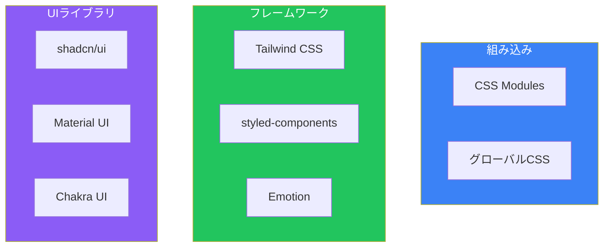

# Day 8: スタイリングとUI

## 今日学ぶこと

- CSS Modules
- Tailwind CSS統合
- グローバルスタイル
- コンポーネントライブラリ統合
- ダークモード対応

---

## Next.jsのスタイリングオプション

Next.jsは複数のスタイリング方法をサポートしています。



---

## CSS Modules

**CSS Modules**は、CSSをコンポーネントにスコープして、クラス名の衝突を防ぎます。

### 基本的な使い方

```css
/* src/components/Button.module.css */
.button {
  padding: 0.5rem 1rem;
  border-radius: 0.375rem;
  font-weight: 600;
  transition: all 0.2s;
}

.primary {
  background-color: #3b82f6;
  color: white;
}

.primary:hover {
  background-color: #2563eb;
}

.secondary {
  background-color: #e5e7eb;
  color: #1f2937;
}

.secondary:hover {
  background-color: #d1d5db;
}
```

```tsx
// src/components/Button.tsx
import styles from "./Button.module.css";

type ButtonProps = {
  variant?: "primary" | "secondary";
  children: React.ReactNode;
  onClick?: () => void;
};

export function Button({
  variant = "primary",
  children,
  onClick,
}: ButtonProps) {
  return (
    <button
      className={`${styles.button} ${styles[variant]}`}
      onClick={onClick}
    >
      {children}
    </button>
  );
}
```

### クラス名の結合

```tsx
// clsxを使用した例
import clsx from "clsx";
import styles from "./Card.module.css";

type CardProps = {
  highlighted?: boolean;
  className?: string;
};

export function Card({ highlighted, className }: CardProps) {
  return (
    <div
      className={clsx(
        styles.card,
        highlighted && styles.highlighted,
        className
      )}
    >
      {/* ... */}
    </div>
  );
}
```

---

## Tailwind CSS

Next.jsは、Tailwind CSSとの優れた統合を提供します。`create-next-app`で選択可能です。

### セットアップ

```bash
npx create-next-app@latest my-app
# "Would you like to use Tailwind CSS?" → Yes
```

既存プロジェクトへの追加：

```bash
npm install -D tailwindcss postcss autoprefixer
npx tailwindcss init -p
```

### 設定ファイル

```ts
// tailwind.config.ts
import type { Config } from "tailwindcss";

const config: Config = {
  content: [
    "./src/pages/**/*.{js,ts,jsx,tsx,mdx}",
    "./src/components/**/*.{js,ts,jsx,tsx,mdx}",
    "./src/app/**/*.{js,ts,jsx,tsx,mdx}",
  ],
  theme: {
    extend: {
      colors: {
        primary: {
          50: "#eff6ff",
          500: "#3b82f6",
          600: "#2563eb",
          700: "#1d4ed8",
        },
      },
    },
  },
  plugins: [],
};

export default config;
```

### グローバルCSSにTailwindを追加

```css
/* src/app/globals.css */
@tailwind base;
@tailwind components;
@tailwind utilities;

/* カスタムベーススタイル */
@layer base {
  body {
    @apply bg-white text-gray-900;
  }
}

/* カスタムコンポーネント */
@layer components {
  .btn {
    @apply px-4 py-2 rounded-md font-semibold transition-colors;
  }

  .btn-primary {
    @apply bg-primary-500 text-white hover:bg-primary-600;
  }
}
```

### Tailwindでコンポーネントを作成

```tsx
// src/components/Card.tsx
type CardProps = {
  title: string;
  description: string;
  image?: string;
};

export function Card({ title, description, image }: CardProps) {
  return (
    <div className="rounded-lg border border-gray-200 overflow-hidden shadow-sm hover:shadow-md transition-shadow">
      {image && (
        
      )}
      <div className="p-4">
        <h3 className="text-lg font-semibold text-gray-900 mb-2">
          {title}
        </h3>
        <p className="text-gray-600 text-sm">
          {description}
        </p>
      </div>
    </div>
  );
}
```

---

## グローバルスタイル

アプリケーション全体に適用されるスタイルを設定できます。

### ルートレイアウトでインポート

```tsx
// src/app/layout.tsx
import "./globals.css";

export default function RootLayout({
  children,
}: {
  children: React.ReactNode;
}) {
  return (
    <html lang="ja">
      <body>{children}</body>
    </html>
  );
}
```

### CSS変数の活用

```css
/* src/app/globals.css */
:root {
  --background: #ffffff;
  --foreground: #171717;
  --primary: #3b82f6;
  --primary-hover: #2563eb;
}

@media (prefers-color-scheme: dark) {
  :root {
    --background: #0a0a0a;
    --foreground: #ededed;
  }
}

body {
  background-color: var(--background);
  color: var(--foreground);
}
```

---

## ダークモード対応

### Tailwind CSSでのダークモード

```ts
// tailwind.config.ts
const config: Config = {
  darkMode: "class", // または "media"
  // ...
};
```

### ダークモード切り替えコンポーネント

```tsx
// src/components/ThemeToggle.tsx
"use client";

import { useEffect, useState } from "react";

export function ThemeToggle() {
  const [isDark, setIsDark] = useState(false);

  useEffect(() => {
    // 初期値をlocalStorageまたはシステム設定から取得
    const stored = localStorage.getItem("theme");
    const prefersDark = window.matchMedia(
      "(prefers-color-scheme: dark)"
    ).matches;

    if (stored === "dark" || (!stored && prefersDark)) {
      setIsDark(true);
      document.documentElement.classList.add("dark");
    }
  }, []);

  const toggleTheme = () => {
    const newIsDark = !isDark;
    setIsDark(newIsDark);

    if (newIsDark) {
      document.documentElement.classList.add("dark");
      localStorage.setItem("theme", "dark");
    } else {
      document.documentElement.classList.remove("dark");
      localStorage.setItem("theme", "light");
    }
  };

  return (
    <button
      onClick={toggleTheme}
      className="p-2 rounded-md bg-gray-200 dark:bg-gray-800"
      aria-label="テーマを切り替え"
    >
      {isDark ? "🌙" : "☀️"}
    </button>
  );
}
```

### ダークモード対応のスタイル

```tsx
// Tailwindのダークモードクラスを使用
export function Card({ title }: { title: string }) {
  return (
    <div className="bg-white dark:bg-gray-800 border border-gray-200 dark:border-gray-700 rounded-lg p-4">
      <h3 className="text-gray-900 dark:text-gray-100">
        {title}
      </h3>
    </div>
  );
}
```

### next-themesの使用

より高度なテーマ管理には`next-themes`を使用します。

```bash
npm install next-themes
```

```tsx
// src/app/providers.tsx
"use client";

import { ThemeProvider } from "next-themes";

export function Providers({ children }: { children: React.ReactNode }) {
  return (
    <ThemeProvider attribute="class" defaultTheme="system" enableSystem>
      {children}
    </ThemeProvider>
  );
}
```

```tsx
// src/app/layout.tsx
import { Providers } from "./providers";

export default function RootLayout({
  children,
}: {
  children: React.ReactNode;
}) {
  return (
    <html lang="ja" suppressHydrationWarning>
      <body>
        <Providers>{children}</Providers>
      </body>
    </html>
  );
}
```

```tsx
// src/components/ThemeToggle.tsx
"use client";

import { useTheme } from "next-themes";

export function ThemeToggle() {
  const { theme, setTheme } = useTheme();

  return (
    <button
      onClick={() => setTheme(theme === "dark" ? "light" : "dark")}
      className="p-2 rounded-md bg-gray-200 dark:bg-gray-800"
    >
      {theme === "dark" ? "🌙" : "☀️"}
    </button>
  );
}
```

---

## UIライブラリの統合

### shadcn/ui

`shadcn/ui`は、コピー＆ペースト可能な美しいコンポーネントを提供します。

```bash
npx shadcn@latest init
```

コンポーネントを追加：

```bash
npx shadcn@latest add button
npx shadcn@latest add card
npx shadcn@latest add input
```

```tsx
// 使用例
import { Button } from "@/components/ui/button";
import { Card, CardHeader, CardTitle, CardContent } from "@/components/ui/card";

export function Example() {
  return (
    <Card>
      <CardHeader>
        <CardTitle>タイトル</CardTitle>
      </CardHeader>
      <CardContent>
        <p>コンテンツ</p>
        <Button>クリック</Button>
      </CardContent>
    </Card>
  );
}
```

---

## レスポンシブデザイン

### Tailwindのブレークポイント

| プレフィックス | 最小幅 | CSS |
|---------------|--------|-----|
| `sm` | 640px | `@media (min-width: 640px)` |
| `md` | 768px | `@media (min-width: 768px)` |
| `lg` | 1024px | `@media (min-width: 1024px)` |
| `xl` | 1280px | `@media (min-width: 1280px)` |
| `2xl` | 1536px | `@media (min-width: 1536px)` |

### レスポンシブコンポーネント

```tsx
export function ResponsiveGrid() {
  return (
    <div className="grid grid-cols-1 sm:grid-cols-2 lg:grid-cols-3 xl:grid-cols-4 gap-4">
      <Card title="カード1" />
      <Card title="カード2" />
      <Card title="カード3" />
      <Card title="カード4" />
    </div>
  );
}
```

### モバイルファーストの考え方

```tsx
// モバイルファースト: デフォルトはモバイル、大きい画面で変更
<div className="
  flex flex-col     /* モバイル: 縦並び */
  md:flex-row       /* タブレット以上: 横並び */
  gap-4
">
  <aside className="
    w-full            /* モバイル: 全幅 */
    md:w-64           /* タブレット以上: 固定幅 */
  ">
    サイドバー
  </aside>
  <main className="flex-1">
    メインコンテンツ
  </main>
</div>
```

---

## 実践: ブログレイアウト

```tsx
// src/components/Layout.tsx
import { ThemeToggle } from "./ThemeToggle";
import Link from "next/link";

export function Layout({ children }: { children: React.ReactNode }) {
  return (
    <div className="min-h-screen bg-white dark:bg-gray-900 transition-colors">
      <header className="border-b border-gray-200 dark:border-gray-800">
        <nav className="max-w-4xl mx-auto px-4 py-4 flex items-center justify-between">
          <Link href="/" className="text-xl font-bold text-gray-900 dark:text-white">
            My Blog
          </Link>
          <div className="flex items-center gap-4">
            <Link href="/blog" className="text-gray-600 dark:text-gray-300 hover:text-gray-900 dark:hover:text-white">
              記事一覧
            </Link>
            <Link href="/about" className="text-gray-600 dark:text-gray-300 hover:text-gray-900 dark:hover:text-white">
              About
            </Link>
            <ThemeToggle />
          </div>
        </nav>
      </header>

      <main className="max-w-4xl mx-auto px-4 py-8">
        {children}
      </main>

      <footer className="border-t border-gray-200 dark:border-gray-800 mt-auto">
        <div className="max-w-4xl mx-auto px-4 py-8 text-center text-gray-600 dark:text-gray-400">
          © 2026 My Blog. All rights reserved.
        </div>
      </footer>
    </div>
  );
}
```

---

## まとめ

| 方法 | 用途 |
|------|------|
| CSS Modules | コンポーネントスコープのスタイル |
| Tailwind CSS | ユーティリティファーストの高速開発 |
| グローバルCSS | 全体の基本スタイル |
| next-themes | ダークモード管理 |
| shadcn/ui | 高品質なUIコンポーネント |

### 重要ポイント

1. **Tailwindが推奨**: Next.jsとの統合が優れている
2. **CSS Modulesで隔離**: 大規模プロジェクトでも安心
3. **ダークモードは標準**: ユーザー体験の向上
4. **モバイルファースト**: 小さい画面から設計

---

## 練習問題

### 問題1: 基本
CSS Modulesを使って、ホバー時に色が変わるカードコンポーネントを作成してください。

### 問題2: 応用
Tailwind CSSでレスポンシブなナビゲーションバーを作成してください。モバイルではハンバーガーメニュー、デスクトップでは横並びのリンクを表示してください。

### チャレンジ問題
`next-themes`を使ってダークモード対応のブログレイアウトを実装してください。システム設定に追従し、ユーザーが手動で切り替えられるようにしてください。

---

## 参考リンク

- [CSS Modules](https://nextjs.org/docs/app/building-your-application/styling/css-modules)
- [Tailwind CSS](https://nextjs.org/docs/app/building-your-application/styling/tailwind-css)
- [next-themes](https://github.com/pacocoursey/next-themes)
- [shadcn/ui](https://ui.shadcn.com/)

---

**次回予告**: Day 9では「認証とミドルウェア」について学びます。Middleware、NextAuth.js、保護されたルートについて探求します。
