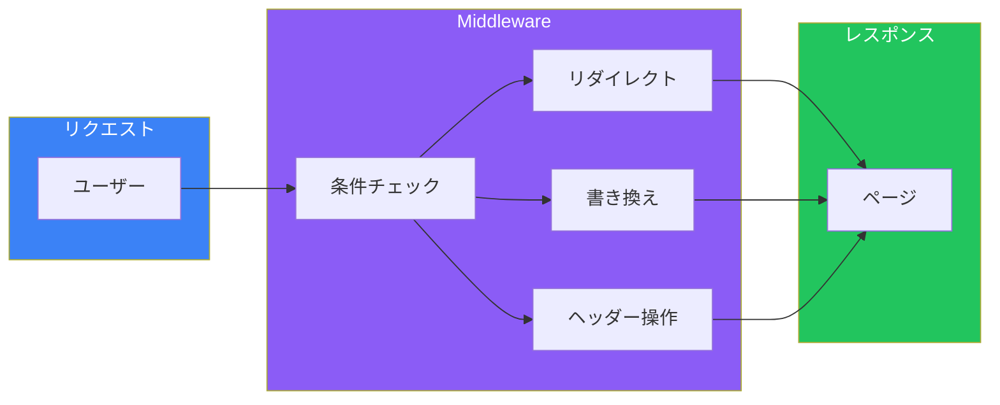
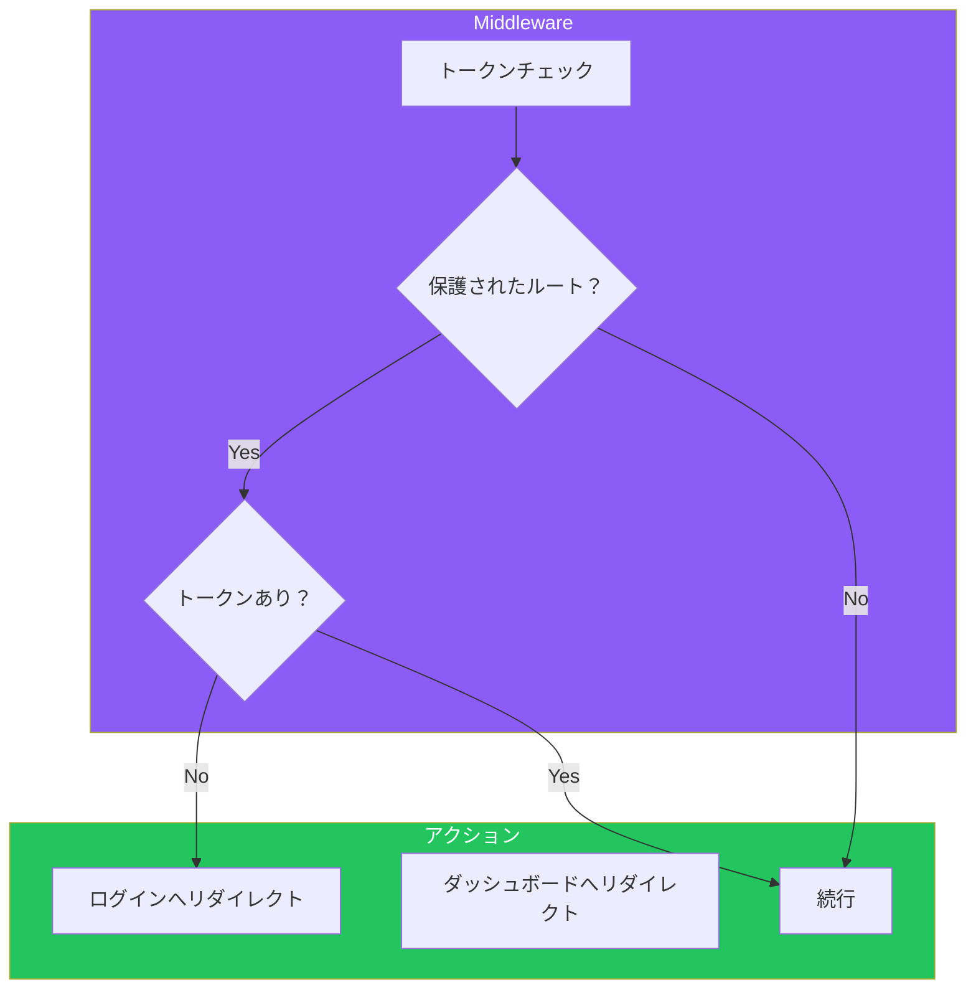

# Day 9: 認証とミドルウェア

## 今日学ぶこと

- Middlewareの基礎
- リダイレクトと書き換え
- NextAuth.js（Auth.js）による認証
- 保護されたルート
- セッション管理

---

## Middlewareとは

**Middleware**は、リクエストが完了する前に実行されるコードです。認証チェック、リダイレクト、ヘッダー操作などに使用します。



### 基本的なMiddleware

```tsx
// middleware.ts（プロジェクトルートに配置）
import { NextResponse } from "next/server";
import type { NextRequest } from "next/server";

export function middleware(request: NextRequest) {
  console.log("Middleware executed:", request.nextUrl.pathname);

  return NextResponse.next();
}

// マッチするパスを指定
export const config = {
  matcher: [
    // 静的ファイルとAPIを除外
    "/((?!api|_next/static|_next/image|favicon.ico).*)",
  ],
};
```

---

## リダイレクト

特定の条件でユーザーを別のページにリダイレクトできます。

```tsx
// middleware.ts
import { NextResponse } from "next/server";
import type { NextRequest } from "next/server";

export function middleware(request: NextRequest) {
  const { pathname } = request.nextUrl;

  // 古いURLから新しいURLへリダイレクト
  if (pathname === "/old-page") {
    return NextResponse.redirect(new URL("/new-page", request.url));
  }

  // 認証が必要なページ
  const token = request.cookies.get("token");
  if (pathname.startsWith("/dashboard") && !token) {
    return NextResponse.redirect(new URL("/login", request.url));
  }

  return NextResponse.next();
}
```

### リダイレクトの種類

| メソッド | ステータス | 用途 |
|----------|-----------|------|
| `redirect()` | 307（一時的） | 一時的なリダイレクト |
| `redirect()` with status | 301（恒久的） | SEO用のURL変更 |

```tsx
// 恒久的なリダイレクト（301）
return NextResponse.redirect(new URL("/new-page", request.url), {
  status: 301,
});
```

---

## 書き換え（Rewrite）

URLを変更せずに、異なるページをレンダリングできます。

```tsx
// middleware.ts
import { NextResponse } from "next/server";
import type { NextRequest } from "next/server";

export function middleware(request: NextRequest) {
  const { pathname } = request.nextUrl;

  // A/Bテスト
  if (pathname === "/") {
    const bucket = Math.random() < 0.5 ? "a" : "b";
    return NextResponse.rewrite(new URL(`/home/${bucket}`, request.url));
  }

  // 地域別コンテンツ
  const country = request.geo?.country || "US";
  if (pathname === "/pricing") {
    return NextResponse.rewrite(
      new URL(`/pricing/${country.toLowerCase()}`, request.url)
    );
  }

  return NextResponse.next();
}
```

---

## ヘッダー操作

リクエストとレスポンスにヘッダーを追加・変更できます。

```tsx
// middleware.ts
import { NextResponse } from "next/server";
import type { NextRequest } from "next/server";

export function middleware(request: NextRequest) {
  // レスポンスヘッダーを追加
  const response = NextResponse.next();
  response.headers.set("x-custom-header", "my-value");

  // セキュリティヘッダーを追加
  response.headers.set(
    "Content-Security-Policy",
    "default-src 'self'"
  );

  return response;
}
```

---

## NextAuth.js（Auth.js）

**NextAuth.js**（現在はAuth.js）は、Next.jsのための認証ライブラリです。

### セットアップ

```bash
npm install next-auth
```

```tsx
// src/app/api/auth/[...nextauth]/route.ts
import NextAuth from "next-auth";
import GithubProvider from "next-auth/providers/github";
import GoogleProvider from "next-auth/providers/google";
import CredentialsProvider from "next-auth/providers/credentials";

const handler = NextAuth({
  providers: [
    // GitHubログイン
    GithubProvider({
      clientId: process.env.GITHUB_ID!,
      clientSecret: process.env.GITHUB_SECRET!,
    }),

    // Googleログイン
    GoogleProvider({
      clientId: process.env.GOOGLE_ID!,
      clientSecret: process.env.GOOGLE_SECRET!,
    }),

    // メール/パスワードログイン
    CredentialsProvider({
      name: "Credentials",
      credentials: {
        email: { label: "Email", type: "email" },
        password: { label: "Password", type: "password" },
      },
      async authorize(credentials) {
        // ユーザーを検証
        const user = await validateUser(
          credentials?.email,
          credentials?.password
        );
        if (user) {
          return user;
        }
        return null;
      },
    }),
  ],
  pages: {
    signIn: "/login",
    error: "/auth/error",
  },
  callbacks: {
    async session({ session, token }) {
      if (session.user) {
        session.user.id = token.sub!;
      }
      return session;
    },
  },
});

export { handler as GET, handler as POST };
```

### 環境変数

```bash
# .env.local
NEXTAUTH_URL=http://localhost:3000
NEXTAUTH_SECRET=your-secret-key

GITHUB_ID=your-github-client-id
GITHUB_SECRET=your-github-client-secret

GOOGLE_ID=your-google-client-id
GOOGLE_SECRET=your-google-client-secret
```

---

## SessionProviderの設定

クライアントコンポーネントでセッションを使うには、`SessionProvider`でラップします。

```tsx
// src/app/providers.tsx
"use client";

import { SessionProvider } from "next-auth/react";

export function Providers({ children }: { children: React.ReactNode }) {
  return <SessionProvider>{children}</SessionProvider>;
}
```

```tsx
// src/app/layout.tsx
import { Providers } from "./providers";

export default function RootLayout({
  children,
}: {
  children: React.ReactNode;
}) {
  return (
    <html lang="ja">
      <body>
        <Providers>{children}</Providers>
      </body>
    </html>
  );
}
```

---

## 認証状態の取得

### Server Componentで取得

```tsx
// src/app/dashboard/page.tsx
import { getServerSession } from "next-auth";
import { redirect } from "next/navigation";

export default async function DashboardPage() {
  const session = await getServerSession();

  if (!session) {
    redirect("/login");
  }

  return (
    <div>
      <h1>ダッシュボード</h1>
      <p>ようこそ、{session.user?.name}さん</p>
    </div>
  );
}
```

### Client Componentで取得

```tsx
// src/components/UserMenu.tsx
"use client";

import { useSession, signIn, signOut } from "next-auth/react";

export function UserMenu() {
  const { data: session, status } = useSession();

  if (status === "loading") {
    return <div>Loading...</div>;
  }

  if (!session) {
    return (
      <button
        onClick={() => signIn()}
        className="px-4 py-2 bg-blue-600 text-white rounded"
      >
        ログイン
      </button>
    );
  }

  return (
    <div className="flex items-center gap-4">
      <span>{session.user?.name}</span>
      <button
        onClick={() => signOut()}
        className="px-4 py-2 bg-gray-200 rounded"
      >
        ログアウト
      </button>
    </div>
  );
}
```

---

## Middlewareで保護

Middlewareを使って、認証が必要なルートを保護できます。

```tsx
// middleware.ts
import { NextResponse } from "next/server";
import type { NextRequest } from "next/server";
import { getToken } from "next-auth/jwt";

export async function middleware(request: NextRequest) {
  const token = await getToken({
    req: request,
    secret: process.env.NEXTAUTH_SECRET,
  });

  const { pathname } = request.nextUrl;

  // 保護されたルート
  const protectedPaths = ["/dashboard", "/settings", "/profile"];
  const isProtected = protectedPaths.some((path) =>
    pathname.startsWith(path)
  );

  if (isProtected && !token) {
    const loginUrl = new URL("/login", request.url);
    loginUrl.searchParams.set("callbackUrl", pathname);
    return NextResponse.redirect(loginUrl);
  }

  // 認証済みユーザーがログインページにアクセス
  if (pathname === "/login" && token) {
    return NextResponse.redirect(new URL("/dashboard", request.url));
  }

  return NextResponse.next();
}

export const config = {
  matcher: ["/dashboard/:path*", "/settings/:path*", "/profile/:path*", "/login"],
};
```



---

## ログインページの実装

```tsx
// src/app/login/page.tsx
"use client";

import { signIn } from "next-auth/react";
import { useSearchParams } from "next/navigation";
import { useState } from "react";

export default function LoginPage() {
  const searchParams = useSearchParams();
  const callbackUrl = searchParams.get("callbackUrl") || "/dashboard";
  const [email, setEmail] = useState("");
  const [password, setPassword] = useState("");
  const [error, setError] = useState("");

  const handleSubmit = async (e: React.FormEvent) => {
    e.preventDefault();

    const result = await signIn("credentials", {
      email,
      password,
      redirect: false,
    });

    if (result?.error) {
      setError("メールアドレスまたはパスワードが正しくありません");
    } else {
      window.location.href = callbackUrl;
    }
  };

  return (
    <div className="min-h-screen flex items-center justify-center">
      <div className="max-w-md w-full p-6 border rounded-lg">
        <h1 className="text-2xl font-bold mb-6 text-center">ログイン</h1>

        {error && (
          <div className="mb-4 p-3 bg-red-100 text-red-600 rounded">
            {error}
          </div>
        )}

        <form onSubmit={handleSubmit} className="space-y-4">
          <div>
            <label className="block mb-1">メールアドレス</label>
            <input
              type="email"
              value={email}
              onChange={(e) => setEmail(e.target.value)}
              className="w-full border rounded p-2"
              required
            />
          </div>

          <div>
            <label className="block mb-1">パスワード</label>
            <input
              type="password"
              value={password}
              onChange={(e) => setPassword(e.target.value)}
              className="w-full border rounded p-2"
              required
            />
          </div>

          <button
            type="submit"
            className="w-full bg-blue-600 text-white py-2 rounded"
          >
            ログイン
          </button>
        </form>

        <div className="mt-6">
          <div className="relative">
            <div className="absolute inset-0 flex items-center">
              <div className="w-full border-t" />
            </div>
            <div className="relative flex justify-center text-sm">
              <span className="px-2 bg-white text-gray-500">または</span>
            </div>
          </div>

          <div className="mt-4 space-y-2">
            <button
              onClick={() => signIn("github", { callbackUrl })}
              className="w-full border py-2 rounded flex items-center justify-center gap-2"
            >
              GitHubでログイン
            </button>
            <button
              onClick={() => signIn("google", { callbackUrl })}
              className="w-full border py-2 rounded flex items-center justify-center gap-2"
            >
              Googleでログイン
            </button>
          </div>
        </div>
      </div>
    </div>
  );
}
```

---

## まとめ

| 概念 | 説明 |
|------|------|
| Middleware | リクエスト前に実行されるコード |
| リダイレクト | 別のURLに転送 |
| 書き換え | URLを変えずにコンテンツを変更 |
| NextAuth.js | Next.js用認証ライブラリ |
| getServerSession | サーバーでセッション取得 |
| useSession | クライアントでセッション取得 |

### 重要ポイント

1. **Middlewareは軽量に**: Edge Runtimeで実行される
2. **NextAuth.jsで簡単認証**: 複数プロバイダをサポート
3. **保護はMiddlewareで**: ルートレベルで一括制御
4. **セッションは両方で取得可能**: Server/Client両対応

---

## 練習問題

### 問題1: 基本
Middlewareを使って、`/admin`で始まるパスにアクセスした場合、認証されていなければ`/login`にリダイレクトする処理を実装してください。

### 問題2: 応用
NextAuth.jsを使って、GitHubログインを実装してください。ログイン後はダッシュボードページにリダイレクトし、ユーザー情報を表示してください。

### チャレンジ問題
メール/パスワード認証とGitHub認証の両方をサポートするログインページを実装してください。エラーハンドリングとローディング状態も含めてください。

---

## 参考リンク

- [Middleware](https://nextjs.org/docs/app/building-your-application/routing/middleware)
- [NextAuth.js](https://next-auth.js.org/)
- [Auth.js](https://authjs.dev/)
- [Protecting Routes](https://nextjs.org/docs/app/building-your-application/authentication#protecting-routes-with-middleware)

---

**次回予告**: Day 10では「デプロイと本番運用」について学びます。Vercelへのデプロイ、環境変数の管理、パフォーマンス最適化について探求します。
