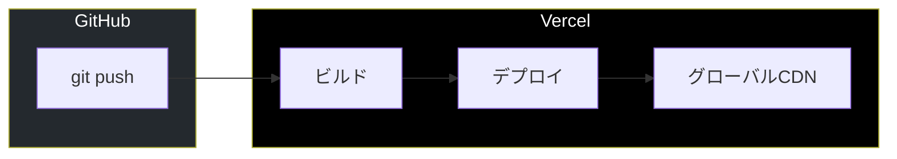
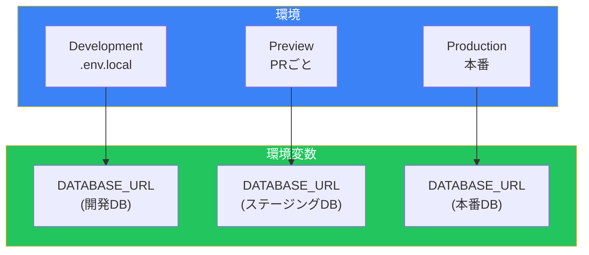
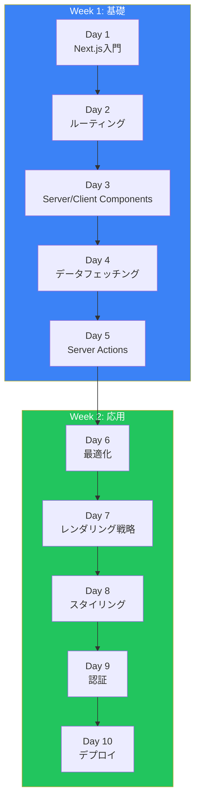

# Day 10: デプロイと本番運用

## 今日学ぶこと

- Vercelへのデプロイ
- 環境変数の管理
- パフォーマンス最適化
- エラー監視
- 次のステップ

---

## ビルドと本番モード

### プロダクションビルド

```bash
npm run build
```

ビルド出力：

```
Route (app)                              Size     First Load JS
┌ ○ /                                    5.2 kB        89.5 kB
├ ○ /about                               2.1 kB        86.4 kB
├ ● /blog                                3.4 kB        87.7 kB
├ ● /blog/[slug]                         4.1 kB        88.4 kB
└ ƒ /dashboard                           6.3 kB        90.6 kB

○  (Static)   prerendered as static content
●  (SSG)      prerendered as static HTML (uses generateStaticParams)
ƒ  (Dynamic)  server-rendered on demand
```

### ローカルで本番モードをテスト

```bash
npm run build && npm run start
```

---

## Vercelへのデプロイ

### GitHubリポジトリと連携

1. [Vercel](https://vercel.com)にアクセス
2. GitHubでログイン
3. "New Project"をクリック
4. リポジトリをインポート
5. 設定を確認して"Deploy"



### Vercel CLIでデプロイ

```bash
# Vercel CLIをインストール
npm install -g vercel

# デプロイ
vercel

# 本番環境にデプロイ
vercel --prod
```

### プレビューデプロイ

PRを作成すると、自動的にプレビューURLが生成されます。

```
https://my-app-git-feature-branch-username.vercel.app
```

---

## 環境変数の管理

### ローカル環境

```bash
# .env.local（gitignoreに含める）
DATABASE_URL="postgresql://..."
NEXTAUTH_SECRET="your-secret"
NEXT_PUBLIC_API_URL="http://localhost:3000/api"
```

### 環境変数の種類

| プレフィックス | 公開範囲 |
|---------------|----------|
| `NEXT_PUBLIC_` | ブラウザに公開される |
| なし | サーバーのみ |

```tsx
// サーバーでのみ使用可能
const secret = process.env.DATABASE_URL;

// ブラウザでも使用可能
const apiUrl = process.env.NEXT_PUBLIC_API_URL;
```

### Vercelでの環境変数設定

1. プロジェクト設定 → Environment Variables
2. 環境（Production, Preview, Development）を選択
3. キーと値を入力



---

## パフォーマンス最適化

### Next.js Analyticsの有効化

```tsx
// src/app/layout.tsx
import { Analytics } from "@vercel/analytics/react";
import { SpeedInsights } from "@vercel/speed-insights/next";

export default function RootLayout({
  children,
}: {
  children: React.ReactNode;
}) {
  return (
    <html lang="ja">
      <body>
        {children}
        <Analytics />
        <SpeedInsights />
      </body>
    </html>
  );
}
```

### バンドルサイズの分析

```bash
npm install @next/bundle-analyzer
```

```ts
// next.config.ts
import bundleAnalyzer from "@next/bundle-analyzer";

const withBundleAnalyzer = bundleAnalyzer({
  enabled: process.env.ANALYZE === "true",
});

export default withBundleAnalyzer({
  // 設定
});
```

```bash
ANALYZE=true npm run build
```

### パフォーマンスチェックリスト

| 項目 | 対策 |
|------|------|
| 画像 | next/imageを使用 |
| フォント | next/fontを使用 |
| 大きなライブラリ | 動的インポート |
| 不要な再レンダリング | メモ化（memo, useMemo） |
| サードパーティスクリプト | next/scriptを使用 |

### 動的インポート

```tsx
import dynamic from "next/dynamic";

// クライアントでのみロード
const Chart = dynamic(() => import("@/components/Chart"), {
  loading: () => <div>Loading chart...</div>,
  ssr: false,
});

export default function DashboardPage() {
  return (
    <div>
      <h1>ダッシュボード</h1>
      <Chart />
    </div>
  );
}
```

### next/scriptでサードパーティスクリプト

```tsx
import Script from "next/script";

export default function RootLayout({
  children,
}: {
  children: React.ReactNode;
}) {
  return (
    <html lang="ja">
      <body>
        {children}
        <Script
          src="https://www.googletagmanager.com/gtag/js?id=G-XXXXXXX"
          strategy="afterInteractive"
        />
        <Script id="google-analytics" strategy="afterInteractive">
          {`
            window.dataLayer = window.dataLayer || [];
            function gtag(){dataLayer.push(arguments);}
            gtag('js', new Date());
            gtag('config', 'G-XXXXXXX');
          `}
        </Script>
      </body>
    </html>
  );
}
```

---

## エラー監視

### Sentryの統合

```bash
npx @sentry/wizard@latest -i nextjs
```

```ts
// sentry.client.config.ts
import * as Sentry from "@sentry/nextjs";

Sentry.init({
  dsn: process.env.NEXT_PUBLIC_SENTRY_DSN,
  tracesSampleRate: 1.0,
});
```

### エラーバウンダリ

```tsx
// src/app/error.tsx
"use client";

import * as Sentry from "@sentry/nextjs";
import { useEffect } from "react";

export default function Error({
  error,
  reset,
}: {
  error: Error & { digest?: string };
  reset: () => void;
}) {
  useEffect(() => {
    Sentry.captureException(error);
  }, [error]);

  return (
    <div className="min-h-screen flex items-center justify-center">
      <div className="text-center">
        <h2 className="text-2xl font-bold mb-4">エラーが発生しました</h2>
        <button
          onClick={reset}
          className="px-4 py-2 bg-blue-600 text-white rounded"
        >
          再試行
        </button>
      </div>
    </div>
  );
}
```

---

## セキュリティ

### セキュリティヘッダー

```ts
// next.config.ts
const nextConfig = {
  async headers() {
    return [
      {
        source: "/(.*)",
        headers: [
          {
            key: "X-Frame-Options",
            value: "DENY",
          },
          {
            key: "X-Content-Type-Options",
            value: "nosniff",
          },
          {
            key: "Referrer-Policy",
            value: "strict-origin-when-cross-origin",
          },
          {
            key: "Content-Security-Policy",
            value: "default-src 'self'; script-src 'self' 'unsafe-inline' 'unsafe-eval'; style-src 'self' 'unsafe-inline';",
          },
        ],
      },
    ];
  },
};

export default nextConfig;
```

### 環境変数のセキュリティ

- `NEXT_PUBLIC_`プレフィックスは必要な場合のみ使用
- 機密情報はサーバーサイドでのみ使用
- `.env.local`は必ず`.gitignore`に含める

---

## 本番運用のベストプラクティス

### デプロイチェックリスト

```markdown
## デプロイ前チェックリスト

### ビルド
- [ ] `npm run build`が成功する
- [ ] TypeScriptエラーがない
- [ ] ESLintエラーがない

### 環境変数
- [ ] 本番用の環境変数が設定されている
- [ ] 機密情報がクライアントに露出していない

### パフォーマンス
- [ ] 画像がnext/imageで最適化されている
- [ ] フォントがnext/fontで最適化されている
- [ ] 大きなライブラリが動的インポートされている

### SEO
- [ ] メタデータが設定されている
- [ ] OGP画像が設定されている
- [ ] sitemap.xmlが生成される
- [ ] robots.txtが設定されている

### セキュリティ
- [ ] セキュリティヘッダーが設定されている
- [ ] 認証が正しく動作する
- [ ] APIルートが保護されている

### 監視
- [ ] エラー監視が設定されている
- [ ] アナリティクスが設定されている
```

---

## 10日間の振り返り



### 学んだこと

| Day | トピック | 主要な概念 |
|-----|----------|-----------|
| 1 | Next.js入門 | App Router、ファイルベースルーティング |
| 2 | ルーティング | 動的ルート、ルートグループ、loading/error |
| 3 | Components | Server Components、Client Components |
| 4 | データ取得 | fetch、キャッシュ、並列取得、Suspense |
| 5 | Server Actions | フォーム処理、ミューテーション、再検証 |
| 6 | 最適化 | next/image、next/font、メタデータ |
| 7 | レンダリング | SSG、SSR、ISR、ストリーミング |
| 8 | スタイリング | CSS Modules、Tailwind、ダークモード |
| 9 | 認証 | Middleware、NextAuth.js |
| 10 | デプロイ | Vercel、環境変数、監視 |

---

## 次のステップ

### さらに学ぶべきトピック

1. **データベース統合**
   - Prisma + PostgreSQL
   - Drizzle ORM
   - PlanetScale / Neon

2. **高度な機能**
   - Internationalization（i18n）
   - Edge Functions
   - Turbopack

3. **テスト**
   - Jest + Testing Library
   - Playwright（E2E）

4. **実践プロジェクト**
   - ブログプラットフォーム
   - ECサイト
   - SaaSアプリケーション

### おすすめリソース

| リソース | URL |
|----------|-----|
| Next.js公式ドキュメント | https://nextjs.org/docs |
| Next.js Learn | https://nextjs.org/learn |
| Vercel Templates | https://vercel.com/templates |
| GitHub Examples | https://github.com/vercel/next.js/tree/canary/examples |

---

## まとめ

| 概念 | 説明 |
|------|------|
| Vercelデプロイ | GitHubと連携した自動デプロイ |
| 環境変数 | 本番/プレビュー/開発で分離 |
| パフォーマンス | Analytics、バンドル分析 |
| セキュリティ | ヘッダー、環境変数の保護 |
| エラー監視 | Sentry統合 |

### 最終ポイント

1. **Vercelが最適**: Next.jsと同じ開発元
2. **環境を分離**: 本番/ステージング/開発
3. **監視は必須**: エラーとパフォーマンス
4. **継続的な学習**: 公式ドキュメントをフォロー

---

## おわりに

10日間お疲れさまでした！

この10日間で、Next.jsの基礎から本番運用まで、実践的なスキルを身につけました。Next.jsは活発に開発されているフレームワークです。公式ドキュメントをフォローし、最新の機能やベストプラクティスを学び続けてください。

Happy coding!

---

## 参考リンク

- [Deploying](https://nextjs.org/docs/app/building-your-application/deploying)
- [Vercel Documentation](https://vercel.com/docs)
- [Environment Variables](https://nextjs.org/docs/app/building-your-application/configuring/environment-variables)
- [Performance](https://nextjs.org/docs/app/building-your-application/optimizing)
