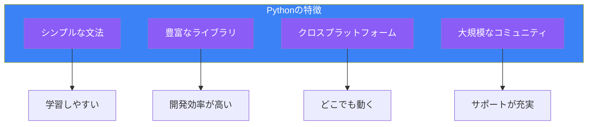
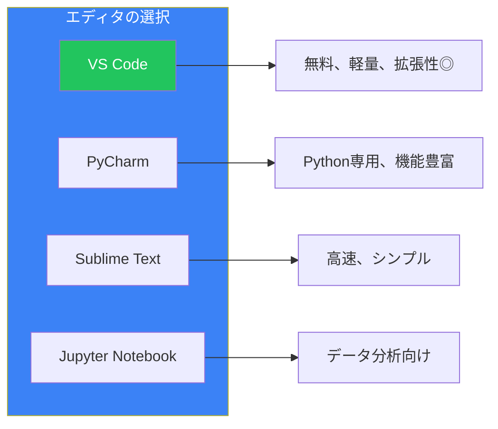

# Day 1: Pythonへようこそ

## 今日学ぶこと

- Pythonとは何か、なぜ人気があるのか
- 開発環境のセットアップ
- 最初のプログラムの作成と実行
- インタラクティブシェルの使い方

---

## Pythonとは？

Pythonは、1991年にグイド・ヴァン・ロッサム（Guido van Rossum）によって開発されたプログラミング言語です。シンプルで読みやすい文法が特徴で、初心者からプロフェッショナルまで幅広く使われています。

### Pythonの特徴



| 特徴 | 説明 |
|------|------|
| **シンプルな文法** | 英語に近い自然な構文で、初心者でも理解しやすい |
| **豊富なライブラリ** | 標準ライブラリと外部パッケージで様々な用途に対応 |
| **クロスプラットフォーム** | Windows、macOS、Linuxで同じコードが動作 |
| **大規模なコミュニティ** | 困ったときに助けを得やすい |

### Pythonでできること

Pythonは非常に汎用性の高い言語です：

- **Web開発**: Django、Flask、FastAPIなどのフレームワーク
- **データ分析**: pandas、NumPyでデータ処理
- **機械学習・AI**: TensorFlow、PyTorchで深層学習
- **自動化**: スクリプトで日常作業を効率化
- **科学計算**: 研究や計算処理

---

## 開発環境のセットアップ

### Pythonのインストール

#### Windows

1. [python.org](https://www.python.org/downloads/) にアクセス
2. 最新版のPythonをダウンロード
3. インストーラーを実行
4. **重要**: 「Add Python to PATH」にチェックを入れる
5. 「Install Now」をクリック

#### macOS

macOSには通常Pythonがプリインストールされていますが、最新版を使うことをお勧めします：

```bash
# Homebrewを使用する場合
brew install python
```

または[python.org](https://www.python.org/downloads/)から直接インストーラーをダウンロードします。

#### Linux

多くのLinuxディストリビューションにはPythonがプリインストールされています：

```bash
# Debian/Ubuntu
sudo apt update
sudo apt install python3

# Fedora
sudo dnf install python3
```

### インストールの確認

ターミナル（コマンドプロンプト）を開いて、以下のコマンドを実行します：

```bash
python --version
```

または

```bash
python3 --version
```

次のような出力が表示されれば成功です：

```
Python 3.12.0
```

---

## 最初のプログラム: Hello, World!

プログラミングの伝統として、最初に書くプログラムは「Hello, World!」と表示するものです。

### 方法1: インタラクティブシェル

ターミナルで `python` または `python3` と入力してEnterを押します：

```bash
$ python3
Python 3.12.0 (main, Oct  2 2023, 00:00:00) [GCC 11.3.0] on linux
Type "help", "copyright", "credits" or "license" for more information.
>>>
```

`>>>` はPythonがコマンドを待っているサインです。次のコードを入力してEnterを押しましょう：

```python
>>> print("Hello, World!")
Hello, World!
```

**おめでとうございます！** 最初のPythonプログラムを実行しました。

シェルを終了するには `exit()` と入力するか、`Ctrl+D`（Windowsでは`Ctrl+Z`）を押します。

### 方法2: スクリプトファイル

より複雑なプログラムを書く場合は、ファイルにコードを保存します。

1. テキストエディタ（VS Code、PyCharm、またはメモ帳）を開く
2. 以下のコードを入力：

```python
print("Hello, World!")
print("Welcome to Python!")
```

3. ファイルを `hello.py` として保存
4. ターミナルでファイルのある場所に移動し、実行：

```bash
python3 hello.py
```

出力：

```
Hello, World!
Welcome to Python!
```

---

## インタラクティブシェルをもっと使ってみよう

インタラクティブシェルは、Pythonを学ぶ上で非常に便利なツールです。コードをすぐに試すことができます。

### 計算機として使う

```python
>>> 2 + 3
5
>>> 10 - 4
6
>>> 5 * 3
15
>>> 20 / 4
5.0
>>> 2 ** 10
1024
```

| 演算子 | 意味 | 例 |
|--------|------|-----|
| `+` | 加算 | `2 + 3` → `5` |
| `-` | 減算 | `10 - 4` → `6` |
| `*` | 乗算 | `5 * 3` → `15` |
| `/` | 除算 | `20 / 4` → `5.0` |
| `**` | べき乗 | `2 ** 10` → `1024` |
| `//` | 整数除算 | `7 // 2` → `3` |
| `%` | 剰余 | `7 % 2` → `1` |

### 文字列を試す

```python
>>> "Hello" + " " + "Python"
'Hello Python'
>>> "Python " * 3
'Python Python Python '
>>> len("Hello")
5
```

---

## エディタの選択

効率的にPythonを書くために、適切なエディタを選びましょう。

### おすすめのエディタ



| エディタ | 特徴 | おすすめ度 |
|----------|------|-----------|
| **VS Code** | 無料、軽量、豊富な拡張機能 | ★★★★★ |
| **PyCharm** | Python専用IDE、充実した機能 | ★★★★☆ |
| **Sublime Text** | 高速で軽量 | ★★★☆☆ |
| **Jupyter Notebook** | データ分析・機械学習向け | ★★★★☆ |

### VS Codeのセットアップ

1. [code.visualstudio.com](https://code.visualstudio.com/) からダウンロード
2. インストール後、拡張機能タブを開く
3. 「Python」を検索してインストール
4. 「Python」拡張機能がシンタックスハイライトや自動補完を提供

---

## コメントを書く

プログラムにはコメントを書くことができます。コメントはプログラムの説明として使われ、Pythonはコメントを無視します。

```python
# これはコメントです
print("Hello")  # 行末にもコメントを書けます

# 複数行のコメント
# 行ごとに # を付けます
```

コメントは将来の自分や他の開発者がコードを理解するのに役立ちます。

---

## まとめ

| 概念 | 説明 |
|------|------|
| **Python** | シンプルで汎用性の高いプログラミング言語 |
| **インタラクティブシェル** | コードを即座に実行できる対話環境 |
| **スクリプトファイル** | `.py` 拡張子でコードを保存して実行 |
| **print()** | 画面に文字を表示する関数 |
| **コメント** | `#` で始まる説明文、プログラムには影響しない |

### 重要ポイント

1. Pythonは初心者に優しく、幅広い用途に使える言語
2. インタラクティブシェルでコードを素早く試せる
3. 本格的なプログラムは `.py` ファイルに保存して実行
4. コメントを使ってコードを分かりやすく

---

## 練習問題

### 問題1: 基本
インタラクティブシェルで以下を計算してみましょう：
- 123 + 456
- 1000 から 357 を引いた値
- 25 の 4 乗

### 問題2: Hello, World!
新しいファイル `greeting.py` を作成し、以下を表示するプログラムを書いてください：
- 自分の名前
- 今日の日付
- 好きなプログラミング言語

### チャレンジ問題
`print()` 関数を使って、以下のようなアスキーアートを表示するプログラムを書いてください：

```
  *
 ***
*****
 ***
  *
```

---

## 参考リンク

- [Python公式サイト](https://www.python.org/)
- [Python公式ドキュメント](https://docs.python.org/ja/3/)
- [Python Tutorial（公式）](https://docs.python.org/ja/3/tutorial/index.html)
- [VS Code Python拡張](https://marketplace.visualstudio.com/items?itemName=ms-python.python)

---

**次回予告**: Day 2では「変数とデータ型」について学びます。データを格納し、操作する方法を習得しましょう！
